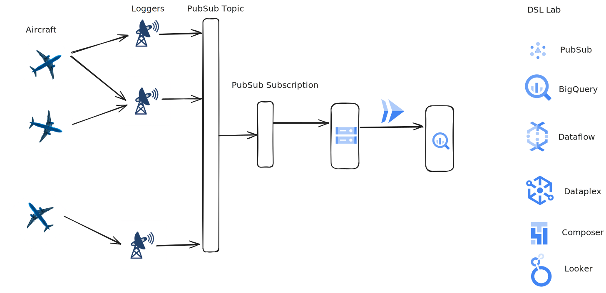

# Data Visualization and Reporting: Transform Data into Actionable Insights

## F-ATC Company Overview

Fictional Aircraft Tracking Company is a leading provider of flight tracking data analytics, dedicated to enhancing the safety of civil aviation worldwide. With a team of experienced aviation professionals and data scientists, we leverage advanced technologies to analyze vast amounts of flight data, providing critical insights to airlines, airports, and regulatory authorities.

Our mission is to revolutionize the way flight tracking data is utilized, empowering our partners to make informed decisions, optimize operations, and mitigate potential risks. By harnessing the power of data, Fictional Aircraft Tracking Company is committed to ensuring the highest standards of safety and efficiency in the global aviation industry.

The flight data is gathered from a distributed network of ADS-B receivers connected to small remote publishing edge compute platforms. These send all data received to pubsub. There are multiple sensors in each region. The busiest airspaces can have more than 2000 messages per second being received from over 100 aircraft. The messages are published to a pubsub topic for easy consumption and this is backed up to a Google Cloud Storage bucket.The flight data is collected through a network of ADS-B receivers, which are strategically distributed and linked to compact, remote edge computing platforms. These platforms are designed for efficient data processing at the source. Each receiver within the network plays a crucial role in capturing real-time data from aircraft within its coverage area.

Due to the dynamic nature of air traffic, the volume of data generated can be substantial. In densely populated airspace, the system can handle an influx of over 2000 messages per second, originating from more than 100 aircraft. To manage this high-velocity data stream, the messages are published to a pubsub topic. This approach ensures that the data is readily available for consumption by various applications and services. Additionally, the data is backed up to a Google Cloud Storage bucket, providing a durable and reliable storage solution for long-term retention and analysis.

The rough architecture of the system is shown below with the existing infrastructure on the left and the challenges for you as the Visualization Analyst on the right.

 
## Setup:
Data spread across Cloud SQL/Spanner and BigQuery (clearly just lift and shift from a transactional DB) which will be needed for business use case
Preexisting Looker Studio dashboard built that isn't quite right/has very poor performance

## Task 1
Understand data across different sources and set up a connection between Cloud SQL/Spanner and BigQuery. Explore Looker Studio dashboard to identify why there are issues with the results and issues with the performance.

## Task 2
Create a new table (or tables) with appropriate schema to optimize query performance. Leverage repeated and nested fields where appropriate.  Create a scheduled query to repopulate this new table once per day.

## Task 3
Update the Looker Studio dashboard to incorporate the new table(s) and fix identified issues with queries. 

## Task 4
Performance is still slower than it should be. Create materialized views to improve the performance of your queries. Set up BI Engine and use it to further improve performance.

## Task 5
The business team who owns the dashboard has asked for you to add in additional metrics and visualizations to the dashboard. Revisit your work from the previous tasks to integrate these new asks into the dashboard.
