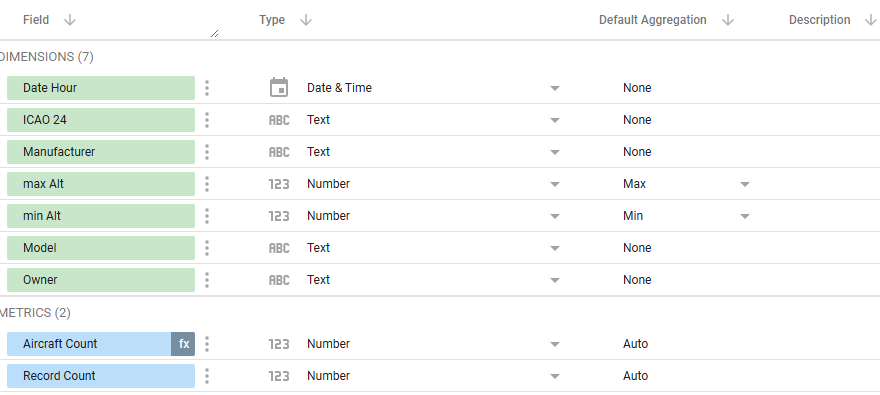

# Data Visualization and Reporting: Transform Data into Actionable Insights

## F-ATC Company Overview


Fictional Aircraft Tracking Company is a leading provider of flight tracking data analytics, dedicated to enhancing the safety of civil aviation worldwide. With a team of experienced aviation professionals and data scientists, we leverage advanced technologies to analyze vast amounts of flight data, providing critical insights to airlines, airports, and regulatory authorities.

Our mission is to revolutionize the way flight tracking data is utilized, empowering our partners to make informed decisions, optimize operations, and mitigate potential risks. By harnessing the power of data, Fictional Aircraft Tracking Company is committed to ensuring the highest standards of safety and efficiency in the global aviation industry.


Flight data is gathered from a distributed network of ADS-B receivers connected to remote edge compute platforms that efficiently process data at the source. The dynamic nature of air traffic results in significant data velocity variations, with busy airspaces generating over 2,000 messages per second from 100+ aircraft. This high-velocity stream is published to a Pub/Sub topic for easy consumption. To meet durability requirements for long-term retention and analysis, the data is also backed up to a Google Cloud Storage bucket, providing a reliable storage solution.


The rough architecture of the system is shown below with the existing infrastructure on the left and the challenges for the visualization analyst on the right.


 
## Setup

Create database server on Cloud SQL.

```bash
# Enable the Cloud SQL Admin API.
gcloud services enable sqladmin.googleapis.com

# Create a Cloud SQL PostgreSQL instance named 'business-dashboard'.
# Set the machine type to db-g1-small, database version to POSTGRES_16,
# and specify the region using the REGION environment variable.
# Use the ENTERPRISE edition and set a root password.
# Enable IAM database authentication.
gcloud sql instances create business-dashboard \
  --tier=db-g1-small \
  --database-version=POSTGRES_16 \
  --region="${REGION}" \
  --edition=ENTERPRISE \
  --root-password=MyDBPassword \
  --database-flags=cloudsql.iam_authentication=on

# Create a database named 'flightdata' within the 'business-dashboard' instance.
gcloud sql databases create flightdata \
  --instance=business-dashboard

# Get the service account email address for the Cloud SQL instance.
# This service account is used for IAM authentication.
CLOUD_SQL_SA=$(gcloud sql instances describe business-dashboard \
  --project="$(gcloud config get-value project)" \
  --format='value(serviceAccountEmailAddress)')

# Create a Cloud IAM service account user for the Cloud SQL instance.
# The username is derived from the service account email.
gcloud sql users create "${CLOUD_SQL_SA%.gserviceaccount.com}" \
  --instance=business-dashboard \
  --type=cloud_iam_service_account

# Get the connection name for the Cloud SQL instance.
# This is used by the Cloud SQL Proxy.
CONNECTION_ID=$(gcloud sql instances describe business-dashboard \
  --format='value(connectionName)')

# Print the Cloud SQL service account email.
echo "${CLOUD_SQL_SA}"

# Start the Cloud SQL Proxy, listening on all interfaces (0.0.0.0) on port 5432,
# and connecting to the specified Cloud SQL instance.
cloud-sql-proxy --address 0.0.0.0 --port 5432 "${CONNECTION_ID}"
```

Open a second tab.

```bash
# Connect to the 'flightdata' database on the PostgreSQL instance.
# -h 127.0.0.1: Specifies the host as the local machine, connecting via the Cloud SQL Proxy.
# --username=postgres: Authenticates as the 'postgres' user.
psql -h 127.0.0.1 --username=postgres flightdata
```

```sql
CREATE TABLE adsb_data (
    message_type VARCHAR(255),
    transmission_type INTEGER,
    sid VARCHAR(255),
    aid VARCHAR(255),
    icao_address VARCHAR(6),
    fid VARCHAR(255),
    date_generated VARCHAR(255),
    time_generated VARCHAR(255),
    date_logged VARCHAR(255),
    time_logged VARCHAR(255),
    callsign VARCHAR(8),
    altitude_feet INTEGER,
    ground_speed_knots INTEGER,
    track_degrees INTEGER,
    latitude DOUBLE PRECISION,
    longitude DOUBLE PRECISION,
    vertical_rate_feet_per_minute INTEGER,
    squawk VARCHAR(4),
    alert INTEGER,
    emer INTEGER,
    spi INTEGER,
    is_on_ground INTEGER
);

CREATE TABLE aircraft_data (
    icao24 VARCHAR(6) NULL,
    registration VARCHAR NULL,
    manufacturericao VARCHAR NULL,
    manufacturername VARCHAR NULL,
    model VARCHAR NULL,
    typecode VARCHAR NULL,
    serialnumber VARCHAR NULL,
    linenumber VARCHAR NULL,
    icaoaircrafttype VARCHAR NULL,
    operator VARCHAR NULL,
    operatorcallsign VARCHAR NULL,
    operatoricao VARCHAR NULL,
    operatoriata VARCHAR NULL,
    owner VARCHAR NULL,
    testreg VARCHAR NULL,
    registered VARCHAR NULL,
    reguntil VARCHAR NULL,
    status VARCHAR NULL,
    built VARCHAR NULL,
    firstflightdate VARCHAR NULL,
    seatconfiguration VARCHAR NULL,
    engines VARCHAR NULL,
    modes VARCHAR NULL,
    adsb VARCHAR NULL,
    acars VARCHAR NULL,
    notes TEXT NULL,
    categoryDescription VARCHAR NULL
);

GRANT ALL ON SCHEMA flightdata TO <CLOUD_SQL_SA>;

\q
```

```bash
# Grant the Cloud SQL service account the 'Storage Object Admin' role on the Cloud Storage bucket.
# This allows Cloud SQL to read and import data from the bucket.
gcloud storage buckets add-iam-policy-binding "gs://${PROJECT_ID}-flightdata-bucket" \
  --member="serviceAccount:${CLOUD_SQL_SA}" \
  --role="roles/storage.objectAdmin"

# Import the 'transponder.csv' file from the Cloud Storage bucket into the 'adsb_data' table
# within the 'flightdata' database in the 'business-dashboard' Cloud SQL instance.
gcloud sql import csv business-dashboard "gs://${PROJECT_ID}-flightdata-bucket/transponder/transponder.csv" \
  --database=flightdata \
  --table=adsb_data -q

# Download the 'aircraftDatabase.zip' file from the OpenSky Network.
wget https://s3.opensky-network.org/data-samples/metadata/aircraftDatabase.zip

# Unzip the downloaded 'aircraftDatabase.zip' file.
unzip aircraftDatabase.zip

# Copy the extracted 'aircraftDatabase.csv' file to the Cloud Storage bucket.
gcloud storage cp aircraftDatabase.csv "gs://${PROJECT_ID}-flightdata-bucket/"

# Import the 'aircraftDatabase.csv' file from the Cloud Storage bucket into the 'aircraft_data' table
# within the 'flightdata' database in the 'business-dashboard' Cloud SQL instance.
gcloud sql import csv business-dashboard "gs://${PROJECT_ID}-flightdata-bucket/aircraftDatabase.csv" \
  --database=flightdata \
  --table=aircraft_data -q
```

```sql
-- clean two top rows from import
delete from aircraft_data where icao24='icao24' or icao24=''
```

Connect Looker Studio.

```bash
# Patch the Cloud SQL instance to authorize a specific network range (142.251.74.0/23 Looker Studio).
# This allows connections to the instance only from IP addresses within this range.
gcloud sql instances patch business-dashboard --authorized-networks=142.251.74.0/23 -q

# Get the public IP address of the Cloud SQL instance and store it in the IP environment variable.
export IP=$(gcloud sql instances describe business-dashboard --format="value(ipAddresses[0].ipAddress)")
```

```sql
WITH
  aircraft AS (
  SELECT
    LOWER(icao24) AS icao24,
    manufacturericao,
    MODEL,
    owner
  FROM
    aircraft_data),
  details AS (
  SELECT
    LOWER(icao_address) AS icao24,
    MAX(altitude_feet) AS maxAlt,
    MIN(altitude_feet) AS minAlt
  FROM
    adsb_data
  WHERE
    icao_address IS NOT NULL
    AND altitude_feet IS NOT NULL
  GROUP BY
    icao_address)
SELECT
  *
FROM
  details
LEFT JOIN
  aircraft
USING
  (icao24)
```

## Task 1: Connect Cloud SQL to BigQuery to reduce operational database load

Investigate the query performance, and perform the initial connection of the data into bigquery establish a connection between Cloud SQL and BigQuery. The goal is to address performance issues that affect daily operations, which are a result of the current database server's limitations in handling full table scans. Keep in mind that the CloudSQL database is the Operational Data Source (ODS) and is used for other services outside the scope of this challenge and as such the data has to be accessible from BigQuery but cannot be moved in its entirety.

A key part of this task is to move analytical queries from the operational database to BigQuery. This will involve:

- **Establishing a Federated connection**: Create a connection from BigQuery to Cloud SQL. This process uses BigQuery's federated query capabilities, allowing BigQuery to directly read data from the operational database. This method shifts the computational load of joins to BigQuery, thereby reducing the strain on the Cloud SQL instance.
- **Analyzing performance with Looker Studio**: Investigate the Looker Studio dashboard to understand the causes of current performance issues and data inconsistencies.

The current database performance problems are worsened by the database server's limited capacity. Using federated queries with BigQuery is a strategy to reduce the operational database load, as BigQuery will handle the sequential scanning and joining of data. This is particularly relevant because current queries are slow even with a single day's data, indicating that scaling to larger datasets (e.g., 30 days) would significantly worsen performance.

Create a database connection. Refer to the documentation on BigQuery federated queries with Cloud SQL for guidance: <https://cloud.google.com/bigquery/docs/cloud-sql-federated-queries>.

## Task 2. Move the larger of the two datasets into BigQuery using a scheduled query
<!---Create a new table (or tables) with appropriate schema to optimize query performance. Leverage repeated and nested fields where appropriate.  Create a scheduled query to repopulate this new table once per day.--->

Moving a portion of the data to BigQuery offloads the operational data source (ODS) from query burdens. Transfer the larger ADSB dataset to BigQuery.

Some tables, potentially subject to frequent updates by operational systems, can remain in Cloud SQL. Joining a smaller Cloud SQL table with larger BigQuery data is feasible.

Create a scheduled query for the ADSB aircraft data to import it into BigQuery. Aircraft details can remain in Cloud SQL. In this scenario, assume that the aircraft database might be updated frequently, making it less suitable for BigQuery.

When building the dashboarding infrastructure, note that federated data sources, such as Cloud SQL, must reside in the same region or multi-regional area as the BigQuery execution engine. Cross-region joins between Cloud SQL and BigQuery are not supported (e.g., Cloud SQL in `europe-west1` and BigQuery in `US` should show an error). This regional alignment is important when joining data between native and federated data sources.

Perform an initial data load, followed by subsequent loads using a high-water mark strategy.

To initiate the load and perform type conversions, create a database connection.

```sql
drop table if exists flightData.adsbData;
CREATE OR REPLACE TABLE flightData.adsbData PARTITION BY DATE(generated) AS
WITH
  adsb_details AS (
  SELECT
    *
  FROM
    EXTERNAL_QUERY("us.aircraft-ods",
      "select message_type,cast(transmission_type as INT) as transmission_type,sid,aid,icao_address,fid,TO_TIMESTAMP(concat(date_generated,' ',time_generated), 'YYYY/MM/DD HH24:MI:SS.MS') as generated,TO_TIMESTAMP(concat(date_logged,' ',time_logged), 'YYYY/MM/DD HH24:MI:SS.MS') as logged,callsign,cast(altitude_feet as int) as altitude_feet,cast(ground_speed_knots as int) as ground_speed_knots,cast(track_degrees as int) as track_degrees,cast(latitude as float) as latitude,cast(longitude as float) as longitude,cast(vertical_rate_feet_per_minute as int) as vertical_rate_feet_per_minute,cast(squawk as int) as squawk,cast(alert as int) as alert,cast(emer as int) as emer,cast(spi as int) as spi,cast(is_on_ground as int) as is_on_ground from adsb_data where date_generated='2025/05/15' and time_generated like '00:%';"))
SELECT
  *
FROM
  adsb_details;
```

## Task 3. Update the Looker Studio dashboard to incorporate the new table(s) and fix identified issues with queries 



To create a report showing the minimum and maximum altitude for each flight and display information about flights, manufacturers, and operators, Perform a join between the ADSB data in BigQuery and the aircraft details in Cloud SQL. The icao24 field, when lowercased, can be used as the join key.

Here is a BigQuery SQL query to achieve this. This query assumes that the following exists:

A BigQuery dataset named your_adsb_dataset with a table named `adsb_flights` containing `generated` (timestamp) and `altitude_feet` fields, along with `icao24`.
An external table in BigQuery named `your_operational_dataset.aircraft_details` that connects to the Cloud SQL instance, containing `manufacturericao`,` model`, `owner`, and `icao24` fields.

Before running this query, ensure that the following has been done:

1. Loaded the ADSB data into a BigQuery table.
1. Created an external table in BigQuery that connects to the Cloud SQL instance. This external table allows BigQuery to query data directly from Cloud SQL without importing it.
1. Configured regional co-location for the BigQuery dataset and Cloud SQL instance. As mentioned, BigQuery federated queries to Cloud SQL require them to be in the same region or multi-regional area.


Create a calculated field to accurately count unique aircraft. The existing record count may display the total number of records, which will be higher than the actual number of distinct aircraft.

Create a new calculated field.

1. Use the `icao24` identifier to count unique aircraft. This will provide a more precise representation of the number of aircraft observed, rather than the total data entries.
1. This step will highlight data quality considerations, which are an integral part of this data quality challenge. The expectation is to present the data as observed.

## Task 4. Optimize query performance with materialized views and BI Engine

Create materialized views to improve query performance. Additionally, configure BI Engine to further enhance performance.

It is recommended to filter data by removing altitudes exceeding 43,000 feet or below 0 feet. Records without location and altitude data should also be removed.

Enable BI Engine and target the tables relevant to the queries to accelerate response times.

Rebuild the Looker query to utilize the newly created materialized views and federated data. Aggregate flight data into single rows by nesting the geometry data into a line.


## Task 5. Enhance the dashboard with additional metrics and visualizations

### Dashboard Enhancements: Integrating additional metrics and visualizations

Enhance the existing dashboard with additional metrics and visualizations, as requested by the business team. This involves revisiting the previous work and integrating these new requirements into the dashboard.

### Aircraft data tooltip

The business team requires a tooltip displaying aircraft data. There is flight information at the following endpoint:
Aircraft Data Endpoint: <https://api.planespotters.net/pub/photos/hex/0101DB> which the application team has exposed as an API that provides an image of the aircraft based on its ICAO number. It is also beneficial to link this thumbnail image to a detailed aircraft information page.

- Aircraft Image API: <https://aircraftimage-707366556769.us-central1.run.app/0101DB>

Refer to the following Looker Studio dashboard as an example for integrating these features:

- Example Looker Studio Dashboard: <https://lookerstudio.google.com/reporting/1zOZ2aPL8HYl4JIhjsMQKvj5BSWwcKRdv/page/EQxK>


Aircraft data sourced from:
> Matthias Schäfer, Martin Strohmeier, Vincent Lenders, Ivan Martinovic, and Matthias Wilhelm.
> "Bringing Up OpenSky: A Large-scale ADS-B Sensor Network for Research".
> In Proceedings of the 13th IEEE/ACM International Symposium on Information Processing in Sensor Networks (IPSN), pages 83-94, April 2014.
