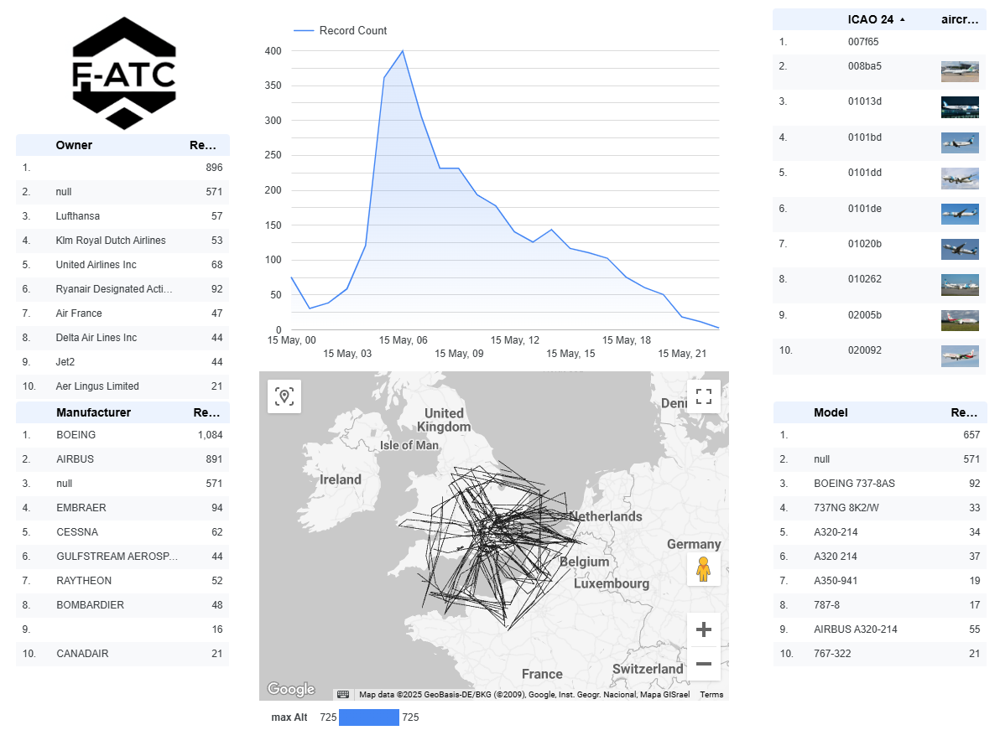

# Data Visualization and Reporting: Transform Data into Actionable Insights

## F-ATC Company Overview


Fictional Aircraft Tracking Company is a leading provider of flight tracking data analytics, dedicated to enhancing the safety of civil aviation worldwide. With a team of experienced aviation professionals and data scientists, we leverage advanced technologies to analyze vast amounts of flight data, providing critical insights to airlines, airports, and regulatory authorities.

Our mission is to revolutionize the way flight tracking data is utilized, empowering our partners to make informed decisions, optimize operations, and mitigate potential risks. By harnessing the power of data, Fictional Aircraft Tracking Company is committed to ensuring the highest standards of safety and efficiency in the global aviation industry.

The flight data is gathered from a distributed network of ADS-B receivers connected to small remote publishing edge compute platforms. These send all data received to pubsub. There are multiple sensors in each region. The busiest airspaces can have more than 2000 messages per second being received from over 100 aircraft. The messages are published to a pubsub topic for easy consumption and this is backed up to a Google Cloud Storage bucket.The flight data is collected through a network of ADS-B receivers, which are strategically distributed and linked to compact, remote edge computing platforms. These platforms are designed for efficient data processing at the source. Each receiver within the network plays a crucial role in capturing real-time data from aircraft within its coverage area.

Due to the dynamic nature of air traffic, the volume of data generated can be substantial. In densely populated airspace, the system can handle an influx of over 2000 messages per second, originating from more than 100 aircraft. To manage this high-velocity data stream, the messages are published to a pubsub topic. This approach ensures that the data is readily available for consumption by various applications and services. Additionally, the data is backed up to a Google Cloud Storage bucket, providing a durable and reliable storage solution for long-term retention and analysis.

The rough architecture of the system is shown below with the existing infrastructure on the left and the challenges for you as the Visualization Analyst on the right.


 
## Setup:

Create database server on Cloud SQL.

```bash
gcloud services enable sqladmin.googleapis.com

gcloud sql instances create business-dashboard \
    --tier=db-g1-small \
    --database-version=POSTGRES_16 \
    --region=$REGION \
    --edition=ENTERPRISE \
    --root-password=MyDBPassword \
    --database-flags=cloudsql.iam_authentication=on


gcloud sql databases create flightdata \
--instance=business-dashboard


CLOUD_SQL_SA=$(gcloud sql instances describe business-dashboard --project=$(gcloud config get-value project) --format='value(serviceAccountEmailAddress)')

gcloud sql users create ${CLOUD_SQL_SA%.gserviceaccount.com} \
--instance=business-dashboard \
--type=cloud_iam_service_account

CONNECTION_ID=$(gcloud sql instances describe business-dashboard  --format='value(connectionName)')

echo $CLOUD_SQL_SA
cloud-sql-proxy --address 0.0.0.0 --port 5432 $CONNECTION_ID
```

Open a second tab.

```bash
psql -h 127.0.0.1  --username=postgres flightdata
```

```sql
CREATE TABLE adsb_data (
    message_type VARCHAR(255),
    transmission_type INTEGER,
    sid VARCHAR(255),
    aid VARCHAR(255),
    icao_address VARCHAR(6),
    fid VARCHAR(255),
    date_generated VARCHAR(255),
    time_generated VARCHAR(255),
    date_logged VARCHAR(255),
    time_logged VARCHAR(255),
    callsign VARCHAR(8),
    altitude_feet INTEGER,
    ground_speed_knots INTEGER,
    track_degrees INTEGER,
    latitude DOUBLE PRECISION,
    longitude DOUBLE PRECISION,
    vertical_rate_feet_per_minute INTEGER,
    squawk VARCHAR(4),
    alert INTEGER,
    emer INTEGER,
    spi INTEGER,
    is_on_ground INTEGER
);

CREATE TABLE aircraft_data (
    icao24 VARCHAR(6) NULL,
    registration VARCHAR NULL,
    manufacturericao VARCHAR NULL,
    manufacturername VARCHAR NULL,
    model VARCHAR NULL,
    typecode VARCHAR NULL,
    serialnumber VARCHAR NULL,
    linenumber VARCHAR NULL,
    icaoaircrafttype VARCHAR NULL,
    operator VARCHAR NULL,
    operatorcallsign VARCHAR NULL,
    operatoricao VARCHAR NULL,
    operatoriata VARCHAR NULL,
    owner VARCHAR NULL,
    testreg VARCHAR NULL,
    registered VARCHAR NULL,
    reguntil VARCHAR NULL,
    status VARCHAR NULL,
    built VARCHAR NULL,
    firstflightdate VARCHAR NULL,
    seatconfiguration VARCHAR NULL,
    engines VARCHAR NULL,
    modes VARCHAR NULL,
    adsb VARCHAR NULL,
    acars VARCHAR NULL,
    notes TEXT NULL,
    categoryDescription VARCHAR NULL
);

GRANT ALL ON SCHEMA flightdata TO <CLOUD_SQL_SA>;

\q
```

```bash
gcloud storage buckets add-iam-policy-binding "gs://$PROJECT_ID-flightdata-bucket" \
  --member="serviceAccount:$CLOUD_SQL_SA" \
  --role="roles/storage.objectAdmin"

gcloud sql import csv business-dashboard gs://$PROJECT_ID-flightdata-bucket/transponder/transponder.csv \
--database=flightdata \
--table=adsb_data -q

wget https://s3.opensky-network.org/data-samples/metadata/aircraftDatabase.zip
unzip aircraftDatabase.zip 
gcloud storage cp aircraftDatabase.csv gs://$PROJECT_ID-flightdata-bucket/

gcloud sql import csv business-dashboard gs://$PROJECT_ID-flightdata-bucket/aircraftDatabase.csv \
--database=flightdata \
--table=aircraft_data -q
```

```sql
-- clean two top rows from import
delete from aircraft_data where icao24='icao24' or icao24=''
```

Connect Looker Studio.

```bash
gcloud sql instances patch business-dashboard --authorized-networks=142.251.74.0/23 -q

export IP=$(gcloud sql instances describe business-dashboard --format="value(ipAddresses[0].ipAddress)")
```

```sql
WITH
  aircraft AS (
  SELECT
    LOWER(icao24) AS icao24,
    manufacturericao,
    MODEL,
    owner
  FROM
    aircraft_data),
  details AS (
  SELECT
    LOWER(icao_address) AS icao24,
    MAX(altitude_feet) AS maxAlt,
    MIN(altitude_feet) AS minAlt
  FROM
    adsb_data
  WHERE
    icao_address IS NOT NULL
    AND altitude_feet IS NOT NULL
  GROUP BY
    icao_address)
SELECT
  *
FROM
  details
LEFT JOIN
  aircraft
USING
  (icao24)
```

## Task 1. Investigate the data, query performance, and connnect Cloud SQL to BigQuery
Understand data across different sources and set up a connection between Cloud SQL/Spanner and BigQuery. Explore Looker Studio dashboard to identify why there are issues with the results and issues with the performance.

The critical issue is that the database server is too small to run the full table scans required for the queries and this is also impacting the day to day operations of the company. Your first task will be to connect BigQuery to the database to reduce the load on the operational database. 

### Create a connection from BigQuery to Cloud SQl

You have recently reviewed this site <https://cloud.google.com/bigquery/docs/cloud-sql-federated-queries> to enable the reading of data directly from your operational database into BigQuery.

This first step in this journey will be to reduce join load. If you use federated queries, it is a sequential scan of the data that is sent to BigQuery. BigQuery can then run the join for you, reducing the computational load on the operational database.

Keep in mind that you are only working with a single day's worth of data and the query is really slow already. If you move to 30 days or longer, then the queries will be too slow. 

## Task 2. Move the larger of the two datasets into BigQuery using a scheduled query
<!---Create a new table (or tables) with appropriate schema to optimize query performance. Leverage repeated and nested fields where appropriate.  Create a scheduled query to repopulate this new table once per day.--->

Move some of the data into BigQuery so that the actual query does not put load on the Operational Data Source (ODS). You have elected to move the ADS-B data (the larger of the two datasets) into BigQuery.

Some tables could stay in Cloud SQL as they may be updated by the operational systems and as long as the data is not too large, it should be feasible to join a small table from Cloud SQL to the larger data in BigQuery.

Create a scheduled query for the aircraft adsb data to bring that into BigQuery. The aircraft details can safely be left in Cloud SQL as it is small enough and if you assume it may be updated very frequently, then it would not be a good candidate to keep in BigQuery (assume this for this scenario, in production the aircraft database would only be updated when new aircraft are produced which is not a very high velocity dataset).

One of the items to be aware of as you build out the dashboarding infrastrcuture is that federated data sources like Cloud SQL must be in the same region or in the same multi-regional area as the BigQuery execution engine. You cannot have Cloud SQL in `europe-west1` and BigQuery in `US`. This becomes much more important when you start joining data between native and federated data sources.

You will also need to start with an initial load and then load the remaining data with a high water mark.

You can run the initial load using this query and you might as well do the type conversions on load:

```sql
drop table if exists flightData.adsbData;
CREATE OR REPLACE TABLE flightData.adsbData PARTITION BY DATE(generated) AS
WITH
  adsb_details AS (
  SELECT
    *
  FROM
    EXTERNAL_QUERY("us.aircraft-ods",
      "select message_type,cast(transmission_type as INT) as transmission_type,sid,aid,icao_address,fid,TO_TIMESTAMP(concat(date_generated,' ',time_generated), 'YYYY/MM/DD HH24:MI:SS.MS') as generated,TO_TIMESTAMP(concat(date_logged,' ',time_logged), 'YYYY/MM/DD HH24:MI:SS.MS') as logged,callsign,cast(altitude_feet as int) as altitude_feet,cast(ground_speed_knots as int) as ground_speed_knots,cast(track_degrees as int) as track_degrees,cast(latitude as float) as latitude,cast(longitude as float) as longitude,cast(vertical_rate_feet_per_minute as int) as vertical_rate_feet_per_minute,cast(squawk as int) as squawk,cast(alert as int) as alert,cast(emer as int) as emer,cast(spi as int) as spi,cast(is_on_ground as int) as is_on_ground from adsb_data where date_generated='2025/05/15' and time_generated like '00:%';"))
SELECT
  *
FROM
  adsb_details;
```

## Task 3. Update the Looker Studio dashboard to incorporate the new table(s) and fix identified issues with queries 


Write a custom query joining the ADS-B data in BigQuery database with the aircraft data from the operational database. Create a report with the minimum and maximum altitude for each flight. Your dashboard should also be able to show which flights, manufacturers, and operators are flying. You can join the ODS data (`manufacturericao`, `model`,`owner`) with the `generated` and `altitude_feet` data from BigQuery using the lowercased `icao24` field.


Add a calulated field to have the count of the `icao24` records to break down how many aircraft are seen as the record count will be inaccurate (it will show total records which will be much higher than the actual aircraft.) You will see data quality issues here, but this is part of the data quality challenge to solve, you are just presenting the data.

## Task 4

Performance is still slower than it should be. Create materialized views to improve the performance of your queries. Set up BI Engine and use it to further improve performance. You can also remove altitudes larger than 43,000 feet and less than 0 feet. You may also drop any records that don't have location and altitude data. 

Enable the BI engine and target the tables used in the query to accelerate the reponse times.

Rebuild the Looker query to use the materialized view and the federated data. You can aggregate the data for each flight into a single row by nesting the geometry data into a line.


## Task 5

The business team who owns the dashboard has asked for you to add in additional metrics and visualizations to the dashboard. Revisit your work from the previous tasks to integrate these new tasks into the dashboard.

The business team would like a tool tip showing the aircraft data from the following endpoint.
You can call the following endpoint and get more details on the aircraft <https://api.planespotters.net/pub/photos/hex/AA9300>. Have a look at this link <https://lookerstudio.google.com/reporting/1zOZ2aPL8HYl4JIhjsMQKvj5BSWwcKRdv/page/EQxK>

The application team has exposed an API that returns an image of the aircraft based on the ICAO number here <https://aircraftimage-707366556769.us-central1.run.app/>



Aircraft data sourced from:
> Matthias Schäfer, Martin Strohmeier, Vincent Lenders, Ivan Martinovic, and Matthias Wilhelm.
> "Bringing Up OpenSky: A Large-scale ADS-B Sensor Network for Research".
> In Proceedings of the 13th IEEE/ACM International Symposium on Information Processing in Sensor Networks (IPSN), pages 83-94, April 2014.
