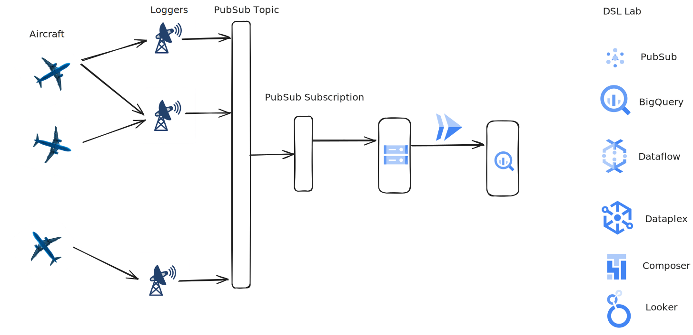
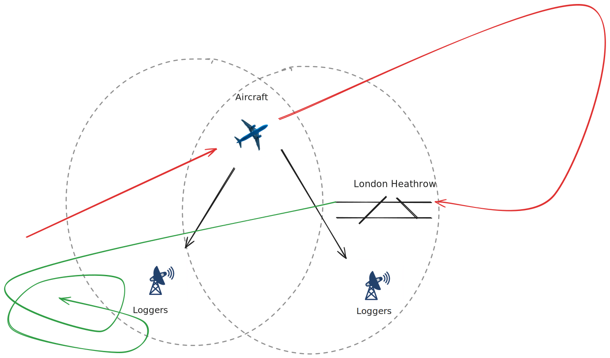
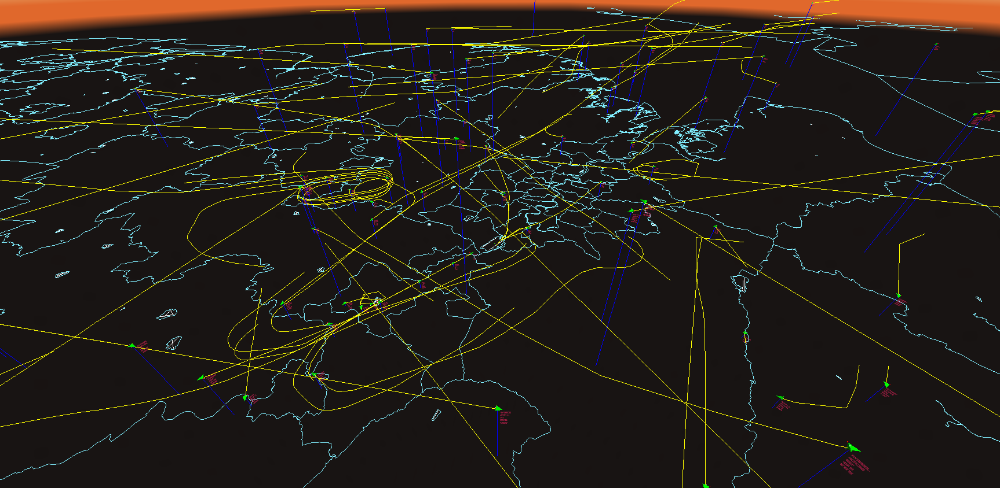

# Data Integration

## F-ATC Company Overview


Fictional Aircraft Tracking Company (F-ATC) is a leading provider of flight tracking data analytics, dedicated to enhancing the safety of civil aviation worldwide. With a team of experienced aviation professionals and data scientists, we leverage advanced technologies to analyze vast amounts of flight data, providing critical insights to airlines, airports, and regulatory authorities.

Our mission is to revolutionize the way flight tracking data is utilized, empowering our partners to make informed decisions, optimize operations, and mitigate potential risks. By harnessing the power of data, F-ATC is committed to ensuring the highest standards of safety and efficiency in the global aviation industry.

The flight data is gathered from a distributed network of ADS-B receivers connected to small, remote publishing edge compute platforms. These platforms send all received data to Pub/Sub. There are multiple sensors in each region. The busiest airspaces can have more than 2000 messages per second being received from over 100 aircraft. The messages are published to a Pub/Sub topic for easy consumption, and this data is backed up to a Google Cloud Storage bucket.

The flight data is collected through a network of ADS-B receivers, strategically distributed and linked to compact, remote edge computing platforms. These platforms are designed for efficient data processing at the source. Each receiver within the network plays a crucial role in capturing real-time data from aircraft within its coverage area.

Due to the dynamic nature of air traffic, the volume of data generated can be substantial. In densely populated airspace, the system can handle an influx of over 2000 messages per second, originating from more than 100 aircraft. To manage this high-velocity data stream, the messages are published to a Pub/Sub topic. This approach ensures that the data is readily available for consumption by various applications and services. Additionally, the data is backed up to a Google Cloud Storage bucket, providing a durable and reliable storage solution for long-term retention and analysis. A sample service is available here to visualize the real-time data.

The rough architecture of the system is shown below, with the existing infrastructure on the left and the challenges for you as the Visualization Analyst on the right.



The critical challenges from a data engineering perspective, beyond the potentially dirty data, lie in the physical implementation of the system. In data engineering, it is preferred to have duplicate data rather than to lose data. However, this means that the system must be designed to tolerate duplicate data throughout the pipeline. Duplication may occur at:

- The aircraft: It may send out the data twice, but it should have the same generation time.
- The logger: The logger may record receiving the data twice.
- The logger: It also might send the data to Pub/Sub twice.
- Pub/Sub: It may deliver the message to each subscription more than once.
- Dataflow and BigQuery: They may duplicate the data ingested in some specific failure scenarios.



If data is going to be aggregated for each session the aircraft is seen, then a session window will be required. Tumbling (fixed time) windows and hopping (sliding windows) will not aggregate the data correctly. A session window should be chosen that accurately reflects the validity of the data. If the window is too short, then an aircraft's session may be closed if it enters a "shadow," which is a portion of the airspace that is untracked due to ground obstructions. This frequently happens when there is a building between the logger and the aircraft, usually close to landing/takeoff areas for aircraft near the maximum range of the loggers. If the session is too long, it may join a previous flight with a current flight. This means the session should be shorter than the fastest turnaround of a commercial airliner, which is around 45 minutes. Another consideration is that the session is not emitted until after the final data is received, so the longer the session, the longer it will take for the data to be available for analysis.

Another challenge is that as the F-ATC logger network expands, data from each aircraft may be received more than once. This is preferable as it eliminates the shadows and gives better detail over a wider area. For each message:

Below is a snapshot of the airspace over London Heathrow showing overflights (flights at high altitude just passing over), aircraft in holding (center left of the image, aircraft waiting to be brought into approach), aircraft on final (below center left), and aircraft taking off (center).



----
Todo

----

## Setup:
Terraform script to deploy databases and load data into the following sources:
SQL Server on Cloud SQL
Postgres on AlloyDB or Spanner
Document storage on Firestore?
Log data in Cloud Storage
Data to be statically stored in AWS S3 buckets and Azure Blob Storage buckets for the project. Will need to think about managing this data and billing
Terraform script to deploy a small VM for streaming simulated data to Pub/Sub and writing transactions to Cloud SQL and/or AlloyDB/Spanner.

----

## Task 1

Data is currently being written into a Cloud Storage bucket at `gs://flightdata-demo`. In this bucket, you'll see sample aircraft metadata in the `flightdata-data` directory and the aircraft logs data in the root directory.

The data in the root directory conforms to the Base Station format listed [here](http://woodair.net/sbs/article/barebones42_socket_data.htm), and as you can see, it is formatted as standard CSV. While CSV data is fairly ubiquitous, it is difficult to work with as the structure can be messy. A sample of the data is shown below.

```csv
MSG,8,1,1,ABFDAF,1,2025/03/19,04:18:28.888,2025/03/19,04:18:28.926,,,,,,,,,,,,0
MSG,7,1,1,A3DC34,1,2025/03/19,04:18:28.891,2025/03/19,04:18:28.927,,8750,,,,,,,,,,
MSG,4,1,1,AC56BA,1,2025/03/19,04:18:28.892,2025/03/19,04:18:28.927,,,298,311,,,2880,,,,,0
MSG,4,1,1,ABFDAF,1,2025/03/19,04:18:28.898,2025/03/19,04:18:28.928,,,437,138,,,-2176,,,,,0
MSG,7,1,1,A1244D,1,2025/03/19,04:18:28.899,2025/03/19,04:18:28.929,,10950,,,,,,,,,,
MSG,5,1,1,A58C29,1,2025/03/19,04:18:28.911,2025/03/19,04:18:28.931,,10375,,,,,,,0,,0,
MSG,3,1,1,ABFDAF,1,2025/03/19,04:18:28.917,2025/03/19,04:18:28.932,,18475,,,33.32707,-117.68406,,,0,,0,0
MSG,3,1,1,A1244D,1,2025/03/19,04:18:28.920,2025/03/19,04:18:28.976,,10950,,,33.45039,-117.99933,,,0,,0,0
MSG,7,1,1,A2E09A,1,2025/03/19,04:18:28.928,2025/03/19,04:18:28.977,,38000,,,,,,,,,,
MSG,8,1,1,A4E146,1,2025/03/19,04:18:29.255,2025/03/19,04:18:29.306,,,,,,,,,,,,0
MSG,7,1,1,A3DC34,1,2025/03/19,04:18:29.265,2025/03/19,04:18:29.308,,8750,,,,,,,,,,
MSG,8,1,1,AD9EDC,1,2025/03/19,04:18:29.266,2025/03/19,04:18:29.309,,,,,,,,,,,,0
MSG,8,1,1,A58C29,1,2025/03/19,04:18:29.266,2025/03/19,04:18:29.309,,,,,,,,,,,,0
MSG,3,1,1,AC56BA,1,2025/03/19,04:18:29.277,2025/03/19,04:18:29.311,,22525,,,33.04674,-117.65885,,,0,,0,0
MSG,8,1,1,A451CF,1,2025/03/19,04:18:29.284,2025/03/19,04:18:29.312,,,,,,,,,,,,0
MSG,7,1,1,0C20F6,1,2025/03/19,04:18:29.288,2025/03/19,04:18:29.313,,33000,,,,,,,,,,
MSG,4,1,1,A2E09A,1,2025/03/19,04:18:29.319,2025/03/19,04:18:29.362,,,371,320,,,-64,,,,,0
MSG,3,1,1,ABFDAF,1,2025/03/19,04:18:29.326,2025/03/19,04:18:29.363,,18450,,,33.32648,-117.68340,,,0,,0,0
MSG,5,1,1,A451CF,1,2025/03/19,04:18:29.331,2025/03/19,04:18:29.364,,37025,,,,,,,0,,0,
MSG,8,1,1,AA630B,1,2025/03/19,04:18:29.343,2025/03/19,04:18:29.366,,,,,,,,,,,,0
MSG,7,1,1,A3DC34,1,2025/03/19,04:18:29.346,2025/03/19,04:18:29.367,,8750,,,,,,,,,,
MSG,4,1,1,A3DC34,1,2025/03/19,04:18:29.370,2025/03/19,04:18:29.415,,,277,263,,,-256,,,,,0
MSG,3,1,1,0D0A21,1,2025/03/19,04:18:29.375,2025/03/19,04:18:29.416,,14650,,,33.60022,-117.14027,,,0,,0,0
```

As you can see, most messages will be the `MSG` format, the dates are not in [ISO 8601](https://www.iso.org/iso-8601-date-and-time-format.html) format, and there are separate message generation date/times and message logged date/times. There are also many blank strings that should be stored as null values.

The files in Cloud Storage are updated fairly frequently (every 10 minutes or every 10.24 MB, whichever comes first).

### Step 1

Set up an [event sync](https://cloud.google.com/storage-transfer/docs/event-driven-transfers) to replicate data from the source bucket into a bucket in your project. BigQuery DTS requires that the data source and BigQuery Dataset are in the same region.

### Step 2

Set up the table so that it is visible in BigQuery. This can use either [DTS](https://cloud.google.com/bigquery/docs/dts-introduction) to schedule the data loads or use [object tables](https://cloud.google.com/bigquery/docs/biglake-intro).

### Step 3

Clean the data using SQL. The dates are especially messy. `CAST`ing and `SAFE_CAST`ing are useful here. You'll need to work with [date functions](https://cloud.google.com/bigquery/docs/reference/standard-sql/date_functions) to clean the dates. You can create this as a [view](https://cloud.google.com/bigquery/docs/views) or a [materialized view](https://cloud.google.com/bigquery/docs/materialized-views-intro).

### Step 4

You'll need to remove the duplicate rows from the overlapping receivers. Keep in mind that the generation date/time and data will be the same, but the logged date/time will vary based on the logger receiving. The granularity of this time is not accurate enough to triangulate the planes, though, so it is your choice on what to do with the logging date/time.

----
Initial request

Consolidate data from transactional databases and object storage into a single location. This will mean using BigQuery or Spanner for the transactional data and Cloud Storage for object storage. Students should explore tools like DTS and connections in BigQuery for performing this task. The goal here is not to fully analyze the data, but rather to just get everything into one place before further ETL

----

## Task 2

Once the structure has been roughly agreed upon, you'll change from a BigQuery-oriented ELT process to a Dataflow-oriented ETL process. This means that the data will need to be transformed on load but helps in that the date/time fields can be converted into `datetime` or `timestamp` types on load, which helps.

### Step 1

Write a Dataflow job that loads the data into BigQuery from Cloud Storage. Using the [Workbenches](https://cloud.google.com/dataflow/docs/guides/interactive-pipeline-development) would accelerate the development of this.

### Step 2

The data should be validated against a regex to make sure that the structure conforms to your required input. This will also fix the scenario that dirty data is written into Cloud Storage, breaking the view of data in BigQuery. Dates and times can be consolidated into a single field, which you can now use to partition the data. Blank fields in the `CSV` should be converted into null values.

### Step 3

If data doesn't match the regex, it should write the data to a second Cloud Storage bucket for review to evaluate whether data could be saved by better ETL or whether it can be safely discarded.

### Step 4 

The duplicate data (messages from a single aircraft received by two loggers) will still need to be removed.

----
Initial request

Perform ETL on the consolidated batch data to transform the data into an appropriate form for the data warehouse. A specific use case will need to be defined for this to be viable.

----

## Task 3

Schedule the transfer from Cloud Storage using either Cloud Composer or Data Fusion to move the data to BigQuery. This should simplify moving the data on a daily basis. The process should only move the data from one day at a time.

----
Initial request

Orchestrate the first two tasks via an orchestration tool such as Composer or Data Fusion. Ideally Composer here unless students want to go the Data Fusion route.

----

## Task 4

The Data Capture team has upgraded the data collection to use Pub/Sub allowing for near realtime data analytics.

### Step 1

The data structure has not changed, but because you'll be reading from an API rather than a bucket, your initial step from Dataflow will need a Google Cloud Storage or Pub/Sub tolerant step. It should work for both your batch and stream processing. The data is available on the following topic `projects/paul-leroy/topics/flight-transponder`, and you'll need to create a subscription in your project or alternatively dynamically create the subscription when your pipeline starts. This is subtly done when using the PubsubIO handler to read from a topic.

### Step 2

You now have access to a continuous stream of data, which allows you to restructure the data so that data can be nested per session (time from when the aircraft is first seen to when it is last seen). The visualization time is interested in the Timestamp/DateTime, the aircraft [ICAO24](https://skybrary.aero/articles/24-bit-aircraft-address) identifier, the altitude, and the location (latitude and longitude) of the aircraft. Keep in mind that aircraft may be in the air over midnight, so sessions should be tolerant of flights spanning multiple days.

----
Initial request

Now visit streaming data via Pub/Sub and Dataflow. Explore the data (that has been written to a sink in GCS) and write a pipeline to properly parse the data and store it in BigQuery. Ensure that the data is valid.

----

## Task 5

----
Initial request

Implement CDC on the transactional data using a product such as Datastream. Incorporate this into your DE workload

----
