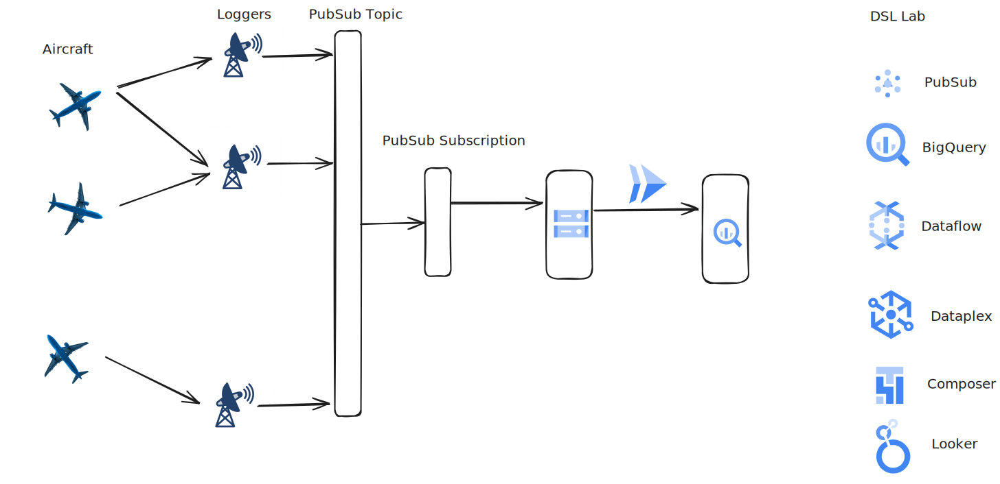
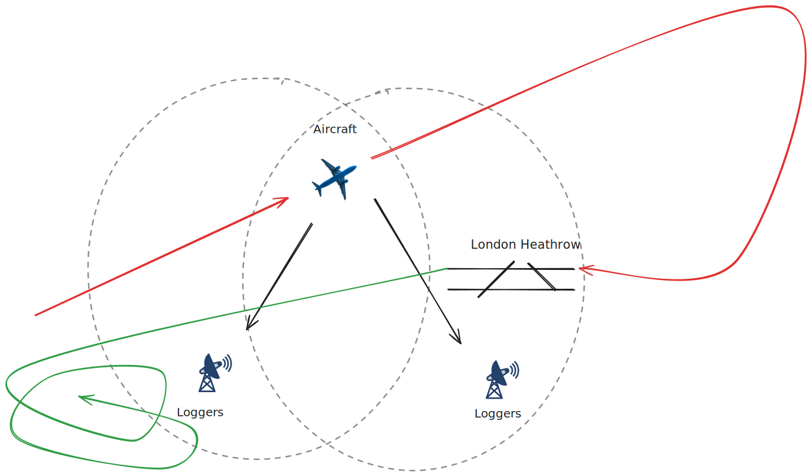

# Data Integration

## F-ATC Company Overview


Fictional Aircraft Tracking Company (F-ATC) is a leading provider of flight tracking data analytics, dedicated to enhancing the safety of civil aviation worldwide. With a team of experienced aviation professionals and data scientists, we leverage advanced technologies to analyze vast amounts of flight data, providing critical insights to airlines, airports, and regulatory authorities.

Our mission is to revolutionize the way flight tracking data is utilized, empowering our partners to make informed decisions, optimize operations, and mitigate potential risks. By harnessing the power of data, F-ATC is committed to ensuring the highest standards of safety and efficiency in the global aviation industry.

The flight data is collected through a network of ADS-B receivers, arbitrarily distributed and linked to compact, remote edge computing platforms. These platforms are designed for efficient data processing at the source. Each receiver within the network plays a crucial role in capturing real-time data from aircraft within its coverage area.

Due to the dynamic nature of air traffic, the volume of data generated can be substantial. In densely populated airspace, the system can handle an influx of over 2,000 messages per second, originating from more than 100 aircraft. To manage this high-velocity data stream, the messages are published to a Pub/Sub topic. This approach ensures that the data is readily available for consumption by various applications and services. Additionally, the data is backed up to a Google Cloud Storage bucket, providing a durable and reliable storage solution for long-term retention and analysis. A sample service is available here to visualize the real-time data.

The rough architecture of the system is shown below, with the existing infrastructure on the left and the challenges for you as the Visualization Analyst on the right.



The critical challenges from a data engineering perspective, beyond the potentially dirty data, lie in the physical implementation of the system. In data engineering, it is preferred to have duplicate data rather than to lose data. However, this means that the system must be designed to tolerate duplicate data throughout the pipeline. Duplication may occur at:

- The aircraft: It may send out the data twice, but it should have the same generation time.
- The logger: The logger may record receiving the data twice.
- The logger: It also might send the data to Pub/Sub twice.
- Pub/Sub: It may deliver the message to each subscription more than once.
- Dataflow and BigQuery: They may duplicate the data ingested in some specific failure scenarios.



If data is going to be aggregated for each session the aircraft is seen, then a session window will be required. Tumbling (fixed time) windows and hopping (sliding windows) will not aggregate the data correctly. A session window should be chosen that accurately reflects the validity of the data. If the window is too short, then an aircraft's session may be closed if it enters a "shadow," which is a portion of the airspace that is untracked due to ground obstructions. This frequently happens when there is a building between the logger and the aircraft, usually close to landing/takeoff areas for aircraft near the maximum range of the loggers. If the session is too long, it may join a previous flight with a current flight. This means the session should be shorter than the fastest turnaround of a commercial airliner, which is around 45 minutes. Another consideration is that the session is not emitted until after the final data is received, so the longer the session, the longer it will take for the data to be available for analysis.

Another challenge is that as the F-ATC logger network expands, data from each aircraft may be received more than once. This is preferable as it eliminates the shadows and gives better detail over a wider area. 

Below is a snapshot of the airspace over London Heathrow showing overflights (flights at high altitude just passing over), aircraft in holding (center left of the image, aircraft waiting to be brought into approach), aircraft on final (below center left), and aircraft taking off (center).


<!----
Todo

----

## Setup:
Terraform script to deploy databases and load data into the following sources:
SQL Server on Cloud SQL
Postgres on AlloyDB or Spanner
Document storage on Firestore?
Log data in Cloud Storage
Data to be statically stored in AWS S3 buckets and Azure Blob Storage buckets for the project. Will need to think about managing this data and billing
Terraform script to deploy a small VM for streaming simulated data to Pub/Sub and writing transactions to Cloud SQL and/or AlloyDB/Spanner.

---->

## Task 1

<!----
Initial request

Perform ETL on the consolidated batch data to transform the data into an appropriate form for the data warehouse. A specific use case will need to be defined for this to be viable.

---->

Data is currently being written into a Cloud Storage bucket at `gs://flightdata-demo`. In this bucket, you'll see sample aircraft metadata in the `flightdata-data` directory and the aircraft logs data in the root directory.

The data in the root directory conforms to the Base Station format listed [here](http://woodair.net/sbs/article/barebones42_socket_data.htm), and as you can see, it is formatted as standard CSV. While CSV data is fairly ubiquitous, it is difficult to work with as the structure can be messy. A sample of the data is shown below.

```csv
MSG,8,1,1,ABFDAF,1,2025/03/19,04:18:28.888,2025/03/19,04:18:28.926,,,,,,,,,,,,0
MSG,7,1,1,A3DC34,1,2025/03/19,04:18:28.891,2025/03/19,04:18:28.927,,8750,,,,,,,,,,
MSG,4,1,1,AC56BA,1,2025/03/19,04:18:28.892,2025/03/19,04:18:28.927,,,298,311,,,2880,,,,,0
MSG,4,1,1,ABFDAF,1,2025/03/19,04:18:28.898,2025/03/19,04:18:28.928,,,437,138,,,-2176,,,,,0
MSG,7,1,1,A1244D,1,2025/03/19,04:18:28.899,2025/03/19,04:18:28.929,,10950,,,,,,,,,,
MSG,5,1,1,A58C29,1,2025/03/19,04:18:28.911,2025/03/19,04:18:28.931,,10375,,,,,,,0,,0,
MSG,3,1,1,ABFDAF,1,2025/03/19,04:18:28.917,2025/03/19,04:18:28.932,,18475,,,33.32707,-117.68406,,,0,,0,0
MSG,3,1,1,A1244D,1,2025/03/19,04:18:28.920,2025/03/19,04:18:28.976,,10950,,,33.45039,-117.99933,,,0,,0,0
MSG,7,1,1,A2E09A,1,2025/03/19,04:18:28.928,2025/03/19,04:18:28.977,,38000,,,,,,,,,,
MSG,8,1,1,A4E146,1,2025/03/19,04:18:29.255,2025/03/19,04:18:29.306,,,,,,,,,,,,0
MSG,7,1,1,A3DC34,1,2025/03/19,04:18:29.265,2025/03/19,04:18:29.308,,8750,,,,,,,,,,
MSG,8,1,1,AD9EDC,1,2025/03/19,04:18:29.266,2025/03/19,04:18:29.309,,,,,,,,,,,,0
MSG,8,1,1,A58C29,1,2025/03/19,04:18:29.266,2025/03/19,04:18:29.309,,,,,,,,,,,,0
MSG,3,1,1,AC56BA,1,2025/03/19,04:18:29.277,2025/03/19,04:18:29.311,,22525,,,33.04674,-117.65885,,,0,,0,0
MSG,8,1,1,A451CF,1,2025/03/19,04:18:29.284,2025/03/19,04:18:29.312,,,,,,,,,,,,0
MSG,7,1,1,0C20F6,1,2025/03/19,04:18:29.288,2025/03/19,04:18:29.313,,33000,,,,,,,,,,
MSG,4,1,1,A2E09A,1,2025/03/19,04:18:29.319,2025/03/19,04:18:29.362,,,371,320,,,-64,,,,,0
MSG,3,1,1,ABFDAF,1,2025/03/19,04:18:29.326,2025/03/19,04:18:29.363,,18450,,,33.32648,-117.68340,,,0,,0,0
MSG,5,1,1,A451CF,1,2025/03/19,04:18:29.331,2025/03/19,04:18:29.364,,37025,,,,,,,0,,0,
MSG,8,1,1,AA630B,1,2025/03/19,04:18:29.343,2025/03/19,04:18:29.366,,,,,,,,,,,,0
MSG,7,1,1,A3DC34,1,2025/03/19,04:18:29.346,2025/03/19,04:18:29.367,,8750,,,,,,,,,,
MSG,4,1,1,A3DC34,1,2025/03/19,04:18:29.370,2025/03/19,04:18:29.415,,,277,263,,,-256,,,,,0
MSG,3,1,1,0D0A21,1,2025/03/19,04:18:29.375,2025/03/19,04:18:29.416,,14650,,,33.60022,-117.14027,,,0,,0,0
```

As you can see, most messages will be the `MSG` format, the dates are not in [ISO 8601](https://www.iso.org/iso-8601-date-and-time-format.html) format, and there are separate message generation date/times and message logged date/times. There are also many blank strings that should be stored as null values.

The files in Cloud Storage are updated fairly frequently (every 10 minutes or every 10.24 MB, whichever comes first).

### Step 1

Set up an [event sync](https://cloud.google.com/storage-transfer/docs/event-driven-transfers) to replicate data from the source bucket into a bucket in your project. The change data is currently published to this topic `projects/paul-leroy/topics/flightdata-gcs-eventstream`, which you can subscribe to in your project. You will also need to check that the data transfer service API is enabled and that the data transfer service account has consume access on Pub/Sub, Bucket Viewer and Object Admin roles on your bucket. BigQuery DTS requires that the data source and BigQuery Dataset are in the same region so be cognizant of this as BigQuery will be unable to load data from other regions outside the dataset region. A daily sync is also acceptable, you can use the following template to decide on mechanisms:

1. How much data needs to be moved? (about 5 GB per day)
1. How fast is the data moving? (roughly 3MB per minute)
1. How frequently is the data reported on? (at this stage once per day, which is the deciding criterion)

### Step 2

Set up the table so that it is visible in BigQuery. This can use either [DTS](https://cloud.google.com/bigquery/docs/dts-introduction) to schedule the data loads or use [object tables](https://cloud.google.com/bigquery/docs/biglake-intro).

The table may look like the sample below.

| MT  | TT | SID | AID | Hex    | FID | DMG         | TMG      | DML         | TML      | CS     | Alt  | GS   | Trk  | Lat  | Lng  | VR   | Sq   | Alrt | Emer | SPI | Gnd |
|-----|----|-----|-----|--------|-----|-------------|----------|-------------|----------|--------|------|------|------|------|------|------|------|------|------|-----|-----|
| MSG | 1  | 1   | 1   | 06A124 | 1   | 2025/03/10  | 0:22:59  | 2025/03/10  | 0:22:59  | QTR99Y | null | null | null | null | null | null | null | null | null | null| 0   |
| MSG | 1  | 1   | 1   | 0D07A8 | 1   | 2025/03/10  | 12:22:09 | 2025/03/10  | 12:22:09 | VOI3180| null | null | null | null | null | null | null | null | null | null| 0   |
| MSG | 1  | 1   | 1   | 0C210D | 1   | 2025/03/10  | 9:43:30  | 2025/03/10  | 9:43:30  | CMP473 | null | null | null | null | null | null | null | null | null | null| 0   |
| MSG | 1  | 1   | 1   | 0C210D | 1   | 2025/03/10  | 9:44:35  | 2025/03/10  | 9:44:35  | CMP473 | null | null | null | null | null | null | null | null | null | null| 0   |
| MSG | 1  | 1   | 1   | 0C210D | 1   | 2025/03/10  | 9:45:30  | 2025/03/10  | 9:45:30  | CMP473 | null | null | null | null | null | null | null | null | null | null| 0   |
| MSG | 1  | 1   | 1   | 0C210D | 1   | 2025/03/10  | 9:44:30  | 2025/03/10  | 9:44:30  | CMP473 | null | null | null | null | null | null | null | null | null | null| 0   |
| MSG | 1  | 1   | 1   | 06A124 | 1   | 2025/03/10  | 0:20:25  | 2025/03/10  | 0:20:25  | QTR99Y | null | null | null | null | null | null | null | null | null | null| 0   |
| MSG | 1  | 1   | 1   | 0C210D | 1   | 2025/03/10  | 9:46:26  | 2025/03/10  | 9:46:26  | CMP473 | null | null | null | null | null | null | null | null | null | null| 0   |
| MSG | 1  | 1   | 1   | 06A124 | 1   | 2025/03/10  | 0:23:29  | 2025/03/10  | 0:23:29  | QTR99Y | null | null | null | null | null | null | null | null | null | null| 0   |
| MSG | 1  | 1   | 1   | 06A19F | 1   | 2025/03/10  | 8:29:02  | 2025/03/10  | 8:29:02  | QTR56Y | null | null | null | null | null | null | null | null | null | null| 0   |

### Step 3

Clean the data using SQL. The dates are especially messy. `CAST`ing and `SAFE_CAST`ing are useful here. You'll need to work with [date functions](https://cloud.google.com/bigquery/docs/reference/standard-sql/date_functions) to clean the dates. You can create this as a [view](https://cloud.google.com/bigquery/docs/views) or a [materialized view](https://cloud.google.com/bigquery/docs/materialized-views-intro). You should also be able to de-duplicate the data that may be received from multiple loggers.

Warning! At this stage you may encounter the first big issue with trusting the incoming data, it may be dirty. If your queries fail with an error that says there is a column mismatch, delete the offending file from the bucket. You'll fix that later with Dataflow.


| Row | MT  | TT | SID | AID | Hex    | FID | MG                  |  CS     | Alt  | GS   | Trk  | Geom | VR   | Sq   | Alrt | Emer | SPI | Gnd |
|---|-----|----|-----|-----|--------|-----|---------------------|--------|------|------|------|------|------|------|------|------|-----|-----|
| 1 | MSG | 1  | 1   | 1   | 06A124 | 1   | 2025-03-10T00:22:59 | QTR99Y | null | null | null | null | null | null | null | null | null| 0   |
| 2 | MSG | 1  | 1   | 1   | 0D07A8 | 1   | 2025-03-10T12:22:09 | VOI3180| null | null | null | null | null | null | null | null | null| 0   |
| 3 | MSG | 1  | 1   | 1   | 0C210D | 1   | 2025-03-10T09:43:30 | CMP473 | null | null | null | null | null | null | null | null | null| 0   |
| 4 | MSG | 1  | 1   | 1   | 0C210D | 1   | 2025-03-10T09:44:35 | CMP473 | null | null | null | null | null | null | null | null | null| 0   |
| 5 | MSG | 1  | 1   | 1   | 0C210D | 1   | 2025-03-10T09:45:30 | CMP473 | null | null | null | null | null | null | null | null | null| 0   |
| 6 | MSG | 1  | 1   | 1   | 0C210D | 1   | 2025-03-10T09:44:30 | CMP473 | null | null | null | null | null | null | null | null | null| 0   |
| 7 | MSG | 1  | 1   | 1   | 06A124 | 1   | 2025-03-10T00:20:25 | QTR99Y | null | null | null | null | null | null | null | null | null| 0   |
| 8 | MSG | 1  | 1   | 1   | 0C210D | 1   | 2025-03-10T09:46:26 | CMP473 | null | null | null | null | null | null | null | null | null| 0   |
| 9 | MSG | 1  | 1   | 1   | 06A124 | 1   | 2025-03-10T00:23:29 | QTR99Y | null | null | null | null | null | null | null | null | null| 0   |
| 10 | MSG | 1  | 1   | 1   | 06A19F | 1   | 2025-03-10T08:29:02 | QTR56Y | null | null | null | null | null | null | null | null | null| 0   |

### Step 4

You'll need to remove the duplicate rows from the overlapping receivers. Keep in mind that the generation date/time and data will be the same, but the logged date/time will vary based on the logger receiving. The granularity of this time is not accurate enough to triangulate the planes, though, so it is your choice on what to do with the logging date/time. The `AID`, `FID`, and `SID` fields have been misconfigured on the remote devices and don't provide any relevant data or insight at this stage and can be dropped.

| Row | MT  | TT |  Hex    | MG                  |  CS     | Alt  | GS   | Trk  | Geom | VR   | Sq   | Alrt | Emer | SPI | Gnd |
|-----|-----|----|---------|---------------------|---------|------|------|------|------|------|------|------|------|-----|-----|
| 1  | MSG | 1  | 06A124 | 2025-03-10T00:22:59 | QTR99Y | null | null | null | null | null | null | null | null | null| 0   |
| 2  | MSG | 1  | 0D07A8 | 2025-03-10T12:22:09 | VOI3180| null | null | null | null | null | null | null | null | null| 0   |
| 3  | MSG | 1  | 0C210D | 2025-03-10T09:43:30 | CMP473 | null | null | null | null | null | null | null | null | null| 0   |
| 4  | MSG | 1  | 0C210D | 2025-03-10T09:44:35 | CMP473 | null | null | null | null | null | null | null | null | null| 0   |
| 5  | MSG | 1  | 0C210D | 2025-03-10T09:45:30 | CMP473 | null | null | null | null | null | null | null | null | null| 0   |
| 6  | MSG | 1  | 0C210D | 2025-03-10T09:44:30 | CMP473 | null | null | null | null | null | null | null | null | null| 0   |
| 7  | MSG | 1  | 06A124 | 2025-03-10T00:20:25 | QTR99Y | null | null | null | null | null | null | null | null | null| 0   |
| 8  | MSG | 1  | 0C210D | 2025-03-10T09:46:26 | CMP473 | null | null | null | null | null | null | null | null | null| 0   |
| 9  | MSG | 1  | 06A124 | 2025-03-10T00:23:29 | QTR99Y | null | null | null | null | null | null | null | null | null| 0   |
| 10 | MSG | 1  | 06A19F | 2025-03-10T08:29:02 | QTR56Y | null | null | null | null | null | null | null | null | null| 0   |


## Task 2

<!----
Initial request

Consolidate data from transactional databases and object storage into a single location. This will mean using BigQuery or Spanner for the transactional data and Cloud Storage for object storage. Students should explore tools like DTS and connections in BigQuery for performing this task. The goal here is not to fully analyze the data, but rather to just get everything into one place before further ETL

---->

Once the structure has been roughly agreed upon, you'll change from a BigQuery-oriented ELT process to a Dataflow-oriented ETL process. This means that the data will need to be transformed on load but helps in that the date/time fields can be converted into `datetime` or `timestamp` types on load, which helps.

### Step 1

Write a Dataflow job that loads the data into BigQuery from Cloud Storage. Using the [Workbenches](https://cloud.google.com/dataflow/docs/guides/interactive-pipeline-development) would accelerate the development of this.

### Step 2

The data should be validated against a regex to make sure that the structure conforms to your required input. This will also fix the scenario that dirty data is written into Cloud Storage, breaking the view of data in BigQuery. Dates and times can be consolidated into a single field, which you can now use to partition the data. Blank fields in the `CSV` should be converted into null values. You can also use Geography data types for the `Latitude` and `Longitude` data.

### Step 3

If data doesn't match the regex, it should write the data to a second Cloud Storage bucket for review to evaluate whether data could be saved by better ETL or whether it can be safely discarded.

### Step 4 

The duplicate data (messages from a single aircraft received by two loggers) will still need to be removed.


## Task 3

<!----
Initial request

Orchestrate the first two tasks via an orchestration tool such as Composer or Data Fusion. Ideally Composer here unless students want to go the Data Fusion route.

---->


The batch process should now be able to be triggered daily to move yesterday's data into the data warehouse. The pipeline itself is working, so you have multiple options in order to deploy this. 

### Step 1

Create a [dataflow template](https://cloud.google.com/dataflow/docs/concepts/dataflow-templates) or [dataflow flex template](https://cloud.google.com/dataflow/docs/guides/templates/using-flex-templates#python) from your pipeline so that it can be parameterized and called periodically, either from [Cloud Composer](https://cloud.google.com/composer/docs/composer-3/composer-overview) or [Cloud Scheduler](https://cloud.google.com/scheduler/docs). Your choice here may have an impact of scaling this in the future (but not as part of this challenge), so for this project it may be cost effective to use Cloud Scheduler. In production, Cloud Composer would allow multiple pipelines to be managed and scale across multiple teams. A quickstart can be found [here](https://cloud.google.com/dataflow/docs/guides/templates/using-flex-templates) for building out the template.


## Task 4


<!----
Initial request

Now visit streaming data via Pub/Sub and Dataflow. Explore the data (that has been written to a sink in GCS) and write a pipeline to properly parse the data and store it in BigQuery. Ensure that the data is valid.

---->

The Data Capture team has upgraded the data collection to use Pub/Sub allowing for near realtime data analytics.

### Step 1

The data structure has not changed, but because you'll be reading from an API rather than a bucket, your initial step from Dataflow will need a Google Cloud Storage or Pub/Sub tolerant step. It should work for both your batch and stream processing. The data is available on the following topic `projects/paul-leroy/topics/flight-transponder`, and you'll need to create a subscription in your project or alternatively dynamically create the subscription when your pipeline starts. This is subtly done when using the PubsubIO handler to read from a topic.

### Step 2

You now have access to a continuous stream of data, which allows you to restructure the data so that data can be nested per session (time from when the aircraft is first seen to when it is last seen). The visualization time is interested in the Timestamp/DateTime, the aircraft [ICAO24](https://skybrary.aero/articles/24-bit-aircraft-address) identifier, the altitude, and the location (latitude and longitude) of the aircraft. Keep in mind that aircraft may be in the air over midnight, so sessions should be tolerant of flights spanning multiple days.

Data may look like this (notice the chronological ordering):

| Hex | SessionStart | Session.MG                     | Session.CS                     | Session.Alt | Session.GS | Session.Trk | Session.pt | Session.VR                 | Session.Sq | Session.Alrt | Session.Emer | Session.SPI | Session.Gnd |      |
| :-: | :----------: | :----------------------------: | :----------------------------: | :---------: | :--------: | :---------: | :--------: | :------------------------: | :--------: | :----------: | :----------: | :---------: | :---------: | :--: |
| 1   | 10207        | 2025-04-12 17:44:48.104000 UTC | 2025-04-12 18:44:48.104000 UTC | null        | null       | 182         | 247        | null                       | \-832      | null         | null         | null        | null        | 0    |
|     |              |                                | 2025-04-12 18:44:51.214000 UTC | null        | null       | 182         | 251        | null                       | \-768      | null         | null         | null        | null        | 0    |
|     |              |                                | 2025-04-12 18:44:51.961000 UTC | null        | 4450       | null        | null       | null                       | null       | null         | null         | null        | null        | null |
|     |              |                                | 2025-04-12 18:45:01.336000 UTC | null        | 4325       | null        | null       | null                       | null       | null         | null         | null        | null        | null |
| 2   | 10207        | 2025-04-12 17:46:29.147000 UTC | 2025-04-12 18:46:29.147000 UTC | null        | 3250       | null        | null       | null                       | null       | null         | null         | null        | null        | null |
|     |              |                                | 2025-04-12 18:46:58.448000 UTC | null        | null       | null        | null       | null                       | null       | 3564         | 0            | 0           | 0           | null |
|     |              |                                | 2025-04-12 18:47:47.082000 UTC | null        | 2150       | null        | null       | null                       | null       | null         | null         | null        | null        | null |
|     |              |                                | 2025-04-12 18:48:08.995000 UTC | null        | 1825       | null        | null       | null                       | null       | null         | null         | null        | null        | null |
| 3   | 0C218D       | 2025-04-12 17:50:49.803000 UTC | 2025-04-12 18:50:49.803000 UTC | null        | null       | 387         | 138        | null                       | 1728       | null         | null         | null        | null        | 0    |
|     |              |                                | 2025-04-12 18:50:56.118000 UTC | null        | 19775      | null        | null       | POINT(-117.89815 33.38121) | null       | null         | 0            | null        | 0           | 0    |
|     |              |                                | 2025-04-12 18:51:02.443000 UTC | null        | null       | 388         | 138        | null                       | 1728       | null         | null         | null        | null        | 0    |
|     |              |                                | 2025-04-12 18:51:06.314000 UTC | null        | 20050      | null        | null       | null                       | null       | null         | null         | null        | null        | null |
|     |              |                                | 2025-04-12 18:51:52.153000 UTC | null        | 21425      | null        | null       | null                       | null       | null         | null         | null        | null        | null |
|     |              |                                | 2025-04-12 18:51:59.474000 UTC | null        | 21625      | null        | null       | null                       | null       | null         | null         | null        | null        | null |
|     |              |                                | 2025-04-12 18:52:29.424000 UTC | null        | 22450      | null        | null       | null                       | null       | null         | null         | null        | null        | null |
| 4   | 0C218D       | 2025-04-12 17:53:55.736000 UTC | 2025-04-12 18:53:55.736000 UTC | null        | 24075      | null        | null       | POINT(-117.62092 33.1485)  | null       | null         | 0            | null        | 0           | 0    |
|     |              |                                | 2025-04-12 18:54:03.511000 UTC | null        | null       | 442         | 109        | null                       | 1344       | null         | null         | null        | null        | 0    |
| 5   | 0D0D92       | 2025-04-12 17:52:53.787000 UTC | 2025-04-12 18:52:53.787000 UTC | null        | null       | 329         | 279        | null                       | 0          | null         | null         | null        | null        | 0    |
|     |              |                                | 2025-04-12 18:53:22.777000 UTC | null        | 13950      | null        | null       | POINT(-117.36661 33.23584) | null       | null         | 0            | null        | 0           | 0    |
|     |              |                                | 2025-04-12 18:53:38.772000 UTC | null        | null       | 330         | 281        | null                       | 0          | null         | null         | null        | null        | 0    |
|     |              |                                | 2025-04-12 18:53:45.170000 UTC | null        | 13950      | null        | null       | null                       | null       | null         | null         | null        | null        | null |
|     |              |                                | 2025-04-12 18:53:49.552000 UTC | null        | null       | 330         | 281        | null                       | 0          | null         | null         | null        | null        | 0    |


## Task 5


In this task, you will be responsible for loading data from an external website into a Cloud SQL instance. This data will then be synchronized with BigQuery, enabling you to join it with the existing ADS-B data for comprehensive analysis. The primary goal is to integrate aircraft metadata from the OpenSky Network with the real-time flight data you've been working with.

### Step 1

**Provision a Cloud SQL PostgreSQL Instance**

Your first step is to set up a Cloud SQL PostgreSQL instance. This instance will serve as the initial repository for the aircraft metadata you'll be downloading.

**Instance configuration:**

*   **Region selection:** Choose a region that aligns with your project's requirements. Consider factors such as proximity to other resources and data residency needs.
*   **Instance type:** For this task, a sandbox instance is sufficient. You don't need a high-performance or production-grade instance. A small, cost-effective instance will suffice.
*   **Database version:** Select a supported PostgreSQL version. Ensure it's compatible with any tools or libraries you plan to use.
*   **Storage:** Allocate enough storage for the aircraft metadata. Since this is a sandbox instance, you can start with a minimal amount and scale up if needed.
*   **Connectivity:** Configure the instance for appropriate network access. You might need to allow connections from your local machine or other Google Cloud services.
*   **Security:** Set up strong credentials for the database user. Follow best practices for password management.

**Purpose:**

This Cloud SQL instance will act as a staging area for the OpenSky Network data. It will allow you to:

*   Store the data in a structured, relational format.
*   Perform initial data validation and transformation.
*   Prepare the data for synchronization with BigQuery.

**Considerations:**

*   **Cost:** Keep an eye on the cost of the instance. Since it's a sandbox, you can use a smaller instance type to minimize expenses.
*   **Scalability:** While you don't need to worry about scaling for this task, it's good to be aware of the scalability options available in Cloud SQL.
*   **Maintenance:** Be aware of any maintenance windows or updates that might affect the instance.

By carefully provisioning your Cloud SQL instance, you'll lay the groundwork for a successful data integration process.

### Step 2 

Download data from this [site](https://opensky-network.org/datasets/#metadata/), pick one of the files, preferrably last months one, and import it into a PostgreSQL Cloud SQL instance. 
The data use citation is [here](https://opensky-network.org/data/aircraft), make sure you add it to your dashboard.


### Step 3

Import the downloaded data into the Cloud SQL instance. This step requires careful consideration of the data schema to ensure that the columns are parsed correctly. The data from the OpenSky Network is provided in a CSV format, which is relatively straightforward to import into a relational database like PostgreSQL. However, you will need to define the table schema in PostgreSQL to match the structure of the CSV data.

Here are some key considerations for this step:

1.  **Schema definition**: Before importing, define the table schema in your PostgreSQL instance. This includes specifying the column names, data types (e.g., TEXT, INTEGER, REAL, TIMESTAMP), and any constraints (e.g., NOT NULL, PRIMARY KEY). The schema should accurately reflect the structure of the OpenSky Network data.
2.  **Data type mapping**: Ensure that the data types in your PostgreSQL schema are compatible with the data types in the CSV file. For example, numeric values should be mapped to INTEGER or REAL, and date/time values should be mapped to TIMESTAMP.
3.  **CSV import**: Use PostgreSQL's `COPY` command or a graphical tool like pgAdmin to import the CSV data into the defined table. The `COPY` command is efficient for large datasets and allows you to specify delimiters, null values, and other formatting options.
4.  **Data validation**: After importing, perform data validation to ensure that the data has been imported correctly. This can involve running SQL queries to check for data integrity, completeness, and accuracy.
5.  **Error handling**: Be prepared to handle potential errors during the import process. This might include data type mismatches, constraint violations, or formatting issues. You may need to clean or transform the data before importing it.
6.  **Indexing**: Consider adding indexes to columns that will be frequently used in queries. This can significantly improve query performance, especially for large datasets.
7. **Citation**: Make sure you add the citation to your dashboard as per the instructions.

By carefully planning and executing the data import process, you can ensure that the OpenSky Network data is accurately and efficiently stored in your Cloud SQL instance.

### Step 4 

Now that you have the aircraft metadata loaded into your Cloud SQL instance, the next step is to synchronize this data with BigQuery. This will allow you to join the metadata with the ADS-B data you've been working with, creating a richer dataset for analysis. To achieve this, you'll use Google Cloud Datastream, a serverless change data capture (CDC) and replication service.

Datastream will act as the bridge between your Cloud SQL instance and BigQuery. It will:

*   Capture changes in the Cloud SQL database (inserts, updates, deletes).
*   Transform these changes into a format suitable for BigQuery.
*   Stream the changes to BigQuery in near real-time.

Here's a breakdown of the steps and considerations:

1.  **Datastream configuration**: In the Google Cloud console, navigate to Datastream and create a new stream. You'll need to configure the source connection (your Cloud SQL instance) and the destination connection (BigQuery).
2.  **Source connection**: Provide the necessary credentials and connection details for your Cloud SQL instance. Datastream will use these to connect to the database and capture changes.
3.  **Destination connection**: Specify the BigQuery dataset where you want the data to be replicated. Datastream will create tables in this dataset that mirror the structure of your PostgreSQL tables.
4.  **Table selection**: Choose the specific table(s) in your PostgreSQL instance that you want to replicate. You can replicate entire tables or select specific columns.
5.  **Data replication**: Once configured, Datastream will start replicating data from your Cloud SQL instance to BigQuery. It will capture both initial data and ongoing changes (inserts, updates, deletes).
6.  **Data synchronization**: Datastream ensures that the data in BigQuery is kept in sync with the data in Cloud SQL. This is done through a process called Change Data Capture (CDC), which captures and replicates changes in real-time.

By setting up Datastream, you'll establish a robust and efficient pipeline for synchronizing your aircraft metadata with BigQuery, enabling powerful data analysis and visualization capabilities.


## Step 5

Validate that the data is loaded into BigQuery. You can run this query to check the data has been loaded. 

```sql
WITH
  t1 AS (
  SELECT
    LOWER(icao24) AS icao24,
    manufacturericao,
    MODEL
  FROM
    public.aircraft_metadata ),
  t2 AS (
  SELECT
    DISTINCT LOWER(Hex) AS icao24
  FROM
    flight_data.test_3 )
SELECT
  manufacturericao,
  MODEL,
  COUNT(*) AS planes
FROM
  t1
JOIN
  t2
USING
  (icao24)
GROUP BY
  ALL
ORDER BY
  planes desc
```
<!----
Initial request

Implement CDC on the transactional data using a product such as Datastream. Incorporate this into your DE workload.

---->
