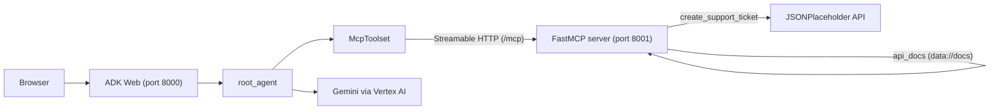

# Creating an MCP Server with FastMCP

A minimal networked MCP server built with FastMCP, plus an ADK agent that discovers and uses its tools and resources at runtime via `McpToolset`. The tool posts to JSONPlaceholder (a free public fake API), so live tool calls succeed without creating anything real, and the resource returns a canned string. The intent is to walk students through the MCP server code and the agent code.

## Table of Contents

- [1. Setup](#1-setup)
- [2. Run/Demo Locally](#2-rundemo-locally)
- [3. Code Walkthrough: MCP Server](#3-code-walkthrough-mcp-server)
- [4. Code Walkthrough: Agent](#4-code-walkthrough-agent)
- [5. Architecture](#5-architecture)

## 1. Setup

Before running this demo, you need a Google Cloud project with the Vertex AI API enabled (the agent calls Gemini through Vertex AI).

#### 1.1 Create and Activate a Virtual Environment

The requirements file is shared across the chapter 3 demos, so create the environment at the `ch3_demos` level:

```bash
cd courses/build_production_ready_agents/ch3_demos
uv venv
source .venv/bin/activate
uv pip install -r requirements.txt
```

#### 1.2 Configure Environment Variables

The agent reads its `.env` from the agent directory (`fastmcp/`):

```bash
cp fastmcp/.env.example fastmcp/.env
```

Edit `fastmcp/.env` and set your project ID:

```
GOOGLE_CLOUD_PROJECT=your-gcp-project-id
GOOGLE_CLOUD_LOCATION=global
GOOGLE_GENAI_USE_VERTEXAI=True
```

#### 1.3 Authenticate with Google Cloud

```bash
gcloud auth application-default login
gcloud config set project your-gcp-project-id
```

## 2. Run/Demo Locally

#### 2.1 Start the MCP Server (port 8001)

**Terminal 1:**
```bash
cd courses/build_production_ready_agents/ch3_demos/fastmcp
source ../.venv/bin/activate
python fast.py
```

The MCP server starts on `http://127.0.0.1:8001/mcp`. Port 8001 is used so it doesn't collide with ADK Web, which serves on port 8000 by default.

#### 2.2 Start ADK Web (port 8000)

`adk web` treats each subdirectory as an agent, so run it from `ch3_demos`:

**Terminal 2:**
```bash
cd courses/build_production_ready_agents/ch3_demos
source .venv/bin/activate
adk web
```

Then open http://localhost:8000 in your browser and select the **fastmcp** agent from the app picker.

#### 2.3 Demo the Tool (MCP tool call)

1. In the chat, enter something like:

    ```
    File a bug for customer 12345: checkout page returns a 500 error. High priority.
    ```

2. The agent calls the `create_support_ticket` tool it discovered from the MCP server. The tool posts to JSONPlaceholder, which echoes the payload back with a fake **id** (101), so the call succeeds but nothing is actually stored.
3. Open the **Events** panel in ADK Web and show the tool call: the request arguments the model produced and the JSON response that came back from the MCP server.

#### 2.4 Demo the Resource (MCP resource read)

1. In the chat, enter:

    ```
    Show me the API docs.
    ```

2. The agent uses the `load_mcp_resource` tool (added by `use_mcp_resources=True`) to read the `api_docs` resource and returns the canned docs string.
3. Point out in the **Events** panel that this was a resource read, not a tool the server author wrote: the MCP server only defined `create_support_ticket` and the `data://docs` resource.

## 3. Code Walkthrough: MCP Server

When walking through `fast.py`, highlight the following:

- **FastMCP initialization** — A single line creates the server and gives it a name that clients can discover. This is all the boilerplate you need.
- **`@mcp.tool` decorator** — Show how any regular Python function becomes a callable tool just by adding the decorator. The function's parameters automatically become the tool's input schema, so there's no separate schema definition to maintain. (The function posts to JSONPlaceholder, a public fake API, so live tool calls succeed but nothing is actually stored.)
- **`@mcp.resource` decorator** — Contrast this with tools: resources are *read-only data* the agent can pull in for context (like documentation or config), not actions it can execute. The URI scheme (`data://docs`) is how the agent references it.
- **`mcp.run(transport="http", port=8001)`** — Point out that this single call starts a networked server. The transport choice (`http` vs `stdio`) is what makes this server accessible over the network rather than only to a local subprocess. Port 8001 is used so the server doesn't collide with ADK Web, which serves on port 8000 by default.

## 4. Code Walkthrough: Agent

When walking through `agent.py`, highlight the following:

- **`McpToolset` as a tool source** — Show how the agent's `tools` list doesn't contain individual tool definitions. Instead, it points to an MCP server via `McpToolset`, and the agent discovers available tools (and resources) at runtime. This is the key decoupling that MCP provides.
- **`StreamableHTTPConnectionParams`** — This is how the agent knows where to find the MCP server. Point out the URL (`http://127.0.0.1:8001/mcp`) and connect it back to the `mcp.run(transport="http", port=8001)` call in `fast.py` — one starts the server, the other connects to it.
- **`use_mcp_resources=True`** — By default, `McpToolset` only exposes the server's *tools* to the agent. This flag adds a `load_mcp_resource` tool so the agent can also read the server's resources (like `api_docs`). Without it, the instruction's reference to the resource would go nowhere.
- **Agent instruction references MCP capabilities** — The instruction mentions `create_support_ticket` and `api_docs` by name even though they aren't defined in this file. The agent will resolve them from the MCP server, so the instruction acts as guidance for *when* to use tools the agent discovers dynamically.
- **No serving layer** — Unlike a typical FastAPI app, there's no `app` object or route definitions here. This agent must be run through ADK's built-in server (`adk api_server` or `adk web`), which handles the chat UI and session management.

## 5. Architecture



Two processes run locally: ADK Web hosts the agent and chat UI on port 8000, and the FastMCP server exposes the tool and resource on port 8001. The agent discovers what the MCP server offers at runtime; nothing about the tool or resource is hard-coded in the agent.
