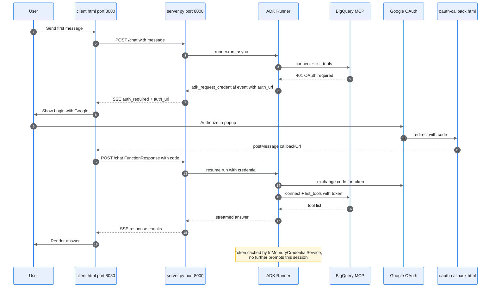

# OAuth for MCP Tools — ADK Demo

A minimal, end-to-end demo of **OAuth-protected tool access** for an ADK agent. The agent
is a "BigQuery analyst" whose data capability comes from Google's remote, managed **MCP
server** for BigQuery. Because that server is OAuth-protected, the user must sign in with
Google before the agent can use it — and this demo shows the full browser sign-in flow
wired through ADK's event-based authentication pattern.

---

## 1. What this demonstrates

- **Consuming a remote, OAuth-protected MCP toolset.** The BigQuery tools are not local
  Python functions — they live behind `https://bigquery.googleapis.com/mcp` and require an
  OAuth token to use.
- **ADK's event-based auth handshake.** When credentials are needed, ADK pauses the run and
  emits an `adk_request_credential` event. The client drives the Google sign-in and returns
  the result as a `FunctionResponse`, and ADK resumes automatically.
- **One-time sign-in per session** via a credential service that caches the token.
- **A realistic three-piece architecture:** a FastAPI agent server, a chat web client, and
  an OAuth popup callback page.

> **Why sign-in appears on your *first* message — even "hello."**
> To build the toolset, ADK must connect to the remote MCP server and **list its tools**,
> and that connection itself requires OAuth. ADK does this at the start of the first turn,
> *before* the model decides whether it needs a tool — so the prompt appears up front no
> matter what you ask. This is expected for a *connect-time* protected toolset, not a bug.
> (To make auth fire only when a specific tool runs, you'd use a custom `FunctionTool` —
> see [EVALUATION.md](EVALUATION.md), Strategy A.)

---

## 2. How it works

### Components

- **`client.html`** (port 8080) — the chat UI. Talks to the agent server over a streaming
  (Server-Sent Events) `/chat` endpoint.
- **`server.py`** (port 8000) — a FastAPI app hosting the ADK `Runner`, the agent, and the
  credential service. Streams ADK events to the client and relays the auth request.
- **`oauth-callback.html`** — the page Google redirects to after sign-in. Served by the
  agent server and `postMessage`s the authorization code back to the chat UI.

### The OAuth handshake (first message)



The annotated code walk-through in **§4** explains each step.

---

## 3. Local setup

### Prerequisites

- Python 3.10+
- A Google Cloud project with the **BigQuery API enabled**
- Application-default credentials (the server uses Vertex AI): run
  `gcloud auth application-default login` once.

### Step 1 — Create an OAuth client

In the Google Cloud Console → **APIs & Services → Credentials → Create credentials → OAuth
client ID**:

- **Application type:** Desktop app is simplest. (Web app also works — if you use it, add
  `http://localhost:8000/oauth-callback.html` as an authorized redirect URI.)
- Copy the **Client ID** and **Client secret** for the next step.

### Step 2 — Configure the environment

```bash
cd courses/build_production_ready_agents/ch3_demos/oauth
cp .env.example .env
```

Edit `.env` and fill in the blanks:

```ini
GOOGLE_GENAI_USE_VERTEXAI=1
GOOGLE_CLOUD_PROJECT=your-project-id
GOOGLE_CLOUD_LOCATION=global
OAUTH_CLIENT_ID=your-oauth-client-id
OAUTH_CLIENT_SECRET=your-oauth-client-secret
DEBUG=true          # set to false to silence the verbose [DEBUG] trace
```

### Step 3 — Create a virtual environment and install dependencies

```bash
python -m venv .venv
source .venv/bin/activate        # Windows: .venv\Scripts\activate
pip install -r ../requirements.txt
```

### Step 4 — Run the two servers

The agent API and the static chat client run as **two separate processes**.

```bash
# Terminal 1 — agent server (port 8000)
python server.py

# Terminal 2 — chat client (port 8080)
python -m http.server 8080
```

> Keep both ports as-is: the agent server (`:8000`) serves the OAuth callback page, and the
> redirect URI baked into the OAuth flow depends on these exact ports.

### Step 5 — Try it

Open **http://localhost:8080/client.html** and send a message such as *"What datasets are in
my project?"* You'll be prompted to sign in with Google on this first message (see §1). After
authorizing, the agent answers and follow-ups need no further sign-in.

---

## 4. Code walk-through

The auth logic lives entirely in `server.py`. This section follows it in the order the
handshake runs.

### Defining the protected tool

A remote OAuth-protected `McpToolset` is built from two objects ([server.py:65-95](server.py#L65-L95)).

**`auth_scheme` — *how* to authenticate.** The same `OAuth2` model used in OpenAPI security
schemes; it carries no secrets, only the shape of the flow:

```python
auth_scheme = OAuth2(
    flows=OAuthFlows(
        authorizationCode=OAuthFlowAuthorizationCode(
            authorizationUrl="https://accounts.google.com/o/oauth2/auth",
            tokenUrl="https://oauth2.googleapis.com/token",
            scopes={"https://www.googleapis.com/auth/bigquery": "bigquery"},
        )
    )
)
```

- `authorizationCode` selects the three-legged Authorization Code flow: send the user to
  Google, get back a short-lived `code`, then exchange it for a token.
- `authorizationUrl` is where the user approves access — this becomes the `auth_uri` the
  popup opens.
- `tokenUrl` is the back-channel endpoint ADK calls to exchange the `code` for a token.
- `scopes` declares what access to request; Google shows these on the consent screen.

**`auth_credential` — *who* is asking.** This application's OAuth client id and secret,
loaded from `.env`. ADK needs them to perform the token exchange at `tokenUrl`:

```python
auth_credential = AuthCredential(
    auth_type=AuthCredentialTypes.OAUTH2,
    oauth2=OAuth2Auth(client_id=OAUTH_CLIENT_ID, client_secret=OAUTH_CLIENT_SECRET),
)
```

Both are passed to the `McpToolset`. Together they give ADK everything it needs to
authenticate on your behalf when it connects to the MCP server. Note the *user's* token does
not exist yet — it is produced during the live handshake.

### Caching the result, so sign-in happens once

```python
credential_service = InMemoryCredentialService()
runner = Runner(..., credential_service=credential_service)   # server.py:130-137
```

Registering a credential service on the `Runner` is what makes sign-in a one-time event per
session: ADK stores the exchanged token here and reuses it on every later turn. Remove this
and ADK has nowhere to keep the token, so it re-prompts every turn.

### Detecting the auth request

ADK does not raise an exception when credentials are needed — it emits a normal **event**
into the same stream as the model's text: a function call named `adk_request_credential`.
`is_auth_request_event` ([server.py:143-153](server.py#L143-L153)) picks it out:

```python
event.content.parts[0].function_call.name == 'adk_request_credential'
and event.long_running_tool_ids
and event.content.parts[0].function_call.id in event.long_running_tool_ids
```

Because the request is **in-band**, a precise test is required. The last two conditions
matter: `adk_request_credential` is a *long-running* call (it pauses the run to wait for a
human), so its id appears in `long_running_tool_ids` — confirming a genuine pause-and-wait
rather than any event that merely mentions the name.

Two small helpers then pull what the server needs out of that event, each guarding against
absent fields ([server.py:155-182](server.py#L155-L182)):

- **`get_function_call_id`** — the id of the paused call. This is the correlation handle: the
  client tags its `FunctionResponse` with this same id so ADK knows which call to resume.
- **`get_auth_config`** — the `AuthConfig`, including
  `exchanged_auth_credential.oauth2.auth_uri`, the Google authorization URL the user visits.
  It accepts the value as raw JSON (validated with `AuthConfig.model_validate`) or an
  already-parsed `AuthConfig`.

### The two-leg event loop

A single `/chat` endpoint handles **both legs** of the handshake, because both are just
`runner.run_async` calls over the same session — only the message content differs.

**Leg 1 — request (diagram steps 1-8).** As events stream, the moment `is_auth_request_event`
matches, the server extracts the call id and `auth_uri`, sends an `auth_required` SSE
message, and stops emitting — the run is paused, so there is nothing more to stream until
credentials arrive ([server.py:345-371](server.py#L345-L371)):

```python
if auth_pending:
    continue            # already relayed the request; emit nothing more

if is_auth_request_event(event):
    function_call_id = get_function_call_id(event)
    auth_config = get_auth_config(event)
    auth_uri = auth_config.exchanged_auth_credential.oauth2.auth_uri
    yield f"data: {json.dumps({'type': 'auth_required', ...})}\n\n"
    auth_pending = True
    continue            # drain the generator; do NOT break out of it
```

> **Why `continue`, not `break`.** Breaking out of `runner.run_async(...)` abandons ADK's
> async generator mid-iteration, leaving its MCP session and context scopes open. Their later
> teardown injects `GeneratorExit` at the wrong suspension point and raises cancel-scope /
> context errors on current ADK. Letting the loop drain to completion lets ADK close those
> scopes in the task that opened them; the `auth_pending` flag preserves the intent — emit
> nothing once the run is suspended waiting on the human.

**Leg 2 — response (diagram steps 9-18).** After the user authorizes, the client POSTs back
to `/chat`, but this time the message is a **`FunctionResponse`** carrying the same call id
and completed `AuthConfig`. The endpoint detects that shape up front and rebuilds it into ADK
`Content` rather than treating it as plain text ([server.py:247-253](server.py#L247-L253),
[295-298](server.py#L295-L298)):

```python
is_auth_response = (
    isinstance(message, dict)
    and message.get("role") == "user"
    and "function_response" in message["parts"][0]
)
```

Feeding that into `runner.run_async` **resumes the paused call**: ADK exchanges the code for
a token, caches it, connects to the MCP server, and runs the agent's real work — whose text
streams back through the same loop as ordinary `response_chunk` events.

> The streaming code that follows ([server.py:366-391](server.py#L366-L391)) emits only the
> **new delta** of each response. ADK sends partial events whose text grows cumulatively, then
> a final event repeating the whole thing; tracking `streamed_text` and resetting on the final
> event avoids dropping or duplicating the post-auth answer.

On the client side, `showAuthPrompt` ([client.html:492-542](client.html#L492-L542)) renders
the "Login with Google" button, opens the popup, and — via the `postMessage` from
`oauth-callback.html` — sends the `FunctionResponse` that drives Leg 2.

---

## 5. Demo & discussion guide

A ~10-minute flow for presenting to students. **Before you start:** complete setup (§3), run
both servers, and confirm `gcloud auth application-default login` is done.

### Live demo

1. **Send "hello."** Even this non-data message triggers sign-in. Ask the class *why*, then
   reveal: listing the remote toolset's tools is itself OAuth-gated, and ADK does it up front
   (§1).
2. **Click "Login with Google,"** authorize, and watch the popup close. Note the
   "Authorization received, continuing…" message.
3. **Ask a real question** — *"What datasets are in my project?"* — and let the agent run the
   tools and answer.
4. **Ask a follow-up** and point out there is **no second sign-in**: the token is cached for
   the session.

Walk the code live using **§4**, ideally alongside the numbered diagram in §2.

### Discussion prompts

- **"How would you make auth fire only when a data tool actually runs?"** → the custom
  `FunctionTool` design (Journey 2) in [EVALUATION.md](EVALUATION.md), Strategy A: the auth
  decision moves *inside* the tool body.
- **"What changes for production?"** → persisted (not in-memory) credential storage,
  sanitizing model-rendered markdown, pinning CORS and the `postMessage` target origin, and
  configuring the redirect URI via the OAuth client rather than string-building it in JS. See
  [EVALUATION.md](EVALUATION.md), Finding 5.

---

## Files

| File | Role |
|---|---|
| [server.py](server.py) | FastAPI agent server: ADK `Runner`, agent, credential service, `/chat` SSE endpoint |
| [client.html](client.html) | Chat UI and OAuth sign-in flow (port 8080) |
| [oauth-callback.html](oauth-callback.html) | OAuth redirect target; relays the auth code back to the client |
| [.env.example](.env.example) | Template for required environment variables |
| [EVALUATION.md](EVALUATION.md) | Deeper analysis of auth timing and an alternative per-tool design |
