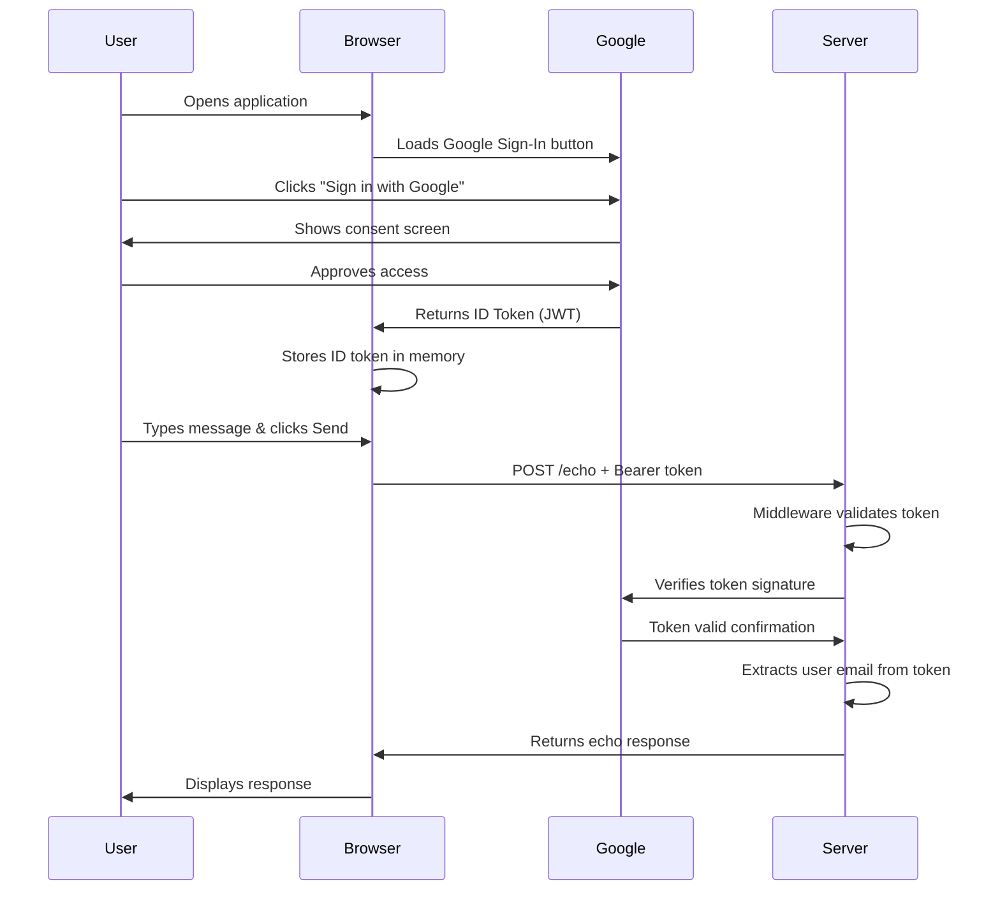
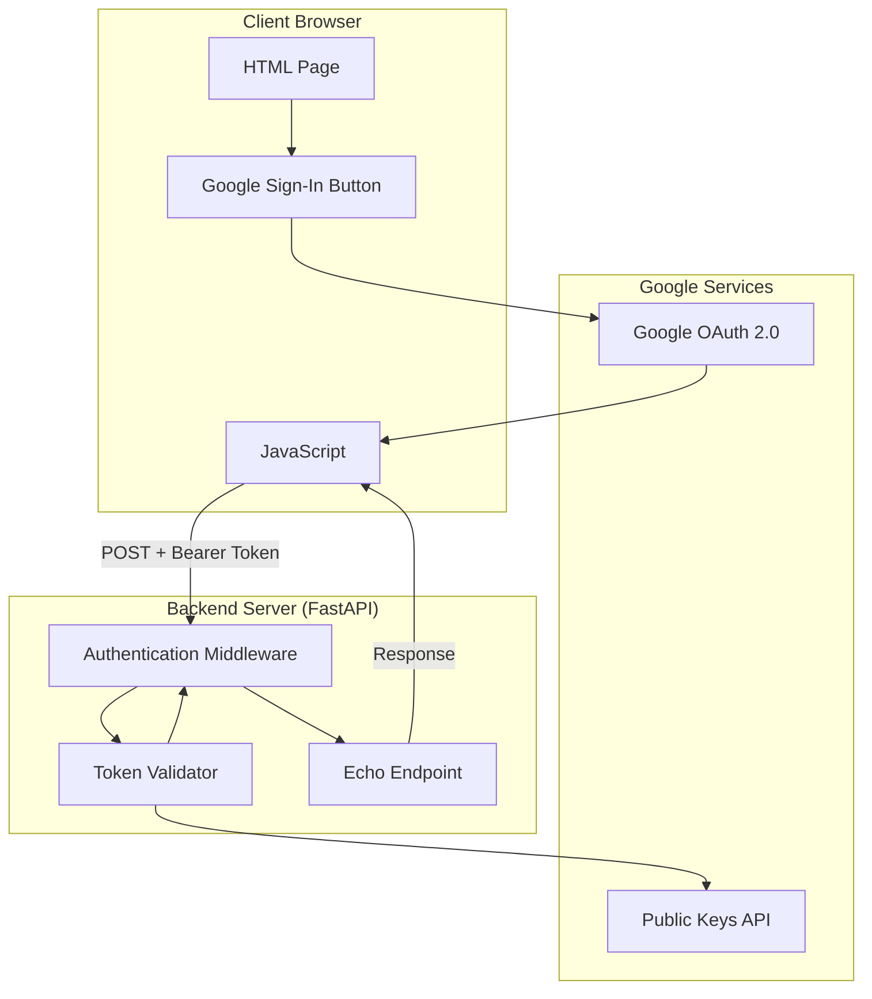
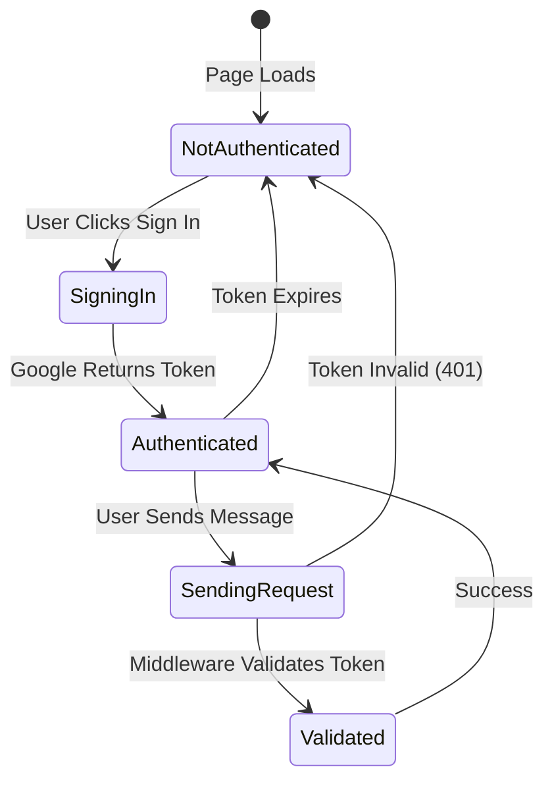
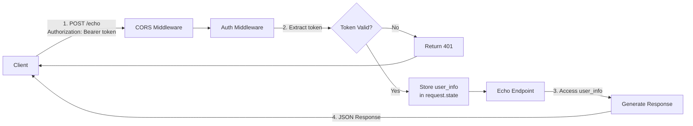

# FastAPI Echo Service with Middleware Auth

A FastAPI-based echo service demonstrating Google OAuth 2.0 authentication using ID tokens. This implementation uses middleware for centralized authentication, making it easy to protect all API endpoints.

## Table of Contents

- [1. Setup](#1-setup)
- [2. Run/Demo Locally](#2-rundemo-locally)
- [3. Key Features](#3-key-features)
- [4. Authentication Flow Overview](#4-authentication-flow-overview)
- [5. How Authentication Works](#5-how-authentication-works)
  - [5.1 Client-Side Process](#51-client-side-process)
  - [5.2 Server-Side Process](#52-server-side-process)
- [6. Architecture Diagrams](#6-architecture-diagrams)
- [7. Implementation Details](#7-implementation-details)

## 1. Setup

Before running this application, you need to set up Google OAuth 2.0 credentials:

#### 1.1 Create OAuth 2.0 Client ID

1. Go to [Google Cloud Console → APIs & Services → Credentials](https://console.cloud.google.com/apis/credentials)
2. Click **"+ CREATE CREDENTIALS"** → **"OAuth client ID"**
3. If prompted, configure the OAuth consent screen first:
   - Choose **External** (or Internal if using Google Workspace)
   - Fill in application name and support email
   - Add your email to test users if using External
4. For Application type, select **"Web application"**
5. Add **Authorized JavaScript origins**:
   - `http://localhost:8080` (for local development)
6. Click **"CREATE"**
7. Copy the **Client ID** (format: `xxxxx-xxxxx.apps.googleusercontent.com`)

#### 1.2 Configure Environment Variables

1. Copy the example environment file and add your Client ID:

```bash
cp .env.example .env
```

2. Edit `.env` and set your Client ID:

```
GOOGLE_OAUTH_CLIENT_ID=xxxxx-xxxxx.apps.googleusercontent.com
API_URL=http://localhost:8000
```

Both the backend and frontend servers read from this shared `.env` file.

## 2. Run/Demo Locally

#### 2.1 Create and Activate a Virtual Environment

```bash
uv venv
source .venv/bin/activate
```

#### 2.2 Install Dependencies

```bash
uv pip install -r requirements.txt
```

#### 2.3 Start Servers

**Terminal 1 - Backend Server (port 8000):**
```bash
python backend_server.py
```

**Terminal 2 - Frontend Server (port 8080):**
```bash
python frontend_server.py
```

Then open http://localhost:8080 in your browser.

#### 2.4 Show app functionality

1. Show that client requires user to log in with Google account prior to exposing functionality.
2. Click **Sign in** and show the login process
3. Show that the app know who the user is
4. Enter a message to echo; show that the app know who sent the message
5. Show the FastAPI middleware logic in the **backend-server** app

## 3. Key Features

- **FastAPI Framework**: Modern, fast Python web framework with async support
- **Middleware Authentication**: Centralized token validation in middleware layer
- **Google OAuth 2.0**: Uses Google Sign-In with ID tokens (JWT)
- **Pydantic Models**: Type-safe request/response handling
- **Automatic API Docs**: OpenAPI/Swagger documentation at `/docs`

## 4. Authentication Flow Overview

This application uses **Google OAuth 2.0 with ID tokens** to authenticate users. The key concept is:

1. User signs in with Google (client-side)
2. Google provides an **ID token** (a JWT - JSON Web Token)
3. Client sends this token with each API request
4. Server validates the token and extracts user information



## 5. How Authentication Works

### 5.1 Client-Side Process

The client (browser) handles authentication in several steps:

#### 5.1.1 Loading Google Sign-In

```html
<!-- Google's authentication library -->
<script src="https://accounts.google.com/gsi/client" async defer></script>

<!-- Sign-in button configuration -->
<div id="g_id_onload"
     data-client_id="YOUR_CLIENT_ID"
     data-callback="handleCredentialResponse">
</div>
```

#### 5.1.2 Handling the Sign-In Response

When the user signs in, Google calls the `handleCredentialResponse` function with an ID token:

```javascript
function handleCredentialResponse(response) {
    // response.credential is the JWT ID token
    USER_ID_TOKEN = response.credential;

    // Decode token to show user info (optional)
    const payload = JSON.parse(atob(response.credential.split('.')[1]));
    console.log("User email:", payload.email);
}
```

**What's in the ID Token?**
The ID token is a JWT containing:
- `email`: User's email address
- `sub`: User's unique Google ID
- `iat`: Token issued at timestamp
- `exp`: Token expiration timestamp
- `aud`: Client ID (ensures token is for your app)

#### 5.1.3 Sending Authenticated Requests

Every API request includes the ID token in the Authorization header:

```javascript
const response = await fetch(API_URL, {
    method: "POST",
    headers: {
        "Content-Type": "application/json",
        "Authorization": "Bearer " + USER_ID_TOKEN  // ← ID token here
    },
    body: JSON.stringify({ message: "Hello" })
});
```

**Key Points:**
- Token is sent as `Bearer <token>` in the `Authorization` header
- Token is stored in memory (not localStorage to avoid XSS risks)
- Token expires after 1 hour and needs to be refreshed

### 5.2 Server-Side Process

The FastAPI server validates authentication using middleware:

#### 5.2.1 Middleware Intercepts Requests

```python
@app.middleware("http")
async def authentication_middleware(request: Request, call_next):
    # For POST requests, validate the token
    if request.method == "POST":
        auth_header = request.headers.get('Authorization')
        user_info = await validate_token(auth_header)

        if not user_info:
            return JSONResponse(
                status_code=401,
                content={"error": "Unauthorized"}
            )

        # Store user info for route handlers
        request.state.user_info = user_info

    return await call_next(request)
```

#### 5.2.2 Token Validation Process

```python
async def validate_token(authorization: str) -> dict:
    # Extract token from "Bearer <token>"
    token = authorization.split(" ")[1]

    # Verify with Google's public keys
    # This checks:
    # - Signature (token wasn't tampered with)
    # - Expiration (token is still valid)
    # - Audience (token is for this CLIENT_ID)
    id_info = id_token.verify_oauth2_token(
        token,
        requests.Request(),
        CLIENT_ID
    )

    return id_info  # Contains email, sub, etc.
```

#### 5.2.3 Route Handlers Access User Info

```python
@app.post("/")
async def echo_service(request: Request, echo_request: EchoRequest):
    # User info is already validated by middleware
    user_info = request.state.user_info
    user_email = user_info.get('email')

    return {"echo": f"Received from {user_email}"}
```

## 6. Architecture Diagrams

#### 6.1 Component Architecture



#### 6.2 Authentication State Flow



#### 6.3 Request/Response Flow



## 7. Implementation Details

#### 7.1 Middleware vs Per-Route Authentication

This implementation uses **middleware** for authentication, which means:

**Advantages:**
- ✅ Centralized authentication logic
- ✅ All endpoints protected automatically
- ✅ No decorator needed on each route
- ✅ User info available via `request.state`

**Alternative Approach (Per-Route):**
```python
# Without middleware, you'd need to do this on every route:
@app.post("/")
async def echo_service(request: Request):
    auth_header = request.headers.get('Authorization')
    user_info = await validate_token(auth_header)
    if not user_info:
        raise HTTPException(401)
    # ... rest of logic
```

#### 7.2 Security Considerations

1. **Token Validation**: Server verifies token signature using Google's public keys
2. **Audience Check**: Ensures token was issued for this specific CLIENT_ID
3. **Expiration Check**: Tokens expire after 1 hour
4. **HTTPS Only**: ID tokens should only be sent over HTTPS in production
5. **CORS Configuration**: Set specific origins in production, not `"*"`

#### 7.3 Differences from Flask Version

- **Middleware Pattern**: Uses FastAPI middleware instead of per-route decorators
- **Type Safety**: Pydantic models ensure type-safe requests/responses
- **Async Support**: Fully async for better performance
- **Auto Documentation**: OpenAPI docs at `/docs` and `/redoc`
- **Modern Framework**: FastAPI is built on Starlette and Pydantic
