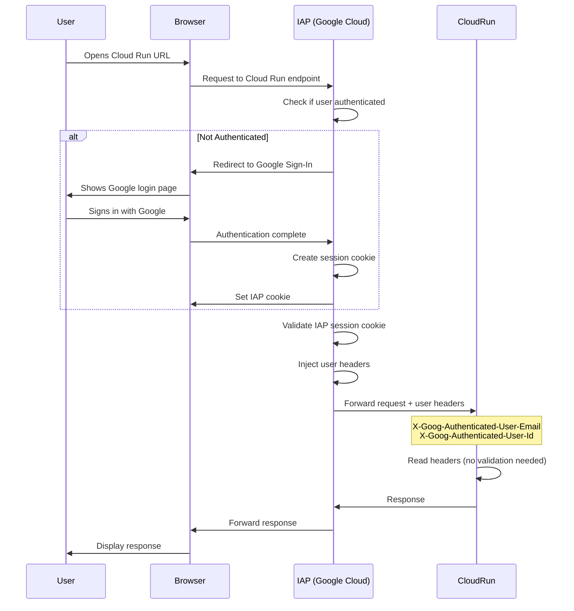
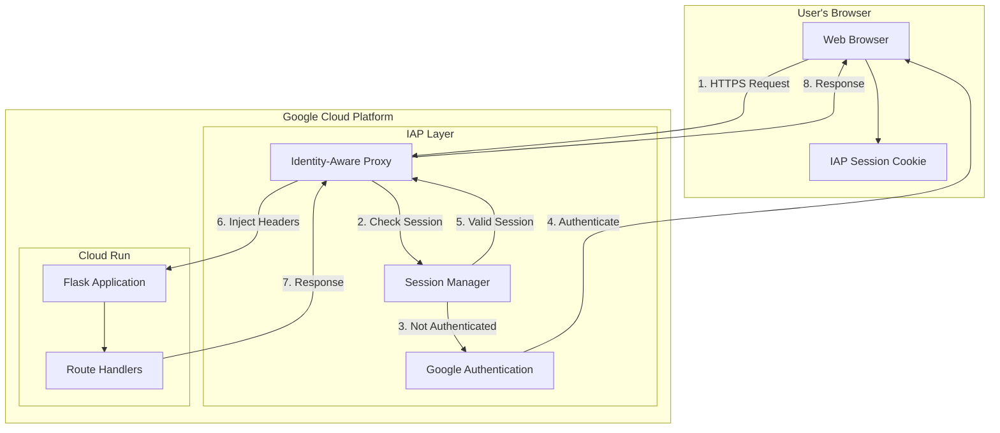
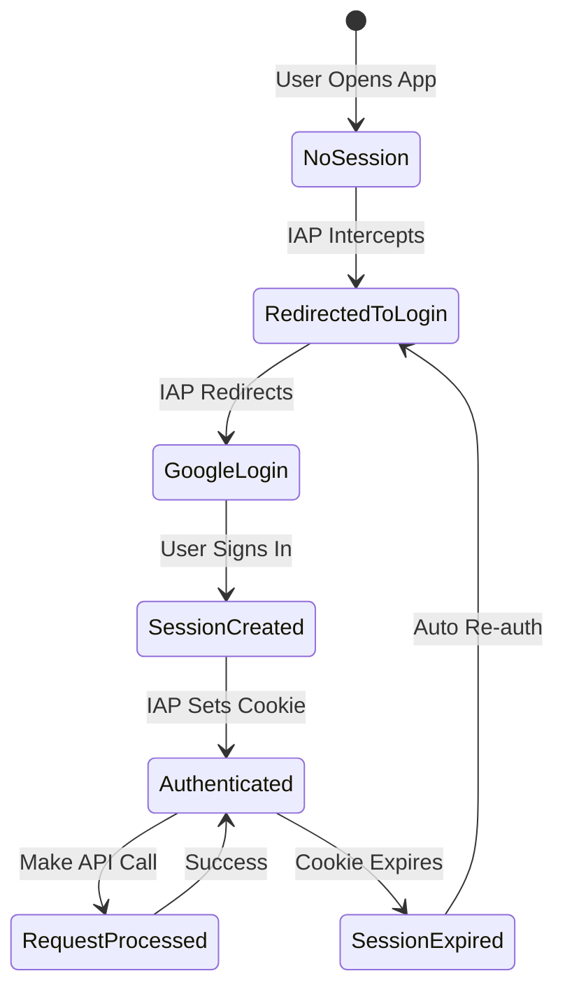
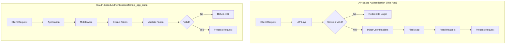
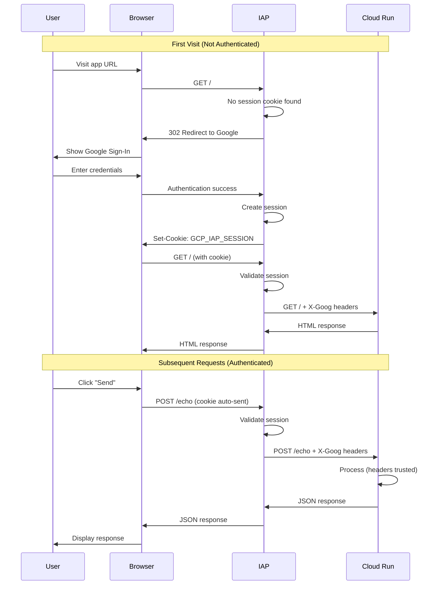

# Flask Echo Service with Identity-Aware Proxy (IAP) Authentication

A Flask-based echo service demonstrating **Google Cloud Identity-Aware Proxy (IAP)** authentication. Unlike OAuth-based authentication where the application validates tokens, IAP handles all authentication at the infrastructure level before requests reach your application.

## Table of Contents

- [1. Run/Demo on Cloud Run](#1-rundemo-on-cloud-run)
- [2. Key Features](#2-key-features)
- [3. Authentication Flow Overview](#3-authentication-flow-overview)
- [4. How IAP Authentication Works](#4-how-iap-authentication-works)
  - [4.1 Infrastructure-Level Authentication](#41-infrastructure-level-authentication)
  - [4.2 Client-Side Process](#42-client-side-process)
  - [4.3 Server-Side Process](#43-server-side-process)
- [5. Architecture Diagrams](#5-architecture-diagrams)
- [6. Additional Resources](#6-additional-resources)

## 1. Run/Demo on Cloud Run

#### 1.1 Deploy to Cloud Run

```bash
gcloud run deploy iap-echo-service \
  --source . \
  --region us-central1 \
  --allow-unauthenticated
```

**Note:** We use `--allow-unauthenticated` initially so Cloud Run allows traffic. IAP will handle authentication.

#### 1.2 Enable IAP

1. Go to the Cloud Run page for your newly deployed service
2. Go to security page, disable IAM, enable IAP
3. Edit policy and add your user and save

#### 1.3 Test

It will take 1-2 minutes for IAP to settle. Once it has...
1. Visit your Cloud Run URL in an incognito mode window.
2. When prompted sign in (note that you are forced to)
3. After signing in, see the application
4. User email should appear automatically, and echo should work
5. Repeat the process with an account that hasn't been granted access and note results.

## 2. Key Features

- **Identity-Aware Proxy (IAP)**: Google Cloud handles all authentication
- **No Token Management**: Application doesn't validate tokens or manage sessions
- **Automatic User Headers**: IAP injects user information into request headers
- **Simple Flask App**: Minimal code - just read headers
- **Zero Auth Code**: No OAuth libraries, no token validation, no middleware

## 3. Authentication Flow Overview

IAP is fundamentally different from OAuth-based authentication:

**With OAuth (like fastapi_app_auth):**
- Application validates tokens
- Client manages token lifecycle
- Application code handles authentication

**With IAP (this application):**
- Google Cloud validates everything
- Application just reads headers
- Zero authentication code needed



## 4. How IAP Authentication Works

### 4.1 Infrastructure-Level Authentication

IAP sits **in front** of your application as a reverse proxy:

```
User → IAP (Authentication) → Your Application
```

**What IAP Does:**
1. Intercepts all requests to your Cloud Run service
2. Checks if user has valid IAP session cookie
3. If not authenticated: redirects to Google Sign-In
4. If authenticated: validates session and injects headers
5. Forwards request to your application with user information

**What Your Application Does:**
1. Read the `X-Goog-Authenticated-User-Email` header
2. That's it!

### 4.2 Client-Side Process

The client side is **extremely simple** because IAP handles everything:

#### 4.2.1 No Authentication Code Needed

```html
<!-- No Google Sign-In button -->
<!-- No OAuth libraries -->
<!-- No token management -->
<!-- Just regular HTML and JavaScript -->
```

#### 4.2.2 Regular API Calls

```javascript
// No Authorization header needed
// No tokens to manage
// IAP cookie is automatically sent by browser
async function sendEcho() {
    const res = await fetch('/echo', {
        method: 'POST',
        headers: { 'Content-Type': 'application/json' },
        body: JSON.stringify({ message: msg })
    });
    const data = await res.json();
    // Use the response
}
```

#### 4.2.3 Getting User Information

```javascript
// IAP has already authenticated the user
// Just ask your backend for the user info from headers
fetch('/me').then(r => r.json()).then(data => {
    console.log("Logged in as:", data.email);
});
```

**Key Points:**
- Browser automatically sends IAP session cookie
- No need to manage tokens or credentials
- User is authenticated before reaching your app
- If session expires, IAP handles re-authentication automatically

### 4.3 Server-Side Process

The server code is remarkably simple:

#### 4.3.1 Read User Headers

IAP injects these headers into every request:

```python
@app.route('/me')
def whoami():
    # IAP adds this header automatically after authentication
    email = request.headers.get('X-Goog-Authenticated-User-Email', 'Unknown')

    # Header format: "accounts.google.com:user@example.com"
    clean_email = email.split(':')[-1] if ':' in email else email

    return jsonify({"email": clean_email})
```

**Available IAP Headers:**
- `X-Goog-Authenticated-User-Email`: User's email address
- `X-Goog-Authenticated-User-Id`: User's unique Google ID
- `X-Goog-IAP-JWT-Assertion`: JWT token (for advanced validation)

#### 4.3.2 Handle Requests Normally

```python
@app.route('/echo', methods=['POST'])
def echo():
    # No authentication check needed!
    # If the request got here, IAP already authenticated it
    data = request.get_json()
    return jsonify({"reply": f"Echo: {data.get('message')}"})
```

#### 4.3.3 Optional: Advanced Validation

For extra security, you can validate the IAP JWT:

```python
from google.auth.transport import requests
from google.oauth2 import id_token

def validate_iap_jwt(iap_jwt, expected_audience):
    """
    Validate the IAP JWT token (optional - IAP already validated it)
    """
    try:
        decoded_jwt = id_token.verify_token(
            iap_jwt,
            requests.Request(),
            audience=expected_audience,
            certs_url='https://www.gstatic.com/iap/verify/public_key'
        )
        return decoded_jwt
    except Exception as e:
        raise Exception(f'JWT validation error: {e}')
```

**Note:** This is optional because IAP has already validated the request. You only need this for defense-in-depth or if you're paranoid about header spoofing (which shouldn't be possible with proper IAP configuration).

## 5. Architecture Diagrams

#### 5.1 Component Architecture



#### 5.2 Authentication State Flow



#### 5.3 Request Flow Comparison



#### 5.4 Network Flow



## 6. Additional Resources

- [IAP Documentation](https://cloud.google.com/iap/docs)
- [Securing Cloud Run with IAP](https://cloud.google.com/iap/docs/enabling-cloud-run)
- [IAP JWT Validation](https://cloud.google.com/iap/docs/signed-headers-howto)
