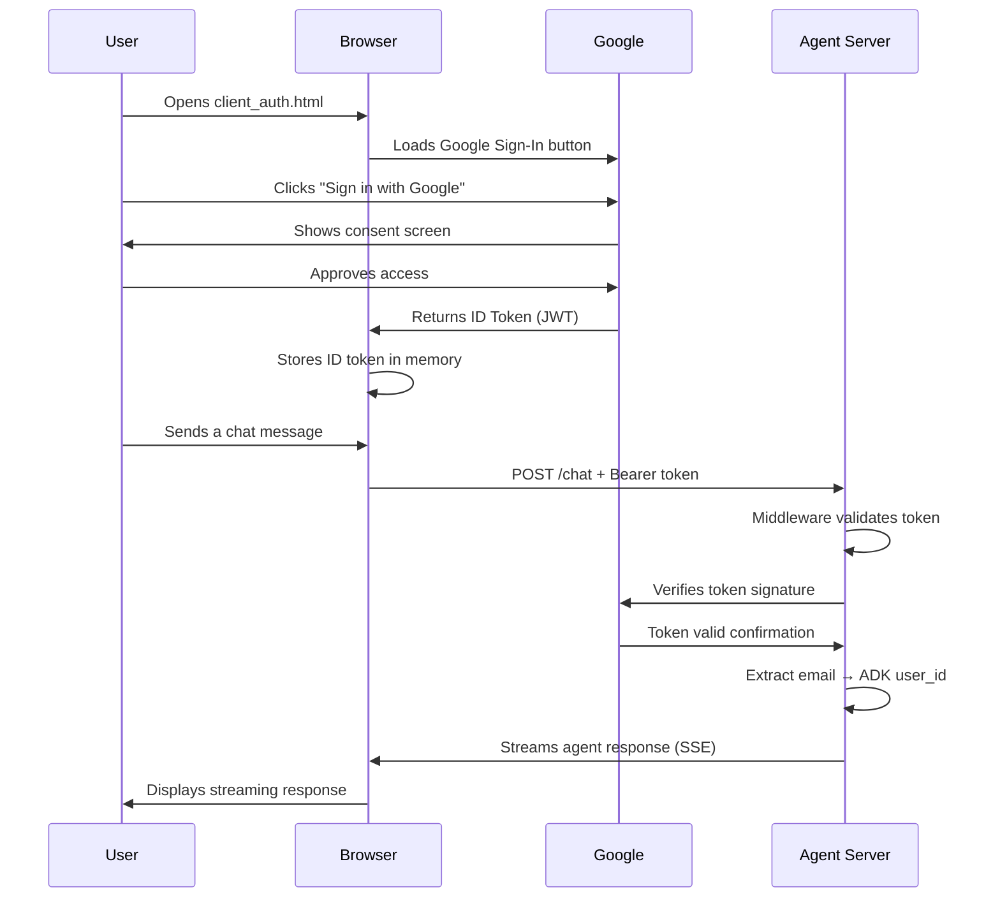
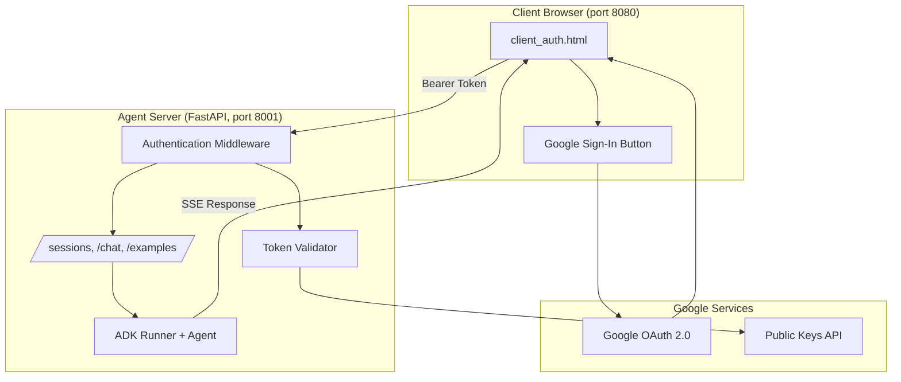
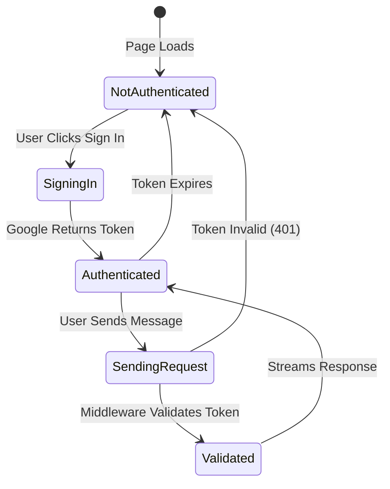

# ADK Agent Server with Google OAuth Authentication

The Chapter 2 lab application (a streaming ADK agent server) with **Google OAuth 2.0** access control added. A FastAPI middleware validates a Google ID token on every protected endpoint, and the client uses Google Sign-In (GSI) to obtain and send that token. The authenticated user's email becomes the agent's `user_id`, so sessions are scoped per user.

## Table of Contents

- [1. Setup](#1-setup)
- [2. Run/Demo Locally](#2-rundemo-locally)
- [3. Key Features](#3-key-features)
- [4. Authentication Flow Overview](#4-authentication-flow-overview)
- [5. How Authentication Works](#5-how-authentication-works)
  - [5.1 Client-Side Process](#51-client-side-process)
  - [5.2 Server-Side Process](#52-server-side-process)
- [6. Architecture Diagrams](#6-architecture-diagrams)
- [7. Implementation Details](#7-implementation-details)

## 1. Setup

Before running this application, you need Google OAuth 2.0 credentials and a Google Cloud project for the ADK agent (which uses Vertex AI / Gemini).

#### 1.1 Create OAuth 2.0 Client ID

1. Go to [Google Cloud Console → APIs & Services → Credentials](https://console.cloud.google.com/apis/credentials)
2. Click **"+ CREATE CREDENTIALS"** → **"OAuth client ID"**
3. If prompted, configure the OAuth consent screen first:
   - Choose **External** (or Internal if using Google Workspace)
   - Fill in application name and support email
   - Add your email to test users if using External
4. For Application type, select **"Web application"**
5. Add **Authorized JavaScript origins**:
   - `http://localhost:8080` (the client/frontend origin)
6. Click **"CREATE"**
7. Copy the **Client ID** (format: `xxxxx-xxxxx.apps.googleusercontent.com`)

#### 1.2 Configure Environment Variables

1. Copy the example environment file:

```bash
cp .env.example .env
```

2. Edit `.env` and set at least:

```
GOOGLE_OAUTH_CLIENT_ID=xxxxx-xxxxx.apps.googleusercontent.com
GOOGLE_CLOUD_PROJECT=your-gcp-project-id
GOOGLE_GENAI_USE_VERTEXAI=TRUE
```

The server reads `GOOGLE_OAUTH_CLIENT_ID` to validate incoming tokens, and `GOOGLE_CLOUD_PROJECT` for the ADK agent's Vertex AI calls.

#### 1.3 Set the Client ID in the Frontend

In **client_auth.html**, replace the placeholder Client ID with your own:

```html
<div id="g_id_onload"
     data-client_id="YOUR-CLIENT-ID.apps.googleusercontent.com"
     data-callback="handleCredentialResponse">
```

> The client calls the API at `http://localhost:8001` (set as `API_BASE_URL` in the page). If you change the server port, update it there too.

## 2. Run/Demo Locally

#### 2.1 Create and Activate a Virtual Environment

```bash
python -m venv venv
source venv/bin/activate
```

#### 2.2 Install Dependencies

```bash
pip install -r requirements.txt
```

#### 2.3 Start the Agent Server (port 8001)

**Terminal 1:**
```bash
python sessions_server_auth.py
```

#### 2.4 Start the Client (port 8080)

**Terminal 2:**
```bash
python -m http.server 8080
```

Then open http://localhost:8080/client_auth.html in your browser.

#### 2.5 Show App Functionality

1. Note the login area is shown first — the agent UI (`appSection`) is hidden in the markup until login succeeds; the page does **not** call a protected endpoint on load.
2. Click **Sign in with Google** and walk through the login flow.
3. Show that the app now knows who the user is (email displayed).
4. Send a chat message and show the streaming agent response and the session being created.
5. Show the `authentication_middleware` logic in **sessions_server_auth.py** — note that `/` (GET) is public but `/sessions`, `/chat`, and `/examples` require a valid token.
6. Point out that the authenticated email is used as the ADK `user_id`, so sessions are per-user.

## 3. Key Features

- **ADK Agent Backend**: Streaming agent (`/chat` via Server-Sent Events) with session management on top of the Chapter 2 lab app
- **Middleware Authentication**: Centralized token validation protects all endpoints except the public home page
- **Google OAuth 2.0**: Uses Google Sign-In with ID tokens (JWT)
- **Per-User Sessions**: Authenticated email becomes the ADK `user_id`
- **Selective Protection**: `GET /` stays open for health/home; `OPTIONS` (CORS preflight) is allowed through
- **Login-Gated UI**: The agent UI is hidden until sign-in succeeds — the client never attempts a protected call without a token in hand

## 4. Authentication Flow Overview

This application uses **Google OAuth 2.0 with ID tokens**. The key concept is:

1. User signs in with Google (client-side)
2. Google provides an **ID token** (a JWT)
3. Client sends this token as a `Bearer` header with each protected API request
4. Server middleware validates the token and extracts the user's email



## 5. How Authentication Works

### 5.1 Client-Side Process

#### 5.1.1 Loading Google Sign-In

```html
<!-- Google's authentication library -->
<script src="https://accounts.google.com/gsi/client" async defer></script>

<!-- Sign-in button configuration -->
<div id="g_id_onload"
     data-client_id="YOUR-CLIENT-ID.apps.googleusercontent.com"
     data-callback="handleCredentialResponse">
</div>
```

#### 5.1.2 Handling the Sign-In Response

When the user signs in, Google calls `handleCredentialResponse` with an ID token:

```javascript
function handleCredentialResponse(response) {
    // response.credential is the JWT ID token
    USER_ID_TOKEN = response.credential;
}
```

#### 5.1.3 Sending Authenticated Requests

Every protected API request includes the ID token in the `Authorization` header:

```javascript
const response = await fetch(API_BASE_URL + "/chat", {
    method: "POST",
    headers: {
        "Content-Type": "application/json",
        "Authorization": "Bearer " + USER_ID_TOKEN  // ← ID token here
    },
    body: JSON.stringify({ message: "Hello", session_id: sessionId })
});
```

**Key Points:**
- Token is sent as `Bearer <token>` in the `Authorization` header
- Token is held in memory (not localStorage) to limit XSS exposure
- Token expires after ~1 hour and the user must sign in again

### 5.2 Server-Side Process

#### 5.2.1 Middleware Intercepts Requests

```python
@app.middleware("http")
async def authentication_middleware(request: Request, call_next):
    # Public home page / health check
    if request.method == "GET" and request.url.path == "/":
        return await call_next(request)

    # Allow CORS preflight through
    if request.method == "OPTIONS":
        return await call_next(request)

    # All other routes require a valid token
    auth_header = request.headers.get('Authorization')
    user_info = await validate_token(auth_header)
    if not user_info:
        return JSONResponse(status_code=401,
            content={"error": "Unauthorized. Please login with Google."})

    request.state.user_info = user_info
    return await call_next(request)
```

#### 5.2.2 Token Validation

```python
async def validate_token(authorization: Optional[str]) -> Optional[dict]:
    if not authorization:
        return None
    # Extract token from "Bearer <token>"
    token = authorization.split(" ")[1]
    # Verify signature, expiration, and audience (CLIENT_ID) with Google
    id_info = id_token.verify_oauth2_token(
        token, google_requests.Request(), CLIENT_ID
    )
    return id_info  # Contains email, sub, etc.
```

#### 5.2.3 Route Handlers Use the Authenticated User

The validated email drives the ADK session, so each user gets their own session history:

```python
@app.post("/chat")
async def chat(request_data: dict, request: Request):
    user_email = request.state.user_info.get('email')
    user_id = user_email  # Authenticated email → ADK user_id
    session, session_id = await get_or_create_session(user_id, request_data.get("session_id"))
    # ... stream the agent response
```

## 6. Architecture Diagrams

#### 6.1 Component Architecture



#### 6.2 Authentication State Flow



## 7. Implementation Details

#### 7.1 Middleware vs Per-Route Authentication

This implementation uses **middleware** for authentication:

**Advantages:**
- ✅ Centralized authentication logic
- ✅ All endpoints protected automatically (except the explicit allowlist)
- ✅ No decorator needed on each route
- ✅ User info available via `request.state.user_info`

The middleware allowlists `GET /` (home/health) and `OPTIONS` (CORS preflight); everything else — `/sessions`, `/chat`, `/examples` — requires a valid token.

#### 7.2 Login-Gated Client UI

The client controls access by **revealing the UI only after login**, rather than letting an unauthenticated request fail and using that 401 to trigger sign-in. On page load, the login panel (`authSection`) is visible and the agent UI (`appSection`) carries the `hidden` class. Only inside `handleCredentialResponse` — after Google returns a token — does the client swap them and make its first protected call (`createSession()`):

```javascript
function handleCredentialResponse(response) {
    USER_ID_TOKEN = response.credential;
    document.getElementById("authSection").classList.add("hidden");
    document.getElementById("appSection").classList.remove("hidden");
    createSession();  // first protected call — only after login
}
```

The protected request functions also guard with `if (!USER_ID_TOKEN) return;`, so the client never hits `/sessions` or `/chat` without a token. The server's 401 is a backstop that protects the API directly; it is **not** what drives the *initial* login flow. (Expired tokens are a separate case — see [7.3](#73-token-expiry).)

#### 7.3 Token Expiry

Login-gating only covers the *initial* gate. The Google ID token is valid for **~1 hour**, and this client stores it once at login (`USER_ID_TOKEN`) and **never refreshes it** — the client cannot tell the token has expired just by inspecting it. Expiry only surfaces when the **server** rejects a request:

1. The user keeps the tab open past the hour and sends a message.
2. The client attaches the now-stale `Bearer` token to `POST /chat`.
3. Server middleware calls `id_token.verify_oauth2_token(...)`, which raises on the expired token → `validate_token` returns `None` → middleware returns **401**.
4. The client detects `response.status === 401`, shows "Unauthorized. Please login again.", removes any in-flight streaming message, and calls `logout()`.
5. `logout()` clears client state and runs `window.location.reload()`, returning the user to the login screen.

```javascript
if (response.status === 401) {
    setStatus('Unauthorized. Please login again.');
    // ...remove in-flight streaming bubble...
    logout();   // clears state, then window.location.reload()
    return;
}
```

Both protected calls — `createSession()` and `sendMessage()` — implement this 401 check, so an expired token always lands the user back at login on their next action.

**Simplifications (vs. production):** This demo handles expiry **reactively** but does not (1) **refresh** the token — it forces a full re-login rather than silently obtaining a new one; (2) **preserve work** — the `reload()` discards in-memory chat history for the open session; or (3) **preempt expiry** — there is no proactive check before the token's `exp`, so it always waits for the server's 401. A production client would typically refresh silently (or re-prompt) and resume in place.

#### 7.4 Per-User Sessions

Because the validated email is used as the ADK `user_id`, each signed-in user gets isolated session state. Sessions are stored via the configured `SESSION_SERVICE_PROVIDER` (defaults to `in_memory`).

#### 7.5 Security Considerations

1. **Token Validation**: Server verifies the token signature using Google's public keys
2. **Audience Check**: Ensures the token was issued for this `GOOGLE_OAUTH_CLIENT_ID`
3. **Expiration Check**: Tokens expire after ~1 hour
4. **HTTPS Only**: ID tokens should only be sent over HTTPS in production
5. **CORS Configuration**: This demo allows all origins (`"*"`) for convenience — restrict to specific origins in production
