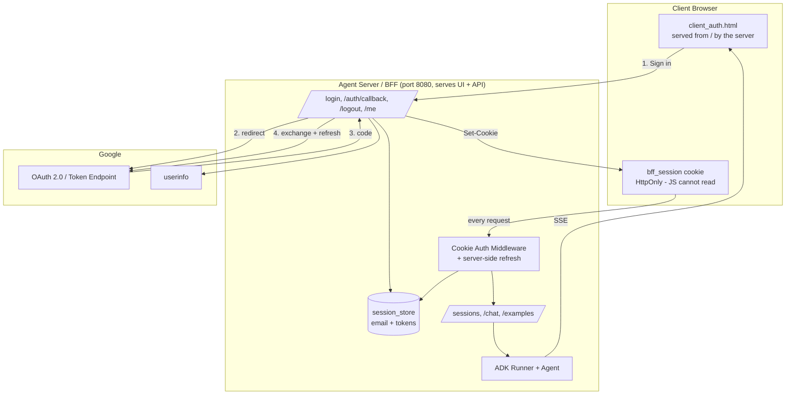
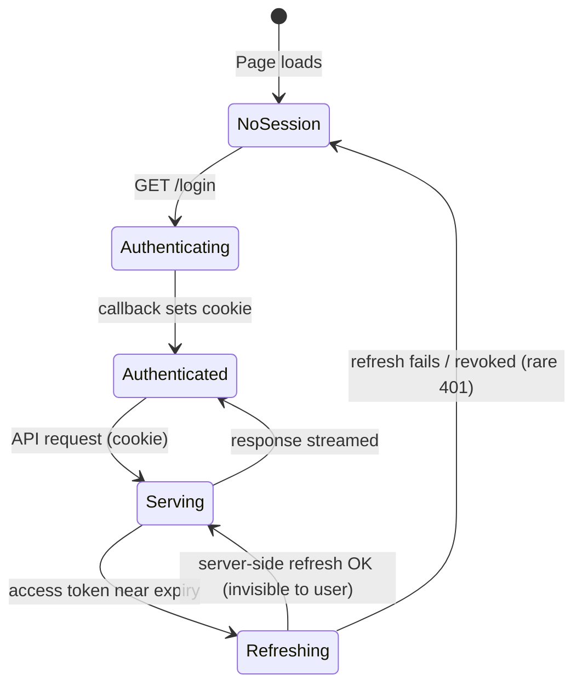

# ADK Agent Server with Google OAuth — Backend-for-Frontend (BFF)

A streaming ADK agent server secured with **Google OAuth 2.0** using the **Backend-for-Frontend (BFF)** pattern. This is the production-oriented counterpart to [`../lab_app_w_auth`](../lab_app_w_auth/README.md): instead of the browser holding a Google token and sending it as a `Bearer` header, the **server** runs the OAuth flow, holds the tokens, refreshes them, and hands the browser only an opaque **HttpOnly session cookie**.

The headline benefit: because the client never holds a token, **token refresh and conversation continuity are handled for you**. There are no client-side token timers, no `Bearer` headers, and no "token expired → forced re-login → lost conversation" problem. The server silently refreshes the Google access token; the user keeps chatting.

## Table of Contents

- [1. What's Different From the Bearer-Token Variant](#1-whats-different-from-the-bearer-token-variant)
- [2. Setup](#2-setup)
- [3. Run/Demo Locally](#3-rundemo-locally)
- [4. Key Features](#4-key-features)
- [5. Authentication Flow Overview](#5-authentication-flow-overview)
- [6. How It Works](#6-how-it-works)
  - [6.1 The BFF (Server-Side)](#61-the-bff-server-side)
  - [6.2 Server-Side Token Refresh](#62-server-side-token-refresh)
  - [6.3 The Client (Browser)](#63-the-client-browser)
  - [6.4 Conversation Continuity](#64-conversation-continuity)
- [7. Architecture Diagrams](#7-architecture-diagrams)
- [8. Implementation Details & Production Notes](#8-implementation-details--production-notes)

## 1. What's Different From the Bearer-Token Variant

This demo was built by taking [`../lab_app_w_auth`](../lab_app_w_auth/README.md) and converting it to the BFF pattern. Here is exactly what changed and why.

| Concern | Bearer variant (`lab_app_w_auth`) | **This variant (BFF)** |
|---|---|---|
| Who holds the token | Browser (in JS memory) | **Server** (server-side session store) |
| Token type | Google **ID token** (JWT) | Google **access + refresh** tokens |
| What the browser carries | `Authorization: Bearer <token>` | **HttpOnly session cookie** (unreadable by JS) |
| Login mechanism | GSI button + `handleCredentialResponse` | Redirect to server `/login` → Google → `/auth/callback` |
| Server validates by | Local JWT verify (`verify_oauth2_token`) | Looking up the session cookie + refreshing the Google token |
| **Token refresh** | **None** — token expires, user is forced to re-login | **Automatic, server-side** — silent, no user impact |
| Token expiry UX | 401 → `logout()` → `window.location.reload()` → conversation lost | Token refreshed transparently; conversation continues |
| XSS exposure of token | Token is reachable by any script on the page | Cookie is `HttpOnly`; script cannot read it |

**Files changed for the conversion:**

- **`sessions_server_auth.py`** — gained the BFF: OAuth routes (`/login`, `/auth/callback`, `/logout`, `/me`), a server-side `session_store`, server-side token-exchange/refresh helpers, and a middleware that now validates the **session cookie** (and refreshes the Google token) instead of a Bearer JWT. `GET /` now **serves the client UI itself** (it used to return a small home/link page), so one server handles both the page and the API on port 8080. Because the page and API are same-origin, CORS is no longer load-bearing.
- **`client_auth.html`** — the GSI library and `handleCredentialResponse` were removed. "Sign in" now just navigates to `/login`. All `Authorization` headers and the client-side `USER_ID_TOKEN` are gone; every request uses `credentials: 'include'` to send the cookie, with `API_BASE_URL = ''` (relative, same-origin URLs). The 401 handler no longer reloads the page (see [6.4](#64-conversation-continuity)).
- **`.env.example`** — added `GOOGLE_OAUTH_CLIENT_SECRET`, `OAUTH_REDIRECT_URI`, `CLIENT_APP_URL`, and `CLIENT_ORIGIN`. The BFF needs the **client secret** (it performs the code exchange); the Bearer variant did not.

## 2. Setup

#### 2.1 Create OAuth 2.0 Client ID **and Secret**

1. Go to [Google Cloud Console → APIs & Services → Credentials](https://console.cloud.google.com/apis/credentials)
2. Click **"+ CREATE CREDENTIALS"** → **"OAuth client ID"** → **"Web application"**
3. Under **Authorized redirect URIs** (the box with a path, *not* "Authorized JavaScript origins" — that one rejects paths), add exactly:
   - `http://localhost:8080/auth/callback`  ← **this is new vs. the Bearer variant**
4. (You do **not** need a JavaScript origin here — there is no GSI widget.)
5. Click **"CREATE"** and copy **both** the **Client ID** and the **Client secret**.

> The BFF performs the authorization-code exchange server-side, which requires the client secret. The Bearer variant only used the public client ID.

> **Propagation:** redirect-URI changes in the Console can take several minutes (Google says up to a few hours) to take effect. If you get `redirect_uri_mismatch` right after saving, wait and retry **in a fresh browser tab** — a tab that already showed the error can replay the stale request.

#### 2.2 Configure Environment Variables

```bash
cp .env.example .env
```

Edit `.env`:

```
GOOGLE_OAUTH_CLIENT_ID=xxxxx-xxxxx.apps.googleusercontent.com
GOOGLE_OAUTH_CLIENT_SECRET=GOCSPX-xxxxxxxxxxxxxxxx
OAUTH_REDIRECT_URI=http://localhost:8080/auth/callback
CLIENT_APP_URL=http://localhost:8080/
CLIENT_ORIGIN=http://localhost:8080
GOOGLE_CLOUD_PROJECT=your-gcp-project-id
GOOGLE_GENAI_USE_VERTEXAI=TRUE
```

> **One server, one port.** This server serves *both* the client UI (at `/`) and the protected API on port **8080**, so the page and the API are same-origin. `CLIENT_APP_URL` is just where `/auth/callback` sends the browser after login (the app root). `CLIENT_ORIGIN` (CORS) is no longer load-bearing now that everything is same-origin, but is kept aligned with the server's origin.

> **No Client ID goes in the HTML.** Unlike the Bearer variant, `client_auth.html` contains no client ID placeholder — all OAuth config lives on the server.

## 3. Run/Demo Locally

#### 3.1 Create a Virtual Environment and Install Dependencies

```bash
python -m venv venv
source venv/bin/activate
pip install -r requirements.txt
```

#### 3.2 Start the Server (serves UI **and** API on port 8080)

```bash
python sessions_server_auth.py
```

This single server serves the client UI at `/` and the protected API on the same port — there is **no separate `python -m http.server`**. Then open:

**http://localhost:8080/**

> Open the root URL, **not** a `.../client_auth.html` path. Only `GET /` serves the page; `/client_auth.html` is not a route and would be treated as a protected API path (returning a `401` JSON). If you ever see Python's `http.server` "Error response / File not found" page, a stray `python -m http.server` is squatting on port 8080 — stop it and run only `sessions_server_auth.py`.

#### 3.3 Show App Functionality

1. The login screen shows a **"Sign in with Google"** button — note there is no Google-rendered GSI widget; it's a plain button.
2. Click it → the browser navigates to the **server's** `/login`, which redirects to Google.
3. After consent, Google redirects to the server's `/auth/callback`; the server sets a cookie and sends you back to the client, now logged in.
4. Open DevTools → Application → Cookies: show the `bff_session` cookie is marked **HttpOnly** (JavaScript can't read it), and note there is **no token in `localStorage` or JS memory**.
5. Send a chat message — show it works with **no `Authorization` header** (DevTools → Network → the `/chat` request carries only the cookie).
6. **Demonstrate refresh:** to force it quickly, lower `TOKEN_REFRESH_SKEW_SECONDS` in the server (e.g. to a value larger than the token lifetime) or wait near the ~1h mark, then send another message — it keeps working, and the server log shows `Refreshing access token ... (server-side)`. The conversation is uninterrupted.

## 4. Key Features

- **Backend-for-Frontend (BFF)**: the server owns the OAuth flow and the tokens; the browser only holds a cookie
- **HttpOnly Session Cookie**: identity travels in a cookie that JavaScript cannot read (XSS-resistant)
- **Automatic Server-Side Token Refresh**: the Google access token is refreshed transparently using the stored refresh token
- **Conversation Continuity**: refresh happens without a re-login, so the chat is never interrupted or reset
- **No Client-Side Token Code**: no GSI library, no `Bearer` headers, no token timers, no 401-then-relogin dance
- **CSRF Protection**: the OAuth `state` parameter is validated on the callback
- **Per-User Sessions**: the authenticated email is still used as the ADK `user_id`

## 5. Authentication Flow Overview

```mermaid
sequenceDiagram
    participant User
    participant Browser
    participant Server as Agent Server (BFF)
    participant Google

    User->>Browser: Click "Sign in with Google"
    Browser->>Server: GET /login
    Server->>Browser: 302 redirect to Google (with state)
    Browser->>Google: Authorization request
    User->>Google: Approve consent
    Google->>Browser: 302 to /auth/callback?code=...
    Browser->>Server: GET /auth/callback?code=...
    Server->>Google: Exchange code (+ client secret) for tokens
    Google->>Server: access_token + refresh_token
    Server->>Server: Store tokens in session_store[sid]
    Server->>Browser: Set-Cookie: bff_session (HttpOnly) + redirect to client
    Note over Browser,Server: Later: user sends a chat message
    Browser->>Server: POST /chat (cookie auto-sent, no token in JS)
    Server->>Server: Look up session; access token near expiry?
    Server->>Google: Refresh using refresh_token (if needed)
    Google->>Server: New access_token
    Server->>Browser: Streams agent response (SSE)
```

## 6. How It Works

### 6.1 The BFF (Server-Side)

Login is a server redirect, not a client widget. `/login` sends the user to Google; `/auth/callback` exchanges the one-time code for tokens **using the client secret** and stores them server-side, keyed by an opaque cookie value:

```python
@app.get("/auth/callback")
async def auth_callback(request: Request):
    # ... validate state (CSRF), read code ...
    tokens = await exchange_code_for_tokens(code)      # server-side, uses client secret
    userinfo = await fetch_userinfo(tokens["access_token"])

    sid = secrets.token_urlsafe(32)
    session_store[sid] = {
        "email": userinfo.get("email"),
        "access_token": tokens["access_token"],
        "refresh_token": tokens.get("refresh_token"),  # kept server-side, never sent to browser
        "expires_at": time.time() + tokens.get("expires_in", 3600),
    }
    response = RedirectResponse(CLIENT_APP_URL)
    response.set_cookie(SESSION_COOKIE, sid, httponly=True, samesite="lax", ...)
    return response
```

The middleware validates the **cookie** (not a Bearer token) and exposes the email to handlers exactly as before, so `/sessions`, `/chat`, and `/examples` are unchanged downstream:

```python
@app.middleware("http")
async def authentication_middleware(request: Request, call_next):
    if request.url.path in PUBLIC_PATHS:        # "/", "/login", "/auth/callback"
        return await call_next(request)
    sess = await get_valid_session(request)     # cookie lookup + refresh
    if not sess:
        return JSONResponse(status_code=401, content={"error": "Unauthorized..."})
    request.state.user_info = {"email": sess["email"]}
    return await call_next(request)
```

### 6.2 Server-Side Token Refresh

This is the core of the "handles token refresh" requirement. On every protected request, `get_valid_session` checks whether the Google access token is near expiry and, if so, refreshes it **server-side** using the stored refresh token — before the request is ever served. The browser is never involved.

```python
async def get_valid_session(request):
    sid = request.cookies.get(SESSION_COOKIE)
    if not sid or sid not in session_store:
        return None
    sess = session_store[sid]

    # Refresh if expired or within the skew window.
    if time.time() >= sess["expires_at"] - TOKEN_REFRESH_SKEW_SECONDS:
        new_tokens = await refresh_access_token(sess["refresh_token"])  # server-side call to Google
        sess["access_token"] = new_tokens["access_token"]
        sess["expires_at"] = time.time() + new_tokens.get("expires_in", 3600)
    return sess
```

Contrast with the Bearer variant, where the token lived in the browser, could not be refreshed, and simply expired — forcing the user back to the login screen.

### 6.3 The Client (Browser)

The client has almost no auth code left. "Sign in" is a navigation; identity comes from `/me`; every call just includes the cookie:

```javascript
function login() {
    window.location.href = `${API_BASE_URL}/login`;   // server handles OAuth
}

async function checkAuth() {                           // runs on page load
    const res = await fetch(`${API_BASE_URL}/me`, { credentials: 'include' });
    if (res.ok) { USER_EMAIL = (await res.json()).email; showLoggedIn(); createSession(); }
    else showLoggedOut();
}

// Every API call: no Authorization header, just the cookie.
fetch(`${API_BASE_URL}/chat`, {
    method: 'POST',
    headers: { 'Content-Type': 'application/json' },
    credentials: 'include',
    body: JSON.stringify({ session_id, message })
});
```

There is no `USER_ID_TOKEN`, no token decoding, and no refresh timer anywhere in the page.

### 6.4 Conversation Continuity

Two things keep the conversation alive:

1. **Refresh is invisible.** Because the token is refreshed server-side mid-request ([6.2](#62-server-side-token-refresh)), an expiring token never surfaces to the client. The user keeps chatting in the same ADK session with no interruption.
2. **No reload on the rare genuine 401.** A 401 now only happens if the session is truly gone (e.g. the refresh token was revoked). When that happens the client preserves the on-screen conversation and just prompts re-auth — it does **not** call `window.location.reload()`:

```javascript
if (response.status === 401) {
    setStatus('Session ended. Please sign in again to continue.');
    showLoggedOut();   // keeps chat history on screen; no reload, no data loss
    return;
}
```

This is the direct fix for the Bearer variant's behavior, where a 401 ran `logout()` → `reload()` and wiped the in-memory conversation.

## 7. Architecture Diagrams

#### 7.1 Component Architecture



#### 7.2 Token Lifetime (where refresh happens)



## 8. Implementation Details & Production Notes

This demo implements the production **pattern**, with a few demo-grade simplifications called out so they aren't mistaken for production-ready code.

#### 8.1 In-Memory Session Store
`session_store` is a plain dict, so sessions are lost on restart and won't work across multiple server instances. **Production:** use a shared store (e.g. Redis) and consider encrypting tokens at rest.

#### 8.2 Cookie Flags
The cookie is set `HttpOnly` and `SameSite=Lax`, but `secure=False` so it works over `http://localhost`. **Production:** serve over HTTPS and set `secure=True`. Consider `SameSite=Strict` if your redirect flow allows it.

#### 8.3 Same-Origin Serving (and CORS)
This server serves the UI at `/` and the API on the same port, so the page and API are **same-origin** and the session cookie is sent with no CORS involved. If you instead split them onto different origins (e.g. serve the page from a separate static host), CORS becomes load-bearing again — and because the browser sends credentials (the cookie), it **cannot** use `allow_origins=["*"]`; credentialed requests require an explicit origin plus `allow_credentials=True` (that is what `CLIENT_ORIGIN` is for). (The Bearer variant, which sent a token in a header rather than a cookie, could get away with `"*"`.)

#### 8.4 Single Server vs. a Standalone BFF
Here the BFF logic is **baked into the agent API server** — one process, simplest to run and to read. In a larger system with multiple backend services you would typically promote this into a **standalone BFF / auth-proxy** that fronts all of them: the browser talks only to the BFF, which authenticates the user, holds the tokens, and forwards requests to backend services with a service-to-service identity. The auth mechanics shown here are identical; only the deployment topology changes.

#### 8.5 Why This Is the Recommended Pattern
Per current guidance for browser-based apps (IETF "OAuth 2.0 for Browser-Based Apps" BCP), SPAs should avoid holding long-lived tokens because a browser cannot store them safely (XSS can read anything JavaScript can). Keeping tokens — especially the **refresh token** — on the server behind an HttpOnly cookie session removes that exposure entirely, which is why the BFF pattern is the production default for "log in with Google, then call a backend that gates APIs by who's logged in."
