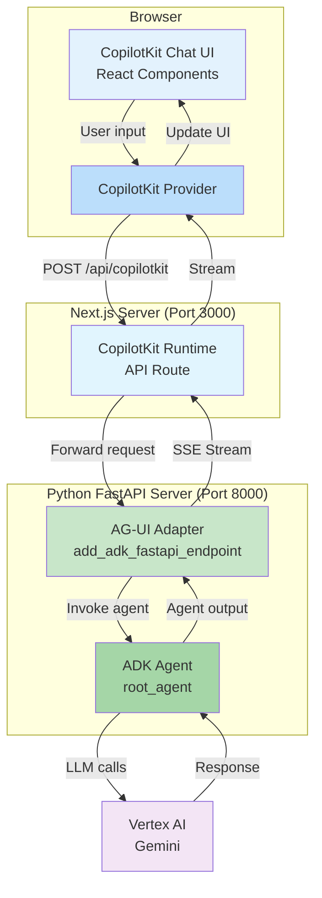

# ADK Agent Client - CopilotKit with AG-UI Integration

A production-ready chat client for Google ADK (Agent Development Kit) agents, built with [CopilotKit](https://www.copilotkit.ai/) and [@ag-ui/client](https://www.npmjs.com/package/@ag-ui/client). This implementation demonstrates seamless integration between ADK agents and CopilotKit's rich UI components through the AG-UI adapter.

## Table of Contents

- [ADK Agent Client - CopilotKit with AG-UI Integration](#adk-agent-client---copilotkit-with-ag-ui-integration)
  - [Table of Contents](#table-of-contents)
  - [1. Run Locally](#1-run-locally)
    - [Prerequisites](#prerequisites)
    - [Setup](#setup)
  - [2. Demo Walkthrough](#2-demo-walkthrough)
  - [3. Features](#3-features)
  - [4. Architecture Overview](#4-architecture-overview)
  - [5. Key Components](#5-key-components)
    - [5.1 Backend: FastAPI Server](#51-backend-fastapi-server)
    - [5.2 Backend: ADK Agent Definition](#52-backend-adk-agent-definition)
    - [5.3 Frontend: CopilotKit UI](#53-frontend-copilotkit-ui)
    - [5.4 Frontend: Runtime Bridge](#54-frontend-runtime-bridge)
  - [6. Project Structure](#6-project-structure)
  - [7. Dependencies](#7-dependencies)
    - [7.1 Backend](#71-backend)
    - [7.2 Frontend](#72-frontend)

## 1. Run Locally

### Prerequisites

- Python 3.11+
- Node.js 18+
- Google Cloud Project with Vertex AI API enabled
- Google Cloud credentials configured

### Setup

1. Set up the backend virtual environment:

    ```bash
    cd ~/specialized-training-content/courses/build_production_ready_agents/ch5_demos/clients/agui-copilotkit
    uv venv
    source .venv/bin/activate
    uv pip install -r requirements.txt
    ```

2. Create a **.env** file:

    ```bash
    cp .env.example .env
    ```

3. Edit `.env` and configure your settings (e.g. `GOOGLE_GENAI_USE_VERTEXAI=TRUE`).

4. Launch the backend server:

    ```bash
    python main.py
    ```

    The FastAPI server will start on `http://localhost:8000`.

5. In a **new terminal window**, install and start the frontend:

    ```bash
    cd ~/specialized-training-content/courses/build_production_ready_agents/ch5_demos/clients/agui-copilotkit/my-copilot-app
    npm install
    npm run dev
    ```

    The Next.js app will start on `http://localhost:3000`.

6. Open [http://localhost:3000](http://localhost:3000) in your browser.

## 2. Demo Walkthrough

Start with the live demo, then walk through the code.

1. **Live demo** — open [http://localhost:3000](http://localhost:3000) and orient students to the layout. The main page is a mock "Google Cloud CoE (Center of Excellence) Portal" dashboard with metrics cards (Active Projects, Monthly Spend, Team Members, Uptime SLA), quick access links, and active GCP service tiles with usage bars. The CopilotKit sidebar sits on the right edge of the screen — this is the key visual: the AI assistant lives *alongside* the application, not in a separate page. The agent introduces itself as a Google Cloud technology tutor. Type a message (e.g. "tell me about GKE") and show the streaming response appearing in the sidebar while the dashboard remains fully visible and interactive behind it. Point out that this is the "copilot" UX pattern — the assistant augments the app rather than replacing it.

2. **Two-server architecture** — unlike the other clients which talk to a shared `sessions_server.py` backend, this demo runs its own FastAPI server with the ADK agent embedded directly. The AG-UI adapter (`add_adk_fastapi_endpoint`) exposes the agent as an endpoint that CopilotKit can consume. See the [4. Architecture Overview](#4-architecture-overview) diagram.

3. **AG-UI as the bridge** — show the runtime bridge in `route.ts` ([5.4 Frontend: Runtime Bridge](#54-frontend-runtime-bridge)). It's just a few lines: `AgentRuntime` points at the Python backend, and `CopilotRuntime` streams responses to the frontend. This is the glue that makes CopilotKit work with any AG-UI-compatible agent.

4. **CopilotKit UI components** (`page.tsx`) — the chat interface uses `<CopilotKit>` and `<CopilotSidebar>` components. Compare with the assistant-ui client which uses `<Thread />` — both give you a polished UI from a single component, but CopilotKit's sidebar pattern is designed for copilot-style experiences embedded alongside app content (as the dashboard demo illustrates). See [5.3 Frontend: CopilotKit UI](#53-frontend-copilotkit-ui).

5. **Backend simplicity** (`main.py`) — walk through [5.1 Backend: FastAPI Server](#51-backend-fastapi-server). The entire server is ~15 lines: wrap the ADK agent with `ADKAgent`, expose it with `add_adk_fastapi_endpoint`, done. No manual SSE parsing, no session management code — the AG-UI adapter handles all of it.

6. **Contrast with other clients** — this is the only client that bundles its own agent rather than connecting to the shared lab backend. Discuss when you'd use this pattern (self-contained deployable unit) vs. the shared backend pattern (multiple clients, one agent).

## 3. Features

- **CopilotKit Integration** - Full-featured chat interface with built-in UI components
- **AG-UI Adapter** - Bridges ADK agents with CopilotKit runtime
- **Native Streaming** - Real-time streaming responses from ADK agents
- **Session Management** - Automatic session handling via AG-UI adapter
- **Rich UI Components** - CopilotKit's pre-built chat components
- **Next.js 16** - Modern React framework with App Router
- **React 19** - Latest React features and optimizations
- **FastAPI Backend** - Python server with ADK agent integration

## 4. Architecture Overview

This implementation uses a unique two-server architecture where a Python FastAPI server hosts the ADK agent with AG-UI endpoints, and a Next.js frontend provides the CopilotKit UI.



## 5. Key Components

### 5.1 Backend: FastAPI Server

`main.py` — the entry point for the Python backend:

```python
from ag_ui_adk import ADKAgent, add_adk_fastapi_endpoint
from agent import root_agent as agent
from dotenv import load_dotenv
from fastapi import FastAPI

load_dotenv()

adk_agent = ADKAgent(
    adk_agent=agent,
    app_name="demo_app",
    user_id="demo_user",
    session_timeout_seconds=3600,
    use_in_memory_services=True
)

app = FastAPI()
add_adk_fastapi_endpoint(app, adk_agent, path="/")

if __name__ == "__main__":
    import uvicorn
    uvicorn.run(app, host="localhost", port=8000)
```

**Key features:**
- Wraps ADK agent with AG-UI adapter (`ADKAgent`)
- Exposes agent endpoints via `add_adk_fastapi_endpoint()`
- Manages sessions with configurable timeout
- In-memory session storage for development

### 5.2 Backend: ADK Agent Definition

`agent.py` — define your ADK agent here. The agent will be accessible through the AG-UI adapter.

### 5.3 Frontend: CopilotKit UI

`app/page.tsx` — the main chat interface using CopilotKit components:

```typescript
import { CopilotKit } from "@copilotkit/react-core";
import { CopilotSidebar } from "@copilotkit/react-ui";

export default function Home() {
  return (
    <CopilotKit runtimeUrl="/api/copilotkit">
      <CopilotSidebar>
        {/* Your app content */}
      </CopilotSidebar>
    </CopilotKit>
  );
}
```

### 5.4 Frontend: Runtime Bridge

`app/api/copilotkit/route.ts` — connects CopilotKit to the AG-UI backend:

```typescript
import { CopilotRuntime } from "@copilotkit/runtime";
import { AgentRuntime } from "@ag-ui/client";

const agentRuntime = new AgentRuntime({
  url: "http://localhost:8000",
});

export const POST = async (req: Request) => {
  const runtime = new CopilotRuntime();
  return runtime.streamHttpServerResponse(req, agentRuntime);
};
```

## 6. Project Structure

```
agui-copilotkit/
├── .env                    # Environment configuration
├── .env.example            # Environment template
├── requirements.txt        # Python dependencies
├── main.py                # FastAPI server entry point
├── agent.py               # ADK agent definition
└── my-copilot-app/        # Next.js frontend
    ├── app/
    │   ├── page.tsx       # Main chat UI component
    │   └── api/
    │       └── copilotkit/
    │           └── route.ts  # CopilotKit runtime API
    ├── package.json       # Node.js dependencies
    └── ...
```

## 7. Dependencies

### 7.1 Backend

```
ag_ui_adk          # AG-UI adapter for ADK agents
google-adk         # Google Agent Development Kit
uvicorn           # ASGI server
fastapi           # Web framework
dotenv            # Environment variable management
```

### 7.2 Frontend

```json
{
  "dependencies": {
    "@ag-ui/client": "^0.0.43",
    "@copilotkit/react-core": "^1.51.3",
    "@copilotkit/react-ui": "^1.51.3",
    "@copilotkit/runtime": "^1.51.3",
    "next": "16.1.6",
    "react": "19.2.3",
    "react-dom": "19.2.3"
  }
}
```
