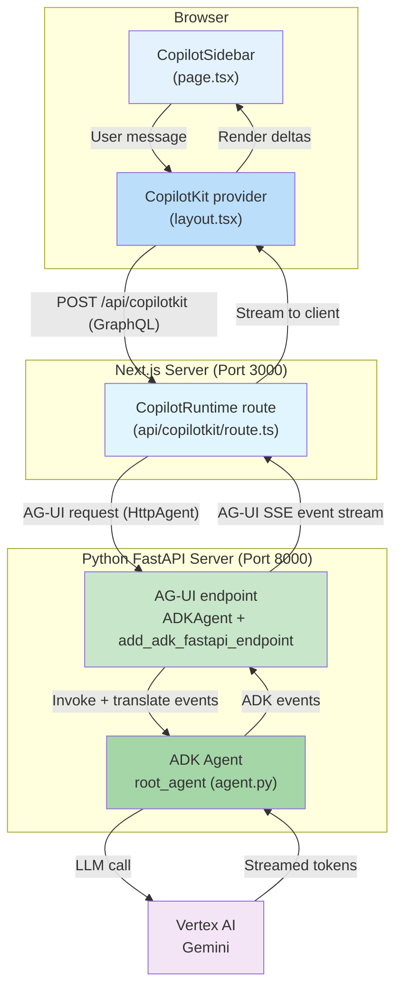

# ADK Agent Client - CopilotKit with AG-UI Integration

A production-ready chat client for Google ADK (Agent Development Kit) agents, built with [CopilotKit](https://www.copilotkit.ai/) and [@ag-ui/client](https://www.npmjs.com/package/@ag-ui/client). This implementation demonstrates seamless integration between ADK agents and CopilotKit's rich UI components through the AG-UI adapter.

## Table of Contents

- [ADK Agent Client - CopilotKit with AG-UI Integration](#adk-agent-client---copilotkit-with-ag-ui-integration)
  - [Table of Contents](#table-of-contents)
  - [1. Run Locally](#1-run-locally)
    - [Prerequisites](#prerequisites)
    - [Setup](#setup)
  - [2. Demo Walkthrough](#2-demo-walkthrough)
  - [3. Features](#3-features)
  - [4. Architecture Overview](#4-architecture-overview)
  - [5. Key Components](#5-key-components)
    - [5.0 How It Works: AG-UI and CopilotKit](#50-how-it-works-ag-ui-and-copilotkit)
    - [5.1 Backend: FastAPI Server](#51-backend-fastapi-server)
    - [5.2 Backend: ADK Agent Definition](#52-backend-adk-agent-definition)
    - [5.3 Frontend: CopilotKit UI](#53-frontend-copilotkit-ui)
    - [5.4 Frontend: Runtime Bridge](#54-frontend-runtime-bridge)
  - [6. Project Structure](#6-project-structure)
  - [7. Dependencies](#7-dependencies)
    - [7.1 Backend](#71-backend)
    - [7.2 Frontend](#72-frontend)

## 1. Run Locally

### Prerequisites

- Python 3.11+
- Node.js 18+
- Google Cloud Project with Vertex AI API enabled
- Google Cloud credentials configured

### Setup

1. Set up the backend virtual environment:

    ```bash
    cd ~/specialized-training-content/courses/build_production_ready_agents/ch5_demos/clients/agui-copilotkit
    uv venv
    source .venv/bin/activate
    uv pip install -r requirements.txt
    ```

2. Create a **.env** file:

    ```bash
    cp .env.example .env
    ```

3. Edit `.env` and configure your settings (e.g. `GOOGLE_GENAI_USE_VERTEXAI=TRUE`).

4. Launch the backend server:

    ```bash
    python main.py
    ```

    The FastAPI server will start on `http://localhost:8000`.

5. In a **new terminal window**, install and start the frontend:

    ```bash
    cd ~/specialized-training-content/courses/build_production_ready_agents/ch5_demos/clients/agui-copilotkit/my-copilot-app
    npm install
    npm run dev
    ```

    The Next.js app will start on `http://localhost:3000`.

6. Open [http://localhost:3000](http://localhost:3000) in your browser.

## 2. Demo Walkthrough

Start with the live demo, then walk through the code.

1. **Live demo** — open [http://localhost:3000](http://localhost:3000) and orient students to the layout. The main page is a mock "Google Cloud CoE (Center of Excellence) Portal" dashboard with metrics cards (Active Projects, Monthly Spend, Team Members, Uptime SLA), quick access links, and active GCP service tiles with usage bars. The CopilotKit sidebar sits on the right edge of the screen — this is the key visual: the AI assistant lives *alongside* the application, not in a separate page. The agent introduces itself as a Google Cloud technology tutor. Type a message (e.g. "tell me about GKE") and show the streaming response appearing in the sidebar while the dashboard remains fully visible and interactive behind it. Point out that this is the "copilot" UX pattern — the assistant augments the app rather than replacing it.

2. **Two-server architecture** — this demo runs its own FastAPI server with the ADK agent embedded directly, packaged alongside the frontend as a self-contained deployable unit. The AG-UI adapter (`add_adk_fastapi_endpoint`) exposes the agent as an endpoint that CopilotKit can consume. See the [4. Architecture Overview](#4-architecture-overview) diagram.

3. **AG-UI as the bridge** — show the runtime bridge in `route.ts` ([5.4 Frontend: Runtime Bridge](#54-frontend-runtime-bridge)). It's just a few lines: a `CopilotRuntime` registers an `HttpAgent` pointed at the Python backend, and `copilotRuntimeNextJSAppRouterEndpoint` serves it to the frontend. The `HttpAgent` is the AG-UI client — this is the glue that makes CopilotKit work with any AG-UI-compatible agent.

4. **CopilotKit UI components** — the `<CopilotKit>` provider lives in `layout.tsx` and the `<CopilotSidebar>` is dropped into `page.tsx` alongside the dashboard. A single component gives you a polished UI, and CopilotKit's sidebar pattern is designed for copilot-style experiences embedded alongside app content (as the dashboard demo illustrates). See [5.3 Frontend: CopilotKit UI](#53-frontend-copilotkit-ui).

5. **Backend simplicity** (`main.py`) — walk through [5.1 Backend: FastAPI Server](#51-backend-fastapi-server). The entire server is ~15 lines: wrap the ADK agent with `ADKAgent`, expose it with `add_adk_fastapi_endpoint`, done. No manual SSE parsing, no session management code — the AG-UI adapter handles all of it.

## 3. Features

Each "feature" below maps to a concrete piece of the codebase. The mechanics
are explained in [5.0 How It Works](#50-how-it-works-ag-ui-and-copilotkit).

- **AG-UI protocol** — [AG-UI](https://docs.ag-ui.com/) is a vendor-neutral
  standard for streaming agent activity to a UI (text deltas, tool calls, state
  updates). ADK agents don't emit AG-UI natively — they produce ADK's own
  events. The `ag_ui_adk` package's `ADKAgent` class wraps the agent, runs it,
  and translates each ADK event into the equivalent AG-UI event. That
  translation layer is what lets a CopilotKit frontend talk to a Google ADK
  backend without either side knowing about the other.
- **CopilotKit UI** — pre-built React chat components (`<CopilotSidebar>`,
  `<CopilotKit>` provider). You get a polished, embeddable assistant from two
  components instead of hand-building a chat interface.
- **Copilot UX pattern** — the assistant lives in a sidebar *alongside* a
  working app (the mock CoE dashboard in `page.tsx`), rather than occupying a
  dedicated chat page. The app stays visible and interactive while the user
  chats.
- **Streaming** — responses render token-by-token. ADK emits incremental
  events, the adapter forwards them as AG-UI Server-Sent Events (SSE), and
  CopilotKit appends them to the sidebar as they arrive.
- **Automatic session management** — `ADKAgent` creates and tracks an ADK
  session per conversation (here, in-memory with a 1-hour timeout). No
  session-handling code in the client.
- **Modern stack** — Next.js 16 (App Router) + React 19 frontend, FastAPI +
  ADK backend.

## 4. Architecture Overview

This implementation uses a two-server architecture: a Python FastAPI server
hosts the ADK agent behind an AG-UI endpoint, and a separate Next.js server
serves the CopilotKit UI and runs a small runtime route that bridges the
browser to the Python backend.



**Reading the diagram.** A single chat turn flows clockwise through five hops:

1. **Browser → Provider.** The user types in `<CopilotSidebar>` (rendered in
   `page.tsx`). The `<CopilotKit>` provider (in `layout.tsx`) wraps the whole
   app and owns the conversation state and transport.
2. **Provider → Next.js runtime route.** The provider POSTs the conversation to
   its own Next.js API route at `/api/copilotkit` (CopilotKit's
   browser↔runtime calls use GraphQL under the hood). This route runs on the
   Next.js server, *not* the Python server — it exists so the browser never
   talks to the Python backend directly.
3. **Runtime route → Python AG-UI endpoint.** The route's `CopilotRuntime` is
   configured with an `HttpAgent` pointing at `http://localhost:8000/`. It
   re-issues the request to the Python server as an AG-UI call.
4. **Endpoint → ADK → Vertex.** `add_adk_fastapi_endpoint` received the request
   and handed it to `ADKAgent`, which runs the ADK `root_agent`. The agent
   calls Gemini on Vertex AI and gets back streamed tokens.
5. **Stream back up.** As the agent produces output, `ADKAgent` translates each
   ADK event into a standard **AG-UI event** and emits the result as an **SSE
   stream**. The Next.js runtime relays that stream to the provider, which
   appends text deltas to the sidebar in real time.

The key idea: the two servers agree only on the **AG-UI protocol** at hop 3–5.
Neither the Python agent nor the React UI is coupled to the other's framework —
swap either side for anything AG-UI-compatible and the contract still holds.

## 5. Key Components

### 5.0 How It Works: AG-UI and CopilotKit

The two interesting questions in this demo are *what AG-UI actually is* and
*how CopilotKit interoperates with it*. The diagram in
[Section 4](#4-architecture-overview) shows the wiring; this section explains
the contract behind it.

**AG-UI is a protocol, not a library.** AG-UI ("Agent–User Interaction
Protocol") standardizes how a running agent reports its activity to a user
interface, as a stream of typed events over Server-Sent Events (SSE). Instead
of a UI having to understand ADK's internal event objects (or LangGraph's, or
anyone else's), every compliant backend emits the same small vocabulary of
events. The ones this adapter produces include:

| AG-UI event | Meaning |
| --- | --- |
| `RUN_STARTED` / `RUN_FINISHED` / `RUN_ERROR` | A turn began / completed / failed |
| `TEXT_MESSAGE_START` / `_CONTENT` / `_END` | An assistant message and its streamed token deltas |
| `TOOL_CALL_START` / `_ARGS` / `_END` / `_RESULT` | The agent invoked a tool, its arguments, and the result |
| `STATE_SNAPSHOT` / `STATE_DELTA` | Full or incremental shared-state updates |

Because the contract is just this event stream, the frontend and backend are
decoupled: any AG-UI client can drive any AG-UI agent.

**`ag_ui_adk` is the ADK→AG-UI translator.** On the Python side, `ADKAgent`
(from the `ag_ui_adk` package) wraps a normal ADK agent and does two jobs:
runs the agent, and converts each ADK event it emits into the corresponding
AG-UI event above. `add_adk_fastapi_endpoint` mounts that as an HTTP route
that returns the AG-UI SSE stream. See [5.1](#51-backend-fastapi-server).

**CopilotKit is the AG-UI client.** CopilotKit is a React toolkit for
embedding assistants in apps. It interoperates with AG-UI through its
`@ag-ui/client` integration: an `HttpAgent` is a client that knows how to call
an AG-UI endpoint and consume its event stream. In this demo
([5.4](#54-frontend-runtime-bridge)), a `CopilotRuntime` running inside a
Next.js API route is configured with one such `HttpAgent` pointed at the
Python server. CopilotKit's React components ([5.3](#53-frontend-copilotkit-ui))
subscribe to that runtime and turn the events into UI — `TEXT_MESSAGE_CONTENT`
events become streamed text in the sidebar, and `TOOL_CALL_*` events drive tool
status and results.

**Why the extra Next.js runtime hop?** CopilotKit's browser components don't
call the AG-UI backend directly; they call a CopilotKit *runtime*. Here that
runtime is a thin Next.js route ([5.4](#54-frontend-runtime-bridge)) that holds
the `HttpAgent`. This keeps the backend URL and any credentials server-side and
gives CopilotKit a place to coordinate multiple agents, frontend actions, and
shared state if the app grows. For this demo it's only a few lines of glue.

### 5.1 Backend: FastAPI Server

`main.py` — the entry point for the Python backend:

```python
from ag_ui_adk import ADKAgent, add_adk_fastapi_endpoint
from agent import root_agent as agent
from dotenv import load_dotenv
from fastapi import FastAPI

load_dotenv()

adk_agent = ADKAgent(
    adk_agent=agent,
    app_name="demo_app",
    user_id="demo_user",
    session_timeout_seconds=3600,
    use_in_memory_services=True
)

app = FastAPI()
add_adk_fastapi_endpoint(app, adk_agent, path="/")

if __name__ == "__main__":
    import uvicorn
    uvicorn.run(app, host="localhost", port=8000)
```

**Key features:**
- Wraps ADK agent with AG-UI adapter (`ADKAgent`)
- Exposes agent endpoints via `add_adk_fastapi_endpoint()`
- Manages sessions with configurable timeout
- In-memory session storage for development

### 5.2 Backend: ADK Agent Definition

`agent.py` — define your ADK agent here. The agent will be accessible through the AG-UI adapter.

### 5.3 Frontend: CopilotKit UI

The UI is split across two files. The **provider** wraps the entire app once,
in `app/layout.tsx`, naming which runtime route and which agent to use:

```typescript
// app/layout.tsx
import { CopilotKit } from "@copilotkit/react-core";
import "@copilotkit/react-ui/styles.css";

export default function RootLayout({ children }: { children: React.ReactNode }) {
  return (
    <html lang="en">
      <body>
        <CopilotKit runtimeUrl="/api/copilotkit" agent="my_agent">
          {children}
        </CopilotKit>
      </body>
    </html>
  );
}
```

The **page** (`app/page.tsx`) renders the application content — a mock Google
Cloud CoE dashboard — and drops in the `<CopilotSidebar>` component. Because
the provider is in the layout, the sidebar just works anywhere in the tree:

```typescript
// app/page.tsx
"use client";
import { CopilotSidebar } from "@copilotkit/react-ui";

export default function Page() {
  return (
    <div>
      {/* ...dashboard markup... */}
      <CopilotSidebar />
    </div>
  );
}
```

### 5.4 Frontend: Runtime Bridge

`app/api/copilotkit/route.ts` — the Next.js route that bridges CopilotKit to
the AG-UI backend. It builds a `CopilotRuntime` whose `my_agent` is an
`HttpAgent` (the `@ag-ui/client` class that speaks the AG-UI protocol) pointed
at the Python server, then serves it through CopilotKit's App Router handler:

```typescript
// app/api/copilotkit/route.ts
import {
  CopilotRuntime,
  ExperimentalEmptyAdapter,
  copilotRuntimeNextJSAppRouterEndpoint,
} from "@copilotkit/runtime";
import { HttpAgent } from "@ag-ui/client";
import { NextRequest } from "next/server";

const serviceAdapter = new ExperimentalEmptyAdapter();

const runtime = new CopilotRuntime({
  agents: {
    my_agent: new HttpAgent({ url: "http://localhost:8000/" }),
  },
});

export const POST = async (req: NextRequest) => {
  const { handleRequest } = copilotRuntimeNextJSAppRouterEndpoint({
    runtime,
    serviceAdapter,
    endpoint: "/api/copilotkit",
  });
  return handleRequest(req);
};
```

A few things to notice:

- The agent key `my_agent` is what `layout.tsx` selects with `agent="my_agent"`.
  A runtime can register several agents; the provider picks one by name.
- `HttpAgent({ url: "http://localhost:8000/" })` is the AG-UI client — this is
  the single line that connects CopilotKit to the Python AG-UI endpoint.
- `ExperimentalEmptyAdapter` is used because the LLM call happens *inside* the
  ADK agent on the Python side. The "service adapter" slot is where CopilotKit
  would otherwise call a model provider directly; here there's nothing for it
  to do, so the empty adapter is correct.
- `copilotRuntimeNextJSAppRouterEndpoint` produces the `handleRequest` function
  that serves CopilotKit's GraphQL endpoint from this App Router route.

## 6. Project Structure

```
agui-copilotkit/
├── .env                    # Environment configuration
├── .env.example            # Environment template
├── requirements.txt        # Python dependencies
├── main.py                # FastAPI server entry point
├── agent.py               # ADK agent definition
└── my-copilot-app/        # Next.js frontend
    ├── app/
    │   ├── layout.tsx     # Root layout; hosts the <CopilotKit> provider
    │   ├── page.tsx       # Dashboard + <CopilotSidebar>
    │   └── api/
    │       └── copilotkit/
    │           └── route.ts  # CopilotRuntime bridge to the AG-UI backend
    ├── package.json       # Node.js dependencies
    └── ...
```

## 7. Dependencies

### 7.1 Backend

```
ag_ui_adk          # AG-UI adapter for ADK agents (ADKAgent translator)
google-adk         # Google Agent Development Kit
uvicorn            # ASGI server
fastapi            # Web framework
python-dotenv      # Environment variable management
```

### 7.2 Frontend

```json
{
  "dependencies": {
    "@ag-ui/client": "^0.0.43",
    "@copilotkit/react-core": "1.54.1",
    "@copilotkit/react-ui": "1.54.1",
    "@copilotkit/runtime": "^1.51.3",
    "next": "16.1.6",
    "react": "19.2.3",
    "react-dom": "19.2.3"
  }
}
```
