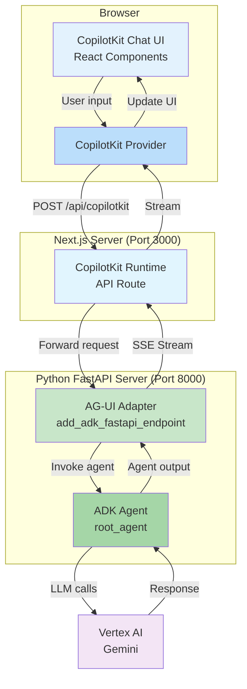

# ADK Agent Client - CopilotKit with AG-UI Integration

A production-ready chat client for Google ADK (Agent Development Kit) agents, built with [CopilotKit](https://www.copilotkit.ai/) and [@ag-ui/client](https://www.npmjs.com/package/@ag-ui/client). This implementation demonstrates seamless integration between ADK agents and CopilotKit's rich UI components through the AG-UI adapter.

## Features

- 🎯 **CopilotKit Integration** - Full-featured chat interface with built-in UI components
- 🔌 **AG-UI Adapter** - Bridges ADK agents with CopilotKit runtime
- 📡 **Native Streaming** - Real-time streaming responses from ADK agents
- 🔄 **Session Management** - Automatic session handling via AG-UI adapter
- 🎨 **Rich UI Components** - CopilotKit's pre-built chat components
- 🚀 **Next.js 16** - Modern React framework with App Router
- ⚛️ **React 19** - Latest React features and optimizations
- 🔧 **FastAPI Backend** - Python server with ADK agent integration

## Architecture Overview

This implementation uses a unique two-server architecture where a Python FastAPI server hosts the ADK agent with AG-UI endpoints, and a Next.js frontend provides the CopilotKit UI.



## Quick Start

### Prerequisites

- Python 3.11+
- Node.js 18+
- Google Cloud Project with Vertex AI API enabled
- Google Cloud credentials configured

### Setup

This project requires two separate setup processes: one for the Python backend server and one for the Next.js frontend.

#### 1. Backend Server Setup (Python FastAPI)

Navigate to the `agui-copilotkit` directory:

```bash
cd agui-copilotkit
```

**Create and activate a virtual environment:**

```bash
# Create virtual environment
python -m venv .venv

# Activate virtual environment
# On macOS/Linux:
source .venv/bin/activate

# On Windows:
.venv\Scripts\activate
```

**Install Python dependencies:**

```bash
pip install -r requirements.txt
```

**Configure environment variables:**

Create a `.env` file in the `agui-copilotkit` directory:

```bash
cp .env.example .env
```

Edit `.env` and configure your settings:

```bash
GOOGLE_GENAI_USE_VERTEXAI=TRUE
# Add any additional environment variables needed for your agent
```

**Start the backend server:**

```bash
python main.py
```

The FastAPI server will start on `http://localhost:8000`.

#### 2. Frontend Client Setup (Next.js)

Open a **new terminal** and navigate to the Next.js app directory:

```bash
cd agui-copilotkit/my-copilot-app
```

**Install Node.js dependencies:**

```bash
npm install
```

**Start the development server:**

```bash
npm run dev
```

The Next.js app will start on `http://localhost:3000`.

### Access the Application

Open your browser and navigate to:

```
http://localhost:3000
```

You should see the CopilotKit chat interface ready to interact with your ADK agent.

## Project Structure

```
agui-copilotkit/
├── .env                    # Environment configuration
├── .env.example            # Environment template
├── requirements.txt        # Python dependencies
├── main.py                # FastAPI server entry point
├── agent.py               # ADK agent definition
└── my-copilot-app/        # Next.js frontend
    ├── app/
    │   ├── page.tsx       # Main chat UI component
    │   └── api/
    │       └── copilotkit/
    │           └── route.ts  # CopilotKit runtime API
    ├── package.json       # Node.js dependencies
    └── ...
```

## Key Components

### Backend Components

#### `main.py` - FastAPI Server

```python
from ag_ui_adk import ADKAgent, add_adk_fastapi_endpoint
from agent import root_agent as agent
from dotenv import load_dotenv
from fastapi import FastAPI

load_dotenv()

adk_agent = ADKAgent(
    adk_agent=agent,
    app_name="demo_app",
    user_id="demo_user",
    session_timeout_seconds=3600,
    use_in_memory_services=True
)

app = FastAPI()
add_adk_fastapi_endpoint(app, adk_agent, path="/")

if __name__ == "__main__":
    import uvicorn
    uvicorn.run(app, host="localhost", port=8000)
```

**Key features:**
- Wraps ADK agent with AG-UI adapter (`ADKAgent`)
- Exposes agent endpoints via `add_adk_fastapi_endpoint()`
- Manages sessions with configurable timeout
- In-memory session storage for development

#### `agent.py` - ADK Agent Definition

Define your ADK agent here. The agent will be accessible through the AG-UI adapter.

### Frontend Components

#### `app/page.tsx` - CopilotKit UI

The main chat interface using CopilotKit components:

```typescript
import { CopilotKit } from "@copilotkit/react-core";
import { CopilotSidebar } from "@copilotkit/react-ui";

export default function Home() {
  return (
    <CopilotKit runtimeUrl="/api/copilotkit">
      <CopilotSidebar>
        {/* Your app content */}
      </CopilotSidebar>
    </CopilotKit>
  );
}
```

#### `app/api/copilotkit/route.ts` - Runtime Bridge

Connects CopilotKit to the AG-UI backend:

```typescript
import { CopilotRuntime } from "@copilotkit/runtime";
import { AgentRuntime } from "@ag-ui/client";

const agentRuntime = new AgentRuntime({
  url: "http://localhost:8000",
});

export const POST = async (req: Request) => {
  const runtime = new CopilotRuntime();
  return runtime.streamHttpServerResponse(req, agentRuntime);
};
```

## Development Workflow

### Running Both Servers

You'll need **two terminal windows**:

**Terminal 1 - Backend:**
```bash
cd agui-copilotkit
source .venv/bin/activate  # or .venv\Scripts\activate on Windows
python main.py
```

**Terminal 2 - Frontend:**
```bash
cd agui-copilotkit/my-copilot-app
npm run dev
```

### Making Changes

**Backend changes:**
1. Edit `agent.py` or related files
2. Restart the FastAPI server (Ctrl+C, then `python main.py`)

**Frontend changes:**
1. Edit files in `my-copilot-app/app/`
2. Next.js will hot-reload automatically

## Dependencies

### Backend (`requirements.txt`)

```
ag_ui_adk          # AG-UI adapter for ADK agents
google-adk         # Google Agent Development Kit
uvicorn           # ASGI server
fastapi           # Web framework
dotenv            # Environment variable management
```

### Frontend (`package.json`)

```json
{
  "dependencies": {
    "@ag-ui/client": "^0.0.43",
    "@copilotkit/react-core": "^1.51.3",
    "@copilotkit/react-ui": "^1.51.3",
    "@copilotkit/runtime": "^1.51.3",
    "next": "16.1.6",
    "react": "19.2.3",
    "react-dom": "19.2.3"
  }
}
```
