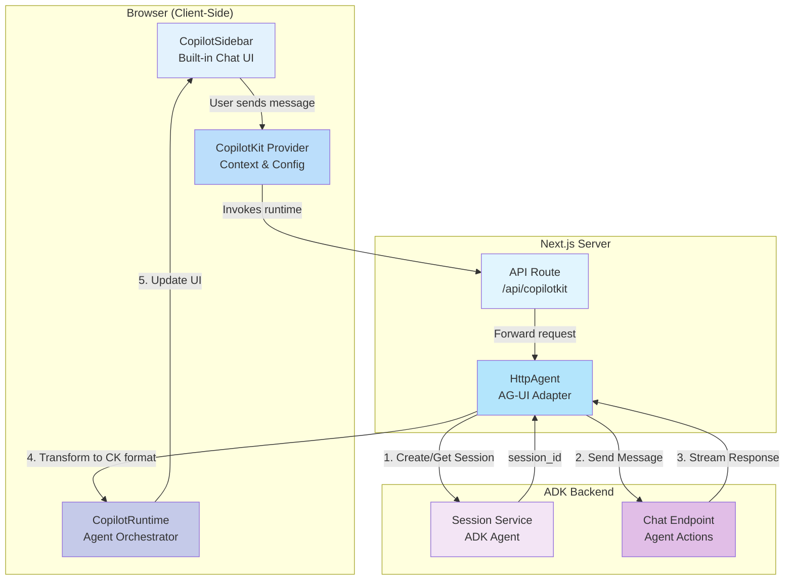

# ADK Agent Client - CopilotKit

A modern chat client for Google ADK (Agent Development Kit) agents, built with [CopilotKit](https://www.copilotkit.ai/). This implementation showcases CopilotKit's sidebar interface and agent integration capabilities, connecting to the ADK backend through the AG-UI client adapter.

## Features

- 🎨 **Pre-built UI Components** - Professional sidebar chat interface with `CopilotSidebar`
- 🔌 **AG-UI Adapter** - Seamless integration with ADK backend via `@ag-ui/client`
- 🛠️ **Tool Rendering** - Custom rendering of agent tool calls with `useRenderToolCall`
- 🔄 **Agent Orchestration** - CopilotKit runtime manages agent lifecycle and communication
- ⚛️ **React-First Design** - Declarative components with automatic state management
- 🚀 **Zero-Config Streaming** - Built-in streaming support with no manual SSE parsing

## Architecture Overview

CopilotKit provides a **runtime-based architecture** where the runtime manages agent communication, state, and tool execution. The AG-UI `HttpAgent` adapter bridges the CopilotKit runtime with the ADK backend, handling session management and message streaming automatically.



## Implementation Details

### 1. Layout Provider (`layout.tsx`)

The root layout wraps the entire app in the CopilotKit context:

```typescript
<CopilotKit runtimeUrl="/api/copilotkit" agent="my_agent">
  {children}
</CopilotKit>
```

**Configuration:**
- `runtimeUrl`: Points to the Next.js API route that handles agent communication
- `agent`: Specifies which agent to use (must match the agent name in the runtime)

**What CopilotKit provides:**
- Global context for all child components
- Automatic connection to the runtime endpoint
- State management for messages and agent interactions
- Built-in error handling and loading states

### 2. API Route (`/api/copilotkit/route.ts`)

The API route configures the CopilotKit runtime and connects to the ADK backend:

**Runtime Configuration:**
```typescript
const runtime = new CopilotRuntime({
  agents: {
    my_agent: new HttpAgent({ url: "http://localhost:8000/" }),
  }
});
```

**AG-UI HttpAgent:**
- Automatically handles ADK session creation
- Manages session persistence across requests
- Transforms ADK's SSE format to CopilotKit's protocol
- Handles agent tool calls and responses

**Request Handling:**
- Uses `copilotRuntimeNextJSAppRouterEndpoint` for Next.js App Router integration
- Automatically routes messages to the appropriate agent
- Streams responses back to the client
- No manual SSE parsing required

### 3. Chat Interface (`page.tsx`)

The main application page uses CopilotKit's pre-built components:

```typescript
<CopilotSidebar />
```

**Built-in Features:**
- Collapsible sidebar interface
- Message history display
- User input field with submit button
- Loading indicators
- Tool call visualization
- Markdown rendering
- Auto-scroll behavior

### 4. Tool Call Rendering

The `useRenderToolCall` hook allows custom rendering of agent tool executions:

```typescript
useRenderToolCall({
  name: "check_gcp_service_availability",
  render: ({ status, args }) => {
    return (
      <p className="text-gray-500 mt-2">
        {status !== "complete" && "Calling availability API..."}
        {status === "complete" && 
          `Called the availability API for ${args.service_name}.`}
      </p>
    );
  },
});
```

**Use Cases:**
- Visualize agent actions in real-time
- Show progress for long-running operations
- Display structured data from tool results
- Provide user feedback during agent processing

## Project Structure

```
my-copilot-app/
├── app/
│   ├── api/
│   │   └── copilotkit/
│   │       └── route.ts          # Runtime endpoint & AG-UI adapter
│   ├── layout.tsx                # CopilotKit provider setup
│   ├── page.tsx                  # Main chat interface
│   └── globals.css               # Styles including CopilotKit CSS
├── package.json                  # Dependencies
└── next.config.ts                # Next.js configuration
```

## Getting Started

### Prerequisites

1. **ADK Backend Server** - The FastAPI server must be running:
   ```bash
   cd ../
   python server.py
   ```
   This starts the ADK agent on `http://localhost:8000/`

### Installation

Install dependencies:

```bash
npm install
```

### Development

Run the development server:

```bash
npm run dev
```

Open [http://localhost:3000](http://localhost:3000) to see the chat interface.

### Environment Configuration

The ADK backend URL is configured in the API route. To change it, edit:

```typescript
// app/api/copilotkit/route.ts
new HttpAgent({ url: "http://localhost:8000/" })
```

For production, use environment variables:

```typescript
new HttpAgent({ url: process.env.ADK_BACKEND_URL || "http://localhost:8000/" })
```

## Key Dependencies

- **@copilotkit/react-core** - Core CopilotKit functionality and hooks
- **@copilotkit/react-ui** - Pre-built UI components (CopilotSidebar)
- **@copilotkit/runtime** - Runtime for agent orchestration
- **@ag-ui/client** - AG-UI adapter for ADK integration (HttpAgent)
- **Next.js 16+** - React framework with App Router
- **React 19** - Latest React with server components

## How It Works

### Message Flow

1. **User sends a message** in the CopilotSidebar
2. **CopilotKit context** captures the message and calls the runtime endpoint
3. **API route** receives the request and forwards it to the HttpAgent
4. **HttpAgent** (AG-UI adapter):
   - Creates/retrieves an ADK session
   - Sends the message to the ADK backend
   - Receives the SSE stream response
   - Transforms it to CopilotKit's protocol
5. **CopilotRuntime** processes the response and updates the UI
6. **CopilotSidebar** renders the assistant's response with streaming

### Session Management

The AG-UI `HttpAgent` handles session management automatically:
- Creates a new session on the first request
- Stores the session ID internally
- Reuses the session for subsequent messages
- Sessions timeout based on ADK backend configuration

### Tool Execution

When the ADK agent executes a tool:
1. The agent returns tool execution metadata in the response
2. CopilotKit detects the tool call
3. `useRenderToolCall` hooks render custom UI for that tool
4. The tool result is automatically included in the conversation context

## Comparison with Other Clients

| Feature | CopilotKit | Assistant UI | Vercel AI SDK | ADK Frontend |
|---------|-----------|--------------|---------------|--------------|
| **UI Components** | Pre-built sidebar | Pre-built thread | DIY | DIY |
| **Backend Adapter** | AG-UI HttpAgent | Custom adapter | API route | API route |
| **Session Management** | Automatic | Manual | Manual | Manual |
| **Tool Rendering** | Built-in hooks | Custom | Custom | Custom |
| **Learning Curve** | Low | Medium | Low | Medium |
| **Customization** | Moderate | High | High | High |
| **Best For** | Quick prototypes | Production apps | Minimal setup | Learning |

## Customization

### Change the UI Layout

Replace `CopilotSidebar` with other CopilotKit components:

```typescript
import { CopilotChat } from "@copilotkit/react-ui";

// Full-screen chat
<CopilotChat />
```

### Add Multiple Agents

Configure multiple agents in the runtime:

```typescript
const runtime = new CopilotRuntime({
  agents: {
    primary_agent: new HttpAgent({ url: "http://localhost:8000/" }),
    secondary_agent: new HttpAgent({ url: "http://localhost:8001/" }),
  }
});
```

Then switch agents in the provider:

```typescript
<CopilotKit runtimeUrl="/api/copilotkit" agent="primary_agent">
```

### Customize Styling

CopilotKit components use CSS variables for theming. Override in `globals.css`:

```css
:root {
  --copilot-kit-primary-color: #4F46E5;
  --copilot-kit-background-color: #F9FAFB;
  --copilot-kit-text-color: #111827;
}
```

## Troubleshooting

### Backend Connection Failed

Ensure the ADK backend is running:
```bash
curl http://localhost:8000/
```

Check the API route URL configuration matches your backend.

### Session Not Persisting

The HttpAgent manages sessions automatically. If sessions aren't persisting:
1. Check that the ADK backend session service is working
2. Verify the `use_in_memory_services` configuration in the backend
3. Check browser console for errors

### Tool Calls Not Rendering

Ensure:
1. The tool name in `useRenderToolCall` matches the ADK agent's tool name exactly
2. The component using the hook is a client component (`"use client"`)
3. The hook is placed inside the component function, not outside

## Learn More

- [CopilotKit Documentation](https://docs.copilotkit.ai/)
- [AG-UI Client](https://github.com/google/agent-ui)
- [Next.js App Router](https://nextjs.org/docs/app)
- [ADK (Agent Development Kit)](https://cloud.google.com/vertex-ai/generative-ai/docs/agent-builder)

## License

This example is for educational purposes.
