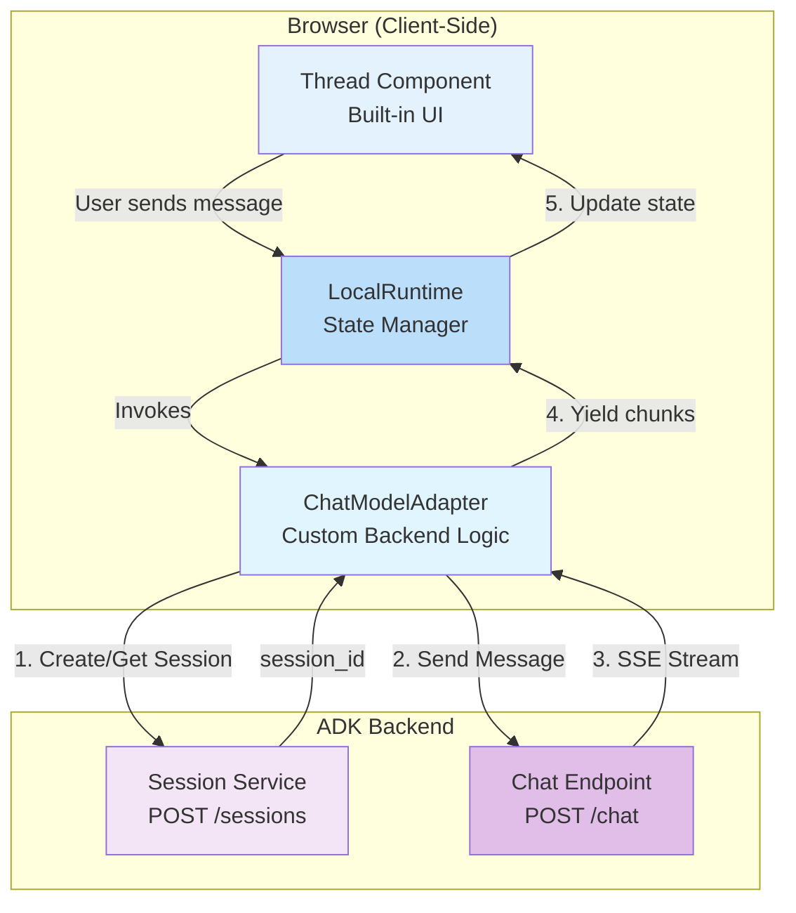

# ADK Agent Client - Assistant UI

A demo-grade chat client for Google ADK (Agent Development Kit) agents, built with the [assistant-ui](https://github.com/assistant-ui/assistant-ui) library. This implementation showcases assistant-ui's composable primitives and built-in state management while connecting to the ADK backend through a custom runtime adapter.

## Features

- 🎨 **Native assistant-ui Design** - Polished, accessible UI using assistant-ui's built-in `Thread` component and styling
- 🔄 **Custom Runtime Adapter** - `useLocalRuntime` with a `ChatModelAdapter` that connects directly to the ADK backend
- 📡 **Streaming Responses** - Real-time message streaming with progressive rendering
- 💾 **Session Management** - Automatic session creation and persistence via sessionStorage
- ⚛️ **React State Management** - assistant-ui handles all chat state, message history, and UI updates
- 🎯 **TypeScript-First** - Full type safety with assistant-ui's strongly-typed APIs

## Architecture Overview

The assistant-ui library provides a **runtime-based architecture** that separates backend communication (runtime) from UI presentation (components). This client uses `useLocalRuntime` with a custom adapter to bridge the ADK backend with assistant-ui's frontend primitives.



## Implementation Details

### 1. Runtime Provider (`MyRuntimeProvider.tsx`)

The runtime provider creates the assistant-ui runtime and wraps the application:

```typescript
const runtime = useLocalRuntime(MyModelAdapter);

return (
  <AssistantRuntimeProvider runtime={runtime}>
    {children}
  </AssistantRuntimeProvider>
);
```

### 2. Custom Model Adapter

The `ChatModelAdapter` implements the contract between assistant-ui and the ADK backend:

**Session Management:**
- On first message, creates a new session via `POST /sessions`
- Stores `session_id` in `sessionStorage` for persistence
- Reuses existing session for subsequent messages

**Message Handling:**
- Receives messages from assistant-ui runtime in a standardized format
- Extracts the last user message content
- Sends to ADK backend with session context

**Streaming Implementation:**
- Uses async generator function (`async *run()`) to yield message chunks
- Reads SSE stream using `ReadableStreamReader`
- Parses `data:` lines to extract JSON payloads
- Yields progressive updates as `{ content: [{ type: "text", text }] }`
- assistant-ui automatically re-renders on each yield

### 3. UI Layer (`page.tsx`)

The application uses assistant-ui's pre-built `Thread` component:

```typescript
<Thread />
```

This single component provides:
- Message list with auto-scrolling
- User/assistant message rendering
- Input field with send button
- Loading states and typing indicators
- Markdown rendering
- Accessibility features (ARIA labels, keyboard navigation)

## Setup

1. **Ensure backend is running:** Open a se terminal windows and...

   ```bash
   # Change to the lab_app directory (adjust path to your ch5_demos location)
   cd <path-to-ch5_demos>/lab_app

   # Create environment file from example
   cp .env.example .env

   # Edit .env and populate the PROJECT_ID value
   # (Use your editor to set PROJECT_ID to your GCP project ID)

   # Create a virtual environment
   python -m venv .venv

   # Activate the virtual environment
   # On macOS/Linux:
   source .venv/bin/activate
   # On Windows:
   # .venv\Scripts\activate

   # Install requirements
   pip install -r requirements.txt

   # Run the sessions server
   python sessions_server.py
   ```

   The backend API will start on `http://localhost:8000`.

2. Get the client running. Create a second terminal window and

   ```bash
   cd <path-to-ch5_demos>/clients/assistant-ui
   npm install
   npm run dev
   ```

3. **Open the application:**
   Visit [http://localhost:3001](http://localhost:3001) in your browser

4. Demo the app running

## Configuration

### Backend Connection

The adapter connects to the ADK backend with these settings in `MyRuntimeProvider.tsx`:

```typescript
const API_BASE_URL = "http://localhost:8000";
const USER_ID = "web_user_001";
```

### Styling

The application uses:
- **assistant-ui styles**: Imported from `@assistant-ui/react/styles/index.css`
- **Tailwind CSS**: For layout and utility classes
- **CSS Variables**: Custom theme in `globals.css` for colors

Customize the theme by modifying CSS variables in `src/app/globals.css`:

```css
:root {
  --aui-background: #ffffff;
  --aui-foreground: #0a0a0a;
  --aui-muted: #f5f5f5;
  /* ... more variables */
}
```

## Code Structure

```
assistant-ui-client/
├── src/
│   ├── app/
│   │   ├── layout.tsx          # Root layout
│   │   ├── page.tsx            # Main page with Thread component
│   │   └── globals.css         # Global styles and theme
│   └── components/
│       └── MyRuntimeProvider.tsx  # Custom runtime with adapter
├── package.json
├── tsconfig.json
└── next.config.ts
```