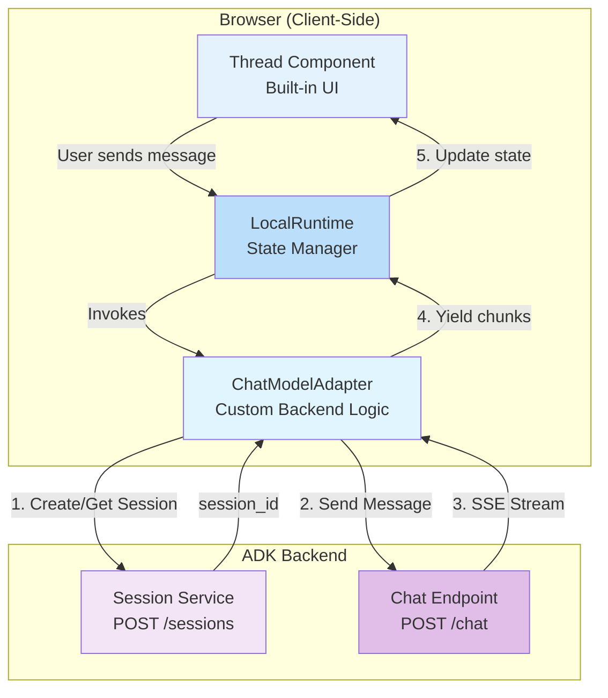

# ADK Agent Client - Assistant UI

A demo-grade chat client for Google ADK (Agent Development Kit) agents, built with the [assistant-ui](https://github.com/assistant-ui/assistant-ui) library. This implementation showcases assistant-ui's composable primitives and built-in state management while connecting to the ADK backend through a custom runtime adapter.

## Table of Contents

- [ADK Agent Client - Assistant UI](#adk-agent-client---assistant-ui)
  - [Table of Contents](#table-of-contents)
  - [1. Run Locally](#1-run-locally)
  - [2. Demo Walkthrough](#2-demo-walkthrough)
  - [3. Features](#3-features)
  - [4. Architecture Overview](#4-architecture-overview)
  - [5. Implementation Details](#5-implementation-details)
    - [5.1 Runtime Provider](#51-runtime-provider)
    - [5.2 Custom Model Adapter](#52-custom-model-adapter)
    - [5.3 UI Layer](#53-ui-layer)
  - [6. Configuration](#6-configuration)
    - [6.1 Backend Connection](#61-backend-connection)
    - [6.2 Styling](#62-styling)
  - [7. Code Structure](#7-code-structure)

## 1. Run Locally

1. Set up the backend virtual environment:

    ```bash
    cd ~/specialized-training-content/courses/build_production_ready_agents/ch5_demos/lab_app
    uv venv
    source .venv/bin/activate
    uv pip install -r requirements.txt
    ```

2. Create a **.env** file:

    ```bash
    cp .env.example .env
    ```

3. Edit `.env` and set `PROJECT_ID` to your GCP project ID.

4. Launch the backend server:

    ```bash
    python sessions_server.py
    ```

    The backend API will start on `http://localhost:8000`.

5. In a **new terminal window**, install and start the client:

    ```bash
    cd ~/specialized-training-content/courses/build_production_ready_agents/ch5_demos/clients/assistant-ui
    npm install
    npm run dev
    ```

6. Open [http://localhost:3001](http://localhost:3001) in your browser.

## 2. Demo Walkthrough

When presenting this client to students, highlight the following:

1. **Contrast with the simple_es client** — this client achieves the same core functionality (session creation, streaming chat) but uses a full React framework (Next.js) with assistant-ui's component library. The simple_es client is ~150 lines of vanilla JS; this one trades that simplicity for a polished UI and built-in state management.

2. **Runtime adapter pattern** (`MyRuntimeProvider.tsx`) — show how the `ChatModelAdapter` bridges assistant-ui's runtime with the ADK backend. The `async *run()` generator function is the key: it yields chunks as they arrive from the SSE stream, and assistant-ui automatically re-renders on each yield. See [5.2 Custom Model Adapter](#52-custom-model-adapter) for details.

3. **One-line UI** (`page.tsx`) — the entire chat interface is a single `<Thread />` component. Walk through what that gives you for free: message list, auto-scrolling, input field, loading states, and accessibility. Note that markdown rendering is *not* on by default — assistant-ui renders assistant text as plain text unless you supply a markdown component (see point 6). See [5.3 UI Layer](#53-ui-layer).

4. **Session management via sessionStorage** — point out that the adapter stores the `session_id` in `sessionStorage`, so refreshing the page doesn't lose the session. Contrast with the simple_es client which creates a new session on every page load.

5. **Markdown rendering** (`MarkdownText.tsx`) — show that formatted responses (headings, bold, lists, code blocks, tables) require explicitly wiring a markdown component into the `Thread`. This is a good teaching moment: assistant-ui keeps rendering pluggable rather than assuming every backend returns markdown. See [5.3 UI Layer](#53-ui-layer).

6. **Live demo** — send a message and show the streaming response. Open DevTools Network tab to show the SSE stream, then compare the developer experience with the simple_es client side by side.

## 3. Features

- **Native assistant-ui Design** - Polished, accessible UI using assistant-ui's built-in `Thread` component and styling
- **Custom Runtime Adapter** - `useLocalRuntime` with a `ChatModelAdapter` that connects directly to the ADK backend
- **Streaming Responses** - Real-time message streaming with progressive rendering
- **Markdown Rendering** - Assistant responses render as formatted markdown (headings, lists, code, tables) via `@assistant-ui/react-markdown`
- **Session Management** - Automatic session creation and persistence via sessionStorage
- **React State Management** - assistant-ui handles all chat state, message history, and UI updates
- **TypeScript-First** - Full type safety with assistant-ui's strongly-typed APIs

## 4. Architecture Overview

The assistant-ui library provides a **runtime-based architecture** that separates backend communication (runtime) from UI presentation (components). This client uses `useLocalRuntime` with a custom adapter to bridge the ADK backend with assistant-ui's frontend primitives.



## 5. Implementation Details

### 5.1 Runtime Provider

The runtime provider (`MyRuntimeProvider.tsx`) creates the assistant-ui runtime and wraps the application:

```typescript
const runtime = useLocalRuntime(MyModelAdapter);

return (
  <AssistantRuntimeProvider runtime={runtime}>
    {children}
  </AssistantRuntimeProvider>
);
```

### 5.2 Custom Model Adapter

The `ChatModelAdapter` implements the contract between assistant-ui and the ADK backend:

**Session Management:**
- On first message, creates a new session via `POST /sessions`
- Stores `session_id` in `sessionStorage` for persistence
- Reuses existing session for subsequent messages

**Message Handling:**
- Receives messages from assistant-ui runtime in a standardized format
- Extracts the last user message content
- Sends to ADK backend with session context

**Streaming Implementation:**
- Uses async generator function (`async *run()`) to yield message chunks
- Reads SSE stream using `ReadableStreamReader`
- Parses `data:` lines to extract JSON payloads
- Yields progressive updates as `{ content: [{ type: "text", text }] }`
- assistant-ui automatically re-renders on each yield

### 5.3 UI Layer

The application (`page.tsx`) uses assistant-ui's pre-built `Thread` component, with a custom markdown renderer plugged in for assistant messages:

```typescript
<Thread assistantMessage={{ components: { Text: MarkdownText } }} />
```

The `Thread` component provides out of the box:
- Message list with auto-scrolling
- User/assistant message rendering
- Input field with send button
- Loading states and typing indicators
- Accessibility features (ARIA labels, keyboard navigation)

**Markdown rendering is opt-in.** By default, assistant-ui renders assistant
text as plain text, so a response containing `**bold**` or `### Heading`
shows the raw characters. To render it as formatted markdown, we provide a
`Text` component via `assistantMessage.components`. `MarkdownText.tsx` builds
that component with the `@assistant-ui/react-markdown` package:

```typescript
// MarkdownText.tsx
import { makeMarkdownText } from "@assistant-ui/react-markdown";
import remarkGfm from "remark-gfm";

export const MarkdownText = makeMarkdownText({
  remarkPlugins: [remarkGfm], // GitHub-flavored markdown (tables, etc.)
});
```

Styling for the rendered markdown comes from the package's Tailwind plugin,
registered in `tailwind.config.js`:

```javascript
plugins: [require("@assistant-ui/react-markdown/tailwindcss")],
```

## 6. Configuration

### 6.1 Backend Connection

The adapter connects to the ADK backend with these settings in `MyRuntimeProvider.tsx`:

```typescript
const API_BASE_URL = "http://localhost:8000";
const USER_ID = "web_user_001";
```

### 6.2 Styling

The application uses:
- **assistant-ui styles**: Imported from `@assistant-ui/react/styles/index.css`
- **Tailwind CSS**: For layout and utility classes
- **Markdown plugin**: `@assistant-ui/react-markdown/tailwindcss`, registered in `tailwind.config.js`, styles the rendered markdown (headings, lists, code blocks)
- **CSS Variables**: Custom theme in `globals.css` for colors

Customize the theme by modifying CSS variables in `src/app/globals.css`:

```css
:root {
  --aui-background: #ffffff;
  --aui-foreground: #0a0a0a;
  --aui-muted: #f5f5f5;
  /* ... more variables */
}
```

## 7. Code Structure

```
assistant-ui-client/
├── src/
│   ├── app/
│   │   ├── layout.tsx          # Root layout
│   │   ├── page.tsx            # Main page with Thread component
│   │   └── globals.css         # Global styles and theme
│   └── components/
│       ├── MyRuntimeProvider.tsx  # Custom runtime with adapter
│       └── MarkdownText.tsx       # Markdown renderer for assistant messages
├── tailwind.config.js          # Tailwind config (incl. markdown plugin)
├── package.json
├── tsconfig.json
└── next.config.ts
```
