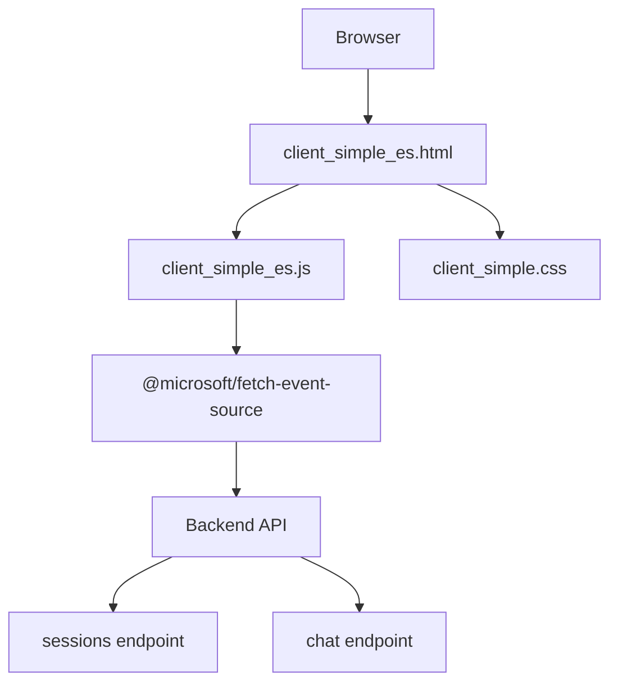
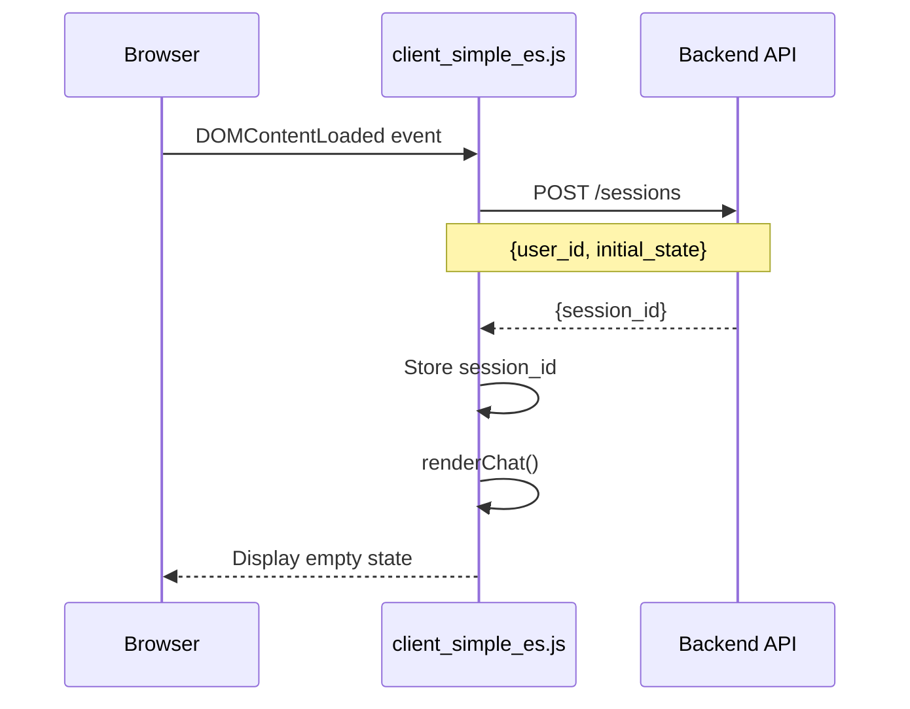
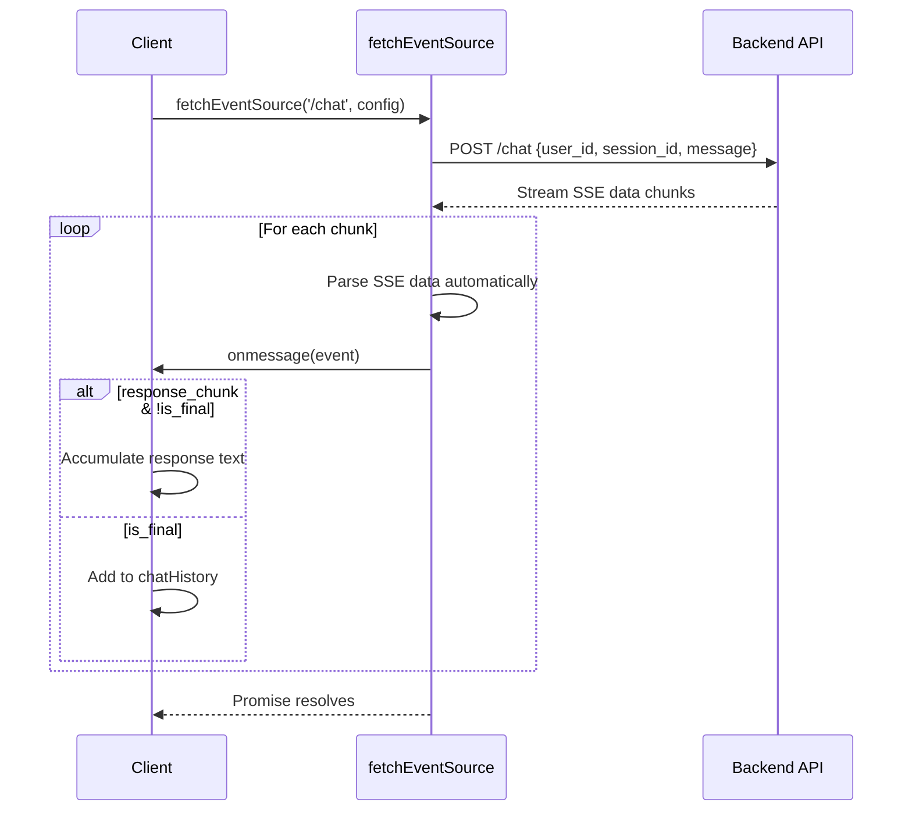
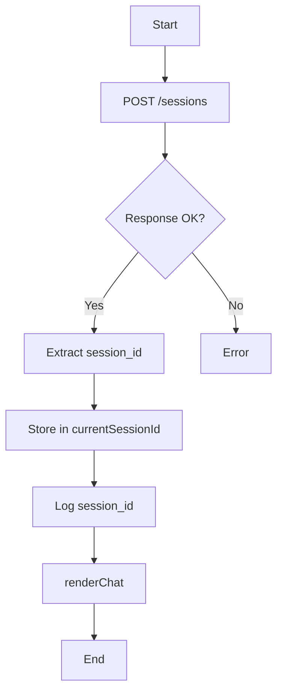
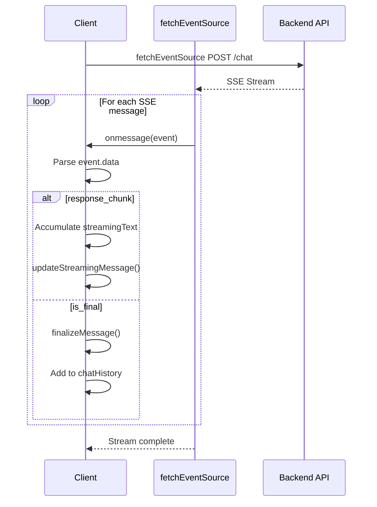

# Simple ADK Agent Client - EventSource Edition - Technical Documentation

## Overview

This is a minimal web client for interacting with an ADK (Agent Development Kit) agent via a streaming chat interface. It uses **@microsoft/fetch-event-source** for clean, robust SSE (Server-Sent Events) handling with POST request support.

## Architecture



## Application Flow

### 1. Initialization Flow



When the page loads:
1. The `DOMContentLoaded` event triggers `createSession()`
2. A POST request creates a new session with the backend
3. The returned `session_id` is stored globally
4. The chat UI is rendered (initially showing "No messages yet")

### 2. Message Send Flow



### 3. Key Functions

#### `createSession()`



**Purpose:** Establishes a session with the backend API.

**Key Operations:**
- Makes POST request to `/sessions` endpoint
- Includes `user_id` and `initial_state` in request body
- Stores returned `session_id` for subsequent API calls
- Uses `credentials: 'include'` for cookie-based auth

#### `sendMessage()`



**Purpose:** Sends user message to backend and processes streaming response.

**Backend Communication:**
1. Calls `fetchEventSource()` with:
   - `method: 'POST'`
   - Headers: `Content-Type: application/json`
   - Body: `{user_id, session_id, message}`
   - `credentials: 'include'` for auth

**Stream Processing:**
1. `fetchEventSource()` automatically:
   - Handles chunked transfer encoding
   - Parses SSE format (`data: ...`)
   - Manages buffering and line splitting
   - Provides clean `event` objects to callbacks

2. `onmessage(event)` callback:
   - Receives pre-parsed SSE events
   - `event.data` contains the JSON payload
   - No manual buffer management needed
   - Handles two chunk types:
     - `response_chunk`: Accumulates agent response text
     - `is_final`: Signals end of stream

3. `onerror(err)` callback:
   - Logs errors to console
   - Throws error to stop reconnection attempts
   - Library provides automatic retry logic (prevented by throw)

## Data Structures

### Global State

```javascript
const API_BASE_URL = 'http://localhost:8000';  // Backend endpoint
const USER_ID = 'web_user_001';                // Static user identifier

let currentSessionId = null;                    // Session UUID from backend
let chatHistory = [];                           // Array of {role, content}
```

### Chat History Format

```javascript
chatHistory = [
    { role: 'user', content: 'Hello!' },
    { role: 'agent', content: 'Hi there! How can I help?' },
    // ...
]
```

### SSE Message Format

```javascript
// Chunk during streaming
{
    type: 'response_chunk',
    text: 'partial response text',
    is_final: false
}

// Final message marker
{
    is_final: true,
    // ... other metadata
}
```

## Streaming Implementation Details

### SSE Protocol

The backend sends Server-Sent Events in this format:

```
data: {"type": "response_chunk", "text": "Hello", "is_final": false}

data: {"type": "response_chunk", "text": " world", "is_final": false}

data: {"is_final": true}

```

### Why @microsoft/fetch-event-source?

**Key advantages:**

1. **Automatic buffering** - Handles incomplete lines and message boundaries
2. **POST support** - Unlike native `EventSource`, supports POST requests with custom headers
3. **Retry logic** - Built-in reconnection handling with exponential backoff
4. **Error handling** - Sophisticated error detection and recovery
5. **Cleaner API** - Declarative callbacks for event handling
6. **Edge case handling** - Manages UTF-8 boundary splits, malformed messages

### Library Features

- **Automatic reconnection** with exponential backoff
- **Custom headers** and credentials support
- **Request/response interceptors** for debugging
- **Proper connection closing** via error throwing
- **TypeScript support** with full type definitions

## Usage

### 1. Start the Backend API Server

First, you need to start the lab application server:

```bash
# Change to the lab_app directory (adjust path to your ch5_demos location)
cd <path-to-ch5_demos>/lab_app

# Create environment file from example
cp .env.example .env

# Edit .env and populate the PROJECT_ID value
# (Use your editor to set PROJECT_ID to your GCP project ID)

# Create a virtual environment
python -m venv .venv

# Activate the virtual environment
# On macOS/Linux:
source .venv/bin/activate
# On Windows:
# .venv\Scripts\activate

# Install requirements
pip install -r requirements.txt

# Run the sessions server
python sessions_server.py
```

The backend API will start on `http://localhost:8000`.

### 2. Start the Client Server

In a **new terminal window**, start the static file server:

```bash
# Change to the simple_es client directory (adjust path to your ch5_demos location)
cd <path-to-ch5_demos>/clients/simple_es

# Serve static files
python -m http.server 8080
```

### 3. Access the Application

Open your browser and navigate to:
```
http://localhost:8080/client_simple_es.html
```

### Configuration

Update constants in `client_simple_es.js`:

```javascript
const API_BASE_URL = 'http://localhost:8000';  // Your backend URL
const USER_ID = 'web_user_001';                // Unique user identifier
```

## Dependencies

### Runtime Dependencies

- **@microsoft/fetch-event-source**: SSE client library with POST support
  - Loaded from CDN: `https://cdn.jsdelivr.net/npm/@microsoft/fetch-event-source@2.0.1/+esm`
  - Used in `sendMessage()` for streaming chat responses
  
- **marked.js**: Markdown parser for rendering agent responses
  - Loaded from CDN: `https://cdn.jsdelivr.net/npm/marked/marked.min.js`
  - Used in `renderChat()`, `updateStreamingMessage()`, and `finalizeMessage()`

### Module System

This client uses **ES modules** (`type="module"`):
- Enables `import` statements in the browser
- Provides proper scoping and dependency management
- Functions must be explicitly exposed via `window` object for HTML event handlers

## Error Handling

Enhanced error handling via `fetchEventSource`:

```javascript
onerror(err) {
    console.error('SSE error:', err);
    throw err; // Stops reconnection attempts
}
```

**Automatic features:**
- Connection timeout detection
- Network failure recovery
- HTTP error status handling
- Malformed SSE detection

**Production enhancements to add:**
- User-facing error messages
- Session expiry handling
- Graceful degradation for unsupported browsers
- Retry limits and backoff configuration

## Future Enhancements

1. **Custom retry logic** using `fetchEventSource` options
2. **Typing indicators** from backend
3. **Message editing/deletion**
4. **File upload support**
5. **Session persistence** and recovery
6. **Progressive enhancement** fallback for older browsers
7. **Request cancellation** using AbortController

## Performance Considerations

- **Memory efficiency**: No manual buffer accumulation
- **CPU efficiency**: Library-optimized parsing
- **Network efficiency**: Built-in connection pooling
- **Bundle size**: ~5KB for fetch-event-source (minified)

## Browser Compatibility

Requires modern browser with:
- ES6 modules support
- Fetch API
- TextDecoder API

Tested on:
- Chrome 90+
- Firefox 88+
- Safari 14+
- Edge 90+
