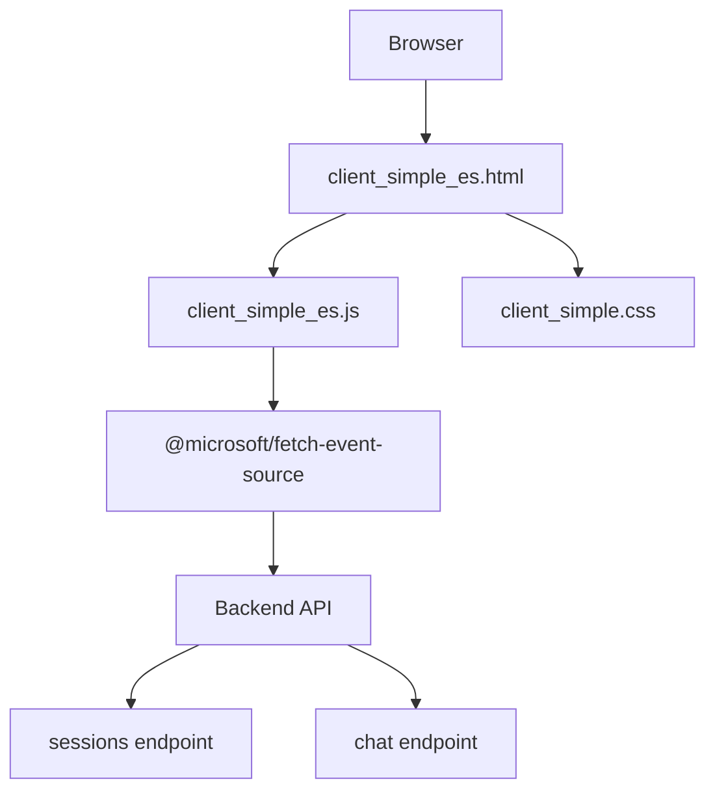
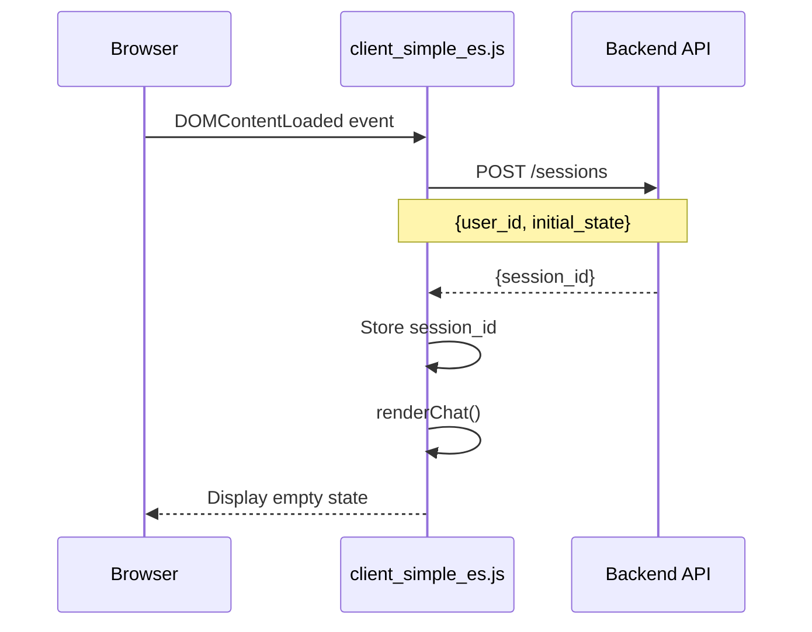
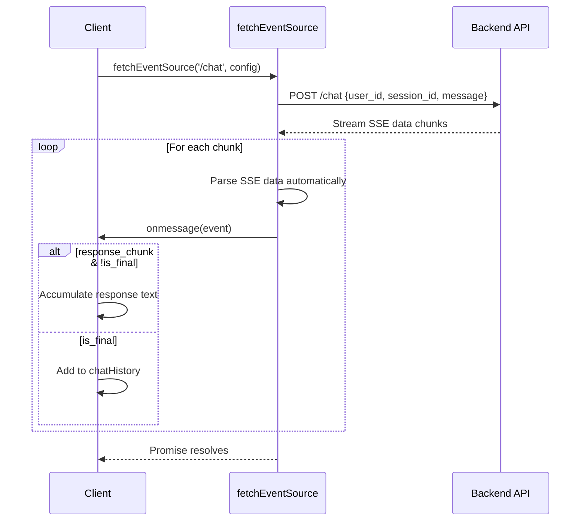
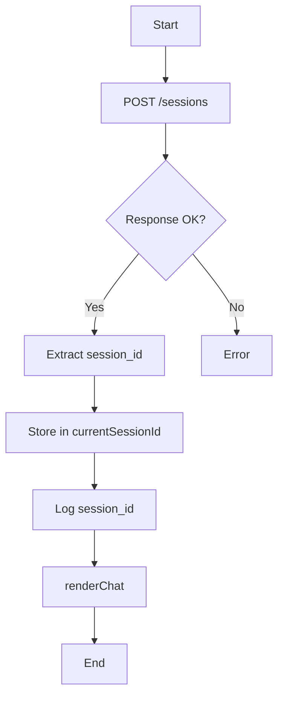
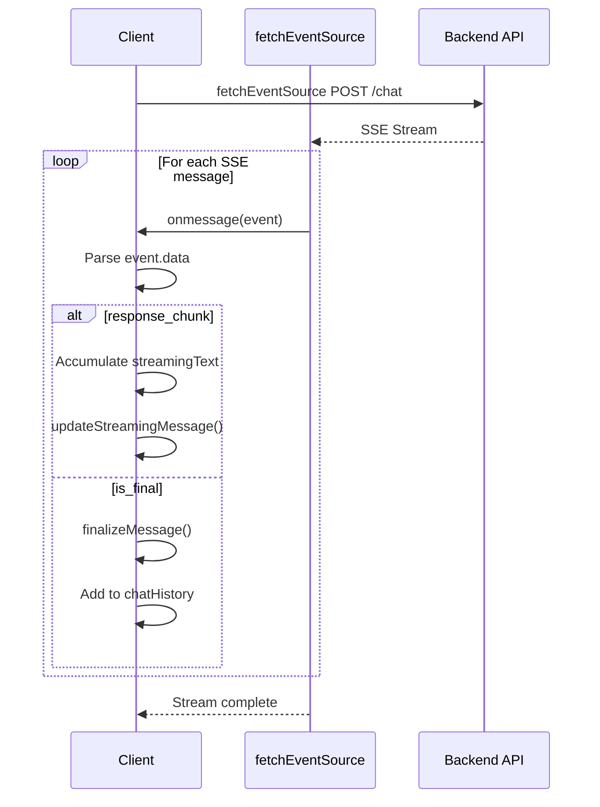

# Simple ADK Agent Client - EventSource Edition - Technical Documentation

## Table of Contents

- [Simple ADK Agent Client - EventSource Edition - Technical Documentation](#simple-adk-agent-client---eventsource-edition---technical-documentation)
  - [Table of Contents](#table-of-contents)
  - [1. Overview](#1-overview)
  - [2. Run Locally](#2-run-locally)
      - [2.1 Set up virtual environment](#21-set-up-virtual-environment)
      - [2.2 Create .env file](#22-create-env-file)
      - [2.3 Run the Backend API Server](#23-run-the-backend-api-server)
      - [2.4 Start the Client Server](#24-start-the-client-server)
      - [2.5 Access the Application](#25-access-the-application)
  - [3. Demo Walkthrough](#3-demo-walkthrough)
  - [4. Architecture](#4-architecture)
  - [5. Application Flow](#5-application-flow)
    - [5.1 Initialization Flow](#51-initialization-flow)
    - [5.2 Message Send Flow](#52-message-send-flow)
    - [5.3 Key Functions](#53-key-functions)
      - [5.3.1 `createSession()`](#531-createsession)
      - [5.3.2 `sendMessage()`](#532-sendmessage)
  - [6. Data Structures](#6-data-structures)
      - [6.1 Global State](#61-global-state)
      - [6.2 Chat History Format](#62-chat-history-format)
      - [6.3 SSE Message Format](#63-sse-message-format)
  - [7. Streaming Implementation Details](#7-streaming-implementation-details)
    - [7.1 SSE Protocol](#71-sse-protocol)
    - [7.2 Why @microsoft/fetch-event-source?](#72-why-microsoftfetch-event-source)
    - [7.3 Library Features](#73-library-features)
  - [8. Dependencies](#8-dependencies)
      - [8.1 Runtime Dependencies](#81-runtime-dependencies)
      - [8.2 Module System](#82-module-system)
  - [9. Error Handling](#9-error-handling)

## 1. Overview

This is a minimal web client for interacting with an ADK (Agent Development Kit) agent via a streaming chat interface. It uses **@microsoft/fetch-event-source** for clean, robust SSE (Server-Sent Events) handling with POST request support.

## 2. Run Locally

#### 2.1 Set up virtual environment

    ```bash
    cd ~/specialized-training-content/courses/build_production_ready_agents/ch5_demos/lab_app
    uv venv
    source .venv/bin/activate
    uv pip install -r requirements.txt
    ```

#### 2.2 Create .env file

    ```bash
    cp .env.example .env
    ```

    Edit `.env` and set `PROJECT_ID` to your GCP project ID.

#### 2.3 Run the Backend API Server

    ```bash
    python sessions_server.py
    ```

    The backend API will start on `http://localhost:8000`.

#### 2.4 Start the Client Server

    In a **new terminal window**, start the static file server:

    ```bash
    cd ~/specialized-training-content/courses/build_production_ready_agents/ch5_demos/clients/simple_es

    python -m http.server 8080
    ```

#### 2.5 Access the Application

    Open your browser and navigate to:
    ```
    http://localhost:8080/client_simple_es.html
    ```

## 3. Demo Walkthrough

When presenting this client to students, highlight the following:

1. **Session creation on page load** (`client_simple_es.js:10-12`) — the `DOMContentLoaded` listener calls `createSession()`, which POSTs to `/sessions` and stores the returned `session_id` for all subsequent requests. See also the [5.1 Initialization Flow](#51-initialization-flow) diagram.

2. **SSE streaming via `fetchEventSource`** (`client_simple_es.js:48-73`) — this is the core of the client. Walk through how it sends a POST to `/chat` and processes the SSE stream via `onmessage`. Contrast with the native `EventSource` API, which only supports GET requests. The [7.2 Why @microsoft/fetch-event-source?](#72-why-microsoftfetch-event-source) section provides talking points for this comparison.

3. **Chunk accumulation pattern** (`client_simple_es.js:58-66`) — show how `response_chunk` events are accumulated into `streamingText` and rendered incrementally, while `is_final` signals the end of the stream. The [7.1 SSE Protocol](#71-sse-protocol) section shows the raw wire format, and the [5.2 Message Send Flow](#52-message-send-flow) diagram visualizes the full sequence.

4. **No authentication** — point out that this client has no login flow or token management. Compare with the `fastapi_app_auth` demo to show what changes when auth is added.

5. **Live demo** — send a message and have students watch the response stream in token by token. Open the browser DevTools Network tab to show the SSE event stream in real time.

## 4. Architecture



## 5. Application Flow

### 5.1 Initialization Flow



When the page loads:
1. The `DOMContentLoaded` event triggers `createSession()`
2. A POST request creates a new session with the backend
3. The returned `session_id` is stored globally
4. The chat UI is rendered (initially showing "No messages yet")

### 5.2 Message Send Flow



### 5.3 Key Functions

#### 5.3.1 `createSession()`



**Purpose:** Establishes a session with the backend API.

**Key Operations:**
- Makes POST request to `/sessions` endpoint
- Includes `user_id` and `initial_state` in request body
- Stores returned `session_id` for subsequent API calls
- Uses `credentials: 'include'` for cookie-based auth

#### 5.3.2 `sendMessage()`



**Purpose:** Sends user message to backend and processes streaming response.

**Backend Communication:**
1. Calls `fetchEventSource()` with:
   - `method: 'POST'`
   - Headers: `Content-Type: application/json`
   - Body: `{user_id, session_id, message}`
   - `credentials: 'include'` for auth

**Stream Processing:**
1. `fetchEventSource()` automatically:
   - Handles chunked transfer encoding
   - Parses SSE format (`data: ...`)
   - Manages buffering and line splitting
   - Provides clean `event` objects to callbacks

2. `onmessage(event)` callback:
   - Receives pre-parsed SSE events
   - `event.data` contains the JSON payload
   - No manual buffer management needed
   - Handles two chunk types:
     - `response_chunk`: Accumulates agent response text
     - `is_final`: Signals end of stream

3. `onerror(err)` callback:
   - Logs errors to console
   - Throws error to stop reconnection attempts
   - Library provides automatic retry logic (prevented by throw)

## 6. Data Structures

#### 6.1 Global State

```javascript
const API_BASE_URL = 'http://localhost:8000';  // Backend endpoint
const USER_ID = 'web_user_001';                // Static user identifier

let currentSessionId = null;                    // Session UUID from backend
let chatHistory = [];                           // Array of {role, content}
```

#### 6.2 Chat History Format

```javascript
chatHistory = [
    { role: 'user', content: 'Hello!' },
    { role: 'agent', content: 'Hi there! How can I help?' },
    // ...
]
```

#### 6.3 SSE Message Format

```javascript
// Chunk during streaming
{
    type: 'response_chunk',
    text: 'partial response text',
    is_final: false
}

// Final message marker
{
    is_final: true,
    // ... other metadata
}
```

## 7. Streaming Implementation Details

### 7.1 SSE Protocol

The backend sends Server-Sent Events in this format:

```
data: {"type": "response_chunk", "text": "Hello", "is_final": false}

data: {"type": "response_chunk", "text": " world", "is_final": false}

data: {"is_final": true}

```

### 7.2 Why @microsoft/fetch-event-source?

**Key advantages:**

1. **Automatic buffering** - Handles incomplete lines and message boundaries
2. **POST support** - Unlike native `EventSource`, supports POST requests with custom headers
3. **Retry logic** - Built-in reconnection handling with exponential backoff
4. **Error handling** - Sophisticated error detection and recovery
5. **Cleaner API** - Declarative callbacks for event handling
6. **Edge case handling** - Manages UTF-8 boundary splits, malformed messages

### 7.3 Library Features

- **Automatic reconnection** with exponential backoff
- **Custom headers** and credentials support
- **Request/response interceptors** for debugging
- **Proper connection closing** via error throwing
- **TypeScript support** with full type definitions

## 8. Dependencies

#### 8.1 Runtime Dependencies

- **@microsoft/fetch-event-source**: SSE client library with POST support
  - Loaded from CDN: `https://cdn.jsdelivr.net/npm/@microsoft/fetch-event-source@2.0.1/+esm`
  - Used in `sendMessage()` for streaming chat responses

- **marked.js**: Markdown parser for rendering agent responses
  - Loaded from CDN: `https://cdn.jsdelivr.net/npm/marked/marked.min.js`
  - Used in `renderChat()`, `updateStreamingMessage()`, and `finalizeMessage()`

#### 8.2 Module System

This client uses **ES modules** (`type="module"`):
- Enables `import` statements in the browser
- Provides proper scoping and dependency management
- Functions must be explicitly exposed via `window` object for HTML event handlers

## 9. Error Handling

Enhanced error handling via `fetchEventSource`:

```javascript
onerror(err) {
    console.error('SSE error:', err);
    throw err; // Stops reconnection attempts
}
```
