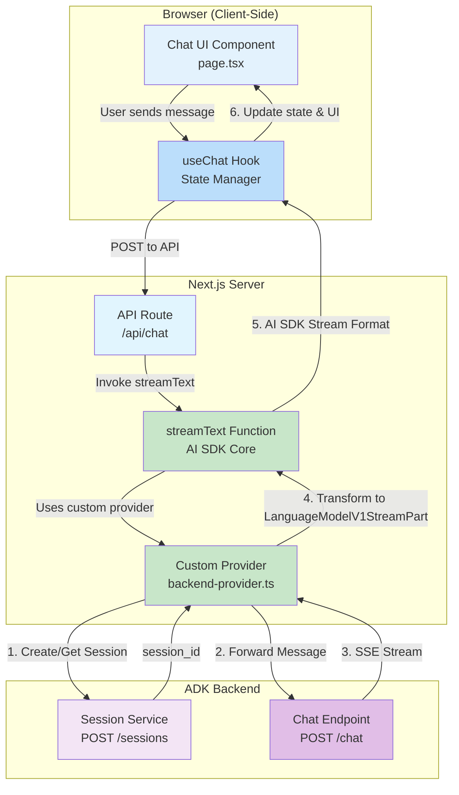

# ADK Agent Client - Vercel AI SDK with Custom Provider

A production-ready chat client for Google ADK (Agent Development Kit) agents, built with the [Vercel AI SDK](https://sdk.vercel.ai). This implementation demonstrates a **custom Language Model Provider** that integrates ADK backends with the full AI SDK ecosystem, enabling advanced features like tool calling, structured output, and comprehensive type safety.

## Features

- 🎯 **`useChat` Hook** - Single React hook managing all chat state, streaming, and UI updates
- 🔌 **Custom Provider Implementation** - Full `LanguageModelV1` interface integration
- 📡 **Native Streaming** - Built-in streaming support via AI SDK's `streamText()`
- 🔄 **Automatic State Management** - Messages, loading states, and input handled automatically
- 💾 **Session Integration** - Connects to ADK backend session management
- 🧪 **Highly Testable** - Provider logic isolated and independently testable
- ♻️ **Reusable** - Provider can be shared across multiple routes and applications
- 🔧 **AI SDK Features** - Full support for tool calling, structured output, token tracking
- 🎨 **Type Safe** - Comprehensive TypeScript support throughout the stack
- ⚛️ **React-First Design** - Declarative UI patterns with automatic re-rendering
- 🚀 **Production Ready** - Robust architecture following AI SDK best practices

## Architecture Overview

This implementation uses a **custom provider architecture** where a `LanguageModelV1` implementation wraps the ADK backend. The provider handles stream transformation and session management, while `streamText()` orchestrates the streaming response through the AI SDK's standard pipeline.



## Implementation Details

### 1. Client Component (`page.tsx`)

The chat interface is identical to the simple implementation, built around the `useChat` hook:

```typescript
import { useChat } from '@ai-sdk/react';  // Modular AI SDK v6 import

const { messages, input, handleInputChange, handleSubmit, isLoading } = useChat({
  api: '/api/chat',
  body: { user_id: USER_ID },
});
```

**What the SDK provides automatically:**
- `messages`: Array of message objects with unique IDs, roles, and content
- `input`: Current input field value with two-way binding
- `handleInputChange`: Input change handler
- `handleSubmit`: Form submission handler that sends messages
- `isLoading`: Boolean indicating streaming state

**Frontend benefits:**
- Zero changes required to switch between simple and provider implementations
- Identical developer experience
- Same React patterns and UI code

### 2. Custom Provider (`/src/lib/backend-provider.ts`)

**This is the core innovation** - a reusable provider that implements the AI SDK's `LanguageModelV1` interface:

```typescript
import type { LanguageModelV1, LanguageModelV1StreamPart } from 'ai';

export function createBackendProvider(config: {
  userId: string;
  sessionId?: string;
}): LanguageModelV1 {
  return {
    specificationVersion: 'v2',
    provider: 'custom-backend',
    modelId: 'adk-agent',
    
    async doStream(options) {
      const { prompt } = options;
      
      // Transform AI SDK prompt to ADK message format
      const messageText = extractUserMessage(prompt);
      
      // Session management
      const sessionId = await ensureSession(config.userId);
      
      // Call ADK backend
      const response = await fetch(`${API_BASE_URL}/chat`, {
        method: 'POST',
        headers: { 'Content-Type': 'application/json' },
        body: JSON.stringify({
          user_id: config.userId,
          session_id: sessionId,
          message: messageText
        })
      });
      
      // Transform SSE stream to typed AI SDK stream parts
      const stream = new ReadableStream<LanguageModelV1StreamPart>({
        async start(controller) {
          // Parse SSE and emit typed stream parts
          for (const chunk of parseSSE(response.body)) {
            if (chunk.type === 'response_chunk') {
              controller.enqueue({
                type: 'text-delta',
                textDelta: chunk.text
              });
            }
            
            if (chunk.is_final) {
              controller.enqueue({
                type: 'finish',
                finishReason: 'stop',
                usage: { promptTokens: 0, completionTokens: 0 }
              });
            }
          }
        }
      });
      
      return { stream, rawCall: { rawPrompt: prompt, rawSettings: {} } };
    }
  };
}
```

**Provider Benefits:**
- **Type Safety**: Returns strongly-typed `LanguageModelV1StreamPart` objects
- **Reusability**: Can be imported and used across multiple API routes
- **Testability**: Provider logic can be tested independently of API routes
- **Encapsulation**: All ADK backend interaction logic in one place
- **Future-Proof**: Standard interface that works with AI SDK ecosystem

**Supported Stream Part Types:**
- `text-delta`: Incremental text chunks
- `finish`: Completion event with finish reason and token usage
- `error`: Error handling (can be added)
- Ready for: `tool-call`, `tool-result` for future tool support

### 3. API Route (`/api/chat/route.ts`)

The API route uses the AI SDK's `streamText()` function with the custom provider:

```typescript
import { streamText } from 'ai';
import { createBackendProvider } from '@/lib/backend-provider';

export const runtime = 'edge';  // Edge runtime for optimal streaming

export async function POST(req: Request) {
  const { messages, user_id } = await req.json();
  
  // Create custom provider instance
  const provider = createBackendProvider({
    userId: user_id || 'web_user_001'
  });
  
  // Use AI SDK's streamText with custom provider
  const result = streamText({
    model: provider,
    messages: messages,
  });
  
  // Return AI SDK formatted stream response
  return result.toDataStreamResponse();
}
```

**Key Advantages:**
- Clean, minimal API route code
- Full access to `streamText()` options (temperature, max tokens, etc.)
- Standard AI SDK response format
- Can add tool calling with minimal changes:
  ```typescript
  const result = streamText({
    model: provider,
    messages: messages,
    tools: {
      // Define tools here
    }
  });
  ```

### 4. How Streaming Works

**Flow with Provider:**
1. User types message and clicks send
2. `useChat` calls API route with messages array
3. API route invokes `streamText()` with custom provider
4. `streamText()` calls provider's `doStream()` method
5. Provider creates/retrieves ADK session
6. Provider forwards message to ADK backend
7. ADK streams SSE events with text chunks
8. Provider transforms each SSE event to typed `LanguageModelV1StreamPart`
9. `streamText()` processes stream parts through AI SDK pipeline
10. `toDataStreamResponse()` formats for `useChat` consumption
11. `useChat` hook appends each chunk to the current message
12. React automatically re-renders with updated content

**Advantages over manual transformation:**
- Type-safe stream parts prevent runtime errors
- Provider can be unit tested independently
- Standard interface enables AI SDK features
- Separation of concerns (provider vs route)

## Advanced Features Enabled

Because this implementation uses a proper `LanguageModelV1` provider, you can leverage:

### Tool Calling
```typescript
const result = streamText({
  model: provider,
  messages: messages,
  tools: {
    getWeather: {
      description: 'Get current weather',
      parameters: z.object({
        location: z.string()
      }),
      execute: async ({ location }) => {
        // Tool implementation
      }
    }
  }
});
```

### Structured Output
```typescript
const result = streamObject({
  model: provider,
  schema: z.object({
    name: z.string(),
    age: z.number()
  })
});
```

### Token Usage Tracking
The provider's `finish` event includes token counts that can be logged or displayed.

### Multi-Modal Support
Provider can be extended to support image inputs via the `LanguageModelV1` interface.

## Project Structure

```
src/
├── app/
│   ├── api/
│   │   └── chat/
│   │       └── route.ts          # AI SDK streamText integration
│   ├── layout.tsx                # Root layout
│   ├── page.tsx                  # Chat UI with useChat hook
│   └── globals.css               # Minimal global styles
├── lib/
│   └── backend-provider.ts       # Custom LanguageModelV1 provider
├── package.json                  # AI SDK v6 + @ai-sdk/react
├── tsconfig.json
└── next.config.ts
```

## When to Use This Implementation

Choose this **custom provider approach** when:

✅ Building a **production application**  
✅ You need **tool calling** or **structured output**  
✅ You want to **leverage AI SDK ecosystem**  
✅ Multiple routes will use the same backend  
✅ You need **type safety** across the stack  
✅ You plan to **swap backends** in the future  
✅ Team values **standard patterns** and **best practices**  
✅ You want **future-proof** architecture  

Use the simpler proxy approach (`vercel-ai-simple`) for:
- Quick prototypes or MVPs
- Learning the basics
- Simple proxy requirements without advanced features

## Dependencies

```json
{
  "@ai-sdk/react": "^1.0.0",  // Modular React bindings
  "ai": "^6.0.0",             // Latest AI SDK with full features
  "react": "^19.0.0",
  "react-dom": "^19.0.0",
  "react-markdown": "^10.1.0"
}
```

**vs. simple implementation:**
- Uses AI SDK v6 (vs v4)
- Includes `@ai-sdk/react` modular package
- Enables full provider ecosystem

## Demoing

1. **Ensure backend is running:** Open a terminal window and...

   ```bash
   # Change to the lab_app directory (adjust path to your ch5_demos location)
   cd <path-to-ch5_demos>/lab_app

   # Create environment file from example
   cp .env.example .env

   # Edit .env and populate the PROJECT_ID value
   # (Use your editor to set PROJECT_ID to your GCP project ID)

   # Create a virtual environment
   python -m venv .venv

   # Activate the virtual environment
   # On macOS/Linux:
   source .venv/bin/activate
   # On Windows:
   # .venv\Scripts\activate

   # Install requirements
   pip install -r requirements.txt

   # Run the sessions server
   python sessions_server.py
   ```

   The backend API will start on `http://localhost:8000`.

2. Get the client running. Create a second terminal window and

   ```bash
   cd <path-to-ch5_demos>/clients/vercel-ai-provider
   npm install
   npm run dev
   ```

3. Open [http://localhost:3003](http://localhost:3003) in your browser

4. Demo the app running
