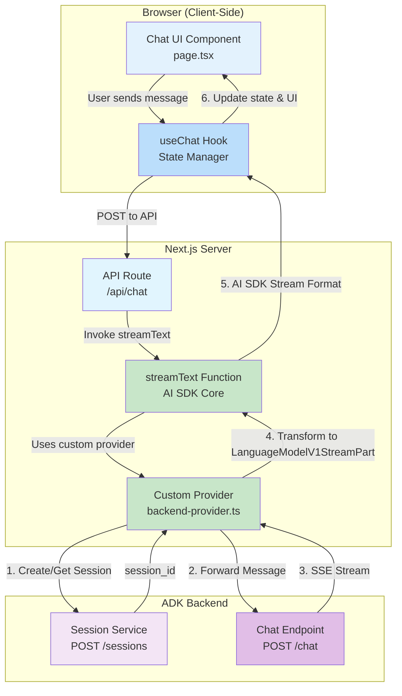

# ADK Agent Client - Vercel AI SDK with Custom Provider

A production-ready chat client for Google ADK (Agent Development Kit) agents, built with the [Vercel AI SDK](https://sdk.vercel.ai). This implementation demonstrates a **custom Language Model Provider** that integrates ADK backends with the full AI SDK ecosystem, enabling advanced features like tool calling, structured output, and comprehensive type safety.

## Table of Contents

- [1. Run Locally](#1-run-locally)
- [2. Demo Walkthrough](#2-demo-walkthrough)
- [3. Features](#3-features)
- [4. Architecture Overview](#4-architecture-overview)
- [5. Implementation Details](#5-implementation-details)
  - [5.1 Client Component](#51-client-component)
  - [5.2 Custom Provider](#52-custom-provider)
  - [5.3 API Route](#53-api-route)
  - [5.4 How Streaming Works](#54-how-streaming-works)
- [6. Advanced Features Enabled](#6-advanced-features-enabled)
  - [6.1 Tool Calling](#61-tool-calling)
  - [6.2 Structured Output](#62-structured-output)
  - [6.3 Token Usage Tracking](#63-token-usage-tracking)
  - [6.4 Multi-Modal Support](#64-multi-modal-support)
- [7. Project Structure](#7-project-structure)
- [8. When to Use This Implementation](#8-when-to-use-this-implementation)
- [9. Dependencies](#9-dependencies)

## 1. Run Locally

1. Set up the backend virtual environment:

    ```bash
    cd ~/specialized-training-content/courses/build_production_ready_agents/ch5_demos/lab_app
    uv venv
    source .venv/bin/activate
    uv pip install -r requirements.txt
    ```

2. Create a **.env** file:

    ```bash
    cp .env.example .env
    ```

3. Edit `.env` and set `PROJECT_ID` to your GCP project ID.

4. Launch the backend server:

    ```bash
    python sessions_server.py
    ```

    The backend API will start on `http://localhost:8000`.

5. In a **new terminal window**, install and start the client:

    ```bash
    cd ~/specialized-training-content/courses/build_production_ready_agents/ch5_demos/clients/vercel-ai-provider
    npm install
    npm run dev
    ```

6. Open [http://localhost:3003](http://localhost:3003) in your browser.

## 2. Demo Walkthrough

When presenting this client to students, highlight the following:

1. **Custom provider pattern** (`backend-provider.ts`) — this is the core innovation. Show how `createBackendProvider()` returns a `LanguageModelV1` object with a `doStream()` method that bridges the ADK SSE stream to typed AI SDK stream parts. See [5.2 Custom Provider](#52-custom-provider) for the full breakdown.

2. **Contrast with the simple Vercel AI client** (`vercel-ai-simple`) — both use `useChat` on the frontend, but the simple version does manual stream transformation in the API route. This version encapsulates all backend logic in a reusable provider, making the API route minimal. The [5.3 API Route](#53-api-route) section shows just how clean it becomes.

3. **The `useChat` hook** (`page.tsx`) — identical to the simple implementation. Point out that the frontend code doesn't change at all when switching from a simple proxy to a custom provider. This demonstrates the power of the AI SDK's abstraction layers.

4. **Stream transformation pipeline** — walk through the [5.4 How Streaming Works](#54-how-streaming-works) flow end to end: SSE events from ADK become typed `LanguageModelV1StreamPart` objects, which `streamText()` processes through the AI SDK pipeline, which `useChat` renders automatically.

5. **Advanced capabilities** — show the [6. Advanced Features Enabled](#6-advanced-features-enabled) section to explain what the provider pattern unlocks: tool calling, structured output, token tracking. These aren't available with the simple proxy approach.

6. **Live demo** — send a message and show the streaming response. Compare the DevTools Network tab output with the simple_es client to show how the AI SDK formats the stream differently.

## 3. Features

- **`useChat` Hook** - Single React hook managing all chat state, streaming, and UI updates
- **Custom Provider Implementation** - Full `LanguageModelV1` interface integration
- **Native Streaming** - Built-in streaming support via AI SDK's `streamText()`
- **Automatic State Management** - Messages, loading states, and input handled automatically
- **Session Integration** - Connects to ADK backend session management
- **Highly Testable** - Provider logic isolated and independently testable
- **Reusable** - Provider can be shared across multiple routes and applications
- **AI SDK Features** - Full support for tool calling, structured output, token tracking
- **Type Safe** - Comprehensive TypeScript support throughout the stack
- **React-First Design** - Declarative UI patterns with automatic re-rendering
- **Production Ready** - Robust architecture following AI SDK best practices

## 4. Architecture Overview

This implementation uses a **custom provider architecture** where a `LanguageModelV1` implementation wraps the ADK backend. The provider handles stream transformation and session management, while `streamText()` orchestrates the streaming response through the AI SDK's standard pipeline.



## 5. Implementation Details

### 5.1 Client Component

The chat interface (`page.tsx`) is built around the `useChat` hook:

```typescript
import { useChat } from '@ai-sdk/react';  // Modular AI SDK v6 import

const { messages, input, handleInputChange, handleSubmit, isLoading } = useChat({
  api: '/api/chat',
  body: { user_id: USER_ID },
});
```

**What the SDK provides automatically:**
- `messages`: Array of message objects with unique IDs, roles, and content
- `input`: Current input field value with two-way binding
- `handleInputChange`: Input change handler
- `handleSubmit`: Form submission handler that sends messages
- `isLoading`: Boolean indicating streaming state

**Frontend benefits:**
- Zero changes required to switch between simple and provider implementations
- Identical developer experience
- Same React patterns and UI code

### 5.2 Custom Provider

**This is the core innovation** - a reusable provider (`/src/lib/backend-provider.ts`) that implements the AI SDK's `LanguageModelV1` interface:

```typescript
import type { LanguageModelV1, LanguageModelV1StreamPart } from 'ai';

export function createBackendProvider(config: {
  userId: string;
  sessionId?: string;
}): LanguageModelV1 {
  return {
    specificationVersion: 'v2',
    provider: 'custom-backend',
    modelId: 'adk-agent',

    async doStream(options) {
      const { prompt } = options;

      // Transform AI SDK prompt to ADK message format
      const messageText = extractUserMessage(prompt);

      // Session management
      const sessionId = await ensureSession(config.userId);

      // Call ADK backend
      const response = await fetch(`${API_BASE_URL}/chat`, {
        method: 'POST',
        headers: { 'Content-Type': 'application/json' },
        body: JSON.stringify({
          user_id: config.userId,
          session_id: sessionId,
          message: messageText
        })
      });

      // Transform SSE stream to typed AI SDK stream parts
      const stream = new ReadableStream<LanguageModelV1StreamPart>({
        async start(controller) {
          // Parse SSE and emit typed stream parts
          for (const chunk of parseSSE(response.body)) {
            if (chunk.type === 'response_chunk') {
              controller.enqueue({
                type: 'text-delta',
                textDelta: chunk.text
              });
            }

            if (chunk.is_final) {
              controller.enqueue({
                type: 'finish',
                finishReason: 'stop',
                usage: { promptTokens: 0, completionTokens: 0 }
              });
            }
          }
        }
      });

      return { stream, rawCall: { rawPrompt: prompt, rawSettings: {} } };
    }
  };
}
```

**Provider Benefits:**
- **Type Safety**: Returns strongly-typed `LanguageModelV1StreamPart` objects
- **Reusability**: Can be imported and used across multiple API routes
- **Testability**: Provider logic can be tested independently of API routes
- **Encapsulation**: All ADK backend interaction logic in one place
- **Future-Proof**: Standard interface that works with AI SDK ecosystem

**Supported Stream Part Types:**
- `text-delta`: Incremental text chunks
- `finish`: Completion event with finish reason and token usage
- `error`: Error handling (can be added)
- Ready for: `tool-call`, `tool-result` for future tool support

### 5.3 API Route

The API route (`/api/chat/route.ts`) uses the AI SDK's `streamText()` function with the custom provider:

```typescript
import { streamText } from 'ai';
import { createBackendProvider } from '@/lib/backend-provider';

export const runtime = 'edge';  // Edge runtime for optimal streaming

export async function POST(req: Request) {
  const { messages, user_id } = await req.json();

  // Create custom provider instance
  const provider = createBackendProvider({
    userId: user_id || 'web_user_001'
  });

  // Use AI SDK's streamText with custom provider
  const result = streamText({
    model: provider,
    messages: messages,
  });

  // Return AI SDK formatted stream response
  return result.toDataStreamResponse();
}
```

**Key Advantages:**
- Clean, minimal API route code
- Full access to `streamText()` options (temperature, max tokens, etc.)
- Standard AI SDK response format
- Can add tool calling with minimal changes:
  ```typescript
  const result = streamText({
    model: provider,
    messages: messages,
    tools: {
      // Define tools here
    }
  });
  ```

### 5.4 How Streaming Works

**Flow with Provider:**
1. User types message and clicks send
2. `useChat` calls API route with messages array
3. API route invokes `streamText()` with custom provider
4. `streamText()` calls provider's `doStream()` method
5. Provider creates/retrieves ADK session
6. Provider forwards message to ADK backend
7. ADK streams SSE events with text chunks
8. Provider transforms each SSE event to typed `LanguageModelV1StreamPart`
9. `streamText()` processes stream parts through AI SDK pipeline
10. `toDataStreamResponse()` formats for `useChat` consumption
11. `useChat` hook appends each chunk to the current message
12. React automatically re-renders with updated content

**Advantages over manual transformation:**
- Type-safe stream parts prevent runtime errors
- Provider can be unit tested independently
- Standard interface enables AI SDK features
- Separation of concerns (provider vs route)

## 6. Advanced Features Enabled

Because this implementation uses a proper `LanguageModelV1` provider, you can leverage:

### 6.1 Tool Calling

```typescript
const result = streamText({
  model: provider,
  messages: messages,
  tools: {
    getWeather: {
      description: 'Get current weather',
      parameters: z.object({
        location: z.string()
      }),
      execute: async ({ location }) => {
        // Tool implementation
      }
    }
  }
});
```

### 6.2 Structured Output

```typescript
const result = streamObject({
  model: provider,
  schema: z.object({
    name: z.string(),
    age: z.number()
  })
});
```

### 6.3 Token Usage Tracking

The provider's `finish` event includes token counts that can be logged or displayed.

### 6.4 Multi-Modal Support

Provider can be extended to support image inputs via the `LanguageModelV1` interface.

## 7. Project Structure

```
src/
├── app/
│   ├── api/
│   │   └── chat/
│   │       └── route.ts          # AI SDK streamText integration
│   ├── layout.tsx                # Root layout
│   ├── page.tsx                  # Chat UI with useChat hook
│   └── globals.css               # Minimal global styles
├── lib/
│   └── backend-provider.ts       # Custom LanguageModelV1 provider
├── package.json                  # AI SDK v6 + @ai-sdk/react
├── tsconfig.json
└── next.config.ts
```

## 8. When to Use This Implementation

Choose this **custom provider approach** when:

- Building a **production application**
- You need **tool calling** or **structured output**
- You want to **leverage the AI SDK ecosystem**
- Multiple routes will use the same backend
- You need **type safety** across the stack
- You plan to **swap backends** in the future
- Team values **standard patterns** and **best practices**

Use the simpler proxy approach (`vercel-ai-simple`) for:
- Quick prototypes or MVPs
- Learning the basics
- Simple proxy requirements without advanced features

## 9. Dependencies

```json
{
  "@ai-sdk/react": "^1.0.0",  // Modular React bindings
  "ai": "^6.0.0",             // Latest AI SDK with full features
  "react": "^19.0.0",
  "react-dom": "^19.0.0",
  "react-markdown": "^10.1.0"
}
```

**vs. simple implementation:**
- Uses AI SDK v6 (vs v4)
- Includes `@ai-sdk/react` modular package
- Enables full provider ecosystem
