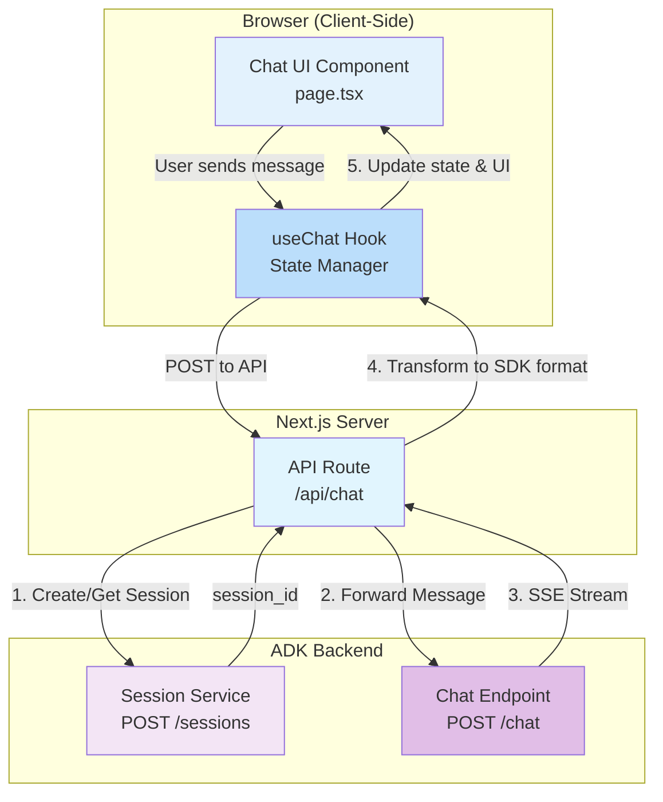

# ADK Agent Client - Vercel AI SDK

A minimal chat client for Google ADK (Agent Development Kit) agents, built with the [Vercel AI SDK](https://sdk.vercel.ai). This implementation showcases the AI SDK's opinionated, hook-based approach to building streaming chat interfaces with minimal boilerplate.

## Features

- 🎯 **`useChat` Hook** - Single React hook managing all chat state, streaming, and UI updates
- 📡 **Native Streaming** - Built-in streaming support via `StreamingTextResponse`
- 🔄 **Automatic State Management** - Messages, loading states, and input handled automatically
- 💾 **Session Integration** - Connects to ADK backend session management
- ⚛️ **React-First Design** - Declarative UI patterns with automatic re-rendering
- 🚀 **Minimal Boilerplate** - SDK abstracts complexity, focusing on application logic

## Architecture Overview

The Vercel AI SDK provides a **hook-based architecture** where `useChat` handles all state management and streaming logic. The API route adapts the ADK backend's SSE format to the SDK's expected streaming format.



## Implementation Details

### 1. Client Component (`page.tsx`)

The entire chat interface is built around the `useChat` hook:

```typescript
const { messages, input, handleInputChange, handleSubmit, isLoading } = useChat({
  api: '/api/chat',
  body: { user_id: USER_ID },
});
```

**What the SDK provides automatically:**
- `messages`: Array of message objects with unique IDs, roles, and content
- `input`: Current input field value with two-way binding
- `handleInputChange`: Input change handler
- `handleSubmit`: Form submission handler that sends messages
- `isLoading`: Boolean indicating streaming state

**What you implement:**
- Rendering the messages (mapping over `messages` array)
- Styling the chat interface
- Connecting the form to `handleSubmit`
- Auto-scroll behavior

### 2. API Route (`/api/chat/route.ts`)

The API route bridges the Vercel AI SDK with the ADK backend:

**Session Management:**
- Creates a session on first request via `POST /sessions`
- Stores `session_id` in module scope (in-memory for this simple demo)
- Could be enhanced with proper session storage or cookies

**Request Handling:**
- Receives messages array from `useChat` hook
- Extracts the latest user message
- Forwards to ADK backend with session context

**Stream Transformation:**
- Reads ADK's SSE stream (`data: {...}` format)
- Parses JSON payloads to extract `response_chunk` events
- Transforms text chunks to SDK-compatible format
- Uses `StreamingTextResponse` to stream back to client
- The SDK's `useChat` hook automatically appends chunks to UI

**Key Code:**
```typescript
const transformStream = new TransformStream({
  async transform(chunk, controller) {
    // Parse SSE format: "data: {...}"
    const data = JSON.parse(line.substring(6));
    
    if (data.type === 'response_chunk' && !data.is_final) {
      // Stream text chunks to SDK
      controller.enqueue(new TextEncoder().encode(data.text));
    }
  },
});

return new StreamingTextResponse(stream);
```

### 3. How Streaming Works

**Flow:**
1. User types message and clicks send
2. `useChat` calls API route with messages array
3. API route forwards to ADK backend
4. ADK streams SSE events with text chunks
5. Transform stream extracts text from SSE format
6. `StreamingTextResponse` sends chunks to client
7. `useChat` hook appends each chunk to the current message
8. React automatically re-renders with updated content

**Advantages:**
- No manual state management required
- Automatic message deduplication by ID
- Built-in error handling
- Optimistic UI updates

## Project Structure

```
src/
├── app/
│   ├── api/
│   │   └── chat/
│   │       └── route.ts          # Stream adapter for ADK backend
│   ├── layout.tsx                # Root layout
│   ├── page.tsx                  # Chat UI with useChat hook
│   └── globals.css               # Minimal global styles
├── package.json
├── tsconfig.json
└── next.config.ts
```

## Demoing

1. **Ensure backend is running:** Open a terminal window and...

   ```bash
   # Change to the lab_app directory (adjust path to your ch5_demos location)
   cd <path-to-ch5_demos>/lab_app

   # Create environment file from example
   cp .env.example .env

   # Edit .env and populate the PROJECT_ID value
   # (Use your editor to set PROJECT_ID to your GCP project ID)

   # Create a virtual environment
   python -m venv .venv

   # Activate the virtual environment
   # On macOS/Linux:
   source .venv/bin/activate
   # On Windows:
   # .venv\Scripts\activate

   # Install requirements
   pip install -r requirements.txt

   # Run the sessions server
   python sessions_server.py
   ```

   The backend API will start on `http://localhost:8000`.

2. Get the client running. Create a second terminal window and

   ```bash
   cd <path-to-ch5_demos>/clients/vercel-ai-simple
   npm install
   npm run dev
   ```

```bash
npm install 
```

3. Open [http://localhost:3001](http://localhost:3002) in your browser

4. Demo the app running
