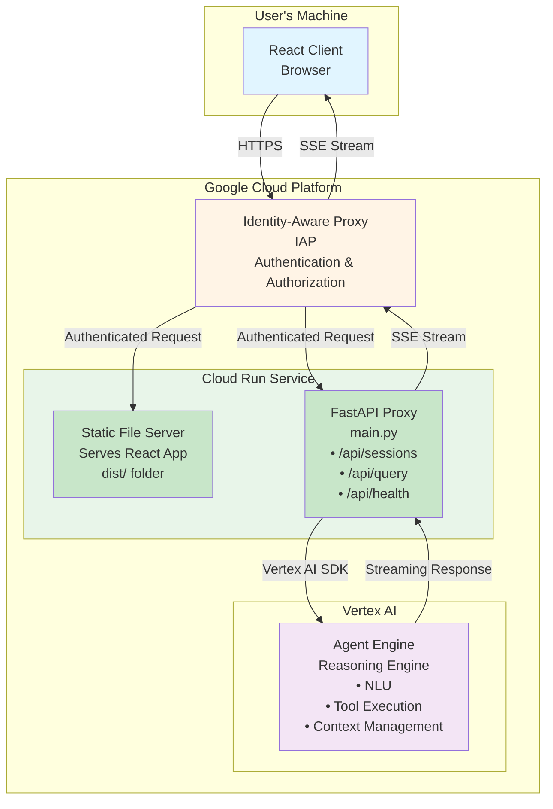

# Vertex AI Agent Proxy - Cloud Run Service

A production-ready solution for deploying Vertex AI agents with a React frontend, FastAPI proxy, and Identity-Aware Proxy (IAP) authentication.

## Architecture

This application uses a three-tier architecture with secure access controls:



### Key Components

1. **React Client (Browser)**: User interface running in the browser on the user's machine, handles chat interactions and displays streaming responses
2. **Identity-Aware Proxy (IAP)**: Google Cloud's authentication layer that validates users before allowing access to the Cloud Run service
3. **Cloud Run Service (Single Service)**: Hosts both the static React files and the FastAPI proxy endpoints in one deployment
4. **Vertex AI Agent Engine**: Managed service hosting the agent (reasoning engine) with tools and capabilities
5. **Session Management**: Maintained by Vertex AI Agent Engine across multiple interactions

## How the Client Works

The React client provides a simple chat interface for interacting with the Vertex AI agent:

1. **Initialization**: When the page loads, the client is served from the Cloud Run proxy's `/` endpoint (static files from `dist/`)

2. **Session Creation**: Before sending the first message, the client creates a session:
   ```javascript
   POST /api/sessions
   { "user_id": "unique-user-id" }
   → { "session_id": "...", "user_id": "..." }
   ```

3. **Sending Queries**: User messages are sent to the proxy with session context:
   ```javascript
   POST /api/query
   {
     "user_id": "unique-user-id",
     "session_id": "session-from-step-2",
     "message": "User's question"
   }
   ```

4. **Receiving Streaming Responses**: The proxy returns a Server-Sent Events (SSE) stream, allowing the client to display responses in real-time as the agent generates them. Each event contains structured data about the agent's thinking process and final response.

5. **State Management**: The client maintains the session ID and user ID throughout the conversation, ensuring continuity and context preservation.

## How the Proxy Works

The FastAPI proxy serves as the secure bridge between the client and Vertex AI Agent Engine:

1. **Static File Serving**: Serves the built React application from the `dist/` directory at the root path (`/`)

2. **Session Management** (`/api/sessions`):
   - Receives user ID from client
   - Calls `remote_agent.async_create_session(user_id=...)`
   - Returns session ID to client for subsequent requests

3. **Query Streaming** (`/api/query`):
   - Receives user ID, session ID, and message from client
   - Calls `remote_agent.async_stream_query()` with these parameters
   - Converts the async iterator of events into Server-Sent Events (SSE)
   - Streams events back to client in real-time
   - Each event includes type information and relevant data (text chunks, tool calls, etc.)

4. **Error Handling**: Wraps Vertex AI SDK calls with try/except blocks and returns appropriate HTTP error codes

5. **CORS Configuration**: Allows cross-origin requests (configured for development; restrict in production)

The proxy is stateless—all session state is managed by Vertex AI Agent Engine, making it easy to scale horizontally on Cloud Run.

## Environment Variables

| Variable | Description | Required |
|----------|-------------|----------|
| `GOOGLE_CLOUD_PROJECT` | Google Cloud Project ID | Yes |
| `GOOGLE_CLOUD_LOCATION` | Vertex AI location (e.g., `us-central1`) | Yes |
| `GOOGLE_CLOUD_STAGING_BUCKET` | GCS bucket for staging | Yes |
| `AGENT_RESOURCE_NAME` | Full resource name of the agent (e.g., `projects/<PROJECT_NUMBER>/locations/<LOCATION>/reasoningEngines/<ENGINE_ID>`) | Yes |
| `PORT` | Server port | No (default: 8080) |

## Deployment

### Prerequisites

1. A Vertex AI agent deployed to Agent Engine
2. Google Cloud project with Cloud Run and Vertex AI APIs enabled
3. Service account with permissions to access Vertex AI

### Deploy to Cloud Run

```bash
gcloud run deploy cloudrun-proxy \
    --source . \
    --region us-central1 \
    --allow-unauthenticated \
    --set-env-vars GOOGLE_CLOUD_PROJECT=<YOUR_PROJECT_ID>,GOOGLE_CLOUD_LOCATION=<YOUR_LOCATION>,GOOGLE_CLOUD_STAGING_BUCKET=<YOUR_PROJECT_ID>,AGENT_RESOURCE_NAME=projects/<YOUR_PROJECT_NUMBER>/locations/<YOUR_LOCATION>/reasoningEngines/<YOUR_ENGINE_ID>
```

### Configure Identity-Aware Proxy (IAP)

1. **Set up OAuth consent screen** in Google Cloud Console
2. **Enable IAP** for your Cloud Run service
3. **Add authorized users** who can access the application
4. **Update Cloud Run** to require authentication:
   ```bash
   gcloud run services update vertex-ai-proxy \
     --region us-central1 \
     --no-allow-unauthenticated
   ```

## Local Development

1. **Install dependencies:**
   ```bash
   pip install -r requirements.txt
   ```

2. **Set up environment variables:**
   ```bash
   cp .env.example .env
   # Edit .env with your values
   ```

3. **Run the server:**
   ```bash
   python main.py
   ```

The server will start on `http://localhost:8080`

## Security

- **IAP Authentication**: Only authorized users can access the application
- **No API Keys in Client**: All Vertex AI communication happens server-side
- **Stateless Proxy**: No sensitive data stored in the proxy service
- **CORS**: Configure `allow_origins` in production to restrict access
