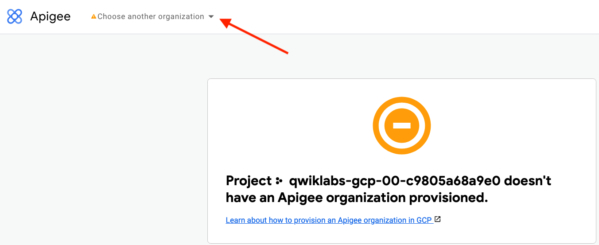
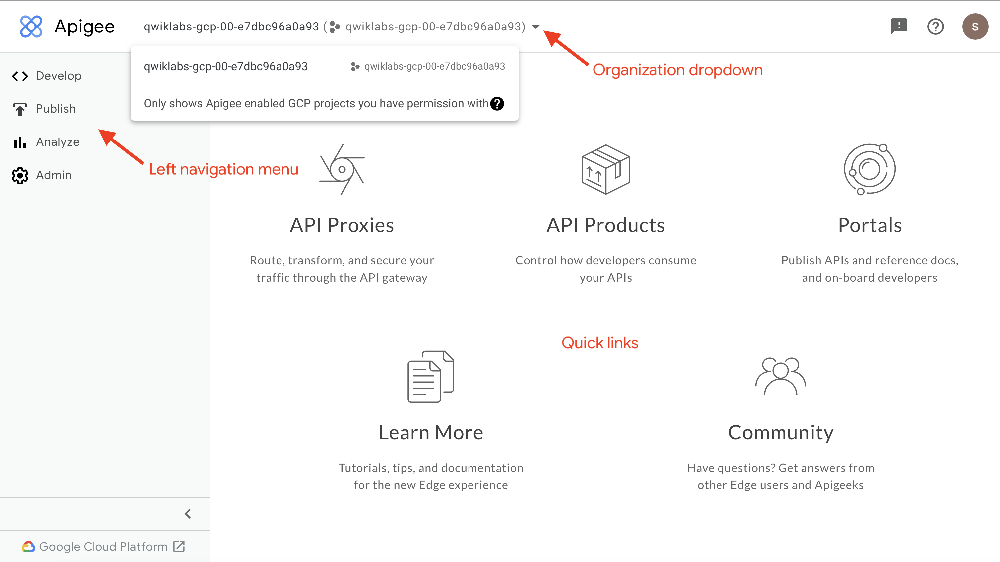

### Open the Apigee UI

The Apigee UI is accessed on a page separate from the Google Cloud Console. This lab has automatically created an Apigee organization that has the same name as the Google Cloud project.

* Click to open the [Apigee UI](https://apigee.google.com/).

    You may also open the Apigee UI from the Google Cloud Console by opening the **Navigation menu** () and selecting **Tools > Apigee**.

If you see an error indicating that the project does not have an organization provisioned, the tab might be trying to load the organization for a previous lab.

If you get this error:

* Click on the organization dropdown.

    

    The organization dropdown should show an organization that has the same name as the Google Cloud project.

    

    The organizations listed are those that are accessible by the logged-in user. For this lab, you should be logged in with the lab credentials provided in the **Lab Details** panel when you started the lab.

    You can navigate the Apigee UI using its **left navigation menu**. The landing page also shows **quick links** for navigating to commonly used locations.
    

