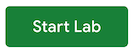

### Before you click the Start Lab button

Read these instructions. Labs are timed and you cannot pause them. The timer, which starts when you click **Start Lab**, shows how long Google Cloud resources will be made available to you.

This hands-on lab lets you do the lab activities yourself in a real cloud environment, not in a simulation or demo environment. It does so by giving you new, temporary credentials that you use to sign in and access Google Cloud for the duration of the lab.

To complete this lab, you need:

* Access to a standard internet browser (Chrome browser recommended).

<ql-warningbox>
<strong>Note:</strong> Use an Incognito or private browser window to run this lab. This prevents any conflicts between your personal account and the Student account, which may cause extra charges incurred to your personal account.
</ql-warningbox>

* Time to complete the lab---remember, once you start, you cannot pause a lab.

<ql-warningbox>
<strong>Note:</strong> If you already have your own personal Google Cloud account or project, do not use it for this lab to avoid extra charges to your account.
</ql-warningbox>

### How to start your lab and sign in to Looker

1. When ready, click .

    A new panel will appear with the temporary credentials that you must use for this lab.

    If you need to pay for the lab, a pop-up will open for you to select your payment method.

2. Note your lab credentials in the left pane. You will use them to sign in to the Looker instance for this lab.

    <ql-warningbox><Strong>Note: </strong>If you use other credentials, you will get <b>errors or incur charges</b>.</ql-warningbox>

3. Click __Open Looker__.

4. Enter the provided Username and Password in the Email and Password fields.

    <ql-warningbox><b>Important:</b> You must use the credentials from the Connection Details panel on this page. Do not use your Google Cloud Skills Boost credentials. If you have your own Looker account, do not use it for this lab.</ql-warningbox>

5. Click __Log In__.

    After a successful login, you will see the Looker instance for this lab.

