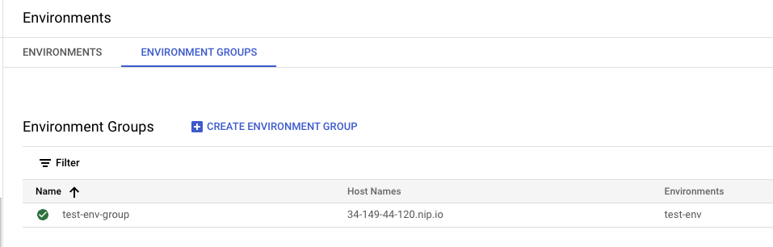

# Introduction to the Journey 

## Overview

In this lab, you provison Apigee X, explore the legacy API, and fix its security. The legacy API is deployed on Google Compute Engine. Due to a configuration error the API is publicly exposed. It was never designed for the public internet so there is no security.

You search for and uncover the security vulnerabilities in the API. This lab is split into three parts. Later in the lab, you use Apigee to correct these vulnerabilities.

Apigee takes appoximately one hour to fully provision. Your instructor will walk you through the first task. You will then be able to proceed with the other tasks while you wait for Apigee to be available.

## Part 1 - Installing Apigee X

## Objectives

In this part of the lab, you learn how to:
- Deploy an Apigee X Evaulation Organization 
- Exploit security vulnerabilities in a legacy API using a test page left in place by the development team 
- Remove public access to an API deployed to Compute Engine

## Setup and Requirements

![[/fragments/startqwiklab]]


![[/fragments/cloudshell]]


## Task 1. Install Apigee X

To ensure we get a constant Apigee experience, we use Terraform to configure Apigee. 

1. Navigate to the the Google Cloud console at https://console.cloud.google.com
   
2. Click **Activate Cloud Shell** (Activate Cloud Shell icon) in the top menu to open Cloud Shell.

3. In Cloud Shell, confirm the default compute zone is set to the zone used by the gateway VM.

    <ql-code-block templated>
    gcloud config set compute/zone {{{project_0.default_zone|vm_zone}}}
    </ql-code-block>

4.  To ensure that you are in the Cloud Shell home directory, execute the following command.

    ```bash
    cd ~ 
    ```

5. Since provisioning Apigee is a long-running operation with Terraform, you will provision a small VM to run the Terraform script. Execute the following command to provision a small VM with Terraform installed.

    <ql-code-block noWrap templated>
    gcloud compute instances create terraformer \
     --machine-type=e2-micro \
     --scopes=https://www.googleapis.com/auth/cloud-platform \
     --metadata=startup-script-url=gs://cloud-training/specialized-training/apigee/startup.sh \
     --service-account={{{project_0.project_id|project_id}}}@{{{project_0.project_id|project_id}}}.iam.gserviceaccount.com
    </ql-code-block>

6. Use the **Navigation menu** to navigate to **Compute Engine** > **VM instances**.

7. Click the **SSH** link for the `terraformer`. Click the **Authorize** button if prompted. Note the **SSH** link will not be available until the `terraformer` VM has been fully provisioned.

8. Set the default compute zone and `$GOOGLE_CLOUD_PROJECT` variables in the `terraformer` VM.

    <ql-code-block templated>
    gcloud config set compute/zone {{{project_0.default_zone|vm_zone}}}
    export GOOGLE_CLOUD_PROJECT={{{project_0.project_id|project_id}}}
    </ql-code-block>

9. Clone the class repository and move into the repository root folder.

    ```bash
    git clone https://github.com/fabltd/Apigee-utils
    cd Apigee-utils
    ```

    <ql-infobox>
    The following step runs a script that starts the Terraform that installs Apigee.
    </ql-infobox>

10. Create and configure Apigee using the following bash script.

   ```bash
    nohup ./setup/install/lab1/install.sh &
   ```

11. The script will not complete until Apigee is fully installed; this could take up to 45 minutes! Keep the SSH window open until the script has completed. You can check the progress of the Terraform deployment by running the command `tail nohup.out` in the SSH window.

## Wait for your instructor before continuing to Part 2. 

 


## Part 2 - Explore the Legacy API

## Situational overview

Welcome to MegaHot Corp., stylized as MHC. You've join the MHC technology team. You are the product lead for the new application “Show Me Now", stylized as SMN.


MHC has identified that many logistic companies have limited tracking information provided to their customers. Often the tracking is not updated until the package has reached the destination. 

The developers on your team have identified that more in-depth tracking details can be obtained from a legacy application. This system is currently part of the call center stack and as a result, there can be no change to this application. 

Show Me Now aims to extract this information and make it available to customers. Management has identified that SMN will reduce the number of calls to your call center as users will have a more in-depth picture. 

SMN will be released as a web application and as a set of APIs for use by third parties. 

You will explore how to deliver SMN in a secure way using Apigee. Each lab approaches a different task until you have a complete solution.

Along the way, you will be able to experiment with the data. Can you break it? Can you bring out your hacking skills? The best way to secure any application is to break it first to find the weaknesses and to lock them down.

We have the tools but how do we implement them?

## Task 1. Test the legacy

1. Return to the Google Cloud console at **https://console.cloud.google.com**.

2. You may need to reconnect to Cloud Shell as the session may have timed out. Click **Reconnect** if this is the case.

3. Clone the class repository into Cloud Shell and move into the repository root folder.

    ```bash
    cd ~
    git clone https://github.com/fabltd/Apigee-utils
    ```

4. To ensure that you are in the Cloud Shell home directory, execute the following command.

    ```bash
    cd ~/Apigee-utils
    ```
    
    <ql-infobox>
    The following step runs a script that adds test data to the legacy backend.
    </ql-infobox>

5. Create and configure the gateway using the following bash script.

   ```bash
    ./setup/install/lab1/setup.sh
   ```

6. Wait for the script to complete and you should see "Done".

7. In the Google Cloud console, from the Navigation menu (), select __Compute Engine and VM instances__.

8. In the Compute Engine VM instances pane, locate the VM named __legacy-api__ and click the more actions icon ().

9. Select **View network details** and copy the __External IP__. Open a new browser tab and paste the IP address into the address bar.

    <ql-infobox>
    The developer of the legacy API appears to have left a test page exposed. You should see the “Shipping API Tester”.
    </ql-infobox>

10. Select the following: (Hint: They are prepopulated.)

    | Property | Value |
    | --- | --- |
    | METHOD | **GET** |
    | PATH | **/v1/customers** |
    | EMAIL | **abischof1d@google.com** |

11. Click **Send**. You should see the customer details in the **Return from API** text box.

    <ql-infobox>
    This shows that the legacy API returns specific data when requested. But what happens if you make a less specific request than the developer intended?
    </ql-infobox>

12. Remove the email address and click **Send**. This time the API exposes all of MHC’s customers.

    <ql-infobox>
    Hint: If the Return from API box is too small, you can drag the handle in the bottom-right corner to resize.
    </ql-infobox>

    

13. Change the **Path** and experiment to discover if __orders__ and __shipments__ have the same vulnerability as __customers__.

## Task 2. Investigate security vulnerabilities

1. Refresh the Shipping API Tester and then select and set the following:

    | Property | Value |
    | --- | --- |
    | METHOD | **GET** |
    | PATH | **/v1/customers** |
    | EMAIL | **hacked@google.com** |

2. Click **Send** and examine the return, if any.

    <ql-infobox>
    The API returns an empty object inside a result array. This customer does not exist.
    </ql-infobox>

3. Copy any JSON object from the output, or use the example below. Be careful to include both the object's surrounding curly braces { }. 

    ```json
    {
      "Email": "abischof1d@google.com",
      "StateOrProvince": "Florida",
      "FirstName": "Anastasia",
      "Address2": "Room 496",
      "PostalCode": "32825",
      "LastName": "Bischof",
      "Country": "United States",
      "StreetAddress": "83480 Sachtjen Parkway"
    }
    ```
4. Paste the JSON object into the __JSON Payload (optional)__ text box and change the Email from *abischof1d@google.com* to __hacked@google.com__.

5. Confirm that the JSON Payload is similar to this:

    ```json
    {
      "Email": "hacked@google.com",
      "StateOrProvince": "Florida",
      "FirstName": "Anastasia",
      "Address2": "Room 496",
      "PostalCode": "32825",
      "LastName": "Bischof",
      "Country": "United States",
      "StreetAddress": "83480 Sachtjen Parkway"
    }
    ```

6. Change the **Method** to **Post** and click **Send**. You should see the following message:

    ```json
    {
      "api": "Customers",
      "msg": "Customer created or updated"
    }
    ```

    <ql-infobox>
    The test page allows customers to be added to MHC’s database without any validation or security. 
    </ql-infobox>

7. Select or set the following and click **Send**:

    | Property | Value |
    | --- | --- |
    | METHOD | **Get** |
    | PATH | **/v1/customers** |
    | EMAIL | **hacked@google.com** |

8. Verify that you now see a customer record for hacked@google.com

9. Bonus: Try altering different fields and emails. Do you see more customer records?

## Task 3. Explore the severity of the security vulnerabilities

1. Refresh the **Shipping API Tester** and then set the following as the entire content of the JSON Payload text box:

    ```json
    {
        "Email": "hacked@google.com",
        "PostalCode": "32825",
        "StateOrProvince": "Florida",
        "LastName": "Bischof",
        "FirstName": "Anastasia",
        "Country": "United States",
        "Address2": "Room 496",
        "StreetAddress": "83480 Sachtjen Parkway"
      }
    ```
2. Add the following snippet of JSON immediately after the opening {

    ```json
    "Junk " :  "This is a very vulnerable API",  
    ```

3. Your JSON Payload should look like this:

    ```json
    {
      "Junk " : "This is a very vulnerable API",  
      "Email": "hacked@google.com",
      "PostalCode": "32825",
      "StateOrProvince": "Florida",
      "LastName": "Bischof",
      "FirstName": "Anastasia",
      "Country": "United States",
      "Address2": "Room 496",
      "StreetAddress": "83480 Sachtjen Parkway"
      }
    ```

4. Change the **Method** to **Post** and click **Send**. You should see the following message:

    ```json
    {
      "api": "Customers",
      "msg": "Customer created or updated"
    }
    ```

    <ql-infobox>
    If you don’t see the above message, your JSON Payload was probably malformed. Check for missing commas, quotation marks, and curly braces.
    </ql-infobox>

5. Select or set the following and click **Send**:

    | Property | Value |
    | --- | --- |
    | METHOD | **GET** |
    | PATH | **/v1/customers** |
    | EMAIL | **hacked@google.com** |

6. Confirm that the __Junk__ field is now part of the returned record. 

## Task 4. Reduce the attack vector

The Legacy API is highly insecure and cannot be used in its current state. We explore ways to secure access in subsequent labs. For now, we need to implement a quick security fix by removing the external IP address from the VM.

1. In the Google Cloud console, from the Navigation menu (), select __Compute Engine and VM instances__.

2. In the Compute Engine VM instances pane, click the link __legacy-api__ in the __Name__ column.

3. In the top menu bar on the next page, click **Edit**. 

4. In the **Network interfaces** section, click the **mhc-network mhc-subnetwork** network interface to open the __Edit network interface__ dialog. 

5. Click the **External IP v4 address** dropdown and change the value to **None** to remove the External (Public) IP Address, and then click __Done__ and __Save__.

    

6. From the side menu, select **VM Instances**. Verify that the legacy-api VM no longer has an entry in the **External IP** column.

### **Congratulations!** You have established that the legacy API has significant security vulnerabilities. You removed the External (Public) IP Address to ensure that it is no longer accessible except to other internal MHC systems.

## Wait for your instructor before continuing to Part 3. Your instructor will introduce the security measure you will implement to allow secure Target access. 

 


## Part 3 - Securing Backend Access

## Overview

In this part, you lay the framework for a secure connection from Apigee to the legacy API. You enable access to the API using an mTLS connection.

## Objectives

In this part, you learn how to:
- Implement a second VM to work as a Gateway (reverse proxy) between the public and private networks 
- Implement mTLS between the Gateway and Apigee
- Establish an initial connection to Apigee


## Task 1. Create the gateway reverse proxy

You create an Nginx gateway to act as a reverse proxy for the legacy API. A helper script has been created to assist in creating the gateway. 

1. Return to the Google Cloud console and click **Activate Cloud Shell** () in the top menu to open Cloud Shell.

2. To ensure that you are in the Cloud Shell home directory, execute the following command.

    ```bash
    cd ~ 
    ```

3. Change to the utils directory you cloned in Part 1.

    ```bash
    cd Apigee-utils
    ```
4. In Cloud Shell, confirm the default compute zone is set to the zone used by the gateway VM.

    <ql-code-block templated>
    gcloud config set compute/zone {{{project_0.default_zone|vm_zone}}}
    </ql-code-block>

    <ql-infobox>
    <b>gcloud</b> is the command-line tool for Google Cloud. It comes pre-installed on Cloud Shell and supports tab completion.
    </ql-infobox>

    <ql-infobox>
    The following step runs a script that includes SSH access to the generated VM. You may see errors as it attempts to connect. You can safely ignore these errors.
    </ql-infobox>

5. Create and configure the gateway using the following bash script.

   ```bash
    ./setup/install/lab1/setup-gw.sh
    ```

6. If you are prompted to generate SSH keys, confirm YES and press ENTER twice for passphrase.

7. Wait for the script to complete and then proceed to Task 2.

8. If you see the following warning, you can ignore this.
  
 ```
    ERROR: (gcloud.compute.instances.delete-access-config) Could not fetch resource:
    - No access config is present.
 ```
The script checks to see you removed the public IP Address and if not will do this for you. The error means that the IP address was removed.

## Task 2. Explore the gateway

1. In the Google Cloud console, from the Navigation menu (), select __Compute Engine and VM instances__.

2. In the Compute Engine VM instances pane, locate the VM named __gateway__ and copy the __External IP__. Open a new browser tab and paste the IP address into the address bar.

    <ql-infobox>
    You should see that you can again get access to the <b>Shipping API Tester</b>. This is because the VM has been provisioned with Nginx to operate as a reverse proxy.
    </ql-infobox>

3. Return to the Google Cloud console and if necessary click **Activate Cloud Shell** () in the top menu to open Cloud Shell.

4. In Cloud Shell, confirm the default compute zone is set to the zone used by the gateway VM.

    <ql-code-block templated>
    gcloud config set compute/zone {{{project_0.default_zone|vm_zone}}}
    </ql-code-block>

5. Connect to the gateway VM and inspect the configuration of the reverse proxy.

    ```bash
    gcloud compute ssh gateway 
    ```

6. When the prompt changes indicating you are connected to the gateway, execute the following command.

    ```bash
    cat /etc/nginx/sites-enabled/reverse-proxy.conf 
    ```

7. Confirm that the output is similar to this.

    ```code
    server {
      listen 80;
      location / {
          proxy_pass http://10.138.0.2;
      }
    }
    ```

    <ql-infobox>
    The actual IP address is the IP address of your legacy API VM.
    </ql-infobox>

8. This configuration tells Nginx to pass any incoming requests on to the internal IP of our legacy API. This recreates the problem from Part 2; the insecure API is once again exposed to the internet.

9. In Cloud Shell, type **exit** to terminate the SSH session and return your terminal session to the Cloud Shell instance.

10. Verify that the prompt has changed from username@**gateway** to username@**cloudshell**. You should also see the project id in yellow. 


## Task 3. Generate and install the certificates

You implement Mutual Transport Layer Security (mTLS) to force connections to present a client certificate to access the gateway and the legacy API. A helper script and updated gateway configuration have been created to assist in generating and applying a certificate authority and client/server certificates. 

1.  To ensure that you are in the Cloud Shell home directory, execute the following command.

    ```bash
    cd ~ 
    ```

2. To ensure the default compute zone is still set, once again execute the following command.

    <ql-code-block templated>
    gcloud config set compute/zone {{{project_0.default_zone|vm_zone}}}
    </ql-code-block>

    <ql-infobox>
    If Cloud Shell has disconnected at any point during the above steps, the default zone may no longer be set.
    </ql-infobox>

3. To set up the certificates, execute the following code to run the certs helper.

    ```bash
    ./Apigee-utils/student-scripts/certs.sh
    ```

    <ql-infobox>
    Be careful not to miss the ./ before Apigee-utils/
    </ql-infobox>

4. To verify that the helper created a directory called mTLS that contains the certificates, execute the following command.

    ```bash
    ls ~/Apigee-utils/mTLS
    ```

    <ql-infobox>
    You should see three directories: ca, server, apigee
    </ql-infobox>

5. To check the validity of the new certificate authority, execute the following command.

    ```bash
    openssl x509 -in ~/Apigee-utils/mTLS/ca/ca.crt -text -noout
    ```

    <ql-infobox>
    The Validity section at the top of the text output shows that our CA is valid for one year. 
    </ql-infobox>

6. To install the server certificates/certificate and authority to the gateway and reconfigure Nginx to use mTLS, execute the following command to run a helper script.

    ```bash
    cd ~/Apigee-utils/student-scripts
    ./server-config.sh 
    ```

    <ql-infobox>
    This script uses <b>gcloud compute scp</b> (secure copy protocol) to add the files to the gateway.
    </ql-infobox>

7.  You can inspect the script to see the commands that are implemented here.

    ```bash
    cat ~/Apigee-utils/student-scripts/server-config.sh
    ```

    <ql-infobox>
    The script sets a Compute Engine zone environment variable, then copies the certificates to the Compute Engine instance (VM), moves these to the correct location, and copies over a revised Nginx conf.
    </ql-infobox>

8. Verify that the compute/zone is still set by executing the following command.

    ```bash
    gcloud config get-value compute/zone
    ```

    <ql-infobox>
    If the value is <b>unset</b>, use the command in step 3 above to set the compute/zone.
    </ql-infobox>

9. To test your work and present a client certificate to the gateway, execute the following command to run a helper script. 

    ```bash
    cd ~
    ./Apigee-utils/student-scripts/mTLS-test.sh
    ```

    **SAMPLE OUTPUT (Truncated for Readability)**

    ```bash
    Testing mTLS Certs
    Your active configuration is: [cloudshell-27263]
    Updated property [compute/zone].

      % Total    % Received % Xferd  Average Speed   Time    Time     Time  Current
                                    Dload  Upload   Total   Spent    Left  Speed
    100  2756  100  2756    0     0  95034      0 --:--:-- --:--:-- --:--:-- 95034
      <title>Shipping API Tester</title>
          <h1>Shipping API Tester</h1>
    ```

10. Verify that your output contains the final two lines from the above example, with the text __Shipping API Tester__. The fact that you can see the title from the legacy API test page verifies that your certificate chain is working. 

    <ql-infobox>
    The script uses a certificate named <b>apigee</b>. This is an arbitrary name created by the script that you ran to create the certificates. It is named apigee because Apigee is the client of the gateway. 
    </ql-infobox>

11. To find the **External IP** of the gateway, execute the following command.

    ```
    gcloud compute instances list 
    ```

    **SAMPLE OUTPUT (Truncated for Readability)**

    <ql-code-block templated>
    NAME: gateway
    ZONE: {{{project_0.default_zone|vm_zone}}}
    MACHINE_TYPE: e2-micro
    PREEMPTIBLE:
    INTERNAL_IP: 10.138.0.2
    EXTERNAL_IP: 35.247.91.33
    STATUS: RUNNING
    </ql-code-block>

12. Locate the value of the **EXTERNAL_IP** for the gateway VM from the output and execute the following command, replacing [EXTERNAL_IP] with the IP address.

    ```bash
    curl -k https://[EXTERNAL_IP]  -v 
    ```

    <ql-infobox>
    The -k flag tells curl to ignore any certificate errors.
    </ql-infobox>

    **SAMPLE OUTPUT (Excerpted for Readability)**

    ```bash
    *   Trying 34.23.241.110:443...
    * Connected to 34.23.241.110 (34.23.241.110) port 443 (#0)
    
    * Server certificate:
    *  subject: CN=Server
    
    < HTTP/1.1 418
    ```

    <ql-infobox>
    In the output, <b>CN</b> is Common Name, set in our script. The port on the gateway is 443 as this is https traffic. The 418 status code is the Nginx error code configured by our script to be returned when no client certificate is provided to validate the request. 
    </ql-infobox>


## Task 4. Configure Apigee for mTLS

You have now configured sufficient infrastructure to allow you to set up Apigee with a reverse proxy and mTLS configuration. This allows you to call the legacy backend. However, it once again exposes the insecure legacy API. You correct this in a later lab using Apigee policies.

1. In a different browser tab within the same window, open the Apigee console at [console.cloud.google.com/apigee](console.cloud.google.com/apigee).

    <ql-infobox>
    This is an alternative Apigee console that is accessed on a different URL from the Google Cloud console. An Apigee organization with the same name as the Google Cloud project was created when you installed Apigee.
    </ql-infobox>

2. In the left navigation menu of the Apigee browser tab, select **Proxy development > API Proxies**.

3. To start the [proxy wizard](https://cloud.google.com/apigee/docs/api-platform/fundamentals/build-simple-api-proxy), click **Create**.

4. Click the **Reverse proxy** box. 

5. Set the following properties, replacing [EXTERNAL-IP] with the External IP address of the __gateway__ VM. 

    | Property | Value |
    | --- | --- |
    | Name | **SMN-Labs** |
    | Basepath | **/show-me-now/v0** |
    | Description | **Show Me Now - LAB1** |
    | Target URL | **https://[EXTERNAL-IP]** |

    <ql-infobox>
    The gateway External IP address is the same one you used in the final step of the previous task. 
    </ql-infobox>

    **EXAMPLE**

    

6. Double-check that the settings are correct and click __Next__.

7. Leave the Optional Deployment blank and click **Create**.

8. On the top menu, click **DEVELOP**.

    

9. In the development view navigator panel, click **Target endpoints  > default >  PostFlow**.

    

11. In the **Code** pane, locate the XML ```<HTTPTargetConnection>``` element.

12. Insert the following XML block immediately above the opening ```<URL>``` tag.

    ```xml
    <SSLInfo>
    <Enabled>true</Enabled>
    <ClientAuthEnabled>true</ClientAuthEnabled>
    <KeyStore>gateway</KeyStore>
    <KeyAlias>mtls-alias</KeyAlias>
    <TrustStore>gateway</TrustStore>
    <IgnoreValidationErrors>true</IgnoreValidationErrors>
    </SSLInfo>
    ```

    Your result should be as follows, though the indentation may vary, and the value of the IP address will match your __gateway__ VM.

    ```xml
    <HTTPTargetConnection>
        <SSLInfo>
        <Enabled>true</Enabled>
        <ClientAuthEnabled>true</ClientAuthEnabled>
        <KeyStore>gateway</KeyStore>
        <KeyAlias>mtls-alias</KeyAlias>
        <TrustStore>gateway</TrustStore>
        <IgnoreValidationErrors>true</IgnoreValidationErrors>
        </SSLInfo>
      <URL>https://34.23.241.110</URL>
    </HTTPTargetConnection>
    ```

    <ql-infobox>
    This XML enables mTLS on the target. You can safely ignore validation errors as the certificate does not contain a host name for the target. 
    </ql-infobox>

13. Click **Save**.

## Task 5. Add mTLS keys to Apigee and test

The Apigee instance requires the client certificates and the certificate authority in order establish a connection to our gateway. These are currently missing.

1. In the left navigation menu, select **Management > Environments** Click on the **test-env** environment then **TLS Keystores**. This should be empty. 

    <ql-infobox>
    <b>Note</b>: You could add your keys manually but that involves downloading them to your local machine and uploading them individually. Instead, you execute a script that calls the Apigee management API.  
    </ql-infobox>

2. Return to the previous browser tab which has Google Cloud console open.

3. If Cloud Shell is no longer open, in the top menu, click **Activate Cloud Shell** () to open Cloud Shell. If it is open but has disconnected, click __Reconnect__.

4. To upload the certificates generated earlier to Apigee, execute the following command.

    ```bash
    cd ~/Apigee-utils/student-scripts
    ./apigee-add-mTLS.sh 
    ```

5. Return to the browser tab that has the Apigee console open and refresh the page.

6. In the left navigation menu, select **Management > Environments** Click on the **test-env** environment then **TLS Keystores**. 

7. Verify that you can see the keystore __gateway__ and two keys, __Apigee__ and __CA__.

    

    <ql-infobox>
    If the page was already open, you may need to refresh it to see the new keystores.
    </ql-infobox>

8. In the left navigation menu, select **Proxy development > API Proxies** then click **SMN-Labs**, then click **Develop** and **Deploy**.

9. In the Deploy dialog, select **1** in the revision box and **test-env** for the environment, then click __Deploy__.

10. In the confirm dialog, click __Confirm__ and wait until the revision has finished deploying.

11. In the top menu, click **Overview**.

12. In the Deployments section, verify that the status column has a green checkmark beside **test-env** for **Revision 1**.

    

13. In the left navigation menu, select **Management > Environments** then click on **Environment Groups** and copy the hostname from __test-env__. If there is more than one, copy the hostname that includes an IP Address.

    

14. Open a new Chrome tab and enter the following URL, replacing APIGEEHOSTNAME with the hostname you copied in the previous step.

    ```
    https://APIGEEHOSTNAME/show-me-now/v0
    ```

    <ql-infobox>
    You should see the Shipping Tester home page. 
    </ql-infobox>

15. To verify that the methods on the tester page no longer work, attempt to use the form to return customer data.

    <ql-infobox>
    The form no longer works, but is the API secure or has the introduction of a base path broken the form?
    </ql-infobox>

16. To verify that Apigee returns data if the full path **/show-me-now/v0/v1/customers** is used, modify the URL as follows.

    ```
    https://APIGEEHOSTNAME/show-me-now/v0/v1/customers
    ```

    <ql-infobox>
    You should see all customers in JSON format. The API is not currently secure.
    </ql-infobox>

## Task 6. Fix the path and add basic security

Currently, Apigee forwards anything that is added to the end of the base path **show-me-now/v0** to the gateway, and thus to the legacy API. The test page does not add the Apigee base path to the URL, but there is nothing to stop a malicious actor from adding **/v1/customers**, or anything else, to a request to the Apigee base path, and having it forwarded to the legacy API. Access to the test page and any unwanted routes can be prevented using **Conditional Flows** and **Fault Rules**.

1. In the left navigation menu, select **Proxy development > API Proxies** and click on **SMN-Labs**. 

2. In the top menu, click **Develop**.

3. In the development view navigator panel, click **Proxy endpoints - default** to open the proxy endpoint in the development panel.

    

4. In the top line, click the + icon () to add a new conditional flow.

    

5. In the dialog, set the following properties for the New Conditional Flow and then click **Add**. 

    **Note:** The Condition is case sensitive.

    | Property | Value |
    | --- | --- |
    | Flow name | **Customers** |
    | Description | **Customer Flow** |
    | Condition type | **Path** |
    | Condition | **/customers** |
    | Target URL | -- **Leave Empty** --  |

    <ql-infobox>
    The flow needs to set the correct path expected by the target API, and prevent the incoming path from being forwarded. 
    </ql-infobox>

6. In the development view navigator panel, click **Target endpoints - default** to open the target endpoint in the development panel.

    **Note:** Be sure to click the **Target** not the Proxy **endpoints**.

    

7. In the development panel, click the + icon () for the  **Target endpoints > Request > PreFlow**.

    

8. In the dialog, select **Create new policy** option. 

9. In the dropdown, from the **Mediation** group, select the **Assign Message** policy. 

10. Set the following properties and click **Add**. 

    | Property | Value |
    | --- | --- |
    | Name | **AM-remove-suffix** |
    | Display name | **AM-remove-suffix** |

11. In the development panel, locate the policy inside the preflow and click the **AM-remove-suffix** link.

    <ql-infobox>
    The development panel now shows just the policy and its XML. 
    </ql-infobox>

12. Delete all the existing XML for the **AM-remove-suffix** policy and replace it with the following.

    ```xml
    <?xml version="1.0" encoding="UTF-8" standalone="yes"?>
    <AssignMessage continueOnError="false" enabled="true" name="AM-remove-suffix">
        <DisplayName>AM-remove-suffix</DisplayName>
        <Properties/>
        <AssignVariable>
            <Name>target.copy.pathsuffix</Name>
            <Value>false</Value>
        </AssignVariable>
        <IgnoreUnresolvedVariables>true</IgnoreUnresolvedVariables>
    </AssignMessage>
    ```

    <ql-infobox>
    This policy removes the Apigee base path. You now use a postflow policy and policies inside your conditional flows to create a <b>dynamic_path</b> variable to hold the correct path for the legacy API.
    </ql-infobox>

13. In the development view navigator panel, click **Target endpoints  > default >  PostFlow** to open the **Target endpoints** in the development panel with the PostFlow highlighted.

14. To amend the target URL, locate the ```<URL>``` element inside the XML panel and add the following to the end of the IP address.

    ```
    /v1/{dynamic_path}
    ```

    <ql-infobox>
    The revised element should be similar to the following, but with the IP address of your gateway.
    </ql-infobox>

    ```xml
    <URL>https://34.168.122.113/v1/{dynamic_path}</URL>
    ```

    <ql-infobox>
    The conditional flows need to create the <b>dynamic_path</b> variable so that it is available for the PostFlow.
    </ql-infobox>

15. In the development navigator panel, click **Proxy endpoints - default** to open the **Proxy** endpoint in the development panel.

16. In the development panel, click the + icon () for the **Proxy Endpoint default > Request > Customers** conditional flow.

    

17. In the dialogs, select **Create new policy** and select the **Assign Message** policy from the **Mediation** group. 

18. Set the following properties and click **Add**. 

    | Property | Value |
    | --- | --- |
    | Name | **AM-Set-Customers** |
    | Display name | **AM-Set-Customers** |

19. In the development panel, locate the policy inside the **Customers** conditional flow and click the **AM-Set-Customers** link.

20. Delete all the existing XML for the **AM-Set-Customers** policy and replace it with the following.

    ```xml
    <?xml version="1.0" encoding="UTF-8" standalone="yes"?>
    <AssignMessage continueOnError="false" enabled="true" name="AM-Set-Customers">
        <DisplayName>AM-Set-Customers</DisplayName>
        <AssignVariable>
            <Name>dynamic_path</Name>
            <Value>/customers</Value>
        </AssignVariable>
        <AssignTo createNew="false" transport="http" type="request"/>
    </AssignMessage>
    ```

21. Click **Save**, confirm you are saving as a new revision, and then **Deploy**.

22. In the Deploy dialog, select revision **2**, click __Deploy__, and then __Confirm__ and wait until the revision has finished deploying.

23. To verify that revision 2 has been deployed to eval, click **Overview** and check the **Status** and **Revision 2** columns.


## Task 7. Test the path and provide a more suitable error response

The policies added in the previous task make it possible to call GET for **/customers**. The empty path **/** now returns an error message. 

1. Return to the previous browser tab where you have Google Cloud console and Cloud Shell open. 

    <ql-infobox>
    If you have closed the browser tab, you can open a new one and navigate to https://console.cloud.google.com/
    </ql-infobox>

2. If Cloud Shell has disconnected, click **Reconnect**. If it is closed, click the **Activate Cloud Shell** icon to reopen it.
 
3. In Cloud Shell, execute the following command to test your work, replacing APIGEEHOSTNAME with the hostname of your Apigee API.

    ```bash
    curl -k https://APIGEEHOSTNAME/show-me-now/v0/customers
    ```

    <ql-infobox>
    Recall that the hostname is available inside <b>Admin > Environments > Groups</b>
    </ql-infobox>

    **SAMPLE OUTPUT (Truncated for Readability)**

      ```
    {"apiStatus":"success","msg":"Fetching customers","result":[{"Email":"abischof1d@google.com","StreetAddress":"83480 Sachtjen Parkway","Country":"United States","FirstName":"Anastasia","Address2":"Room 496","PostalCode":"32825","LastName":"Bischof","StateOrProvince":"Florida"},{"Email":"acelle1t@boston.com","StreetAddress":"29419 Fairview Avenue","PostalCode":"33129","Country":"United States","FirstName":"Albrecht","Address2":"Room 205","LastName":"Celle","StateOrProvince":"Florida"},{"Email":"adaveran10@newsvine.com","PostalCode":"88553","Address2":"7th 
      ```

4. To verify that the route path **/** returns an error response, modify the curl command to omit the final segment of the path and execute it again.

    ```bash
    curl -k https://APIGEEHOSTNAME/show-me-now/v0/
    ```

    **SAMPLE OUTPUT**

    ```
    {"fault":{"faultstring":"Unresolved variable : dynamic_path","detail":{"errorcode":"entities.UnresolvedVariable"}}}
    ```

    <ql-infobox>
    This reponse provides implementation details that can and should be hidden from potential hackers using another Assign Message policy together with a Fault Rule.
    </ql-infobox>

5. In the Apigee environment in your other browser tab, locate and click **Target endpoints > default > PostFlow**.

6. In the XML for the PostFlow in the development pane, to catch the **.UnresolvedVariable** error, add the following FaultRule between the ```<TargetEndpoint>``` and ```<PreFlow>``` tags. 

    ```xml
    <FaultRules>
      <FaultRule name="invalid_path">
        <Step>
          <Name>AM-Nice-Try</Name>
        </Step>
        <Condition>(fault.name = "UnresolvedVariable")</Condition>
      </FaultRule>
    </FaultRules>
    ```

    <ql-infobox>
    You can safely ignore any warning that the AM-Nice-Try policy does not exist, as you are about to create it.
    </ql-infobox>

7. In the Navigator window **Policies** section, click the + icon () to add a Policy.

    

8. In the Create dialog, select the **Assign Message** policy from the **Mediation** group. 

9. Set the following properties and click **CREATE**. 

    | Property | Value |
    | --- | --- |
    | Name | **AM-Nice-Try** |
    | Display name | **AM-Nice-Try** |

10. In the policy editor pane, remove all the current XML and replace it with the following.

    ```xml
    <?xml version="1.0" encoding="UTF-8" standalone="yes"?>
    <AssignMessage continueOnError="false" enabled="true" name="AM-Nice-Try">
        <DisplayName>AM-Nice-Try</DisplayName>
        <Properties/>
        <Set>
            <Payload contentType="application/json">
                {"error_message": "Nice Try :-)" }
            </Payload>
        </Set>
        <IgnoreUnresolvedVariables>true</IgnoreUnresolvedVariables>
        <AssignTo createNew="false" transport="http" type="response"/>
    </AssignMessage>
    ```

11. Save and deploy the application.

    <ql-infobox>
    The application deploys as version 3.
    </ql-infobox>

12. In Cloud Shell, execute the following command to test your work, replacing APIGEEHOSTNAME with the hostname of your Apigee API.

    ```bash
    curl -k https://APIGEEHOSTNAME/show-me-now/v0/
    ```

    **SAMPLE OUTPUT**

    ```bash
    {"error_message": "Nice Try :-)" }
    ```


### **Congratulations!** You have implemented mTLS authentication to the legacy API, filtered out the test page, and set up the framework to validate content. There is still work to be done. The API can still be abused and it is still open to the internet!


## BONUS:

The Suppliers and Shipments paths are both unsecured. In the bonus, you create new conditional flows that are very similar to the one used by Customers.

1. Create two additional conditional flows in the default Proxy endpoint with the following settings. In each case, the **Condition** is case sensitive.

    | Property | Value |
    | --- | --- |
    | Flow name | **Suppliers** |
    | Description | **Suppliers Flow** |
    | Condition type | **Path** |
    | Condition | **/suppliers** |


    | Property | Value |
    | --- | --- |
    | Flow name | **Shipments** |
    | Description | **Shipments Flow** |
    | Condition type | **Path** |
    | Condition | **/shipments** |

2. Verify you now have three conditional flows.

    

    <ql-infobox>
    The Suppliers and Shipments conditional flows require similar policies to the Customers conditional flow.
    </ql-infobox>

3. Create a new **AM-Set-Suppliers** AssignMessage policy for the Suppliers conditional flow.

4. Delete all the existing XML for the **AM-Set-Suppliers** policy and replace it with the following.

    ```xml
    <?xml version="1.0" encoding="UTF-8" standalone="yes"?>
    <AssignMessage continueOnError="false" enabled="true" name="AM-Set-Suppliers">
        <DisplayName>AM-Set-Suppliers</DisplayName>
        <AssignVariable>
            <Name>dynamic_path</Name>
            <Value>/suppliers</Value>
        </AssignVariable>
        <AssignTo createNew="false" transport="http" type="request"/>
    </AssignMessage>
    ```

5. Create a new **AM-Set-Shipments** AssignMessage policy for the Shipments conditional flow.

6. Delete all the existing XML for the **AM-Set-Shipments** policy and replace it with the following.

    ```xml
    <?xml version="1.0" encoding="UTF-8" standalone="yes"?>
    <AssignMessage continueOnError="false" enabled="true" name="AM-Set-Shipments">
        <DisplayName>AM-Set-Shipments</DisplayName>
        <AssignVariable>
             <Name>dynamic_path</Name>
            <Value>/shipments</Value>
        </AssignVariable>
        <AssignTo createNew="false" transport="http" type="request"/>
    </AssignMessage>
    ```

7. Save and deploy the application.

    <ql-infobox>
    The application deploys as version 4.
    </ql-infobox>

8. In Cloud Shell, execute the following commands individually to test your work, replacing APIGEEHOSTNAME with the hostname of your Apigee API.

    ```bash
    curl -k https://APIGEEHOSTNAME/show-me-now/v0/suppliers  
    curl -k https://APIGEEHOSTNAME/show-me-now/v0/shipments
    ```

    <ql-infobox>
    Both commands should successfully return data.
    </ql-infobox>

## Part 4 - Securing the API with an API Key

## Overview

In this part of the lab, you add an API Key to your proxy to prevent unauthorized access and to track usage.

## Objectives

In this lab, you learn how to:
- Implement a Verify API Key policy
- Add a developer and application
- Verify that the proxy is now secure

## Task 1. Add a Verify API Key policy (VAK) to your API proxy

1. In a separate browser tab from Google Cloud console, open the Apigee console at [apigee.google.com](https://apigee.google.com/).
    
2. Verify that your Apigee Organization is selected at the top of the console.

3. In the left navigation menu, select **Proxy development > API Proxies**.

4. From the proxy list, select **SMN-Labs**. To switch to the development view, click **Develop**.

5. In the development view navigator panel, click **Proxy endpoints > default** to open the Proxy endpoint in the development panel.

    **Note:** Be sure to click the **Proxy** not the Target **endpoints**.

    

6. In the development panel, click the + icon () for the **Proxy endpoints default > Request > PreFlow** to create a new policy.

    

7. In the dialog, select **Create new policy**, and in the dropdown select the **Verify API Key** policy from the **Security** group. 

8. Set the following properties and click **Create**. 

    | Property | Value |
    | --- | --- |
    | Name | **VAK-API-Key** |
    | Display name | **VAK-API-Key** |

9. In the development panel, locate the policy inside the Preflow and click the **VAK-API-Key** link.

10. Inside the XML, locate the ```<APIKey>``` element and modify the configuration to expect the API key as a header rather than a query parameter.

    **Replace:**

    ```xml
    <APIKey ref="request.queryparam.apikey"/>
    ```

    **With:**

    ```xml
    <APIKey ref="request.header.apikey"/>
    ```

11. Click **Save** and **Save as new revision**.

12. Click **Deploy** to open the dialog, click **Deploy** in the dialog, and finally click **Confirm** in the second dialog.


## Task 2: Create an API Product

1. In the left navigation menu, select **Distribution > API Products**.

2. To create a new API product, click **+Create**.

3. In the **Product details** pane, specify the following, leaving **Environment** blank.

    | Property | Value |
    | --- | --- |
    | Name | **show-me-now** |
    | Display name | **Show Me Now** |
    | Description | **Show Me Now Full API Access** |
    | Environment |  |
    | Access | **Private** |

4. Leave the **Automatically approve access requests** checkbox selected.

5. In the **Operations** section, click **+Add an Operation**.

    <ql-infobox>
    Operations are used to specify which requests in which API proxies are allowed for an application associated with the API product. 
    </ql-infobox>

6. In the **Operation** dialog, specify the following.

    | Property | Value |
    | --- | --- |
    | Source | **API Proxy > SMN-Labs** |
    | Operation | Path  __/**__ |
    | Methods | **GET, PATCH, POST, PUT and DELETE** |

7. To save the operation, click **Save**.

8. To save the API product, click **Save** at the top of the page.

9. To verify that your API product has been added, return to the API Products page and check that it is listed.


## Task 3: Create a developer

Developers are typically created using a developer portal. Developers create Apps that use API Products.

1. In the left navigation menu, select **Distribution > Developers**.

2. To create a new Developer, click **+Create**.

3. In the **Create a developer** page, specify the following.

    | Property | Value |
    | --- | --- |
    | First Name | **Anastasia** |
    | Last Name | **Bischof** |
    | Username | **ab1d** |
    | Email | **abischof1d@google.com** |

4. To create the app developer, click **Create**.


## Task 4: Create an app

In this task, you create an app for your app developer. The app represents the application that consumes the API Product/API Proxy.

1. In the left navigation menu, select **Distribution > Apps**.

2. To create a new app, click **+Create**. You may need to refresh the browser window for this button to be active.

3. In the **New app** page **App details** panel, specify the following.

    | Property | Value |
    | --- | --- |
    | Name | **show-me-now-web** |
    | Display Name | **Show Me Now - Web Client** |
    | Developer | **abischof1d@google.com** |

4. In the **Credentials** panel, click **Add Product**, select **Show Me Now**, and then click **ADD(1)**.

5. To create the app, click **Create** at the top of the page.

6. In the Credentials panel, click **Show** next to **Key** and copy the value. Save the key as you need it for the next task.


## Task 5: Testing the key

1.  In the left navigation menu, select **Management > Environments** and click on **Environment Groups** and copy the hostname from __eval-group__. Save the hostname so that it is available for the following steps.

    

2. Return to the browser tab which has Google Cloud console open. If none are available, open a new tab and navigate to https://console.cloud.google.com.

3. In the top menu, click **Activate Cloud Shell** () to open Cloud Shell.

4. To test your Key, execute the following command replacing **APIGEE_URL** with the Apigee Hostname and **KEY_HERE** with the key you copied earlier from your API Product. 

    **Note**: The API Key must be placed *before* the closing ”.

    ```bash
    curl -k APIGEE_URL/show-me-now/v0/customers \
    -H "apikey:KEY_HERE"
    ```

    **Example:**

    ```bash
    curl -k https://api.roiapigee.net/show-me-now/v0/customers \
    -H "apikey:giJbIK8n6Udq6TVcrpf4lImldRM0Far4CSAUAGYtsXD60rvv"
    ```

    <ql-infobox>
    You should see all customers in JSON format.
    </ql-infobox>


### **Congratulations!** You implemented an API key. The API proxy is now secure from unauthorized access but remains vulnerable to data leakage and injection attacks.


![[/fragments/copyright]]
