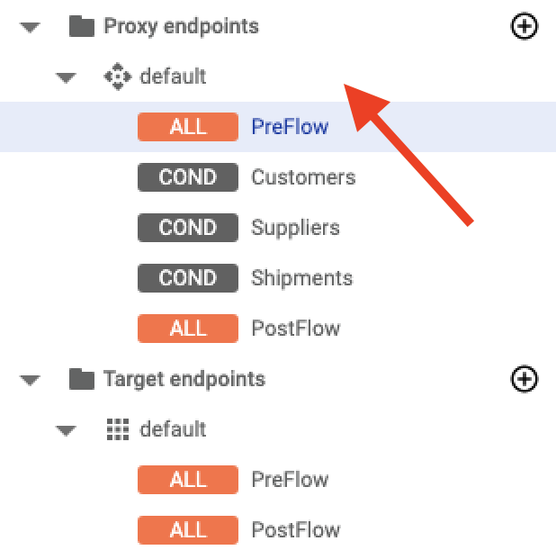
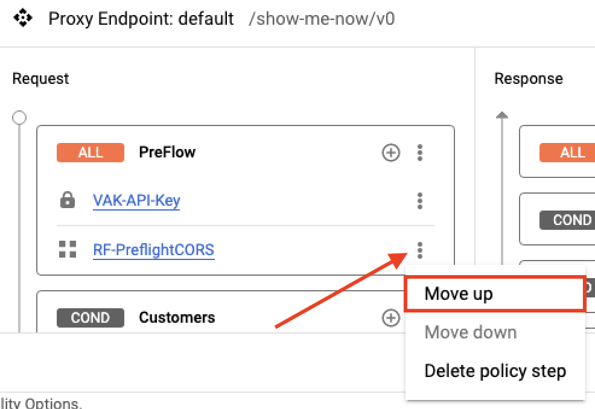
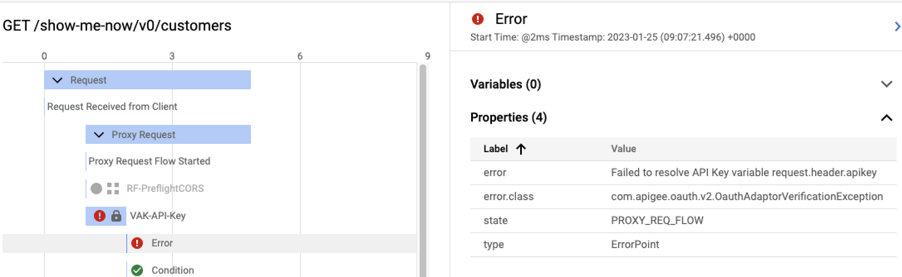
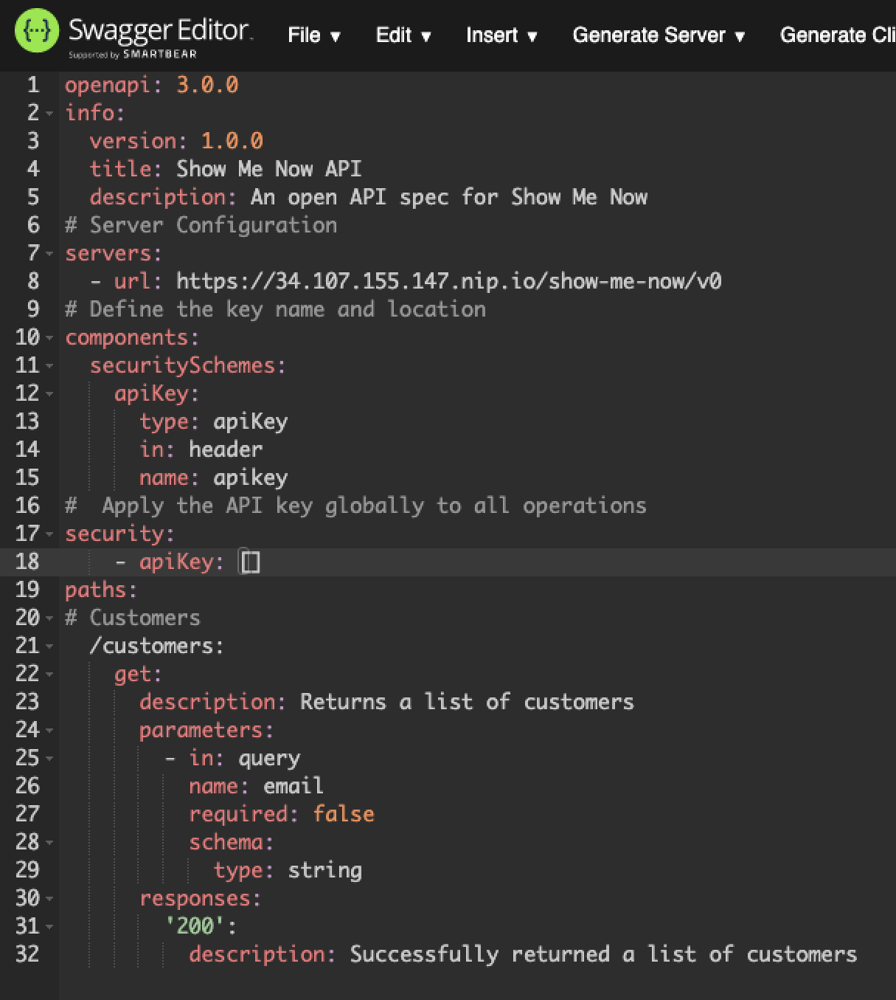
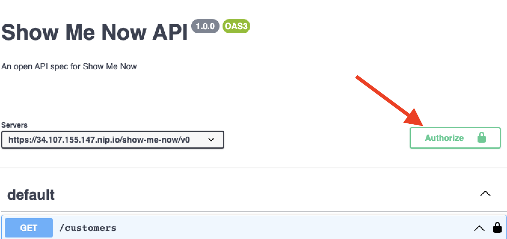

# API First Design with OpenAPI

## Overview

An [OpenAPI specification](https://github.com/OAI/OpenAPI-Specification) uses a standard format to describe a RESTful API. Written in either JSON or YAML, an OpenAPI specification is machine readable, but is also simple for people to read and understand.

The specification describes elements of an API, including its base path, resource paths and verbs, operations, headers, query parameters, and responses. In addition, an OpenAPI specification is commonly used to generate API documentation.

In this lab, you follow an API first approach, build an OpenAPI Specification for Show-Me-Now, and learn how to debug your Apigee proxy.

## Objectives

In this lab, you learn how to:
- Explore the Open API Specification
- Develop an Open API Spec 
- Test your Open API Spec
- Debug Apigee

## Setup and Requirements

![[/fragments/startqwiklab]]


![[/fragments/cloudshell]]


<!-- ![[/fragments/apigeex-ui]] -->


## Task 0. Provison LAB resources 

1. Navigate to the the Google Cloud console at **https://console.cloud.google.com**.

2. Click Activate Cloud Shell (Activate Cloud Shell icon) in the top menu to open Cloud Shell

3.  To ensure that you are in the Cloud Shell home directory, execute the following command.

    ```bash
    cd ~ 
    ```

4. In Cloud Shell, confirm the default compute zone is set to the zone used by the gateway VM.

    <ql-code-block templated>
    gcloud config set compute/zone {{{project_0.default_zone|vm_zone}}}
    </ql-code-block>

5. Clone the class repository and move into the repository root folder.

    ```bash
    git clone https://github.com/fabltd/Apigee-utils
    cd Apigee-utils
    ```

    <ql-infobox>
    The following step runs a script that provisons all the resources you will need
    </ql-infobox>

6. Create and configure the gateway / legacy VMs and base API proxy using the following bash script.

   ```bash
    ./setup/install/lab2/install.sh
    ```
7. If you are prompted to generate SSH keys, confirm YES and press ENTER twice for passphrase.

8. Wait for the script to complete and you should see Done - Return to Apigee.


## Task 1. Update the metadata and obtain your Apigee URL

1. In a separate browser tab from Google Cloud console, open the Apigee console at [https://console.cloud.google.com/apigee](https://console.cloud.google.com/apigee/).

    Alternatively, to open the Apigee console from the Google Cloud console Navigation menu (), select **Tools > Apigee**.

2. Verify that your Apigee Organization is selected at the top of the console.

3. In the left navigation menu, select **Proxy development > API Proxies > SMN-Labs**. To switch to the development view, click **Develop**.

4. In the development navigation panel, click the proxy name **SMN-LABs**.

5. To edit the metadata, click the pencil icon beside **Details**.

6. Enter the following values in the dialog and click **Save**.

    | Property | Value |
    | --- | --- |
    | Display name | **SMN-Lab2** |
    | Description | **Show Me Now - LAB 2** |

7. In the left navigation menu, select **Management > Environments** then click on **Environment Groups** and copy the hostname from __test-env__. If there is more than one, copy the hostname that includes an IP Address.


## Task 2: Develop the OpenAPI Specification

There are many different tools available for the development of OpenAPI Specifications. In this lab, you use the Swagger Editor from [SmartBear](https://smartbear.com/) to create an OpenAPI version 3 specification. OpenAPI derives from the earlier Swagger Specification.

1. Open a new  tab within the same browser window and navigate to the editor at [https://editor.swagger.io/](https://editor.swagger.io/)

2. In the top menu, use **File > Clear editor** to empty the code pane.

    <ql-infobox>
    OpenAPI Specifications can be developed in either JSON or YAML. You use YAML for this lab. YAML uses indentation to represent hierarchy, so it is very important that you preserve the exact indentation of the sample code when you add it to the Swagger editor.
    </ql-infobox>

3.  Add the following YAML to the editor starting at line 1. Replace **APIGEE_URL** with the hostname you copied earlier.

    ```yaml
    openapi: 3.0.0
    info:
      version: 1.0.0
      title: Show Me Now API
      description: An open API spec for Show Me Now
    # Server Configuration
    servers:
      - url: https://APIGEE_URL/show-me-now/v0
    ```

    <ql-infobox>
    You can safely ignore warnings about missing sections as the YAML is  incomplete.
    </ql-infobox>

4.  At line 9 in the editor, add the following YAML. The **paths** element should be at the same level of indentation as servers and info.

    ```yaml
    paths:
    # Customers
      /customers:
        get:
          description: Returns a list of customers
          parameters:
            - in: query
              name: email
              required: false
              schema:
                type: string
          responses:
            '200':
              description: Successfully returned a list of customers
    ```

5. To test your current YAML, expand **GET /customers** in the right pane.

    

    <ql-infobox>
    <b>Hint:</b> The following step will return an error.
    </ql-infobox>

6. Click **Try it Out** and then **Execute**.

    <ql-infobox>
    The request fails with various suggestions for possible errors. In the next task, you investigate the cause of the error.
    </ql-infobox>


## Task 3: Investigate the failure of the initial OpenAPI Specification

1. Leave the Swagger Editor tab open and return to your Apigee console in the other browser tab.

2. In the left navigation menu, select **Proxy development > API Proxies**.

3. From the proxy list, select **SMN-Labs**. To switch to the debugging view, click **Debug**.

    <ql-infobox>
    The debug tool is used to trace API requests that are handled by the proxy. Once started, the debug session will run for 10 minutes.
    </ql-infobox>

4. Click **Start Debug Session**.

5. In the **Start debug session** dialog, on the Environment dropdown, select **test-env-1** and click **Start**.

    <ql-infobox>
    The deployed revision number will also show in the dropdown.
    </ql-infobox>

6. Return to the Swagger Editor tab and Press **Execute** to send a GET request.

    <ql-infobox>
    <b>Hint:</b> The trace may take a while to appear in the Apigee debug window.
    </ql-infobox>

7. To view the trace, return to the Apigee tab and wait for the request to appear in the debug window.

8. Note that the GET request failed with a **401** error and that the trace shows a **401** error.

    <ql-infobox>
    You may also see an Options error.
    </ql-infobox>

    

    <ql-infobox>
    You must enable<strong> <a href="https://fetch.spec.whatwg.org/#cors-protocol">CORS (cross-origin resource sharing)</a> to the proxy.</strong>
    </ql-infobox>


## Task 4: Adding CORS to the API proxy

1. To switch to the development view, click **Develop** in the top menu.

2. In the development view navigator panel, click **Proxy endpoints > default** to open the Proxy endpoint in the development panel.

    **Note:** Be sure to click the **Proxy** not the Target **endpoints**.

    

3. In the development panel, click the + icon () for the **Proxy endpoints default > Request > PreFlow** to create a new policy.

    

4. In the dialog, **Select create new policy**. 

   In the next dialog, select the **CORS** policy from the **Security** group. 

5. Set the following properties and click **Add**. 

    | Property | Value |
    | --- | --- |
    | Name | **CORS-EnableCORS** |
    | Display name | **CORS-EnableCORS** |

    <ql-infobox>
    You are returned to the editor view. 
    </ql-infobox>

6. In the development panel, locate the policies and select **CORS-EnableCORS**.

7. In the policy editor pane, remove all the current XML and replace it with the following.

    ```xml
    <?xml version="1.0" encoding="UTF-8" standalone="yes"?>
    <CORS continueOnError="false" enabled="true" name="CORS-EnableCORS">
        <DisplayName>CORS-EnableCORS</DisplayName>
        <AllowOrigins>{request.header.origin}</AllowOrigins>
        <AllowMethods>GET, PATCH, PUT, POST, DELETE</AllowMethods>
        <AllowHeaders>apikey, content-type, origin, x-requested-with, accept</AllowHeaders>
        <ExposeHeaders>*</ExposeHeaders>
        <MaxAge>-1</MaxAge>
        <AllowCredentials>false</AllowCredentials>
        <GeneratePreflightResponse>true</GeneratePreflightResponse>
        <IgnoreUnresolvedVariables>true</IgnoreUnresolvedVariables>
    </CORS>

    ```

    <ql-infobox>
    <strong>Note:</strong> The Access-Control-Max-Age is set to -1, which specifies that preflights should not be cached. In a production environment, you would typically allow multiple minutes of caching, but for ease of testing you force the browser  to  cache the preflight.
    </ql-infobox>

    <ql-infobox>
    CORS refers to an HTTP verb as a <strong>method</strong>. A preflight request uses the <strong>OPTIONS</strong> method.When an <strong>OPTIONS</strong> request is received and processed by the CORS policy, proxy flow execution transfers directly to the Proxy Response PreFlow, skipping the request flows entirely and continues execution from there. There is no need to create a Condition to ignore the OPTIONS request in the proxy request flow.

    On subsequent calls, when the CORS policy executes, if the MaxAge set in the policy has not expired, the flow continues as normal. During the final response flow just before "Response Sent to Client," a special CORS execution step "CORSResponseOrErrorFlowExecution" sets CORS response headers (Access-Control-Allow-Credentials, Access-Control-Allow-Origin, and Access-Control-Expose-Headers) to return a CORS-validated response.

    The request includes an <strong>Origin</strong> header that indicates the scheme, host, and optionally the port of the calling web application. The request also uses headers to specify the desired method and any headers that will be included.
    </ql-infobox>

    <ql-infobox>
    The preflight response must send back a header confirming that the origin is allowed (<strong>Access-Control-Allow-Origin</strong>). The response also returns the allowed headers and methods (<strong>Access-Control-Allow-Headers</strong> and <strong>Access-Control-Allow-Methods</strong>, respectively) and the number of seconds that the header and method information can be cached.
    </ql-infobox>

    <ql-infobox>
    <strong>Note:</strong> This implementation sends back the request's Origin in the response via the Access-Control-Allow-Origin header. Any Origin will be allowed, which is not a recommended solution for a production-quality API. A better solution is to only accept requests that come from an origin that has been specifically allowed.
    </ql-infobox>


9. In the development navigator panel, click **Proxy endpoints > default** to reopen the Proxy endpoint in the development panel.

10. Click the policy step actions icon () beside **RF-PreflightCORS** in the Preflow and click **Move up**.

    

    <ql-infobox>
    The PreflightCORS policy will run before the VerifyAPIKey policy.
    </ql-infobox>

11. Click **Save** and **Deploy** you may also need to specifiy the environment **test-env**.

12. In the Deploy dialog, click __Deploy__ and then __Confirm__ and wait until the revision has finished deploying.


## Task 5. Test again 

1. Return to the Swagger Editor tab and press **Execute.** The request still fails, but with a more useful error response.

2. Leave the Swagger Editor tab open and return to your Apigee console in the other browser tab.

3. In the top menu, click **Debug**.

4. Click **Start Debug Session**.

5.  In the **Start debug session** dialog, on the Environment dropdown, select **test-env** and click **Start**.

6. Return to the Swagger Editor tab and press **Execute** to send a GET request.

7. To view the trace, return to the Apigee tab, wait for the request to appear in the debug window and then click the GET method with a 401 status.

    <ql-infobox>
    In the Transaction Map, there is an an error marked with an <b>!</b>
    </ql-infobox>

8. Click the Error under the VAK-API-Key policy in the trace. Note that the cause of the error is: **Failed To Resolve API Key**

    

## Task 6. Add the API key to the openAPI Specification

The current OpenAPI specification lacks an API-Key. The request is blocked because no API-Key is provided.

1. On the left navigation menu, click **Distribution > Apps**. 

2. On the Apps page, click **show-me-now**.

3. In the Credentials pane, Locate the **Key** field and click the eye icon to show the key.

4. Copy the Key value to your clipboard and store it in a notepad application.

5. Return to the Swagger Editor tab and insert the following at line 9 immediately above the **paths** definition and at the same level of indentation.

    ```yaml
    # Define the key name and location
    components:
      securitySchemes:
        apiKey:
          type: apiKey
          in: header
          name: apikey
    #  Apply the API key globally to all operations
    security:
        - apiKey: []
    ```

    <ql-infobox>
     This specifies that an API key is required, and that the key should be sent as a header called <strong>apikey</strong>. 
    </ql-infobox>

    <ql-infobox>
     At this point, your Open API Specification should look similar to the following screenshot. 
    </ql-infobox>

    
  
6. On the right of the Swagger Editor, click **Authorize** and paste the key you saved earlier into the Value box and click **Authorize** and **Close**.

    

7. In the GET Method, click **Execute**.

8. Note that this time there is a successful JSON response from the customers API call in the Response Body.

### **Congratulations!** You have followed an API first approach, built an OpenAPI Specification for Show-Me-Now, and learned how to debug your Apigee proxy.

The specification in this lab is very minimal. If you would like to expand upon this further, you can find more information here: 

https://support.smartbear.com/swaggerhub/docs/tutorials/openapi-3-tutorial.html


![[/fragments/copyright]]
