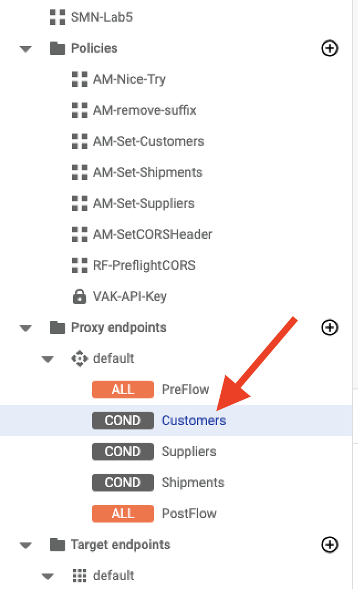
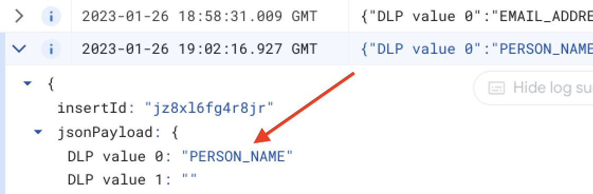

# Integrating External Services

## Overview

In this lab, you connect Apigee to the Cloud Data Loss Prevention (DLP) API using a **Service callout** policy. This is used to validate that the user is providing a valid email address. DLP can be used for many different data audit tasks. You configure your API to raise an error, and log the cause of the error to Cloud Logging using a **Message Logging** policy.

## Objectives

In this lab, you learn how to:
- Call the Google APIs from within Apigee
- Create and use a Service Account for API calls
- Filter the return from the DLP API into variables
- Raise an error when the DLP API detects a fake email address
- Log errors raised in Apigee to Cloud Logging


## Setup and Requirements

![[/fragments/startqwiklab]]


![[/fragments/cloudshell]]


<!-- ![[/fragments/apigeex-ui]] -->


## Task 0. Provison LAB resources 

1. Navigate to the the Google Cloud console at **https://console.cloud.google.com**.

2. Click Activate Cloud Shell (Activate Cloud Shell icon) in the top menu to open Cloud Shell

3.  To ensure that you are in the Cloud Shell home directory, execute the following command.

    ```bash
    cd ~ 
    ```

4. In Cloud Shell, confirm the default compute zone is set to the zone used by the gateway VM.

    <ql-code-block templated>
    gcloud config set compute/zone {{{project_0.default_zone|vm_zone}}}
    </ql-code-block>
    

5. Clone the class repository and move into the repository root folder.

    ```bash
    git clone https://github.com/fabltd/Apigee-utils
    cd Apigee-utils
    ```

    <ql-infobox>
     The following step runs a script that provisons all the resources you will need
    </ql-infobox>

6. Create and configure the gateway / legacy VMs and base API proxy using the following bash script.

   ```bash
    ./setup/install/lab3/install.sh
    ```

7. If you are prompted to generate SSH keys, confirm YES and press ENTER twice for passphrase.

8. Wait for the script to complete and you should see Done - Return to Apigee.

## Task 1. Enable Google Cloud APIs and test

1. In the Google Cloud console, from the Navigation menu (), select __API & Services > Library__.

    <ql-infobox>
    This page allows you to enable the APIs that will be used by the Apigee API proxy.
    </ql-infobox>

2.  In the **Search for APIs & Services** box, enter __DLP__ and press **ENTER**. A tile for the Cloud Data Loss Prevention (DLP) API will appear.

    

    <ql-infobox>
    The Cloud Data Loss Prevention API (DLP API) is a fully-managed service designed to help you discover, classify, and protect your most sensitive data. Amongst its many uses, it can evaluate the likelihood of email addresses being real or fake.
    </ql-infobox>

3. Click the DLP tile to be taken to the Product details page.

4. If the API shows **API Enabled**, proceed to the next step. If not, click **Enable** and wait for the API to be enabled before proceeding.

5. Click **Activate Cloud Shell** () in the top menu to open Cloud Shell.

6. In the Cloud Shell window, execute the following command.

    ```bash
    TOKEN=$(gcloud auth print-access-token)
    ```

    <ql-infobox>
    This generates an access token for your Cloud Shell user and stores the output in a variable called <strong>TOKEN</strong>.
    </ql-infobox>

7. To print the token to the screen, execute the following command.

    ```bash
    echo $TOKEN
    ```

    <ql-infobox>
    This should display a long string, which is the access token.
    </ql-infobox>

8. To test that the DLP API is enabled, execute the following command.

    <ql-code-block templated>
    curl -X POST "https://dlp.googleapis.com/v2/projects/$GOOGLE_CLOUD_PROJECT/locations/{{{project_0.default_region|default_region}}}/content:inspect"   \
    --header "Authorization: Bearer $TOKEN"   \
    --header 'Accept: application/json'    \
    --header 'Content-Type: application/json'  \
    --data '{"item":{"value":"test@google.com"}}' 
    </ql-code-block>

    **EXAMPLE OUTPUT**

    ```
    {
    "result": {
        "findings": [
            {
                "infoType": {
                "name": "EMAIL_ADDRESS"
                },
                "likelihood": "LIKELY",
                "location": {
                "byteRange": {
                    "end": "15"
                },
                "codepointRange": {
                    "end": "15"
                }
                },
                "createTime": "2023-01-26T12:19:41.620Z",
                "findingId": "2023-01-26T12:19:41.627009Z1658538611721249918"
            }
            ]
        }
    }
    ```

    <ql-infobox>
    This verifies that the API is working. It correctly identified <strong>test@google.com</strong> as likely to be a valid email address. You can call this API from Apigee and use it to help secure your API.
    </ql-infobox>


## Task 2. Create a Service Account

Apigee requires a Service Account with the correct permissions to be able to call the DLP and Logging APIs.

1. In the Google Cloud console, from the Navigation menu (), select __IAM & Admin > Service Accounts__.

2. In the top menu, click **+ Create Service Account.**

3. In first step of the wizard, set the following. 

    | Property | Value |
    | --- | --- |
    | Service account name | **sa-apigee-google-services** |
    | Service account description | **Service account for Apigee to access Google services** |

    <ql-infobox>
    The Service Account ID is populated automatically when you add the name.
    </ql-infobox>

4. Click **Create and Continue**.

5. In the second step, click the **Select a Role** dropdown and enter **DLP User** in the filter. Click **DLP User** to select it.

    

6.  Click **+ Add Another Role**

7. Click the **Select a Role** dropdown and enter **Logs Writer** in the filter. Click **Logs Writer** to select it.

8. Click **Continue** and **Done**.

9. In the Cloud Shell window, execute the following command.

    ```bash
    gcloud iam service-accounts list --filter="'DISPLAY NAME': sa-apigee-google-services"
    ```

    <ql-infobox>
    Note: this command assumes you named the service account  ​​<strong>sa-apigee-google-services​​</strong> . If your service account name is different, the command must be modified to use your service account name.
    </ql-infobox>

    **EXAMPLE OUTPUT**

    ```bash
    DISPLAY NAME: sa-apigee-google-services
    EMAIL: sa-apigee-google-services@qwiklabs-gcp-03-2a13b9bc2c16.iam.gserviceaccount.com
    DISABLED: False
    ```

10. Make a note of the value of EMAIL. This value is needed in a later step.

11. To store the value of __EMAIL__ in a environment variable, execute the following command, replacing **VALUE_OF_EMAIL** with the actual value obtained via the command above.

    ```bash
    SA=VALUE_OF_EMAIL
    ```

    **Example**

    ```bash
    SA=sa-apigee-google-services@qwiklabs-gcp-03-2a13b9bc2c16.iam.gserviceaccount.com
    ```

12. To confirm your service account has the required **Roles**, execute the following command. 

    ```bash
    gcloud projects get-iam-policy $GOOGLE_CLOUD_PROJECT --flatten="bindings[].members" --format='table(bindings.role)' --filter="bindings.members:$SA"
    ```

    You should see the following:

    ```bash
    ROLE: roles/dlp.user

    ROLE: roles/logging.logWriter
    ```

    <ql-infobox>
    If your output does not match the above, use the preceding steps as a guide and modify the permissions of your Service Account until the account has the necessary permissions. 
    </ql-infobox>


## Task 3. Extract a parameter into a variable

1. In a different browser tab within the same window, open the Apigee console at [console.cloud.google.com/apigee](https://console.cloud.google.com/apigee/).

    Alternatively, to open the Apigee console from the Google Cloud console Navigation menu (), select <b>Tools > Apigee</b>.

2. Verify your Apigee Organization is selected at the top of the console.

3. In the left navigation menu, select **Proxy Development > API Proxies** then click **SMN-Labs**. 

4. In the top menu, click **Develop**.

5. To edit the metadata to reflect Lab 3, click the pencil icon beside **Details**.

    

6. Modify the values as follows and click **Save**.

    | Property | Value |
    | --- | --- |
    | Display name | **SMN-Lab3** |
    | Description | **Show Me Now - LAB 3** |

7. In the Navigator, select **Customers** in the **Proxy endpoints default**. 

    

    <ql-infobox>
    Customers are identified by their email addresses. Suppliers and Shipments have a separate unique identifier.
    </ql-infobox>

8. In the development panel, click the + icon () for the **Proxy Endpoint default > Request > Customers** conditional flow.

    
 
9. In the dialogs, select **Create new policy** and select the **Extract Variables** policy from the **Mediation** group. 

10. Set the following properties and click **Add**. 

    | Property | Value |
    | --- | --- |
    | Name | **EV-Get-Email** |
    | Display name | **EV-Get-Email** |

11. In the development panel, locate the policy inside the **Customers** conditional flow and click the **EV-Get-Email** link.

12. Delete all the existing XML for the **EV-Get-Email** policy and replace it with the following.

    ```xml
    <?xml version="1.0" encoding="UTF-8" standalone="yes"?>
    <ExtractVariables continueOnError="false" enabled="true" name="EV-Get-Email">
        <DisplayName>EV-Get-Email</DisplayName>
        <Properties/>
        <Source>request</Source>
        <QueryParam name="email">
            <Pattern ignoreCase="true">{email}</Pattern>
        </QueryParam>
        <VariablePrefix>queryinfo</VariablePrefix>
        <IgnoreUnresolvedVariables>false</IgnoreUnresolvedVariables>
    </ExtractVariables>
    ```

    <ql-infobox>
    This policy captures the <strong>email</strong> query parameter of the GET request and stores it as a variable for use in the validation process.
    </ql-infobox>

13. In the development navigator panel, click **Proxy endpoints > default** to reopen the Proxy endpoint in the development panel.

14. In the XML, locate the  ```<Flow name="Customers">``` tag and the **EV-Get-Email** ```Step```.

15. Add a new Condition element between the closing ```</Name>``` before the closing ```</Step>``` tags as follows.

    ```xml
    <Condition>(request.verb = "GET")</Condition>
    ```

    <ql-infobox>
    The complete step should now be as follows.
    </ql-infobox>

    ```xml
    <Step>
        <Name>EV-Get-Email</Name>
        <Condition>(request.verb = "GET")</Condition>
    </Step>
    ```


## Task 4. Create a service callout

1. In the development panel, click the + icon () for the **Proxy Endpoint default > Request > Customers** conditional flow.

2. In the dialogs, select **Create new policy** and select the **Service Callout** policy from the **Extension** group. 

3. Set the following properties and click **Add**. 

    | Property | Value |
    | --- | --- |
    | Name | **SC-DLP-API** |
    | Display name | **SC-DLP-API** |
    | Type | **HTTP** |
    | HTTP Target |  | 

    <ql-infobox>
    Leave the **HTTP Target** blank.
    </ql-infobox>

4. In the development panel, locate the policy inside the **Customers** conditional flow and click the **SC-DLP-API** link.

5. Delete all the existing XML for the **SC-DLP-API** policy and replace it with the following.

    <ql-code-block templated language="xml">
    &lt;?xml version="1.0" encoding="UTF-8" standalone="yes"?&gt;
    &lt;ServiceCallout continueOnError="false" enabled="true" name="SC-DLP-API"&gt;
        &lt;DisplayName&gt;SC-DLP-API&lt;/DisplayName&gt;
        &lt;Request clearPayload="true"&gt;
            &lt;Set&gt;
                &lt;Verb&gt;POST&lt;/Verb&gt;
                &lt;Payload contentType="application/json"&gt;{
        "item": {
            "value": "{queryinfo.email}"
        }
    }
    &lt;/Payload&gt;
            &lt;/Set&gt;
        &lt;/Request&gt;
        &lt;Response&gt;response&lt;/Response&gt;
        &lt;HTTPTargetConnection&gt;
            &lt;Properties/&gt;
            &lt;URL&gt;https://dlp.googleapis.com/v2/projects/{organization.name}/locations/{{{project_0.default_region|default_region}}}/content:inspect&lt;/URL&gt;
            &lt;Authentication&gt;
                &lt;GoogleAccessToken&gt;
                    &lt;Scopes&gt;
                        &lt;Scope&gt;https://www.googleapis.com/auth/cloud-platform&lt;/Scope&gt;
                    &lt;/Scopes&gt;
                &lt;/GoogleAccessToken&gt;
            &lt;/Authentication&gt;
        &lt;/HTTPTargetConnection&gt;
    &lt;/ServiceCallout&gt;
    </ql-code-block>

   

    <ql-infobox>
    This policy calls the DLP API. The input value is <strong>queryinfo.email</strong>. The output is passed to the <strong>response</strong>. A separate policy is needed to filter and extract values from the response.
    </ql-infobox>

6. In the development navigator panel, click **Proxy endpoints > default** to reopen the Proxy endpoint in the development panel.

7. In the XML, locate the  ```<Flow name="Customers">``` tag and the **SC-DLP-API** ```Step```.

8. Add a new Condition element between the closing ```</Name>``` before the closing ```</Step>``` tags as follows.

    ```xml
    <Condition>queryinfo.email != null</Condition>
    ```

    <ql-infobox>
    The complete step should now be as follows.
    </ql-infobox>

    ```xml
    <Step>
        <Name>SC-DLP-API</Name>
        <Condition>queryinfo.email != null</Condition>
    </Step>
    ```

    <ql-infobox>
    This places a condition on the policy that ensures the DLP API will only be called when an email address is sent as a query parameter.

    Queries without an email query parameter will continue to return all customers.
    </ql-infobox>

9. Add another new policy to the **Customers** conditional flow. This one should be an **Extract Variables** policy, and should have the following properties. 

    | Property | Value |
    | --- | --- |
    | Name | **EV-DLP** |
    | Display name | **EV-DLP** |

10. In the development panel, locate the policy inside the **Customers** conditional flow and click the **EV-DLP** link.

11. Delete all the existing XML for the **EV-DLP** policy and replace it with the following.

    ```xml
    <?xml version="1.0" encoding="UTF-8" standalone="yes"?>
    <ExtractVariables continueOnError="false" enabled="true" name="EV-DLP">
        <DisplayName>EV-DLP</DisplayName>
        <Properties/>
        <Source>response</Source>
        <JSONPayload>
            <Variable name="name0" type="string">
                <JSONPath>$.result.findings[0].infoType.name</JSONPath>
            </Variable>
            <Variable name="name1" type="string">
                <JSONPath>$.result.findings[1].infoType.name</JSONPath>
            </Variable>
        </JSONPayload>
        <VariablePrefix>dlp</VariablePrefix>
        <IgnoreUnresolvedVariables>true</IgnoreUnresolvedVariables>
    </ExtractVariables>
    ```

    <ql-infobox>
    This policy parses the JSON payload returned by the
    DLP API and extracts just the speficic <strong>infoType</strong> required by your application. In a production environment you would expand this to extract other values.

    The variables <strong>name0</strong> and <strong>name1</strong> are extracted because the  DLP API may detect a person's name in the email address as well as the email address itself. The position of the email can be 0 or 1 in the returned JSON array. 

    The <strong>IgnoreUnresolvedVariables</strong> element is set to  true. This ensures <strong>name1</strong> is ignored if the DLP API does not detect a person's name.
    </ql-infobox>

12. In the development navigator panel, click **Proxy endpoints > default** to reopen the Proxy endpoint in the development panel.

13. In the XML, locate the  ```<Flow name="Customers">``` tag and the **EV-DLP** ```Step```.

14. Add a new Condition element between the closing ```</Name>``` before the closing ```</Step>``` tags as follows.

    ```xml
    <Condition>(request.verb = "GET"  OR request.verb = "PUT")</Condition>
    ```

    <ql-infobox>
    The complete step should now be as follows.
    </ql-infobox>

    ```xml
    <Step>
        <Name>EV-DLP</Name>
        <Condition>(request.verb = "GET" or request.verb = "PUT")</Condition>
    </Step>
    ```

15. Click **Save** and **Deploy**.

16. In the Deploy dialog, add the Service Account identifier that you saved in an earlier step.

    

    <ql-infobox>
    If you have mislaid your service account identifier, the steps to discover it are available in Task 2 above.
    </ql-infobox>

17. Click __Deploy__ and then __Confirm__ and wait until the revision has finished deploying.


## Task 5. Test the service callout

In order to test the service callout, you need two values: the URL of your proxy and a valid API key. You begin by retrieving and noting down these values.

If you don't have a convenient notepad application to save these values, you can open another Chrome tab and use https://www.rapidtables.com/tools/notepad.html. 

1.  In the left navigation menu, select **Management > Environments** and then click **Environment Groups** copy the hostname that includes an IP Address from __test-env-group__. Save the hostname locally.

    

2. In the left navigation menu, select **Distribution > Apps** and click **show-me-now**.

3. In the Credentials panel, click **Show** next to **Key** and copy the value. Save the key locally.

4. Return to the previous browser tab which has Cloud Console open.

5. If Cloud Shell is no longer open, in the top menu, click **Activate Cloud Shell** () to open Cloud Shell. If it is open but has disconnected, click __Reconnect__.

6. To test your callout, execute the following command in Cloud Shell, replacing **APIGEE_URL** with your **URL**, and **APIGEE_API_KEY** with your key. Be careful to preserve the single quotes **'**. 

    <ql-infobox>
    <strong>Hint</strong>: customize the command inside a notepad application so that you can easily retrieve it again later in the lab.
    </ql-infobox>

    ```bash
    curl -X 'GET' \
    'https://APIGEE_URL/show-me-now/v0/customers?email=dmcconnel1g@google.it' \
    -H 'accept: */*'  \
    -H 'apikey: APIGEE_API_KEY'
    ```

    **EXAMPLE COMMAND**

    ```bash
    curl -X 'GET' \
    'https://34.107.155.147.nip.io/show-me-now/v0/customers?email=dmcconnel1g@google.it' \
    -H 'accept: */*'  \
    -H 'apikey: L6DyrxBdik0KtQ8ikTodHRxekrG1tNC8GHk1Y70XIvXBF3tO'
    ```

    <ql-infobox>
    You should see the following response.
    </ql-infobox>

    ```bash
    {"apiStatus":"success","msg":"Fetching customers","result":[{"Email":"dmcconnel1g@google.it","PostalCode":"M4P","StateOrProvince":"Saskatchewan","Country":"Canada","Address2":"Room 1706","LastName":"McConnel","StreetAddress":"3961 Grim Terrace","FirstName":"Dimitry"}]}
    ```

7. Leave Cloud Shell open and return to the browser tab with the Apigee console.

8. In the left navigation menu, select **Proxy Development > API Proxies**.

9. From the proxy list, select **SMN-Labs**. To switch to the debugging view, click **Debug**.

    <ql-infobox>
    The debug tool is used to trace API requests that are handled by the proxy. Once started, the debug session will run for 10 minutes.
    </ql-infobox>

10. Click **Start Debug Session**.

11. In the **Start debug session** dialog, on the Environment dropdown, select **test-env** and click **Start**.

    <ql-infobox>
    The deployed revision number will also show in the dropdown.
    </ql-infobox>

12. Return to Cloud Shell and press the up arrow on your keyboard. This should show the command you sent earlier.

    <ql-infobox>
    If the command is no longer available in Cloud Shell, retrieve it from the notepad application where you customized it in an earlier step.
    </ql-infobox>

13. Execute the command, return to the Apigee console, and click the request record in the transaction list to reveal the transaction map. 


14. In the Transaction Map, click the Service Call out **SC-DLP-API** to reveal the details pane. 


15. Scroll to the end of the details pane and locate the **Response Content**. This contains the response from the DLP API and shows that the Service Callout is working.


## Task 6. Use RaiseFault policies to handle errors

The proxy should raise an error if a false email address is provided, and otherwise continue. This behavior is implemented using a RaiseFault policy.

1. In the Apigee tab, click **Develop** in the top menu to switch to the development view. 

2. In the development view navigator panel, click **Proxy endpoints > default > Customers** to open the Proxy endpoint in the development panel with the **Customers** conditional flow highlighted.

3. Add another new policy to the **Customers** conditional flow. This one should be a **Raise Fault** policy, and should have the following properties. 

    | Property | Value |
    | --- | --- |
    | Name | **RF-Not-Email** |
    | Display name | **RF-Not-Email** |

4. In the development panel, locate the policy **RF-Not-Email** inside the Preflow and click the **RF-Not-Email** link.

5. In the policy editor pane, remove all the current XML and replace it with the following.

    ```xml
   <?xml version="1.0" encoding="UTF-8" standalone="yes"?>
    <RaiseFault continueOnError="false" enabled="true" name="RF-Not-Email">
        <DisplayName>RF-Not-Email</DisplayName>
        <Properties/>
        <FaultResponse>
            <Set>
                <Headers/>
                <Payload contentType="text/plain"/>
                <StatusCode>403</StatusCode>
                <ReasonPhrase>Invalid Email</ReasonPhrase>
            </Set>
        </FaultResponse>
        <IgnoreUnresolvedVariables>true</IgnoreUnresolvedVariables>
    </RaiseFault>
    ```

    <ql-infobox>
    The policy raises an error and assigns the 403 status code. Currently, this policy runs on every request. It needs a condition to ensure that it only runs when no valid email address is detected.
    </ql-infobox>

6. In the development navigator panel, click **Proxy endpoints > default** to reopen the Proxy endpoint in the development panel.

7. In the XML, locate the  ```<Flow name="Customers">``` tag and the **RF-Not-Email** ```Step```.

8. Add a new Condition element between the closing ```</Name>``` before the closing ```</Step>``` tags as follows.

    ```xml
     <Condition>dlp.name0 != null and dlp.name0 != "EMAIL_ADDRESS" and dlp.name1 != "EMAIL_ADDRESS"</Condition>
    ```

    <ql-infobox>
    The complete step should now be as follows.
    </ql-infobox>

    ```xml
    <Step>
        <Name>RF-Not-Email</Name>
        <Condition>dlp.name0 != null and dlp.name0 != "EMAIL_ADDRESS" and dlp.name1 != "EMAIL_ADDRESS"</Condition>
    </Step>
    ```

    <ql-infobox>
    The condition checks to see if either variable from the DLP service callout contains the string <strong>EMAIL_ADDRESS</strong>. If the string does not exist, the policy runs.
    </ql-infobox>

9. Click **Save**.


## Task 7. Use MessageLogging policies to capture values

Debugging is useful during development, but does not meet the needs of production. In this task, you pass the result of the DLP API call to Cloud Logging using a Message Logging policy.

1. In the Apigee development view navigator panel, click **Proxy endpoints > default > Customers** to open the Proxy endpoint in the development panel with the **Customers** conditional flow highlighted.

3. Add another new policy to the **Customers** conditional flow. This one should be a **Message Logging** policy from the **Extensions** group, and should have the following properties. 

    | Property | Value |
    | --- | --- |
    | Name | **ML-GCP-Logging** |
    | Display name | **ML-GCP-Logging** |

4. In the Proxy endpoints > default development panel, click the policy step actions icon () beside **ML-GCP-Logging** in the Customers Flow and click **Move up** to position the policy before **RF-Not-Email**

    <ql-infobox>
    The ML-GCP-Logging policy runs before the RF-Not-Email policy.
    </ql-infobox>

5. Click the **ML-GCP-Logging** link to open the policy in the policy editor. Remove all the current XML and replace it with the following.

    ```xml
    <?xml version="1.0" encoding="UTF-8" standalone="yes"?>
    <MessageLogging name="ML-GCP-Logging">
        <CloudLogging>
            <LogName>projects/{organization.name}/logs/{apiproxy.name}</LogName>
            <Message contentType="application/json">{
            "DLP value 0" : "{dlp.name0}",
            "DLP value 1" : "{dlp.name1}"
            }</Message>
            <Labels>
                <Label>
                    <Key>app</Key>
                    <Value>show-me-now-logging-demo</Value>
                </Label>
            </Labels>
            <ResourceType>api</ResourceType>
        </CloudLogging>
    </MessageLogging>
    ```

    <ql-infobox>
    This policy constructs a log in JSON format and sends it to Cloud Logging. The Log is named after your Apigee Organisation and Api Proxy Name. The content of the Log is the variables returned from the DLP service callout.
    </ql-infobox>

6. Click **Save** and **Deploy**.

7. In the Deploy dialog, provide the Service Account identifier you saved earlier if it is not already populated and click __Deploy__ and then __Confirm__. 

8. To verify the update has deployed click **Overview** and check the Status column.

9. Return to Cloud Shell and press the up arrow on your keyboard. This should show the command you sent earlier.

    <ql-infobox>
    If the command is no longer available in Cloud Shell, retrieve it from the notepad application where you customized it in an earlier step.
    </ql-infobox>

10. Execute the command. It should run successfully and return the same response as before.

    <ql-infobox>
    <strong>Hint</strong>: The next step is much easier to do in a notepad application than the terminal.
    </ql-infobox>

11. Copy the existing command and replace the email address **dmcconnel1g@google.it** with the name **McConnell**. Add the following new line beneath the URL.

    ```bash
    -s -o /dev/null -w "%{http_code} \n" \
    ```

    <ql-infobox>
    This filters the response and displays just the status code on a new line.
    </ql-infobox>

    <ql-infobox>
    Your complete command should be similar to the example below. Note the back slash **\** that allows the command to be split on multiple lines, and be careful to preserve the quotation marks.
    </ql-infobox>

    ```bash
    curl -X 'GET' \
    'https://34.107.155.147.nip.io/show-me-now/v0/customers?email=McConnell' \
    -s -o /dev/null -w "%{http_code} \n" \
    -H 'accept: */*'  \
    -H 'apikey:L6DyrxBdik0KtQ8ikTodHRxekrG1tNC8GHk1Y70XIvXBF3tO'
    ```

12. Execute the command. You should get the following error response:

    ```bash
    403 
    ```

    <ql-infobox>
    This is the status code you configured in the Raise Fault policy.
    </ql-infobox>

13. In the Google Cloud console, from the Navigation menu (), select __Logging > Logs Explorer__.

14. In the Query box, enter the following query and click **Run Query**.

    ```
    "show-me-now-logging-demo"
    ```

    <ql-infobox>
    This query matches the Label value set in the Message Logging policy. If you change the Label in the Message Logging policy, you must change the query to match.
    </ql-infobox>
  
    You should see two different kinds of log entries. The first shows that DLP detected a valid email address.

    ```
    {"DLP value 0":"EMAIL_ADDRESS", "DLP value 1":""}
    ```

    The second shows that DLP detected a person's name. 

    ```
    {"DLP value 0":"PERSON_NAME", "DLP value 1":""}
    ```

    <ql-infobox>
    This is the request that triggered the 403 error that prevented the invalid request from being passed to the target.
    </ql-infobox>

## Task 8. Set up a logs-based alert policy

The team at MHC is very busy with operational tasks and would like to eliminate toil. To assist, you set up a log-based alert to notify the team when the DLP API fails to detect an email. 

1. In the Google Cloud console, from the Navigation menu (), select __Logging > Logs Explorer__.

14. In the query box, enter the following query and click **Run Query**.

    ```
    "show-me-now-logging-demo"
    ```

3. Locate a line in the logs where the output is:

    ```
    {"DLP value 0":"PERSON_NAME", "DLP value 1":""}
    ```

4. Click the line to expand the log entry, and then click **PERSON_NAME** inside jsonPayload. 

    

5. Click **Show matching entries**.

    

    <ql-infobox>
    A line is added to the query panel narrowing the result to just the error conditions.
    </ql-infobox>

    ```
    jsonPayload."DLP value 0"="PERSON_NAME"
    ```

6. Above the log viewer and under the query box, locate and click the button **Create alert**.

    

7. In the dialog, set the following and click **Next**.

    | Property | Value |
    | --- | --- |
    | Alert Policy Name | **MHC-Invalid Email** |
    | Documentation | **An attempt was made to GET customers without a valid email address** |

8. At **Choose logs to include in the alert**, click **Next**.

    <ql-infobox>
    Note that the content matches the current content of the query editor.
    </ql-infobox>

9. At **Set notification frequency and auto close duration**, set the **Time between notifications** to **5 min**.

10. At **Set notification frequency and auto close duration**, set the **Incident autoclose duration** to **30 min** and click **Next**.

11. At **Who should be notified?**, click the **Notification Channels** box and select **Manage Notifications**.

    <ql-infobox>
    The Notification channels open in a new tab. 
    </ql-infobox>

12. Select **Email** and click **Add New**. Add your real email address and name to ensure you see notifications and then click **Save**.

13. Return to the **Logs Explorer** tab and click the refresh button next to **Manage Notification Channels**.

    

14. Select your email address and click **OK**, then click **Save**.
 
15. Return to Cloud Shell and execute the curl command without the email address.

    **EXAMPLE**

    ```bash
    curl -X 'GET' \
    'https://34.107.155.147.nip.io/show-me-now/v0/customers?email=McConnell' \
    -s -o /dev/null -w "%{http_code} \n" \
    -H 'accept: */*'  \
    -H 'apikey:L6DyrxBdik0KtQ8ikTodHRxekrG1tNC8GHk1Y70XIvXBF3tO'
    ```

16. You should soon receive the following email.

  

### **Congratulations!** You have used the DLP API to validate if an email is valid or not, logged the results of the Service Callout to the API, and set up an alert policy to let the team at MHC know when an error occurs.

![[/fragments/copyright]]
