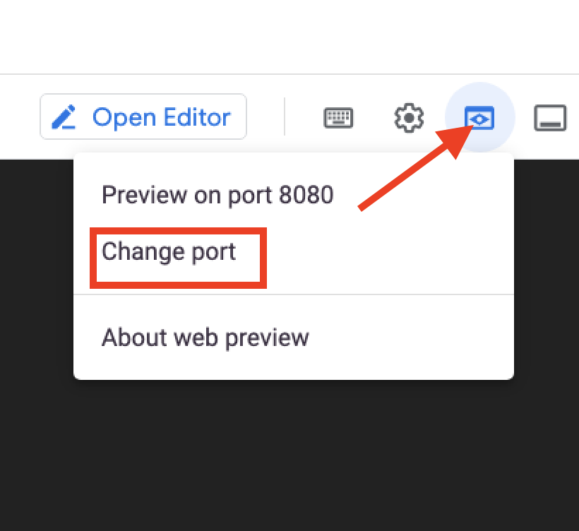
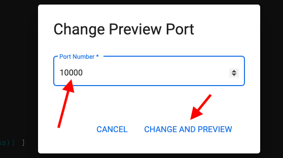

# Hardening your API

## Overview

In this lab, you investigate the security weakness that still exists in the APIs. Your API may now appear secure but can it be manipulated? Is it vulnerable to external attack?

## Objectives

In this lab, you learn how to:
- Implement the Apigee JSON Threat Protection policy
- Use Google Cloud Armor

## Setup and Requirements

![[/fragments/startqwiklab]]


![[/fragments/cloudshell]]


<!-- ![[/fragments/apigeex-ui]] -->

## Task 0. Provison LAB resources 

1. Navigate to the the Google Cloud console at **https://console.cloud.google.com**.

2. Click Activate Cloud Shell (Activate Cloud Shell icon) in the top menu to open Cloud Shell

3.  To ensure that you are in the Cloud Shell home directory, execute the following command.

    ```bash
    cd ~ 
    ```

4. In Cloud Shell, confirm the default compute zone is set to the zone used by the gateway VM.

    <ql-code-block templated>
    gcloud config set compute/zone {{{project_0.default_zone|vm_zone}}}
    </ql-code-block>

5. Clone the class repository and move into the repository root folder.

    ```bash
    git clone https://github.com/fabltd/Apigee-utils
    cd Apigee-utils
    ```

    <ql-infobox>
    The following step runs a script that provisons all the resources you setup in Lab 4
    </ql-infobox>

6. Create and configure the gateway / legacy VMs and base API proxy using the following bash script. If you are prompted to generate SSH keys, confirm YES and press ENTER twice for passphrase.

   ```bash
    ./setup/install/lab5/install.sh
    ```

7. Wait for the script to complete and you should see Done - Return to Apigee.

## Task 1. The hacker page

The development team at MHC thinks the solution is secure. The security team at MHC have raised concerns about the security. To prove to the developers that the solution can be compromised they have developed a simple HTML page that allows for manipulation of API endpoints.

In this task, you confirm the findings of the security team. You then implement solutions to overcome the issues.

<ql-infobox>
The start point for this lab is a simplified version of your existing project to allow more focused exploration of the problem and solution.
</ql-infobox>

1. In the Google Cloud console, in the top menu, click **Activate Cloud Shell** () to open Cloud Shell.

2. To ensure that you are in the Cloud Shell home directory, execute the following command.

    ```bash
    cd ~/
    ``` 

3. To clone the class repository and move into the repository hacker folder, execute the following command.

    ```bash
    cd Apigee-utils/hacker
    ```

4. To start the hacker page, execute the following command to run a help script.

    ```bash
    ./start.sh
    ```

    <ql-infobox>
    The script queries Apigee for the API Hostname, populates this into an HTML form, then runs the hacker page in a simple web server (lite-server). 
    </ql-infobox>

5. Verify that lite-server is running correctly on port 10000. The output should resemble the following.

    ```bash
    [Browsersync] Access URLs:
    -----------------------------------
        Local: http://localhost:10000
        External: http://172.17.0.4:10000
    ```

6. In **Cloud Shell**, click **Web preview > Preview on port 10000** to view the hacker page.

    
    

7. Verify the Endpoint address in the hacker page. Check that the URL contains your Apigee server Host. It should resemble the following. 

    ```bash
    https://34.149.141.95.nip.io/show-me-now/v0/customers?email=acelle1t@boston.com
    ```

    

8. Click **Send** and verify you see the following response. 

    ```json
    {
        "apiStatus": "success",
        "msg": "Fetching customers",
        "result": [
            {
            "Email": "acelle1t@boston.com",
            "Country": "United States",
            "PostalCode": "33129",
            "StreetAddress": "29419 Fairview Avenue",
            "FirstName": "Albrecht",
            "LastName": "Celle",
            "StateOrProvince": "Florida",
            "Address2": "Room 205"
            }
        ]
    }
    ```

    <ql-infobox>
    Note: You did not need an API key as the policy has been disabled for this lab. You can enable the API key if you wish in the following bonus section.
    </ql-infobox>

**OPTIONAL BONUS TASK**

The steps in the bonus task are not required for this lab. If you do not wish to do the bonus, proceed directly to Task 2.

1. To enable the API Key, locate the **VAK-API-Key** policy in the Apigee proxy and change **enabled** from **false** to **true**.

    Example:

    ```xml
    <?xml version="1.0" encoding="UTF-8" standalone="yes"?>
    <VerifyAPIKey continueOnError="false" enabled="true" name="VAK-API-Key">
        <DisplayName>VAK-API-Key</DisplayName>
        <Properties/>
        <APIKey ref="request.header.apikey"/>
    </VerifyAPIKey>

    ```

2. Create an API key by creating an **API Product**, a **Developer** and an **App**, and then using **show** to obtain the API key.

    <ql-infobox>
    Detailed instructions for creating an API key are available in Lab 1.
    </ql-infobox>

3. To use the API key from the hacker page, paste it into the API Key textbox and ensure it is present when calling any methods on the API.


## Task 2. Expose the vulnerability

1. To explore the vulnerability in the hacker page, change the querystring in the Endpoint address as follows.

    **Remove** 

    ```
    customers?email=acelle1t@boston.com
    ```

    **Replace with** 

    ```
    suppliers
    ```

    **EXAMPLE**

    ```
    https://34.111.192.40.nip.io/show-me-now/v0/suppliers
    ```

    <ql-infobox>
    <strong>Note</strong>: you are replacing only the proxy path suffix. Your URL and base path remain the same. If you make a mistake, you can refresh the page to return to the default value. 
    </ql-infobox>

2. To explore adding data, select **post** in the **method** dropdown.

    <ql-infobox>
    Post requests have a body. You provide this in the **JSON Payload** text area.
    </ql-infobox>

3. To test the API's vulnerability to unauthorized POST requests, set the payload to the following malicious content.

    ```json
    {
        "Customers": [
            "hacker@Ijustbrokein.com"
        ],
        "Address": {
            "StreetAddress": "A Street",
            "Address2": "A road",
            "StateOrProvince": "Florida",
            "Country": "United States",
            "PostalCode": "33680"
        },
        "Info": {
            "Name": "Apigee Rules Co"

        }
    }
    ```

    <ql-infobox>
    The hacker is attempting to add themselves as a new supplier with their email as a customer.
    </ql-infobox>

4. Click **Send** and examine the contents of the **Return from API** textarea. It should be similar to the following.

    ```json
    {
    "api": "Suppliers",
    "msg": "Supplier created",
    "id": "AuQXg0TxkNf1rMS82Qmm"
    }
    ```

5. Select the **id** value in the text area and copy it.

6. To test that your supplier was successfully created, copy the id value from the text area and add ```?id=``` and the copied value onto the end of the **Endpoint address**.

    **Example** 

    ```
    https://34.111.192.40.nip.io/show-me-now/v0/suppliers?id=AuQXg0TxkNf1rMS82Qmm
    ```
7. Change the **method** to **get** and click **Send**.

    <ql-infobox>
    You should see that you have successfully added your malicious payload to the data.
    </ql-infobox>

    **EXAMPLE**

    ```json
    {
        "apiStatus": "success",
        "msg": "Fetching suppliers",
        "result": [
            {
            "id": "AuQXg0TxkNf1rMS82Qmm",
            "Customers": [
                "hacker@Ijustbrokein.com"
            ],
            "Address": {
                "PostalCode": "33680",
                "StateOrProvince": "Florida",
                "StreetAddress": "A Street",
                "Address2": "A road",
                "Country": "United States"
            },
            "Info": {
                "Name": "Apigee Rules Co"
            }
            }
        ]
    }
    ```

## Task 3. Prevent malformed payloads

Apigee provides a policy that can validate the payload provided in Task 2 and raise an error if the JSON does not match the expected format. 

1. In a separate browser tab from Google Cloud console, open the Apigee console at [console.cloud.google.com/apigee](https://console.cloud.google.com/apigee/).

    Alternatively, to open the Apigee console from the Google Cloud console Navigation menu (), select **Tools > Apigee**.
    
2. Verify that your Apigee Organization is selected at the top of the console.

3. In the left navigation menu, select **Proxy development > API Proxies**.

4. From the proxy list, select **SMN-Labs**. To switch to the development view, click **Develop**.

5. In the development navigation panel, click **Proxy endpoints > default > Suppliers** to open the development pane for the flow with the Suppliers highlighted.

6. In the development panel, click the (+) icon for the **Proxy Endpoint default > Request > Suppliers** conditional flow. 
 
7. In the dialogs, select **Create new policy**, and select the **JSON Threat Protection** policy from the Security group.

8. Set the policy properties as follows.

    | Property | Value |
    | --- | --- |
    | Name | **JSONTP-Suppliers** |
    | Display name | **JSONTP-Suppliers** |

9. Click **Add**.

10. In the development panel, locate the policy inside the **Suppliers** conditional flow and click the **JSONTP-Suppliers** link.

11. Delete all the existing XML for the **JSONTP-Suppliers** policy and replace it with the following.

    ```xml
    <?xml version="1.0" encoding="UTF-8" standalone="yes"?>
    <JSONThreatProtection continueOnError="false" enabled="true" name="JSONTP-Suppliers">
        <DisplayName>JSONTP-Suppliers</DisplayName>
        <Properties/>
        <ArrayElementCount>0</ArrayElementCount>
        <ContainerDepth>3</ContainerDepth>
        <ObjectEntryCount>8</ObjectEntryCount>
        <ObjectEntryNameLength>25</ObjectEntryNameLength>
        <Source>request</Source>
        <StringValueLength>500</StringValueLength>
    </JSONThreatProtection>
    ```

    <ql-infobox>
    This policy prevents the JSON payload from including arrays. The hacker has discovered that users are added to an array and succeeded in creating a supplier with himself attached as a customer. This was not planned or anticipated by the designers of the API, and can be mitigated by using this policy to exclude arrays.
    </ql-infobox>

    **JSON ARRAY EXAMPLE**

    ```json
     "Customers": [
        "hacker@Ijustbrokein.com"
      ]
    ```

    <ql-infobox>
    This policy only executes if the content-type of the request is set to 'application/json'. This setting is expected by the API, and provided by the hacker form.
    </ql-infobox>

12. Click **Save** and **Save as New Revision**.

13. Click **Deploy**.

14. In the Deploy dialog, add the Service Account identifier. 

    <ql-infobox>
    In the cloud shell open a new tab click (+), run the following command to get your service account.
    </ql-infobox>

    ```bash
    gcloud iam service-accounts list --filter="'DISPLAY NAME': Service account for Apigee to access Google services"
    ```

15. Copy the **Email** value an past into the **service account** field of the Deploy dialog.

16. Wait for your proxy to deploy and then repeat steps 2, 3, and 4 from Task 3. This time, you should receive the following error when you click **Send**.

    ```json
    {
    "fault": {
        "faultstring": "JSONThreatProtection[JSONTP-Suppliers]: Execution failed. reason: JSONThreatProtection[JSONTP-Suppliers]: Exceeded array element count at line 14",
        "detail": {
        "errorcode": "steps.jsonthreatprotection.ExecutionFailed"
        }
    }
    }
    ```

17. To test that the malicious array element is triggering the error, remove the following from the payload, including the trailing comma (,).  

    ```json
    "Customers": [
            "hacker@Ijustbrokein.com"
        ],
    ```

    <ql-infobox>
    If you fail to remove the comma, you will receive another error because the JSON will not be well formed..
    </ql-infobox>


18. To resubmit the payload, click **Send**. This time, the new supplier should be added.

    <ql-infobox>
    You have now improved the security of your API. In production you would add a policy for each API endpoint and an overall policy that is slightly more permissive to cover all endpoints. This could be implemented as a shared flow.
    </ql-infobox>


## Task 4. External threat protection with Cloud Armor

Security in depth is a cybersecurity approach that uses multiple layers of security for protection. In simple terms, with a security-in-depth approach, if a bad actor breaches one layer of defence, they might be contained by the next layer of defence.

In this task, you add a Google Cloud Armor security policy to protect your load balancer and restrict access to your API to requests sent via the gateway VM. 

[Google Cloud Armor](https://cloud.google.com/armor) is Google Cloud's web application firewall. A single Google Cloud Armor policy can be specified for a load balancer. In this lab, you use a Google Cloud Armor security policy to reject specific traffic before it reaches the Apigee runtime instance, protecting your API.


1. In the Google Cloud console, in the top menu, click **Activate Cloud Shell** () to open Cloud Shell.


    <ql-infobox>
    To configure Google Cloud Armor, you require the IP address of the test (Gateway) VM. This can be retrieved using the Google Cloud SDK, which is preinstalled in Cloud Shell.
    </ql-infobox>

2. To retrieve the IP address of the Gateway VM, execute the following command.

    ```bash
    gcloud compute instances describe gateway \
  --format='get(networkInterfaces[0].accessConfigs[0].natIP)'
    ```

3. If you see the following prompt, type **n** and **enter**.

    ```bash
    Did you mean zone X for instance: [gateway] (Y/n)?
    ```

    <ql-infobox>
    gcloud fetches the zone from the instance metadata. The returned result should be the IP address of your gateway VM.
    </ql-infobox>

    **EXAMPLE**

    ```bash
    34.139.241.96
    ```

    <ql-infobox>
    You can also find the IP address in the entry for the gateway VM on the Compute Engine page in Google Cloud console.
    </ql-infobox>

4. Make a note of this IP address. You will need it when configuring Google Cloud Armor.

5. In the Google Cloud console, from the Navigation menu (), navigate to __Network security > Cloud Armor policies__.

6. Click **Create policy** and set the following properties.

    | Property | Value |
    | --- | --- |
    | Name | **apigee-protect-apis** |
    | Description | **Protects Apigee Ingress** |
    | Policy Type | **Backend security policy** |
    | Default rule action | **Deny - 403 Forbidden** |

    <ql-infobox>
    This security policy uses rules to block specific traffic intended for our Apigee API.
    </ql-infobox>

7. Click **Next Step** and then **Add Rule**.  

8. Set the following properties. Be sure to replace **IPADDRESS** with the value of your gateway IP address.


    | Property | Value |
    | --- | --- |
    | Description | **Allowed Countries** |
    | Mode | **Advanced** |
    | Match | **inIpRange(origin.ip, 'IPADDRESS/32')** |
    | Action | **Allow** |
    | Priority | **1000** |

    **EXAMPLE Match value**

    ```
    inIpRange(origin.ip, '34.139.241.96/32')
    ```

A Basic mode rule can only specify IP addresses or IP address ranges to match. In this case, you used Advanced Mode to add the IP address. You could further expand the rule as detailed here in the [Google Cloud Armor documentation](https://cloud.google.com/armor/docs/configure-security-policies#creating-policy-rules).

<ql-infobox>
    Your rule restricts API traffic to the gateway VM. You could use a rule like this to restrict traffic to your development environment. 
    </ql-infobox>

9. Click **Done** and **Create Policy**.

    <ql-infobox>
    The Policies tab shows that the protect-apis policy has 0 targets because it is not yet attached to your load balancer.
    </ql-infobox>

10.  Next to **apigee-protect-apis**, click the policy menu button (()), and then click **Apply policy to target**.


11. For the **Load balancer backend service** dropdown, select **backend-service** and click **Add**.

    <ql-infobox>
    The <strong>protect-apis</strong> policy details page should soon show that the policy applies to 1 target.
    </ql-infobox>

    <ql-infobox>
    <strong>Note:</strong> It may take a few minutes for Google Cloud Armor changes to propagate to the target.
    </ql-infobox>


## Task 5. Test the Google Cloud Armor security policy

1. Return to the browser tab where Cloud Shell is open and, if necessary, click **Reconnect** to restablish a session. If Cloud Shell is no longer open, in the Google Cloud console, in the top menu, click **Activate Cloud Shell** () to open Cloud Shell.

2. To ensure you are in the **hacker** folder, execute the following command in the Cloud Shell terminal.

    ```bash
    cd ~/Apigee-utils/hacker
    ```

3. To start the hacker page, execute the following command to run a help script.

    ```bash
    ./start.sh
    ```

4. In **Cloud Shell**, click **Web preview > Preview on port 10000** to view the hacker page.

    <ql-infobox>
    You may need to use the change port dialog to switch from the default port 8080.
    </ql-infobox>

5. To send the default **GET** request from the form, click **Send**.

6. Verify you receive an empty object as the response. 


    ```json
    {}
    ```

    <ql-infobox>
    You should see an empty response because your request was blocked by Google Cloud Armor. If you recieve a response, then the Cloud Armor changes may have not fully propagated to the target yet. Wait a few minutes and try again.
    </ql-infobox>

7. Copy the entire content of the **Endpoint Address** textbox from the hacker form and make a note of it. 

8. At the top of the Cloud Shell window, click the + to open a new terminal tab. 

    ()

9. In the new tab, execute the following command.

    ```bash
    gcloud compute ssh gateway
    ```

    <ql-infobox>
    This makes an SSH connection to the gateway VM.
    </ql-infobox>

10. If you see the following prompt, type **n** and **enter**.

    ```bash
    Did you mean zone X for instance: [gateway] (Y/n)?
    ```

    <ql-infobox>
    gcloud fetches the zone from the meta-data data and the returns the ip address of your gateway VM.
    </ql-infobox>

11. Verify that you are at the gateway SSH prompt. It should resemble the following.
 
    ```bash
    student_02_fdcd8f383fd1@gateway:~$
    ```

    <ql-infobox>
    Retrieve the <strong>Endpoint address</strong> value you saved earlier. It is required in the next step.
    </ql-infobox>

12. Execute the folowing command, substituting your saved endpoint address for the **HACKER_ENDPOINT_ADDRESS** placeholder.

    ```bash
    curl HACKER_ENDPOINT_ADDRESS
    ```

    **EXAMPLE Command**

    ```
    curl https://34.149.141.95.nip.io/show-me-now/v0/customers?email=acelle1t@boston.com
    ```

13. Verify you receive the appropriate customer data.

    **EXAMPLE Response**

    ```json
    {"apiStatus":"success","msg":"Fetching customers","result":[{"Email":"acelle1t@boston.com","LastName":"Celle","Country":"United States","FirstName":"Albrecht","PostalCode":"33129","Address2":"Room 205","StateOrProvince":"Florida","StreetAddress":"29419 Fairview Avenue"}]}
    ```

    <ql-infobox>
    You are able to reach Apigee from the gateway VM, but not from your Hacker page. 
    </ql-infobox>


### **Congratulations!** You have implemented security in depth. You learned how to implement a JSON Threat Protection policy and used a Google Cloud Armor policy to reject or allow incoming traffic based on your Google Cloud Armor rules.

![[/fragments/copyright]]
