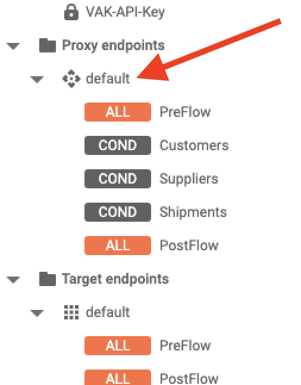
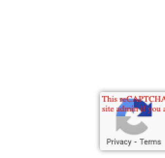
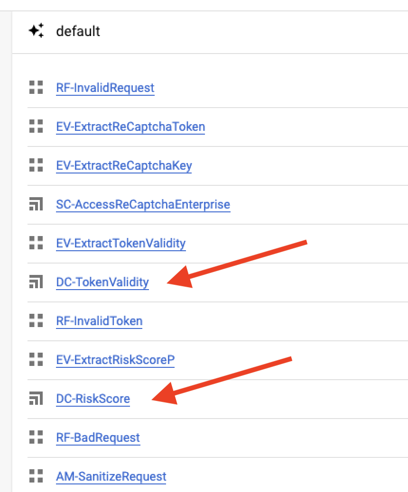
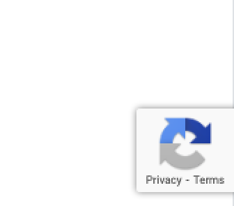

# External Threat Mitigation with reCAPTCHA Enterprise

## Overview

In this lab, you continue to explore security in depth. You implement reCAPTCHA Enterprise, which uses an adaptive risk analysis engine to keep automated software from engaging in abusive activities on your site. You learn how to implement checks within Apigee to prevent bots from reaching your target server.

## Objectives

In this lab, you learn how to:
- Integrate reCAPTCHA Enterprise with Apigee
- Create a DataCapture Policy 

## Setup and Requirements

![[/fragments/startqwiklab]]

![[/fragments/cloudshell]]

<!-- ![[/fragments/apigeex-ui]] -->

## Task 0. Provison LAB resources 

1. Navigate to the the Google Cloud console at **https://console.cloud.google.com**.

2. Click Activate Cloud Shell (Activate Cloud Shell icon) in the top menu to open Cloud Shell

3.  To ensure that you are in the Cloud Shell home directory, execute the following command.

    ```bash
    cd ~ 
    ```

4. In Cloud Shell, confirm the default compute zone is set to the zone used by the gateway VM.

    <ql-code-block templated>
    gcloud config set compute/zone {{{project_0.default_zone|vm_zone}}}
    </ql-code-block>

5. Clone the class repository and move into the repository root folder.

    ```bash
    git clone https://github.com/fabltd/Apigee-utils
    cd Apigee-utils
    ```

    <ql-infobox>
     The following step runs a script that provisons all the resources you will need
    </ql-infobox>

6. Create and configure the gateway / legacy VMs and base API proxy using the following bash script.

   ```bash
    ./setup/install/lab6/install.sh
    ```

7. If you are prompted to generate SSH keys, confirm YES and press ENTER twice for passphrase.

8. Wait for the script to complete and you should see Done - Return to Apigee.

## Task 1. Provision the hacker page

This lab uses the hacker page you were introduced to in an earlier lab. As a reminder, the security team at MHC have developed a simple HTML page that allows for manipulation of API endpoints.

In this task, you provision the hacker page and confirm Apigee is operational. 

1. In the Google Cloud console, in the top menu, click **Activate Cloud Shell** () to open Cloud Shell.

2. To ensure that you are in the Cloud Shell home directory, execute the following command.

    ```bash
    cd ~/
    ``` 

3. To clone the class repository and move into the repository hacker folder, execute the following command.

    ```bash
    cd Apigee-utils/hacker
    ```

4. To start the hacker page, execute the following command to run a help script.

    ```bash
    ./start.sh
    ```

    <ql-infobox>
    The script queries Apigee for the API Hostname, populates this into an HTML form, then runs the hacker page in a simple web server (lite-server). 
    </ql-infobox>

5. Verify that lite-server is running correctly on port 10000. The output should resemble the following.

    ```bash
    [Browsersync] Access URLs:
    -----------------------------------
        Local: http://localhost:10000
        External: http://172.17.0.4:10000
    ```

6. In **Cloud Shell**, click **Web preview > Preview on port 10000** to view the hacker page.

    
    

7. Verify the Endpoint address in the hacker page. Check that the URL contains your Apigee server Host. It should resemble the following. 

    ```bash
    https://34.149.141.95.nip.io/show-me-now/v0/customers?email=acelle1t@boston.com
    ```

    


8. Click **Send** and verify you see the following response. 

    ```json
    {
        "apiStatus": "success",
        "msg": "Fetching customers",
        "result": [
            {
            "Email": "acelle1t@boston.com",
            "Country": "United States",
            "PostalCode": "33129",
            "StreetAddress": "29419 Fairview Avenue",
            "FirstName": "Albrecht",
            "LastName": "Celle",
            "StateOrProvince": "Florida",
            "Address2": "Room 205"
            }
        ]
    }
    ```


## Task 2. Enable reCAPTCHA Enterprise

1. In the Google Cloud console, from the Navigation menu (), select __API & Services > Library__.

    <ql-infobox>
    This page allows you to enable the APIs that are used by the Apigee API proxy.
    </ql-infobox>

2. In the **Search for APIs & Services** box, enter **reCAPTCHA Enterprise API** and press **ENTER**. 

3. Click the tile for the reCAPTCHA Enterprise API, then click **Enable** on the API page and wait for the API to be enabled.

    <ql-infobox>
    With reCAPTCHA Enterprise, you can defend your website against common web-based attacks such as credential stuffing, account takeovers, and scraping and help prevent costly exploits from malicious human and automated actors.
    </ql-infobox>

4. Once the API is enabled, use the search box at the top of the console to find and navigate to **reCAPTCHA Enterprise**.

5. To create a new reCaptcha key, click **Create Key** and set the following.

    | Property | Value |
    | --- | --- |
    | Display Name | **Show-me-now-real** |
    | Choose platform type | **Website** |

6. In the domain list, click **Add a domain** and enter the following in the **Domain** text box. 

    ```
    run.app
    ```

    <ql-infobox>
    The run.app domain is the default for all containers hosted in Cloud Run.
    </ql-infobox>

7. Click **Done** and then expand the **Web Application Firewall (WAF), domain verification, AMP pages, and challenge** option.

8. Enable **Disable domain verification**. 

    <ql-infobox>
   This is necessary because Show Me Now is running on the default run.app domain rather than a custom domain that you control. 
    </ql-infobox>

9. Click **Create Key**.

    <ql-infobox>
    <strong>Important!</strong> You now repeat the above steps twice to create two more keys for use in testing. These keys have additional settings marking them as test keys. One has a score of 1, meaning that it validates as low risk. The other has a score of 0, meaning that it validates as high risk.
    </ql-infobox>

10. Return to the main reCaptcha Enterprise page and repeat steps 5-9 with the following settings.

    | Property | Value |
    | --- | --- |
    | Display Name | **Show-me-now-good-actor** |
    | Choose platform type | **Website** |
    | Domain | **run.app** |
    | Disable domain verification  | **enabled** |
    | This is a test key | **enabled** |
    | Score | **1** |

11. Return to the main reCaptcha Enterprise page and repeat steps 5-9 with the following settings.

    | Property | Value |
    | --- | --- |
    | Display Name | **Show-me-now-bad-actor** |
    | Choose platform type | **Website** |
    | Domain | **run.app** |
    | Disable domain verification  | **enabled** |
    | This is a test key | **enabled** |
    | Score | **0** |

12. Verify your reCAPTCHA key list resembles the following.

    


## Task 3. Provision reCAPTCHA permissions

Apigee requires that the Service Account has correct permissions to be able to call the reCaptcha Enterprise validation API.

1. In the Google Cloud console, from the Navigation menu (), select __IAM & Admin > IAM__.

2. Locate the service account *sa-apigee-google-services@YOURPROJECTID*.

3. Click the **pencil button**. 

4. Click **+ Add Another Role**

5. For **Select a Role**, enter **reCAPTCHA Enterprise Agent** into the filter.

6. Click **SAVE**


## Task 4. Install the shared flow

The Apigee Policies required to handle interaction with reCAPTCHA Enterprise have been pre-configured for you in a shared flow. 

1. Return to the browser tab where Cloud Shell is open and, if necessary, click **Reconnect** to restablish a session. If Cloud Shell is no longer open, in the Google Cloud console, in the top menu, click **Activate Cloud Shell** () to open Cloud Shell.

2. To ensure you are in the **student-scripts** folder, execute the following command in the Cloud Shell terminal.

    ```bash
    cd ~/Apigee-utils/student-scripts
    ```

3. To install the shared flow, execute the following code to run the flow helper.


    ```bash
    ./apigee-add-reCaptcha.sh
    ```

    **EXAMPLE OUTPUT**

    ```json
    "configurationVersion": {
        "majorVersion": 4
    },
    "createdAt": "1674830612205",
    "entityMetaDataAsProperties": {
        "createdAt": "1674830612205",
        "lastModifiedAt": "1674830612205",
        "bundle_type": "zip",
        "subType": "SharedFlow"
    },
    "lastModifiedAt": "1674830612205",
    "name": "reCAPTCHAV1",
    "policies": [
        "AM-SanitizeRequest",
        "EV-ExtractReCaptchaToken",
        "EV-ExtractRiskScore",
        "EV-ExtractTokenValidity",
        "RF-BadRequest",
        "RF-InvalidRequest",
        "RF-InvalidToken",
        "SC-AccessReCaptchaEnterprise",
        "EV-ExtractReCaptchaKey"
    ],
    "resourceFiles": {},
    "sharedFlows": [
        "default"
    ],
    "type": "Application",
    "revision": "1",
    "description": "reCAPTCHA Enterprise"
    ```

## Task 5. Add the reCAPTCHA shared flow

1. In a separate browser tab from Google Cloud console, open the Apigee console at [console.cloud.google.com/apigee](https://console.cloud.google.com/apigee/).
    
2. Verify that your Apigee Organization is selected at the top of the console.

3. In the left navigation menu, select **Proxy development > API Proxies**.

4. From the proxy list, select **SMN-Labs**. To switch to the development view, click **Develop**.

5. In the development navigation panel, click **Proxy endpoints > default > Preflow** to open the Proxy endoint in the development pane with the Preflow selected.

    <ql-infobox>
    <strong>Note:</strong> be sure to click the <strong>Proxy</strong>, not the Target endpoints.
    </ql-infobox> 

    

6. In the policies panel, click **CORS-EnableCORS** in the highlighted **PreFlow** panel and edit the XML as follows. 

    **REPLACE**

    ```xml
      <AllowHeaders>apikey,authorization, email, content-type, origin, x-requested-with, accept, x-recaptcha-key, x-recaptcha-token</AllowHeaders>
    ```

    **WITH**

    ```xml
    <AllowHeaders>apikey,x-recaptcha-key, x-recaptcha-token,authorization, email, content-type, origin, x-requested-with, accept, x-recaptcha-key, x-recaptcha-token</AllowHeaders>
    ```

    <ql-infobox>
    This allows two new headers <strong>x-recaptcha-key</strong> and <strong>x-recaptcha-token</strong>.
    </ql-infobox> 

7. Click **Save** and **Save as new revision**.

8. In the left navigation menu of the Apigee browser tab, select **Proxy development > Shared Flows**.

9. Locate and click **reCAPTCHAv1** to open the details view.

10. Click **Develop** to see the flow, and then click **Deploy**.

11. In the Deploy dialog, add the Service Account identifier *sa-apigee-google-services@YOURPROJECTID* which you updated before.. 

    <ql-infobox>
    In Cloud Shell open a new tab and run the following command to get your service account.
    </ql-infobox>

    ```bash
    gcloud iam service-accounts list --filter="'DISPLAY NAME': Service account for Apigee to access Google services"
    ```

12. Copy the **EMAIL** value an past into the **service account** field of the Deploy dialog.

13. Save the **EMAIL** you will **need this in the next Tasks !!!**

13. Click **Overview** and verify that your shared flow is deployed to **test-env**.

14. Click **Deploy** and then **Confirm**.


## Task 6. Implementing reCAPTCHA validation in an existing proxy

1. In the left navigation menu, select **Proxy development > API Proxies**.

2. From the proxy list, select **SMN-Labs**. To switch to the development view, click **Develop**.

3. Click the Add Policy icon () next to **Policies**.

    ()

4. In the dialog, select the **Flow Callout** policy from the **Extension** group.

5. Set the policy properties as follows and click **Create**.

    | Property | Value |
    | --- | --- |
    | Name | **FC-reCAPTCHA** |
    | Display name | **FC-reCAPTCHA** |
    | SharedFlow | **reCAPTCHAV1** |

6. In the development view navigator panel, click **Proxy endpoints > default** to open the proxy endpoint in the development panel.

    **Note:** be sure to click the **Proxy**, not the Target **endpoints**.

7. In the development panel, click the + icon () for the  **Proxy endpoints > default > Preflow**.

8. In the dialog, click the **Select existing policy** dropdown and select **FC-reCAPTCHA**.

9. Click **Add**, **Save**, and **Deploy**.

10. In the **Deploy** dialog, add the Service Account email identifier your saved in an earlier step and click **Deploy** and **Confirm**.


## Task 7. Test reCAPTCHA Enterprise

1. Return to the browser tab where Cloud Shell is open and, if necessary, click **Reconnect** to restablish a session. If Cloud Shell is no longer open, in the Google Cloud console, in the top menu, click **Activate Cloud Shell** () to open Cloud Shell.

2. To ensure you are in the **hacker** folder, execute the following command in the Cloud Shell terminal.

    ```bash
    cd ~/Apigee-utils/hacker
    ```

3. To start the hacker page, execute the following command to run a help script.

    ```bash
    ./start.sh
    ```

    <ql-infobox>
    The script queries Apigee for the API Hostname, populates this into an HTML form, then runs the hacker page in a simple web server (lite-server). 
    </ql-infobox>

4. In **Cloud Shell**, click **Web preview > Preview on port 10000** to view the hacker page.

5. Verify that lite-server is running correctly on port 10000. The output should resemble the following.

    ```bash
    [Browsersync] Access URLs:
    -----------------------------------
        Local: http://localhost:10000
        External: http://172.17.0.4:10000
    ```

6. In **Cloud Shell**, click **Web preview > Preview on port 10000** to view the hacker page.

    
    

7. Verify the Endpoint address in the hacker page. Check that the URL contains your Apigee server Host. It should resemble the following. 

    ```bash
    https://34.149.141.95.nip.io/show-me-now/v0/customers?email=acelle1t@boston.com
    ```

    

8. Click **Send** and verify you see the following response. 

    ```bash
    {
    "error": "invalid_request",
    "details": "missing header"
    }
    ```

    <ql-infobox>
    The reCAPTCHA shared flow expect one of the keys created above. 
    </ql-infobox>

9. Return to the **reCAPTCHA Enterprise** dashboard and copy all three keys using the copy icons () in the **Key ID** column.

10. Switch to the browser tab that has the hacker page. Modify the URL in the address bar by removing everything after the **?** and then adding a new name value pair with the name **sitekey**. Set the value to the value of your **show-me-now-good-actor** key.

    **EXAMPLE RESULT** (Your IP address and other details will differ).

    <ql-code-block templated>
    https://10000-cs-e739cfca-0ed2-48b8-a275-6922a9a9c47b.ql-{{{project_0.default_region|vm_region}}}-wfhy.cloudshell.dev/?sitekey=6LduhEEkAAAAAETBaUo23vmziVAM3WvL7nvfnLZk
    </ql-code-block>

    <ql-infobox>
    You should see the <strong>protected by reCAPTCHA</strong> icon at the bottom of the screen. It is flagged with a warning that you are using a test key.
    </ql-infobox>

    

11. Click **Send** and verify you receive the customer data.

12. Replace the **Show-me-now-good-actor** key in the URL with the **Show-me-now-bad-actor** key and refresh the page.

13. Click **Send** and verify the response is as follows.

    ```json
    {
    "error": "bad_request",
    "details": "bot detected!"
    }
    ```

    <ql-infobox>
    The reCAPTCHA API returns a score. We set the score for our bad actor to zero. In the Apigee shared flow, Apigee checks the assessment and a score that is less than 0.6 is rejected.
    </ql-infobox>

    ```xml
    <Condition>flow.assessment.risk_score LesserThan 0.6</Condition>
    ```

14. In the Cloud Shell terminal, press CTRL+C to stop the hacker web server.


## Task 8. Log BOT attempts

It would be useful to know when Apigee is experiencing BOTs and when API calls are successful. The DataCapture policy captures data (such as payload, HTTP headers, and path or query parameters) from an API proxy for use in Analytics, and can be used for this purpose.

To use the DataCapture policy, you must first create a [data collector](https://cloud.google.com/apigee/docs/reference/apis/apigee/rest/v1/organizations.datacollectors) resource. 


1. Return to the browser tab where Cloud Shell is open and, if necessary, click **Reconnect** to restablish a session. If Cloud Shell is no longer open, in the Google Cloud console, in the top menu, click **Activate Cloud Shell** () to open Cloud Shell.

2. To ensure you are in the **student-scripts** folder, execute the following command in the Cloud Shell terminal.

    ```bash
    cd ~/Apigee-utils/student-scripts
    ```

3. To add the data collectors and update the shared flow, execute the following command.

    ```bash
    ./apigee-add-dc.sh
    ```

    <ql-infobox>
    This script adds the data collectors to Apigee and provisions two custom dashboards to Apigee Analytics.
    </ql-infobox>

4. Return to the Apigee console and in the left navigation menu, select **Proxy development > Shared Flows**.

5. Locate and click **reCAPTCHAv1** to open the details view.

6. Click **Develop** to see the flow, and **Shared Flows > default** to open the flow in the development pane.

7. Verify that you see the two **Data Collectors**, **DC-Token-Validity** and **DC-RiskScore**.
 
    <ql-infobox>
    The shared flow should appear as follows.
    </ql-infobox>

    

8. Click **Deploy**.

9. In the **Deploy** dialog, add the Service Account email identifier your saved in an earlier step and click **Deploy** and **Confirm**.

10. Wait for the shared flow to deploy and then click **Overview**. Verify that the shared flow is deployed to **test-env**.

11. Click **Analytics > Custom Reports**.

12. Verify that you see two reports, **my-riskscore-report** and **my-token-validity-report**.

13. Click the report names to examine the reports.

    <ql-infobox>
    You return to the reports after you add the real reCAPTCHA Enterprise key to Show Me Now.
    </ql-infobox>


## Task 9. Test the production reCAPTCHA key

Show Me Now needs to be configured with the reCAPTCHA key. To simplify testing, a helper script has been provided to run the client application locally in Cloud Shell.

1. Return to the browser tab where Cloud Shell is open and, if necessary, click **Reconnect** to restablish a session. If Cloud Shell is no longer open, in the Google Cloud console, in the top menu, click **Activate Cloud Shell** () to open Cloud Shell.

2. To ensure you are in the **Apigee-utils** folder, execute the following command in the Cloud Shell terminal.

    ```bash
    cd ~/Apigee-utils
    ```
3. To add the reCAPTCHA Enterprise key to **Show Me Now**, execute the following helper.

    ```bash
    ./student-scripts/show-me-now-test.sh
    ```

    <ql-infobox>
    <strong>WARNING</strong>: this script takes some time to run. You can safely ignore any warnings as the script runs.
    </ql-infobox>

    <ql-infobox>
    The script fetches your Apigee Host name and reCAPTCHA key for <strong>show-me-now-real</strong>. The script then uses Cloud Shell to build and run a docker container for Show Me Now to allow you to test the web client without deploying it.
    </ql-infobox>

4. Wait until you see the output **Container running**. 

5. Run the following commands to update, rebuild then run the container.

    <ql-code-block bash>
    cd ~/apigee-show-me-now/
    sed -i 's/FROM node:16 as b/FROM node:18 as b/' Dockerfile
    docker build -t show-me-now .
    docker run -d -p 8080:80 show-me-now
    </ql-code-block>


5. In **Cloud Shell**, click **Web preview > Preview on port 8080** to view the test version of **Show Me Now**.

6. Verify that you see the reCAPTCHA icon at the bottom-right corner of the screen.

    

    <ql-infobox>
    This time you are using a real key, so there is no warning flag on the icon.
    </ql-infobox>

7. In the **Track My Package** text box, enter the following tracking number and click **Get Progress**.

    ```
    01dhQEqMQSzAx0HTLEmA
    ```

8. Verify that you have the following response.

    

9. Check the progress of the following shipments in order to provide data for the reports.

    ```
    9RNdWGfL6pqazLSZYTV2
    Ec78u30i8ZyC4KH3DfWV
    704gIinKlWXVEE8fVcDJ
    BTEIjmSJ9FBUfgTq3EYb
    Dnepbx3mDeBs5WZD9JtJ
    ```

## Task 10. Explore Apigee custom analytics

1. Return to the Apigee console and in the left navigation menu, select **Analytics > Custom Reports > Reports**.

2. Click the **my-riskscore-report** and verify that you have data. Examine the summary at the bottom of the report and the minimum and maximum scores.

    <ql-infobox>
    Recall that 0 represents illegitimate trafic and 1 represents legitimate traffic.
    </ql-infobox>

3. Click **Custom reports** at the top of the page and then **my-token-validity-report**. Verify that you have data about token requests.

### **Congratulations!** You have implemented reCAPTCHA Enterprise in Apigee, implemented data capture policies to log the result of your reCAPTCHA activity, and tested reCAPTCHA in production mode.

![[/fragments/copyright]]

