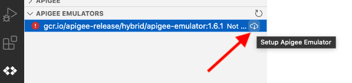

# Using Apigee in VS Code

## Overview

In this lab, you use an open source version of VS Code in the browser (Code-Server). You install Google's Cloud Code, the Apigee local development environment and Apigee Emulator, and use it to build and test a simple local proxy before deploying it to Apigee for testing.

## Objectives

In this lab, you learn how to:
- Install Cloud Code for VS Code
- Develop a local API proxy
- Emulate an Apigee environment
- Deploy a local API to Apigee


## Setup and Requirements

![[/fragments/startqwiklab]]


![[/fragments/cloudshell]]


<!-- ![[/fragments/apigeex-ui]] -->

## Task 0. Provison LAB resources 

1. Navigate to the the Google Cloud console at **https://console.cloud.google.com**.

2. Click Activate Cloud Shell (Activate Cloud Shell icon) in the top menu to open Cloud Shell

3.  To ensure that you are in the Cloud Shell home directory, execute the following command.

    ```bash
    cd ~ 
    ```

4. In Cloud Shell, confirm the default compute zone is set to the zone used by the gateway VM.

    <ql-code-block templated>
    gcloud config set compute/zone {{{project_0.default_zone|vm_zone}}}
    </ql-code-block>

5. Clone the class repository and move into the repository root folder.

    ```bash
    git clone https://github.com/fabltd/Apigee-utils
    cd Apigee-utils
    ```

    <ql-infobox>
    The following step runs a script that provisons the VS Code server enviroment
    </ql-infobox>

6. Create a VM and install VS Code Server.

   ```bash
    ./setup/install/lab7/install.sh
    ```

7. When promoted to generate a key press **y** and then press the **enter** key twice this will generate your ssh keys

7. Wait for the script to complete and you should see - Done !!!!

## Task 1. Set up your environment

1. In the Google Cloud console, from the Navigation menu (), select __Compute Engine and VM instances__.

2. In the Compute Engine VM instances pane, locate the VM named __vs-code-server__ and click the **SSH** button.

    <ql-infobox>
    The <strong>vs-code-server</strong> virtual machine is an Ubuntu instance that hosts an installation of Virtual Studio Code for the sake of this lab. You can also explore the use of Cloud Code with Cloud Workstations or local installations of Virtual Studio Code.
    
    </ql-infobox>

3. When the prompt changes indicating that you are connected to the gateway, execute the following command. Note that the previos script you executed in Cloud Shell must be finished to receive the correct output.

    ```bash
    curl 127.0.0.1:8080
    ```

4. Verify that the output is similar to this.

    ```bash
    Found. Redirecting to ./login
    ```

    <ql-infobox>
    This confirms that your VS Code server is running.    
    </ql-infobox>


5. To close the SSH session, execute the following command.

    ```bash
    Exit 
    ```

6. Return to the Google Cloud console and click **Activate Cloud Shell** () in the top menu to open Cloud Shell.

7. In Cloud Shell, confirm the default compute zone is set to the zone used by the gateway VM.

    <ql-code-block templated>
    gcloud config set compute/zone {{{project_0.default_zone|vm_zone}}}
    </ql-code-block>


8. To ensure that you are in the Cloud Shell home directory, execute the following command.

    ```bash
    cd ~
    ```

9. To clone the class repository and move into the repository root folder, execute the following commands.

    ```bash
    cd ~/Apigee-utils
    ```

    <ql-infobox>
    The virtual machine is not exposed to the internet. It can be accessed via the SSH functionality of gcloud that provides a reverse proxy Shell.
    </ql-infobox>

10. To connect to the server, execute the following command that uses a helper script to start the reverse proxy. 

    ```bash
    ./student-scripts/proxy.sh
    ```

11. Verify that the output is similar to the following.

    ```bash
    Setup SSH Tunnel
    ```

12. In **Cloud Shell**, click **Web preview > Preview on port 8080** to view the VS Code interface.

    

13.  Verify that a new window appears and looks like the following.


14. Enter the password **letmein** and click **submit**.


    <ql-infobox>
    <strong>Note</strong>: the password <strong>letmein</strong> has been set for convenience in this lab. When deploying VS Code server in production, a random password is generated and needs to be retrieved from <em>~/.config/code-server/config.yaml</em>.
    </ql-infobox>


## Task 2: Install Cloud Code for VS Code

1. Close the getting started window by clicking the **X** on the tab.

    

2. Locate the **Extension** button () in the side navigation and click it to bring up the extenstions navigation panel.

    

3. In the **Search Extensions in the MarketPlace** text box, enter the following.

    ```
    Cloud Code
    ```

    <ql-infobox>
    The first item in the list should be Cloud Code, Google's official IDE extension.
    </ql-infobox>

    


4. To see the Cloud Code information window, click the Cloud Code tile. 

5. Locate and click the install button to install Cloud Code.

    

6. Wait for Cloud Code to finish installing. 

    <ql-infobox>
    Installation progress is reported in the status bar at the bottom of VS Code.
    </ql-infobox>

    

7. In the **Extensions** navigation panel locate the installed version of **Cloud Code** and click the **cog** icon.
   
8. Select install anther version and select **1.21.0**.
    
   <ql-infobox>
   The latest version has an incomptability with the way the lab proxy for VS-Code works.
   </ql-infobox>

   

9. Click the button **Reload Required** the screen should now refresh

10. To access Apigee in VS Code, click the Cloud Code icon () in the **Activity Bar**, and select the Apigee section as shown below.

    

11. Click the **Create Apigee workspace** option highlighted above.

12.  In the prompt that appears top center of the VS Code window,  add the value **Demo** and press **ENTER**.
    
     

13. When the prompt changes, click **OK** to accept the default location.

    <ql-infobox>
    The screen refreshes to display the File Explorer and a modal security dialog.
    </ql-infobox>

14. To access the Apigee Emulators in Cloud Code, click the Cloud Code icon () in the **Activity Bar**.

15. Click **gcr.io/apigee-relase/hybrid….** in the Apigee Emulators section to select it, and then click on the download icon () to set up the emulator.

    

16. In the prompt that appears top center of the VS Code window, add the value **Demo** to set the name of your container and press **ENTER**.

    <ql-infobox>
    <strong>WARNING!</strong> Do not accept the default value in the next prompt as you are already using the suggested port for your VS Code server instance. 
    </ql-infobox>

17. When the prompt changes, enter the port **8081** in place of the default value and press **ENTER**.

18. In the next prompt, accept the default value of **8998** for the container control port by pressing **ENTER**.

    <ql-infobox>
    Installation should start at this point. Once it is complete, the Emulator installed successfully message should appear, and the status of the Apigee Emulator container changes to <strong>Ready</strong>. You should be able to expand the emulator to see your container.
    </ql-infobox>

    

19. To view status information for the Apigee Emulator including its Docker and Runtime information, expand those sections.

    


## Task 3. Create and test a local API Proxy

1. Expand the Apigee section, and click the create Apigee proxy bundle + icon to the right of **apiproxies**.
 
    

2. In the prompt, select **Reverse Proxy** and then press **ENTER**.

    

3. In the next prompt, select **No authentication**

    

4. For the backend target URL, insert the URL `https://mocktarget.apigee.net`.

    <ql-infobox>
    This is a test target provided by the Apigee. More detail can be found here: https://docs.apigee.com/api-platform/samples/mock-target-api
    </ql-infobox>

    

5. For the API proxy name, use `REVERSE-proxy`.

    

6. In the base path prompt, replace the default with **/v1/demo** and press **ENTER**.

    The default proxy XML Document is now available in the editor. You can add policies to the proxy as you would in the visual development environment. More information is available here: [VS Code get-started](https://cloud.google.com/apigee/docs/api-platform/local-development/vscode/get-started).

    


## Task 4. Emulate your proxy
  
1. Still in the Apigee section, locate the **environments** folder and click the create Apigee environment + icon to the right.   
 
2. In the prompt, enter the name **dev** for the environment and press **ENTER**.

3. To see the new environment, expand the environments section and **dev**.

    

4. In the expanded **dev** section, click **deployments.json** and then the cog icon to the right.

    

5. In the prompt, select **REVERSE-Proxy** and then click **OK**.

6. Click **dev** and the **Deploy to Apigee Emulator** icon () to the right.

    

    <ql-infobox>
    The REVERSE-proxy is deployed to the emulator, and is available as an active deployment in the Apigee section.
    </ql-infobox>

    

7. Expand **Active deployments > REVERSE-proxy > Application: Reverse-proxy, Proxy:default** and copy the URL.

    <ql-infobox>
    HINT: use the copy icon to the right.
    </ql-infobox>

8. To open a new VS Code terminal window, click the VS Code menu icon () and select **Terminal > New Terminal**.

9. In the terminal window, execute the following command, substituting the URL you copied above. 

    ```bash
    curl http://0:8998/v1/demo; echo
    ```

10. Verify that the response is as follows.

    ```bash
    Hello, Guest!
    ```

    <ql-infobox>
    If you don't have the expected result, check that the URL in the curl command matches the one you copied.
    </ql-infobox>


## Task 5. Configure Apigee

You have successfully tested that the proxy works in your development environment. You now want to publish your API to Apigee. API proxies developed in Cloud Code need a different Apigee configuration to work in Apigee itself.

1. In a separate browser tab from Google Cloud console, open the Apigee console at [console.cloud.google.com/apigee](https://console.cloud.google.com/apigee/).

    Alternatively, to open the Apigee console from the Google Cloud console Navigation menu (), select **Tools > Apigee**.
    
2. To add a new Apigee environment, navigate to **Management > Environments* and click  **+ Create Environment**.

3. Complete the dialog as follows and click **Create**.

    | Property | Value |
    | --- | --- |
    | Name | **dev** |
    | Display name | **dev** |
    | Instance | **apigee-tf-inst** |
    | Development type | **Archive** |

    <ql-infobox>
    Your configuration should resemble the following.
    </ql-infobox>

    

    <ql-infobox>
    The dev environment needs to be added to an Environment Group to allow for incoming traffic.
    </ql-infobox>

4. To add **dev** to an Environment Group, navigate to **Management > Environments** and click on **Environment Groups** and click on the actions (three-dot) menu and select **Edit** for the **test-env-group** Environment group.

5. Locate the **Environments** panel at the bottom of the page.

6. Select **dev** and click the tick box then click **Ok** followed by **Update**

    <ql-infobox>
    The dev environment also needs to be added to a runtime instance this should have been done when we created the new environment. 
    </ql-infobox>

7. To check the **dev** runtime instance, navigate to **Management > Instances** and click **apigee-tf-inst**.

8.  Verify you see **test-env** and **dev**. If dev is missing you can click **edit** and add dev to the environments section.

    

9. To obtain your **APIGEE_URL**, select **Management > Environments** click on **Environment Groups** and then **test-env-group** and make a note of the hostname that ends with **nip.io**.

    

    <ql-infobox>
    This hostname is requried in the next task. Make sure to record the value.
    </ql-infobox>


## Task 6. Upload the proxy

1. Return to your VS Cloud Cloud window.

2. Locate **Compute Engine** in the Cloud Code navigation window and click **Select a project**.

    

3. You are prompted to enter a project. Do **not** enter any value.

4. Click the **Sign In** button (). 

    

5. Click **Proceed to sign in**. 

    <ql-infobox>
    A new tab appears in the VS Code terminal, with a link to retrieve a code, and a prompt to enter the retrieved authorization code.
    </ql-infobox>

6. Copy the long URL from the terminal and paste into a new tab in your Incognito window. 

Example URL:

    ```bash
    https://accounts.google.com/o/oauth2/auth?response_type=code&client_id=32555940559.apps.googleusercontent.com&redirect_uri=https%3A%2F%2Fsdk.cloud.google.com%2Fauthcode.html&scope=openid+https%3A%2F%2Fwww.googleapis.com%2Fauth%2Fuserinfo.email+https%3A%2F%2Fwww.googleapis.com%2Fauth%2Fcloud-platform+https%3A%2F%2Fwww.googleapis.com%2Fauth%2Fappengine.admin+https%3A%2F%2Fwww.googleapis.com%2Fauth%2Fsqlservice.login+https%3A%2F%2Fwww.googleapis.com%2Fauth%2Fcompute+https%3A%2F%2Fwww.googleapis.com%2Fauth%2Faccounts.reauth&state=T4gQznHqaGGbrW7sXI0KVMYRDdx4Sc&prompt=consent&access_type=offline&code_challenge=_kZYm2_cbt8s6PooeyPKJPXsQR_zNttzPQwhPeCjhqw&code_challenge_method=S256
    ```

7. When prompted, select your student account.

    

8. Allow Cloud SDK access and then click **copy** in the **Sign in to the gcloud CLI** page.

9. Return to the VS Code terminal and paste the copied string into the prompt. If Chrome prompts you to allow the clipboard, select **Allow**.

10. Press **Enter**, wait for authorization to complete and then Press **Enter** again to exit the terminal tab.

11. Return to the prompt to enter a project and select your **qwiklabs-gcp-xxxxx** project. 

12. In the VS Code terminal, execute the following.

    ```
    gcloud beta apigee archives deploy --environment=dev
    ```

13. Verify that your output resembles the following.

    ```
    Waiting for operation [6e9816cb-06e1-4554-bd00-d2af6ac2b320] to complete...  
    ```

14.  Locate the **APIGEE_URL** value you noted above. Execute the following command, replacing **APIGEE_URL** with your value. 

```
curl https://APIGEE_URL/v1/demo ; echo
```

<ql-infobox>
Note: <strong>; echo</strong> ensures the result is on a newline in the terminal.
</ql-infobox>

**Example command**

```
curl https://34.149.141.95.nip.io/v1/demo; echo
```

**Expected output**

```
Hello, Guest!
```


### **Congratulations!** You have deployed a local Cloud Code for a VS Code development environment, tested your proxy and deployed to Apigee. This workflow allows for proxies to be integrated with CI/CD workflows as the code can and should be checked into a Git repository.

![[/fragments/copyright]]

