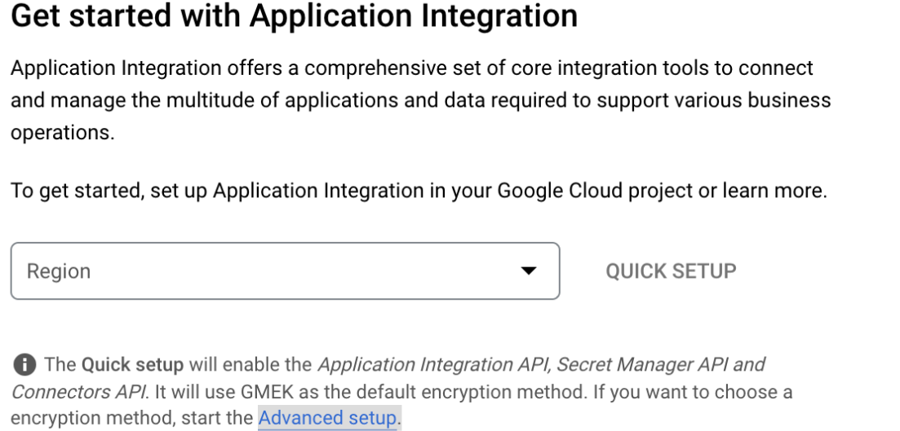
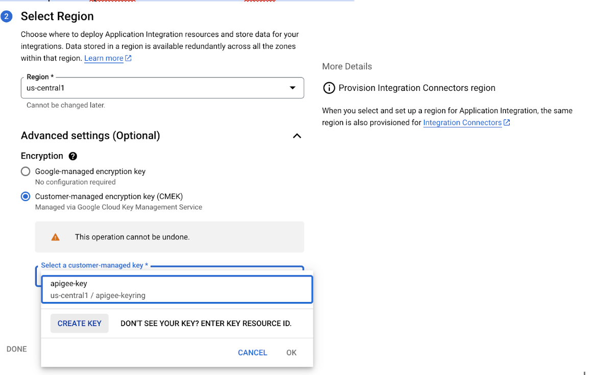
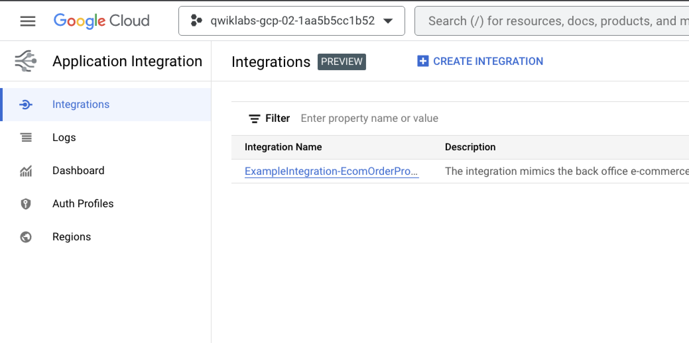
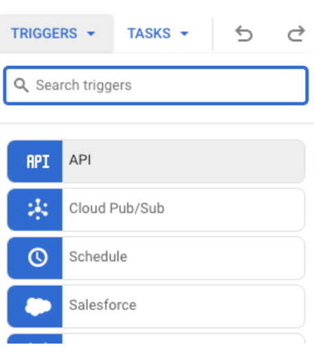
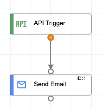
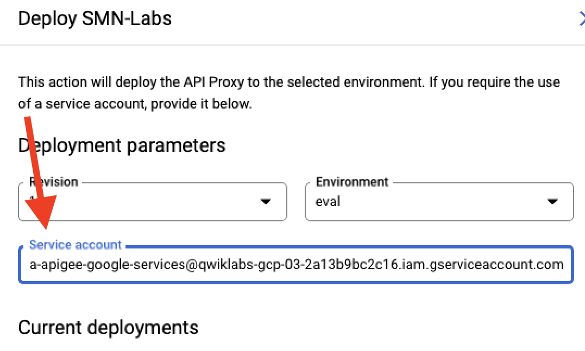
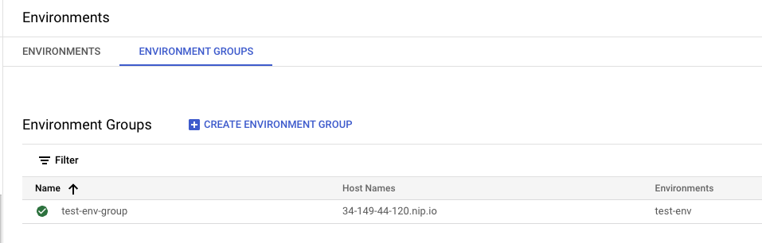
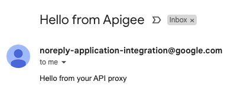

# Expanding Your API with Integration

## Overview

In this lab, you expand the capabilities of your API with Apigee Integration. This allows for configurable tasks that can be called from within your API flow. There is no requirement for extra code. Integrations are configured using a dynamic web UI.


## Objectives

In this lab, you learn how to:
- Implement Apigee integration policies
- Configure an Integration to send an email

## Setup and Requirements

![[/fragments/startqwiklab]]


![[/fragments/cloudshell]]


<!-- ![[/fragments/apigeex-ui]] -->
## Task 1. Enable Apigee Integration

1. In a separate browser tab from Google Cloud console, open the Apigee console at [console.cloud.google.com/apigee](https://console.cloud.google.com/apigee/).

    Alternatively, to open the Apigee console from the Google Cloud console Navigation menu (), select **Tools > Apigee**.
    
2. Verify that your Apigee Organization is selected at the top of the console.

3. In the left navigation menu, select **Proxy development > Integration**. Then click on the **Go to Application Integration** button.

    <ql-infobox>
    The Setup Application Integration page will open in a new tab.
    </ql-infobox>

4. Click **Enable APIs** and wait for all the listed APIs to have a green checkmark. If you can not find it, click on Advanced setup first.

    

5. Click **Next**.

6. At **2 - Select Region and Cloud KMS key**, select <ql-variable key="project_0.default_region" placeHolder="<filled in at lab start>"></ql-variable> for the region. Under **Advanced Settings** select Customer-managed encryption key (CMEK) and click **Create Key** as shown below.

    

7. In the **Create new key** popup, at **step 1 (Key Ring)**, set the following.

    | Property | Value |
    | --- | --- |
    | Create Key ring | **Toggle to enable** |
    | Key ring Name | **apigee-demo** |
    | Key ring Location   | <strong><ql-variable key="project_0.default_region" placeHolder="<filled in at lab start>"></ql-variable></strong> |

8. Click **Continue**.

9. In **step 2 (Key)**, set the following.

    | Property | Value |
    | --- | --- |
    | Key  Name | **apigee-demo-key** |
    | Protection Level   | **Software** |

10. Click **Continue** and then **Create**.

    <ql-infobox>
    You can now proceed with the Setup Application Integration dialog.
    </ql-infobox>

11. Click **Next**. 

12. In the **Grant Crypto Access** step, click **Grant** to allow the service account to access the selected key. If it is not found, then click on **Verify** first.

13. Wait for the green checkmark and message **Granted**, and then click **Done**.

14. The Application Integration window opens.

    


## Task 2: Create an integration

1. In the Application Integration window, to start the create integration wizard, click **Create integration**.

2. Set the following properties and click **Create**. 

    | Property | Value |
    | --- | --- |
    | Integration Name | **send-email** |
    | Description | **Sends Email from Apigee** |
    | Region  | <strong><ql-variable key="project_0.default_region" placeHolder="<filled in at lab start>"></ql-variable></strong> |

    <ql-infobox>
    The integration designer window opens.
    </ql-infobox>  

3. To create more screen space, close the tutorial to the right by clicking **X**.

4. If a blue popup box appears, click **Got it** to close the box.

    <ql-infobox>
    You are now ready to start designing your integration. 
    </ql-infobox>

5. Click **Triggers** and select **API** in the dialog.

    

6. Click the designer background to drop the **API Trigger**.

7. In the properties box to the right, change the **Trigger ID** to **apigee-send-email**.

8. Click **Triggers**.

9. In the dialog, click **Tasks** and then select **Send Email**.

10. Click the designer background to drop the **Send Email** task beneath **API Trigger**.

11. Click the Circle under **API Trigger** and drag the line down to the top circle on **Send Email**.


    

12.  Click the **Send Mail** task and set the following properties in the dialog.

| Property | Value |
| --- | --- |
| To Recipients | **Your real email address** |
| cc | **Leave blank** |
| bcc | **Leave blank** |
| Subject  | **Hello from Apigee** |
| Body Format | **Plain Text** |
| Body in Plain Text | **Hello from your Apigee Proxy** |

13. In the top-right corner of the page, click **Test** to check that the functionality works.

14. In the dialog, leave all parameters at their default values and click **Test Integration**. This may fail on the first attempt, if so then try again after a few minutes.

15. Verify you received the email.

16. To make the integration available, click **Close** in the dialog and **Publish** in the top-right corner.


## Task 3: Provision integration permissions

Apigee requires a Service Account with the correct permissions to be able to call the integration service API.

1. In the Google Cloud console, from the Navigation menu (), select __IAM & Admin > Service Accounts__.

2. In the top menu, click **+ Create Service Account**.

3. In first step of the wizard, set the following. 

    | Property | Value |
    | --- | --- |
    | Service account name | **sa-apigee-google-services** |
    | Service account description | **Service account for Apigee to access Google services** |

    <ql-infobox>
    The Service Account ID is populated automatically when you add the name.
    </ql-infobox>

4. Click **Create and Continue**.

5. In the second step, click the **Select a Role** dropdown and enter **Apigee Integration Invoker** in the filter. Click **Apigee Integration Invoker** to select it.

6. Click **Continue** and **Done**.

7. Copy the service account email address to the clipboard and make a note of it for later use.

 
## Task 4. Trigger your integration from Apigee

1. In a different browser tab within the same window, open the Apigee console at [apigee.google.com](https://apigee.google.com/).

    <ql-infobox>
    The Apigee console is accessed on a different URL from the Google Cloud console. An Apigee organization with the same name as the Google Cloud project has been created for you.
    </ql-infobox>

    Alternatively, to open the Apigee console from the Google Cloud console Navigation menu (), select **Tools > Apigee**.

2. Verify your Apigee Organization is selected at the top of the console.

3. In the left navigation menu, select **Develop > API Proxies**. 

4. Click **Create New**.

5. Choose **Integration Target** as the template and set the following properties.

    | Property | Value |
    | --- | --- |
    | Name | **Send-Email** |
    | Base Path | **/v1/email** |
    | Description | **Send emails using Integration** |
    | Integration Region | <strong><ql-variable key="project_0.default_region" placeHolder="<filled in at lab start>"></ql-variable></strong> |
    | Integration Target | **send-email - Sends Email from Apigee**
    | Trigger | **API Trigger - api_trigger/apigee-send-email** |
    | Endpoint Type | **Sync** |

6. Click **Next**, **Next**, and **Create**.

7. Wait for the proxy to be created and then click **Edit Proxy**.

8. Click **Develop** and observe that a **Set Integration Request** policy has been added.

9. Click **Deploy**.

10. In the Deploy dialog, add the Service Account identifier that you saved in an earlier step.

    

11. Click __Deploy__ and then __Confirm__, and wait until the revision has finished deploying.

12. In the left navigation menu, select **Management > Environments > Environment Groups** and copy the hostname that includes an IP Address from __test-env-group__. Save the hostname locally.

    


## Task 5. Test your API Proxy

In this task, you test your integration. As we have a standalone proxy for this lab, there is no requirement for security credentials. Production Integration would form part of a larger API proxy or shared flow.


1. Return to the browser tab which has Cloud console open. If none are available, open a new tab and navigate to https://console.cloud.google.com.

2. In the top menu, click **Activate Cloud Shell** () to open Cloud Shell.

3. To test your integration, execute the following command replacing **APIGEE_URL** with the Apigee Hostname you copied earlier. 

    ```
    curl https://APIGEE_URL/v1/email
    ```

    **Example:**

    ```bash
    curl https://34.111.192.40.nip.io/v1/email
    ```

   **Sample output**

   ```
    {
    "executionId": "1442334e-065f-42a4-8a13-6925a604bed7",
    "outputParameters": {}
    }
    ```
    
4. Verify that you received an email that resembles the following. 

    

### **Congratulations!** You have successfully extended the capabilities of Apigee with Integrations. There are many connectors and rules that Integration provides that can enhance your Apigee experience.

For more information see here:

[https://cloud.google.com/apigee/docs/api-platform/integration/what-is-apigee-integration
](https://cloud.google.com/apigee/docs/api-platform/integration/what-is-apigee-integration)


![[/fragments/copyright]]