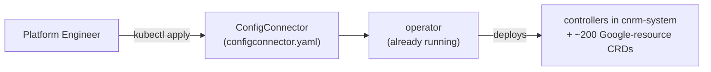

# M2 - Applying the ConfigConnector resource (stage 2)

Stage 1 ([[M2-operator-install]]) installed the operator — a small idle bootstrap.
**Stage 2 turns Config Connector on:** you apply a single **ConfigConnector**
resource, and the operator reacts by deploying the actual controllers and the
Google-resource CRDs into a new `cnrm-system` namespace.



---

## Some important notes

- **One resource flips the switch.** Applying a ConfigConnector object is the whole
  trigger — the operator watches for it and does the rest.
- **The name is fixed.** `metadata.name` **must** be
  `configconnector.core.cnrm.cloud.google.com` (it's a cluster singleton).
- **`mode` is the big decision:** `cluster` (one identity for everything) or
  `namespaced` (per-namespace identity). This shapes what the operator deploys.

---

## Step 1 — choose a mode and write the manifest

### Cluster mode — one Google Service Account for the whole cluster

```yaml
apiVersion: core.cnrm.cloud.google.com/v1beta1
kind: ConfigConnector
metadata:
  # the only accepted name — this is a singleton
  name: configconnector.core.cnrm.cloud.google.com
spec:
  mode: cluster
  googleServiceAccount: "SERVICE_ACCOUNT_NAME@PROJECT_ID.iam.gserviceaccount.com"
  stateIntoSpec: Absent
```

### Namespaced mode — identity is set per namespace instead

```yaml
apiVersion: core.cnrm.cloud.google.com/v1beta1
kind: ConfigConnector
metadata:
  name: configconnector.core.cnrm.cloud.google.com
spec:
  mode: namespaced
  stateIntoSpec: Absent
```

Note there is **no `googleServiceAccount`** here — in namespaced mode you supply the
identity later, per namespace, via a **ConfigConnectorContext** ([[M2-operator-crds]]):

```yaml
apiVersion: core.cnrm.cloud.google.com/v1beta1
kind: ConfigConnectorContext
metadata:
  name: configconnectorcontext.core.cnrm.cloud.google.com
  namespace: NAMESPACE
spec:
  googleServiceAccount: "NAMESPACE_GSA@HOST_PROJECT_ID.iam.gserviceaccount.com"
  stateIntoSpec: Absent
```

## Step 2 — apply the manfiest

```bash
kubectl apply -f configconnector.yaml
```

## Step 3 — verify the controllers came up

The controller Pod can take **several minutes** to start.

```bash
kubectl wait -n cnrm-system \
  --for=condition=Ready pod \
  -l cnrm.cloud.google.com/component=cnrm-controller-manager
# → pod/cnrm-controller-manager-0 condition met
```

---

## What the operator installs

| Workload                       | Kind            | Role                                         |
| ------------------------------ | --------------- | -------------------------------------------- |
| `cnrm-controller-manager`      | **StatefulSet** | the reconcilers — the core engine            |
| `cnrm-webhook-manager`         | **Deployment**  | admission webhooks (validation + defaulting) |
| `cnrm-deletiondefender`        | **StatefulSet** | guards against unintended deletions          |
| `cnrm-resource-stats-recorder` | **Deployment**  | emits resource-count metrics                 |


### Namespaced mode → per-namespace controllers, plus an extra workload

Namespaced mode differs in two ways:

- **The controller becomes per-namespace.** Instead of one shared
  `cnrm-controller-manager`, each ConfigConnectorContext makes the operator stand up
  a **dedicated** `cnrm-controller-manager-${NAMESPACE}` StatefulSet, so each
  namespace reconciles under its own identity.
- **An extra shared workload appears:** `cnrm-unmanaged-detector` (StatefulSet),
  which is deployed **only in namespaced mode**. The `cnrm-webhook-manager`,
  `cnrm-resource-stats-recorder`, and `cnrm-deletiondefender` remain shared.

---

## Deployed workloads

| Workload                       | Kind        | Mode                |
| ------------------------------ | ----------- | ------------------- |
| `cnrm-controller-manager`      | StatefulSet | both                |
| `cnrm-webhook-manager`         | Deployment  | both                |
| `cnrm-deletiondefender`        | StatefulSet | both                |
| `cnrm-resource-stats-recorder` | Deployment  | both                |
| `cnrm-unmanaged-detector`      | StatefulSet | **namespaced only** |

Expanded from the source (`cmd/*` + `pkg/controller/*`), so the roles are precise.

### `cnrm-controller-manager` — the engine (StatefulSet)

- The **reconciler**: for every managed object, it makes Google Cloud API calls to
  create / update / delete the real resource so it matches the spec.
- It runs in one of two shapes, by mode:
  - **Cluster mode** — one workload, one identity for the whole cluster.
  - **Namespaced mode** — one workload *per* namespace
    (`cnrm-controller-manager-${NAMESPACE}`), each scoped to its namespace with its
    own identity.

### `cnrm-webhook-manager` — admission control (Deployment)

Runs the **validating + mutating admission webhooks** — the gate every apply passes
through. All fail-closed (`FailurePolicy: Fail`).

| Webhook type   | What it does              | Examples                                                                                                         |
| -------------- | ------------------------- | ---------------------------------------------------------------------------------------------------------------- |
| **Validating** | rejects bad applies       | immutable-field changes, unknown fields, IAM resources, per-resource validation, `state-into-spec` annotation    |
| **Mutating**   | fills things in on create | container annotations (project/folder/org), IAM defaults, management-conflict annotation, generic field defaults |

### `cnrm-deletiondefender` — safe deletion (StatefulSet)

- A **finalizer-based safety mechanism** . It holds the
  `deletion-defender` finalizer on managed objects so a delete can't complete until
  it has decided **delete vs. abandon** the underlying cloud resource.
- Its key job: when the **CRD itself is being uninstalled** (i.e. Config Connector is
  being removed), it defaults resources to **abandon** — so uninstalling Config
  Connector does **not** cascade-delete your real Google Cloud resources. Otherwise it
  releases the finalizer and lets the controller delete normally.

### `cnrm-resource-stats-recorder` — metrics (Deployment)

- On an interval (~60s) it walks every managed resource, reads each one's **Ready
  condition**, and aggregates counts per namespace / kind / condition.
- Exposes them as a **Prometheus** metric (`applied_resources_total`). Pure
  observability — see [[M4-monitoring]].

### `cnrm-unmanaged-detector` — drift signal, **namespaced mode only** (StatefulSet)

- Deployed **only in namespaced mode** — it has nothing to do in cluster mode.
- It watches managed resources and, for any resource in a namespace that has **no
  controller manager** (i.e. you forgot the ConfigConnectorContext for that
  namespace), it sets the object's **Ready** condition to **False** with reason
  **Unmanaged** and emits a warning event.
- This is what turns "I applied a resource but nothing happened" into a visible
  signal: *"No controller is managing this resource. Check if a ConfigConnectorContext
  exists for the namespace."*