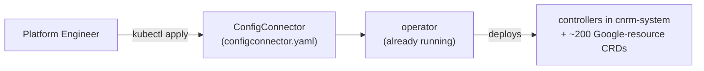

<!-- =====================================================================
  Deploying and Using Config Connector with GKE
  Reference notes for instructors & students
===================================================================== -->


# M2 - Applying the ConfigConnector resource (stage 2)

Stage 1 ([[M2-operator-install]]) installed the operator — a small idle bootstrap.
**Stage 2 turns Config Connector on:** you apply a single **ConfigConnector**
resource, and the operator reacts by deploying the actual controllers and the
Google-resource CRDs into a new `cnrm-system` namespace.



---

## Some important notes

- **One resource flips the switch.** Applying a ConfigConnector object is the whole
  trigger — the operator watches for it and does the rest.
- **The name is fixed.** `metadata.name` **must** be
  `configconnector.core.cnrm.cloud.google.com` (it's a cluster singleton).
- **`mode` is the big decision:** `cluster` (one identity for everything) or
  `namespaced` (per-namespace identity). This shapes what the operator deploys.

---

## Step 1 — choose a mode and write the manifest

### Cluster mode — one Google Service Account for the whole cluster

```yaml
apiVersion: core.cnrm.cloud.google.com/v1beta1
kind: ConfigConnector
metadata:
  # the only accepted name — this is a singleton
  name: configconnector.core.cnrm.cloud.google.com
spec:
  mode: cluster
  googleServiceAccount: "SERVICE_ACCOUNT_NAME@PROJECT_ID.iam.gserviceaccount.com"
  stateIntoSpec: Absent
```

### Namespaced mode — identity is set per namespace instead

```yaml
apiVersion: core.cnrm.cloud.google.com/v1beta1
kind: ConfigConnector
metadata:
  name: configconnector.core.cnrm.cloud.google.com
spec:
  mode: namespaced
  stateIntoSpec: Absent
```

Note there is **no `googleServiceAccount`** here — in namespaced mode you supply the
identity later, per namespace, via a **ConfigConnectorContext** ([[M2-operator-crds]]):

```yaml
apiVersion: core.cnrm.cloud.google.com/v1beta1
kind: ConfigConnectorContext
metadata:
  name: configconnectorcontext.core.cnrm.cloud.google.com
  namespace: NAMESPACE
spec:
  googleServiceAccount: "NAMESPACE_GSA@HOST_PROJECT_ID.iam.gserviceaccount.com"
  stateIntoSpec: Absent
```

## Step 2 — apply the manfiest

```bash
kubectl apply -f configconnector.yaml
```

## Step 3 — verify the controllers came up

The controller Pod can take **several minutes** to start.

```bash
kubectl wait -n cnrm-system \
  --for=condition=Ready pod \
  -l cnrm.cloud.google.com/component=cnrm-controller-manager
# → pod/cnrm-controller-manager-0 condition met
```

---

## What the operator stands up in response

### Cluster mode → 4 shared workloads in `cnrm-system`

Verified against the assembled release bundle
([`cluster/*/0-cnrm-system.yaml`](https://github.com/GoogleCloudPlatform/k8s-config-connector/tree/master/operator/channels/packages/configconnector)):

| Workload | Kind | Role |
|----------|------|------|
| `cnrm-controller-manager` | **StatefulSet** | the reconcilers — the core engine |
| `cnrm-webhook-manager` | **Deployment** | admission webhooks (validation + defaulting) |
| `cnrm-deletiondefender` | **StatefulSet** | guards against unintended deletions |
| `cnrm-resource-stats-recorder` | **Deployment** | emits resource-count metrics |

Plus the **~200 Google-resource CRDs** (ComputeAddress, StorageBucket, …), which
appear only now — not at operator-install time.

### Namespaced mode → per-namespace controllers, plus an extra workload

Namespaced mode differs in two ways:

- **The controller becomes per-namespace.** Instead of one shared
  `cnrm-controller-manager`, each ConfigConnectorContext makes the operator stand up
  a **dedicated** `cnrm-controller-manager-${NAMESPACE}` StatefulSet, so each
  namespace reconciles under its own identity.
- **An extra shared workload appears:** `cnrm-unmanaged-detector` (StatefulSet),
  which is deployed **only in namespaced mode**. The `cnrm-webhook-manager`,
  `cnrm-resource-stats-recorder`, and `cnrm-deletiondefender` remain shared.


---

## Issues with the current slide

1. **The 4 workloads shown are correct — the slide depicts cluster mode.** Cluster
   mode (the simplest deployment) is exactly these four:
   `cnrm-controller-manager`, `cnrm-webhook-manager`, `cnrm-deletiondefender`,
   `cnrm-resource-stats-recorder`. `cnrm-unmanaged-detector` is **namespaced-mode
   only**, so it's correctly absent here. Worth noting in narration that this is the
   cluster-mode picture.
