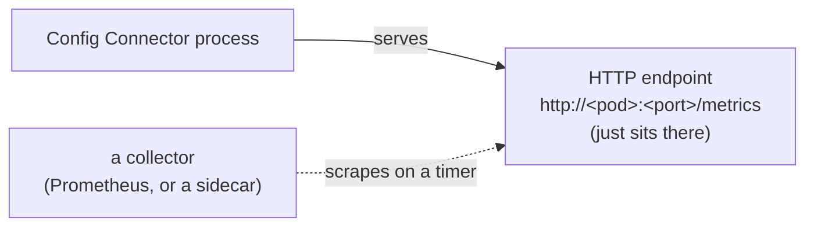
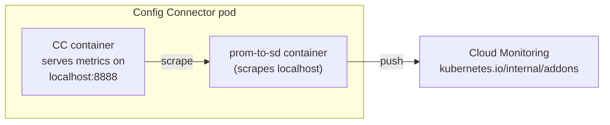
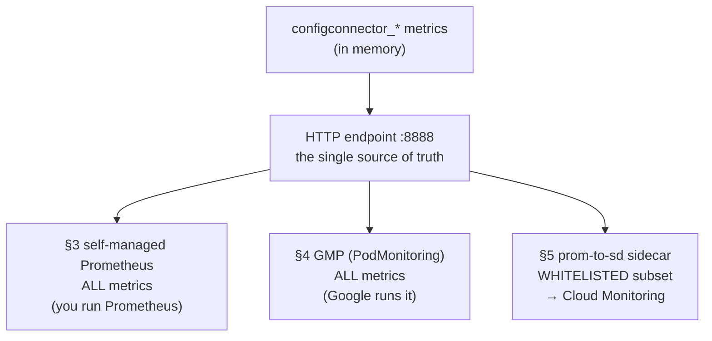

<!-- =====================================================================
  Deploying and Using Config Connector with GKE
  Reference notes for instructors & students
===================================================================== -->


# M4 - How Config Connector monitoring works

Config Connector runs a set of controllers in your cluster that constantly
reconcile Kubernetes objects into Google Cloud resources. Like any busy
controller, it's useful to know **how hard it's working and whether it's
healthy** — how many reconciles it's doing, how long they take, how many errors
it hits. Those numbers are its **metrics**.

---

## 1. The one idea to start with: Config Connector only *exposes* metrics

The most important thing to understand: **Config Connector does not push its
metrics anywhere by itself.** Each Config Connector process keeps counters in memory and
publishes them at an HTTP endpoint — a plain web page of numbers in Prometheus
text format. That's it. Something *else* has to come along and read that page.

This is the standard **Prometheus pull model**:



If nothing scrapes the endpoint, the numbers simply sit there and get
overwritten. Config Connector keeps reconciling regardless — **metrics are
observability, not a dependency.**

---

## 2. Who exposes what, and where

There are **two** Config Connector components that expose metrics, each fronted by a
Kubernetes **Service** so collectors have a stable address:

| Component | What it reports | Service | Scrape port |
|-----------|-----------------|---------|-------------|
| **controller-manager** | reconcile activity (requests, durations, worker pool, errors) | `cnrm-controller-manager-service` | **8888** |
| **resource-stats-recorder** | how many resources Config Connector is managing | `cnrm-resource-stats-recorder-service` | **8888** |

Both Services carry the annotations that tell a Prometheus scraper "come read me":

```yaml
prometheus.io/scrape: 'true'
prometheus.io/port: '8888'
```

> **A small gotcha about the recorder's port.** The recorder *container* actually
> serves on port **48797** internally, but its Service re-maps that to **8888**
> (`port: 8888 → targetPort: 48797`). So from the outside both components look
> like "port 8888," which is what the public docs say — but if you ever look at
> the recorder's sidecar config you'll see `localhost:48797`, the container-side
> port. Both numbers are correct; they're just two ends of the same Service.

The manager's scrape port is set by its own launch argument
`--prometheus-scrape-endpoint=:8888`
([`config/installbundle/components/manager/base/manager.yaml:58`](https://github.com/GoogleCloudPlatform/k8s-config-connector/blob/master/config/installbundle/components/manager/base/manager.yaml#L58));
the recorder uses `--prometheus-scrape-endpoint=:48797`
([`recorder.yaml:49`](https://github.com/GoogleCloudPlatform/k8s-config-connector/blob/master/config/installbundle/components/recorder/recorder.yaml#L49)).

### The metrics you can read there

These are the Config Connector-authored metrics (all prefixed `configconnector_`):

- `configconnector_reconcile_requests_total`
- `configconnector_reconcile_request_duration_seconds`
- `configconnector_reconcile_workers_total`
- `configconnector_reconcile_occupied_workers_total`
- `configconnector_applied_resources_total`
- `configconnector_build_info`

> There are also lower-level `gcp_api_*` request counters exposed on the same
> pods, but they're an internal detail — not in the public metrics table and not
> forwarded to Cloud Monitoring (see §5). Treat the list above as the supported
> surface.

---

## 3. Consuming metrics with self-managed Prometheus

If you run your **own** Prometheus, you point it at the two Services from the §2
table — `cnrm-controller-manager-service` and `cnrm-resource-stats-recorder-service`
— and you get **everything** on the endpoint (no filtering). There are two common
ways to tell Prometheus to scrape them.

### Option A — annotation-based scraping

- **Prometheus does the discovering.** Configured with **Kubernetes service
  discovery** (`kubernetes_sd_config`), it asks the Kubernetes API for all
  pods/Services and their annotations.
- **Relabel rules pick the targets.** A standard rule keeps only targets annotated
  `prometheus.io/scrape: 'true'` and scrapes them on the `prometheus.io/port`.
- **Config Connector just opts in.** Its Services already carry both annotations, so
  no Config Connector-side config is needed.
- **Catch:** this only works if *your* Prometheus has that annotation-honoring
  relabel rule. A bare Prometheus without it ignores the annotations entirely.

### Option B — a `ServiceMonitor` (Prometheus Operator)

- **The Operator generates the scrape config for you.** Instead of hand-editing
  Prometheus config, you create `ServiceMonitor` objects (a CRD the Operator adds)
  and it watches for them.
- **A `ServiceMonitor` is a declarative rule:** "scrape every Service matching
  these labels, on this named port, at this interval." Selection is **explicit and
  label-based**, not convention-based.
- **How it maps to Config Connector:** its Services are labeled
  `cnrm.cloud.google.com/monitored: "true"` and expose a port named `metrics`. The
  official
  [`ServiceMonitor` example](https://docs.cloud.google.com/config-connector/docs/how-to/monitoring-prometheus#scraping_metrics)
  selects on that label, targets the `metrics` port in `cnrm-system`, and scrapes
  every 10s.
- **Trade-off:** needs the Prometheus Operator installed, but the selection is
  spelled out rather than relying on a convention.

> This whole section is what the official
> [Monitoring with Prometheus how-to](https://docs.cloud.google.com/config-connector/docs/how-to/monitoring-prometheus#scraping_metrics)
> documents. **When you scrape directly, no whitelist applies — you see the full set
> of metrics.**

---

## 4. Consuming metrics with Google Managed Service for Prometheus (GMP)

**GMP is Google's hosted, drop-in replacement for running Prometheus yourself.** You
enable **managed collection** and Google runs the collectors for you (in the
`gmp-system` namespace), storing metrics in Cloud Monitoring. Conceptually it's
still §3's model — something scrapes the same `:8888` endpoints — but the *how* is
different.

### How you enable it

- `gcloud container clusters update … --enable-managed-prometheus`, or the checkbox
  in the cluster-creation dialog.
- This starts the collectors and scrapes GKE's own system metrics automatically.

### It does **not** reuse §3's mechanisms

- ❌ Does **not** honor the `prometheus.io/scrape` annotation convention.
- ❌ Does **not** use the Prometheus Operator's `ServiceMonitor`.
- ❌ Is **not** automatic for Config Connector — enabling managed collection gets you
  system metrics, but nothing scrapes Config Connector until you tell it to.

### Instead, GMP uses its own CRDs

- **`PodMonitoring`** — namespaced; scrape pods in one namespace.
- **`ClusterPodMonitoring`** — cluster-wide.
- They work like a `ServiceMonitor` (label selector + named port + interval) but
  target **pods** directly.

**So to get Config Connector metrics into GMP,** you author a `PodMonitoring` in
`cnrm-system` selecting Config Connector's pods on the `metrics` port. Config
Connector does **not** ship one — this is a manual step you add yourself.

---

## 5. Shipping metrics to Cloud Monitoring with the sidecar

This path is for people who **don't** run Prometheus at all but still want Config
Connector's key numbers in **Cloud Monitoring**. It's the piece most people don't
know exists.

### What a sidecar is

- A second container that runs *inside the same pod* as the main one.
- Containers in a pod share a network namespace, so the sidecar reaches the main
  container at `localhost`.



### What this one does

- The image is **`prometheus-to-sd`** ("Prometheus **to** **S**tack**d**river" —
  Stackdriver is the old name for Cloud Monitoring).
- It scrapes the pod-local Prometheus endpoint and **pushes** the results to Cloud
  Monitoring via the API.
- Config Connector still only *exposes* metrics — the sidecar is what pushes.

### The key limitation — the whitelist

Unlike §3/§4, the sidecar forwards only an explicit allow-list, named in its
`--source` argument:

- **manager sidecar:** `reconcile_requests_total`,
  `reconcile_request_duration_seconds`, `reconcile_workers_total`,
  `reconcile_occupied_workers_total`, `internal_errors_total`
- **recorder sidecar:** `applied_resources_total`

Everything else on the endpoint (e.g. the `gcp_api_*` metrics) stays in the pod.

> **Why does this exist if GMP is available?** It predates the convenient GMP path
> and is bundled into the operator's install, so a standard GKE install gets Config
> Connector's core health metrics into Cloud Monitoring out of the box, with no
> Prometheus to run yourself.

---

## 6. Putting it together

All three paths consume the **same** `:8888` Prometheus endpoint — there is no
separate direct-to-Cloud-Monitoring push inside Config Connector.



- **§3 and §4** (you or Google scrape it) are **unrestricted** — you get every
  metric on the endpoint.
- **§5** (the sidecar) is the only path filtered to a **whitelist**, and the only
  one that requires no scraper of your own.