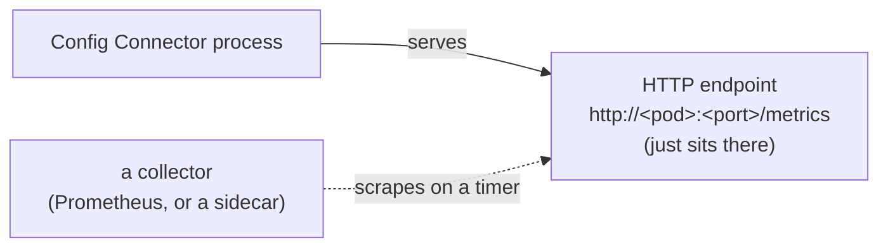
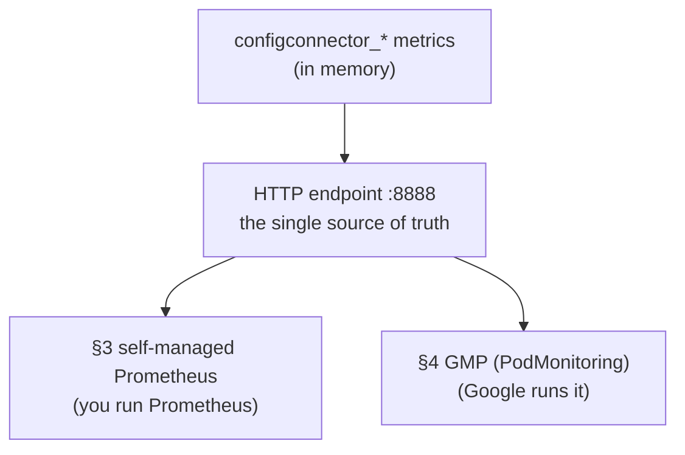

<!-- =====================================================================
  Deploying and Using Config Connector with GKE
  Reference notes for instructors & students
===================================================================== -->


# M4 - How Config Connector monitoring works

Config Connector runs a set of controllers in your cluster that constantly
reconcile Kubernetes objects into Google Cloud resources. Like any busy
controller, it's useful to know **how hard it's working and whether it's
healthy** — how many reconciles it's doing, how long they take, how many errors
it hits. Those numbers are its **metrics**.

---

## 1. The one idea to start with: Config Connector only *exposes* metrics

The most important thing to understand: **Config Connector does not push its
metrics anywhere by itself.** Each Config Connector process keeps counters in memory and
publishes them at an HTTP endpoint — a plain web page of numbers in Prometheus
text format. That's it. Something *else* has to come along and read that page.

This is the standard **Prometheus pull model**:



If nothing scrapes the endpoint, the numbers simply sit there and get
overwritten. Config Connector keeps reconciling regardless — **metrics are
observability, not a dependency.**

---

## 2. Who exposes what, and where

There are **two** Config Connector components that expose metrics, each fronted by a
Kubernetes **Service** so collectors have a stable address:

| Component | What it reports | Service | Scrape port |
|-----------|-----------------|---------|-------------|
| **controller-manager** | reconcile activity (requests, durations, worker pool, errors) | `cnrm-controller-manager-service` | **8888** |
| **resource-stats-recorder** | how many resources Config Connector is managing | `cnrm-resource-stats-recorder-service` | **8888** |

Both Services carry the annotations that tell a Prometheus scraper "come read me":

```yaml
prometheus.io/scrape: 'true'
prometheus.io/port: '8888'
```

> **A small gotcha about the recorder's port.** The recorder *container* actually
> serves on port **48797** internally, but its Service re-maps that to **8888**
> (`port: 8888 → targetPort: 48797`). So from the outside both components look
> like "port 8888," which is what the public docs say — but if you ever look at
> the recorder's sidecar config you'll see `localhost:48797`, the container-side
> port. Both numbers are correct; they're just two ends of the same Service.

The manager's scrape port is set by its own launch argument
`--prometheus-scrape-endpoint=:8888`
([`config/installbundle/components/manager/base/manager.yaml:58`](https://github.com/GoogleCloudPlatform/k8s-config-connector/blob/master/config/installbundle/components/manager/base/manager.yaml#L58));
the recorder uses `--prometheus-scrape-endpoint=:48797`
([`recorder.yaml:49`](https://github.com/GoogleCloudPlatform/k8s-config-connector/blob/master/config/installbundle/components/recorder/recorder.yaml#L49)).

### The metrics you can read there

These are the Config Connector-authored metrics (all prefixed `configconnector_`):

- `configconnector_reconcile_requests_total`
- `configconnector_reconcile_request_duration_seconds`
- `configconnector_reconcile_workers_total`
- `configconnector_reconcile_occupied_workers_total`
- `configconnector_applied_resources_total`
- `configconnector_build_info`

> There are also lower-level `gcp_api_*` request counters exposed on the same
> pods, but they're an internal detail — not in the public metrics table. Treat the
> list above as the supported surface.

---

## 3. Consuming metrics with self-managed Prometheus

If you run your **own** Prometheus, you point it at the two Services from the §2
table — `cnrm-controller-manager-service` and `cnrm-resource-stats-recorder-service`
— and you get **everything** on the endpoint (no filtering). There are two common
ways to tell Prometheus to scrape them.

### Option A — annotation-based scraping

- **Prometheus does the discovering.** Configured with **Kubernetes service
  discovery** (`kubernetes_sd_config`), it asks the Kubernetes API for all
  pods/Services and their annotations.
- **Relabel rules pick the targets.** A standard rule keeps only targets annotated
  `prometheus.io/scrape: 'true'` and scrapes them on the `prometheus.io/port`.
- **Config Connector just opts in.** Its Services already carry both annotations, so
  no Config Connector-side config is needed.
- **Catch:** this only works if *your* Prometheus has that annotation-honoring
  relabel rule. A bare Prometheus without it ignores the annotations entirely.

### Option B — a `ServiceMonitor` (Prometheus Operator)

- **The Operator generates the scrape config for you.** Instead of hand-editing
  Prometheus config, you create `ServiceMonitor` objects (a CRD the Operator adds)
  and it watches for them.
- **A `ServiceMonitor` is a declarative rule:** "scrape every Service matching
  these labels, on this named port, at this interval." Selection is **explicit and
  label-based**, not convention-based.
- **How it maps to Config Connector:** its Services are labeled
  `cnrm.cloud.google.com/monitored: "true"` and expose a port named `metrics`. The
  official
  [`ServiceMonitor` example](https://docs.cloud.google.com/config-connector/docs/how-to/monitoring-prometheus#scraping_metrics)
  selects on that label, targets the `metrics` port in `cnrm-system`, and scrapes
  every 10s.
- **Trade-off:** needs the Prometheus Operator installed, but the selection is
  spelled out rather than relying on a convention.

> This whole section is what the official
> [Monitoring with Prometheus how-to](https://docs.cloud.google.com/config-connector/docs/how-to/monitoring-prometheus#scraping_metrics)
> documents. **When you scrape directly, you see the full set of metrics.**

---

## 4. Consuming metrics with Google Managed Service for Prometheus (GMP)

**GMP is Google's hosted, drop-in replacement for running Prometheus yourself.** You
enable **managed collection** and Google runs the collectors for you (in the
`gmp-system` namespace), storing metrics in Cloud Monitoring. Conceptually it's
still §3's model — something scrapes the same `:8888` endpoints — but the *how* is
different.

### How you enable it

- `gcloud container clusters update … --enable-managed-prometheus`, or the checkbox
  in the cluster-creation dialog (this is the default setting).
- This starts the collectors and scrapes GKE's own system metrics automatically.

### It does **not** reuse §3's mechanisms

- ❌ Does **not** honor the `prometheus.io/scrape` annotation convention.
- ❌ Does **not** use the Prometheus Operator's `ServiceMonitor`.
- ❌ Is **not** automatic for Config Connector — enabling managed collection gets you
  system metrics, but nothing scrapes Config Connector until you tell it to.

### Instead, GMP uses its own CRDs

- **`PodMonitoring`** — namespaced; scrape pods in one namespace.
- **`ClusterPodMonitoring`** — cluster-wide.
- They work like a `ServiceMonitor` (label selector + named port + interval) but
  target **pods** directly.

**So to get Config Connector metrics into GMP,** you author `PodMonitoring`
object(s) in `cnrm-system` selecting Config Connector's pods. Config Connector does
**not** ship one — this is a manual step you add yourself.

### The `PodMonitoring` configuration

```yaml
apiVersion: monitoring.googleapis.com/v1
kind: PodMonitoring
metadata:
  name: cnrm-manager-metrics
  namespace: cnrm-system
spec:
  selector:
    matchLabels:
      cnrm.cloud.google.com/component: cnrm-controller-manager
  endpoints:
    - port: 8888
      interval: 30s
---
apiVersion: monitoring.googleapis.com/v1
kind: PodMonitoring
metadata:
  name: cnrm-recorder-metrics
  namespace: cnrm-system
spec:
  selector:
    matchLabels:
      cnrm.cloud.google.com/component: cnrm-resource-stats-recorder
  endpoints:
    - port: 48797
      interval: 30s
```

Two things that trip people up here — both a consequence of `PodMonitoring`
scraping the **pod/container** directly, not the Service:

- **You need two objects, one per component, because they serve on different
  container ports.** The manager container serves on **8888**, but the recorder
  *container* serves on **48797** (recall from §2 that only its *Service* remaps
  that to 8888). `PodMonitoring` bypasses the Service, so it must target each real
  container port — you can't cover both with one endpoint. Select each component by
  its `cnrm.cloud.google.com/component` **pod** label.
- **Select on a pod label, and use the numeric port.** The
  `cnrm.cloud.google.com/monitored: "true"` label and the `metrics` port name live
  on the *Service*, not the pods, so a selector using them matches nothing (the
  `PodMonitoring` will still report `ConfigurationCreateSuccess` — that only means
  the config is valid, not that it matched any pods). Use the numeric container port
  as shown.

> If you only want the reconcile metrics (rate/latency/errors/workers) and don't
> need `applied_resources_total`, the manager `PodMonitoring` alone is enough — drop
> the recorder object.

---

## 5. Putting it together

Both paths consume the **same** `:8888` Prometheus endpoint — there is no
separate direct-to-Cloud-Monitoring push inside Config Connector. Something always
has to scrape the endpoint; the only question is whether you run that scraper (§3)
or Google runs it (§4).



- **§3 and §4** both give you the **full set** of metrics on the endpoint — you get
  every metric, with no whitelist.
- Either way you must set up the scrape yourself: Config Connector does not ship a
  `PodMonitoring`/`ServiceMonitor`, and enabling GMP alone does not scrape Config
  Connector until you add one.

---

## 6. Queries worth running

Once the metrics are in Cloud Monitoring (via §4) or your own Prometheus (§3),
these six queries cover the questions you'll actually ask. Run them in **Metrics
Explorer → PromQL**, or drop them onto a dashboard. They combine the official
[Monitoring with Prometheus](https://docs.cloud.google.com/config-connector/docs/how-to/monitoring-prometheus)
examples with a few refinements (rates and percentiles) that make them useful over
time rather than as instantaneous counts.

### 1. Reconcile error rate by kind

```promql
sum by (group_version_kind) (
  rate(configconnector_reconcile_requests_total{status="ERROR"}[5m])
)
```

- **Watches:** resources that are failing to converge on Google Cloud.
- **Why it helps:** the single most valuable signal — a rising line for one kind
  almost always means one shared cause (a missing IAM permission, an unresolvable
  dependency, a 429) is hitting every resource of that kind. Using `rate()` instead
  of the raw counter shows failures *happening now*, not the all-time total.

### 2. Reconcile error *ratio* by kind

```promql
sum by (group_version_kind) (rate(configconnector_reconcile_requests_total{status="ERROR"}[5m]))
/
sum by (group_version_kind) (rate(configconnector_reconcile_requests_total[5m]))
```

- **Watches:** what fraction of reconciles are failing, normalized for how busy a
  kind is.
- **Why it helps:** a kind reconciling thousands of times will out-scale a rare
  kind on raw error count even when it's healthier. The ratio (0–1) is the fairer
  signal and the better basis for an alert threshold.

### 3. p95 reconcile latency by kind

```promql
histogram_quantile(0.95,
  sum by (le, group_version_kind) (
    rate(configconnector_reconcile_request_duration_seconds_bucket[5m])
  ))
```

- **Watches:** reconciles that succeed but are getting *slow*.
- **Why it helps:** catches the "not failing, just dragging" state — often the first
  sign of quota throttling or an overloaded controller — before it turns into
  errors or missed reconciles.

### 4. Worker saturation

```promql
sum(configconnector_reconcile_occupied_workers_total)
/
sum(configconnector_reconcile_workers_total)
```

- **Watches:** whether the controller's reconcile worker pool is maxed out.
- **Why it helps:** as this ratio approaches **1.0**, every worker is busy and new
  reconcile requests queue — the controller is throughput-bound. This is the signal
  that you need to tune the controller (more workers / resources) rather than the
  cluster.

### 5. Resources under management

```promql
sum(configconnector_applied_resources_total)
```

- **Watches:** the total size of the fleet Config Connector is managing.
- **Why it helps:** growth here drives everything else — API quota pressure,
  reconcile load, controller memory. A steady climb is your early warning to plan
  capacity. Add `by (group_version_kind)` or filter by `namespace` to see *where*
  the growth is.

### 6. Top 5 kinds by error volume

```promql
topk(5,
  sum by (group_version_kind) (
    rate(configconnector_reconcile_requests_total{status="ERROR"}[5m])
  ))
```

- **Watches:** which resource types are the noisiest right now.
- **Why it helps:** a fast triage view — when something is wrong, this immediately
  ranks the failing kinds so you know where to look first, without scanning every
  series.

### Turning these into alerts

Queries tell you when you look; **alerts tell you when you're not looking.** The
strongest candidates to promote to alerting policies are the *error ratio* (#2) and
*worker saturation* (#4) — both are normalized (0–1), so a threshold is meaningful
regardless of fleet size. Wrap them with a sustained duration (fire after several
minutes, not on a single spike) so a transient blip doesn't page anyone. Sustained
reconcile errors are the most direct signal that your declared state and reality
have diverged — the best alert to add from Config Connector's own metrics.