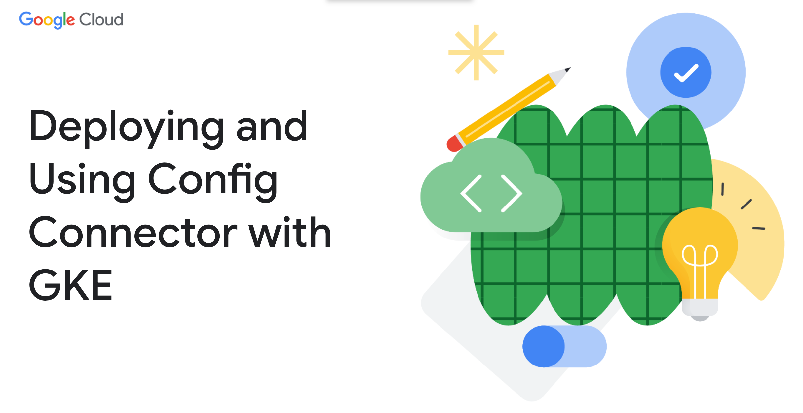

<!-- =====================================================================
  Deploying and Using Config Connector with GKE
  Reference notes for instructors & students
===================================================================== -->



# M4 - Performance tuning

Config Connector runs fine out of the box for small-to-moderate workloads. Tuning
becomes necessary when you push volume — managing thousands of resources, or large
GitOps applies. This note walks a handful of **common scenarios** to illustrate the
tuning knobs and the way to approach a performance problem — it's not an exhaustive
catalog of everything that can go wrong. Each scenario is a **symptom**: how to
recognize it from metrics, and the responses that actually fix it — some are Config
Connector settings, some aren't.

> A couple of notes below reference **Config Controller**, Google's *managed* Config
> Connector offering (private cluster, namespaced mode, Google-sized). Its specifics
> don't always generalize to a self-managed install — those are called out where they
> come up.

---

## How to read this note

Not every fix is a Config Connector CRD change. Responses fall into **three
categories**, and one symptom often needs more than one:

- **CC config** — Config Connector's own knobs (the customization CRDs).
- **Cluster / infra** — the GKE cluster underneath (node capacity, scheduling,
  autoscaling); a CRD asking for more does nothing if the pod can't schedule.
- **Source / environment** — the applier's pace, or downstream Google Cloud API quota
  that no in-cluster knob fixes.

Each scenario is a symptom: a **Signal** to recognize it (scrape via
[M4-monitoring](M4-monitoring.md)), then its responses ordered **most-likely first** —
work down until the signal is addressed.

---

## Scenario 1 — the controller is memory-pressured (OOMKilled)

**When:** the controller is nearing its memory limit or crashing under the weight of
the resources it manages.

- **Signal:** `container_memory_working_set_bytes` for the `manager` container
  **sustained above ~80% of its limit**, or trending up without plateauing — memory is
  non-compressible, so react *before* it hits the limit and gets OOMKilled, not after.
- **Failure state:** the container is **OOMKilled** and restarts. Observe it with
  `kubectl get pod -n cnrm-system` (restart count climbing) and the pod's events
  (**OOMKilled**) — this shows up at the pod, not in the reconcile metrics.

### Responses

**① CC config — raise the memory limit.** The first and usually only response. Use
`ControllerResource` (cluster mode) or `NamespacedControllerResource` (namespaced
mode). Valid container names are fixed by the CRD enum — `manager`, `webhook`,
`deletiondefender`, `prom-to-sd`, `recorder`, `unmanageddetector` (from
`controllerresource_types.go`).

Cluster mode — size a shared component (here, the webhook):

```yaml
apiVersion: customize.core.cnrm.cloud.google.com/v1beta1
kind: ControllerResource
metadata:
  name: cnrm-webhook-manager
spec:
  containers:
    - name: webhook
      resources:
        limits:
          memory: 512Mi
        requests:
          memory: 256Mi
```

Namespaced mode — give one busy namespace's controller more headroom without
inflating every other namespace's controller:

```yaml
apiVersion: customize.core.cnrm.cloud.google.com/v1beta1
kind: NamespacedControllerResource
metadata:
  name: cnrm-controller-manager
  namespace: team-a
spec:
  containers:
    - name: manager
      resources:
        limits:
          cpu: 200m
          memory: 512Mi
        requests:
          cpu: 100m
          memory: 256Mi
```

The per-namespace form is the real win of namespaced mode for tuning: the noisy
tenant gets more resources; the quiet ones stay small.

**② Cluster / infra — make room for the bigger pod.** Raising the request/limit only
helps if the node can actually **schedule** the larger pod. If after applying the CRD
the controller pod is stuck **Pending**, the cluster is out of capacity — see
[When a bigger pod won't schedule](#when-a-bigger-pod-wont-schedule).

---

## Scenario 2 — applies are slow or timing out at admission

**When:** applies are slow at admission, or failing with webhook timeouts. Every
apply passes through the admission webhooks, so
a slow or overwhelmed webhook blocks applies; the Kubernetes default timeout is 10s.

- **Signal:** `apiserver_admission_webhook_admission_duration_seconds` (p95) for the
  `cnrm` webhooks **creeping toward the configured `timeoutSeconds`** (10s by
  default) — that's your cue *before* timeouts fire. Also watch
  `cnrm-webhook-manager` **CPU vs. the HPA's 70% target** and whether the HPA is
  **pinned at `maxReplicas`**.
- **Failure state:** `kubectl apply` intermittently fails with a webhook error
  (`context deadline exceeded` / `failed calling webhook`). Observe it in the apply
  output or the applier's logs.

### Responses

Almost always this is a **capacity** problem — too much admission traffic for the
webhook fleet — so start at the pods, not the timeout. Responses are ordered
most-likely first.

**1. Check the webhook pods — are you capped?** The `cnrm-webhook-manager` runs behind
an HPA (min **2**, max **20**, 70% CPU/mem target) that scales out under load. Under a
big apply it commonly pins at the ceiling. Two things to look at:

- **HPA pinned at `maxReplicas` (20), CPU still high** → the autoscaler has run out of
  room. Raise the ceiling with the `replicas` field on `ControllerResource`:

  ```yaml
  apiVersion: customize.core.cnrm.cloud.google.com/v1beta1
  kind: ControllerResource
  metadata:
    name: cnrm-webhook-manager
  spec:
    replicas: 30
  ```

  Note the operator maps `replicas` onto the HPA's `minReplicas`, and raises
  `maxReplicas` to match only if it's smaller — so `replicas: 30` gives you a
  **pinned** min=max=30 (autoscaling off), not a 2–30 range. You're trading the
  autoscaling band for a guaranteed higher floor; that's the intended tradeoff when
  20 isn't enough.
- **New webhook pods stuck `Pending`** → the HPA *wants* more replicas but the cluster
  can't schedule them. This, not `maxReplicas`, is the real cap. See
  [When a bigger pod won't schedule](#when-a-bigger-pod-wont-schedule).

**2. Raise the webhook timeout — as a stopgap, not a fix.** Bumping `timeoutSeconds`
buys breathing room and is a useful *diagnostic* (if 30s makes the errors stop, the
problem was latency; if it doesn't, the webhook is genuinely overwhelmed and you're
back to step 1). It doesn't make the webhook faster. Edit it via
`ValidatingWebhookConfigurationCustomization` (or the `Mutating…` variant) — not the
webhook configs directly, which the operator reverts:

```yaml
apiVersion: customize.core.cnrm.cloud.google.com/v1beta1
kind: ValidatingWebhookConfigurationCustomization
metadata:
  name: validating-webhook
spec:
  webhooks:
    - name: deny-immutable-field-updates
      timeoutSeconds: 20
```

Valid validating names: `deny-immutable-field-updates`, `deny-unknown-fields`,
`iam-validation`, `resource-validation`, `abandon-on-uninstall`; mutating:
`container-annotation-handler`, `generic-defaulter`, `iam-defaulter`,
`management-conflict-annotation-defaulter` (via `MutatingWebhookConfigurationCustomization`,
same shape). Kubernetes caps `timeoutSeconds` at **30s** — if you're at 30 and still
timing out, the timeout was never the problem.

**3. Slow the applies down.** If a single massive GitOps sync outruns even a
fully-scaled webhook fleet, admit more slowly — batch or stagger the sync, or lower
the applier's concurrency — so admission traffic stays under capacity.

**4. (Rarely) resize the webhook container.** Changing the webhook's CPU/memory
requests/limits via `ControllerResource` is a genuine last resort. The webhook's
defaults were tuned upstream (its old under-provisioned requests and aggressive HPA
target were fixed in the operator), so replicas and cluster capacity above are almost
always the right levers instead. Reach for container sizing only if the webhook is
demonstrably CPU-starved *per replica* even at a healthy replica count.

---

## Scenario 3 — reconciliation is too slow

**When:** a large batch of resources (a GitOps push of hundreds/thousands) reconciles
sluggishly even though the controller has CPU and memory to spare. The bottleneck is
the **client-side rate limit** on calls to the Kubernetes API server — a token bucket
that defaults to **qps 20, burst 30** (`controllerreconciler_types.go`).

- **Signal:** **worker saturation** — occupied over total workers for a kind —
  sustained **near 1.0**:

  ```promql
  configconnector_reconcile_occupied_workers_total
    / configconnector_reconcile_workers_total
  ```

  Corroborate with rising `configconnector_reconcile_request_duration_seconds` (p95
  climbing) **while** the `manager` container's CPU/memory sit **well below their
  limits**. It's that combination — *saturated workers + spare CPU/memory* — that
  points at the rate limit rather than sizing.
- **Failure state:** no crash — reconciles just queue and lag. New/changed resources
  take longer to reach **Ready**, and a big apply drains in slowly. (If workers are
  saturated *and* memory is near its limit, size it first — Scenario 1.)

### Responses

**① CC config — raise the reconciler rate limit.** Use `ControllerReconciler`
(cluster mode, 1.125+) or `NamespacedControllerReconciler` (namespaced mode, 1.119+).
The name **must** be `cnrm-controller-manager`. Raise the limit to speed up
reconciliation — but only when the backlog is genuinely on the *Kubernetes* side and
you have headroom on both the K8s and Google Cloud sides (checked just below):

```yaml
apiVersion: customize.core.cnrm.cloud.google.com/v1beta1
kind: ControllerReconciler
metadata:
  name: cnrm-controller-manager
spec:
  rateLimit:
    qps: 80
    burst: 40
```

Namespaced-mode equivalent, scoped to one namespace:

```yaml
apiVersion: customize.core.cnrm.cloud.google.com/v1beta1
kind: NamespacedControllerReconciler
metadata:
  name: cnrm-controller-manager
  namespace: team-a
spec:
  rateLimit:
    qps: 80
    burst: 40
```

**How to know you have Kubernetes API-server headroom.** The qps/burst limit throttles
the controller's *Kubernetes* client, so before raising it, confirm the API server
isn't already the constraint. The easiest way is the GKE **Observability** dashboard
in the Cloud console — but the control-plane charts only appear if you've enabled
control-plane metrics.

**One-time setup — turn on control-plane (API server) metrics.** They're off by
default. Enable them with:

```bash
gcloud container clusters update CLUSTER_NAME \
  --location COMPUTE_LOCATION \
  --monitoring=SYSTEM,API_SERVER
```

(or in the console: **Kubernetes Engine → Clusters → your cluster → Observability
tab → Control Plane → Enable package**). GKE ships these to Cloud Monitoring via
Managed Prometheus.

**Then read the dashboard.** Go to **Kubernetes Engine → Clusters → your cluster →
Observability tab → Control Plane**. You're looking for whether the API server is
comfortable or saturated:

- **Request latency** (`apiserver_request_duration_seconds`) — Google's suggested
  upper bounds are **~1s for single-resource calls, ~30s for LIST calls**. Latency
  sitting well under those and flat under load = headroom. Latency climbing as you
  apply more = the API server is the constraint, and raising qps/burst will only make
  it worse.
- **Request rate & errors** (`apiserver_request_total`) — a rising share of **4xx/5xx**
  responses (especially **429 Too Many Requests**) means you're already being
  throttled; don't raise qps/burst.
- **In-flight requests** (`apiserver_current_inflight_requests`) — sustained high
  concurrency is another saturation signal.

If those charts are calm, you have K8s-side headroom.

**② Source / environment — mind the downstream Google Cloud API.** Headroom on the
K8s side isn't the whole story — the limit Config Connector hits first is often
**Google Cloud API quota downstream**, not the kube-apiserver. If latency is high but
**nothing in-cluster is saturated** (workers, CPU, memory, API server all fine), the
bottleneck is GCP-side and no in-cluster knob fixes it — check quota and the reconcile
error status.

> **⚠️ Raising qps/burst speeds up *two* things, not one.** The limit is on the
> Kubernetes client, but reconciling faster also makes the controller call **Google
> Cloud APIs** faster — every create/update/GET on the real resource. So a higher
> qps/burst clears the K8s-side queue **and** raises the rate of Google Cloud API
> calls in lock-step. If your actual bottleneck was **GCP quota**, raising qps/burst
> pushes you into quota errors *sooner*, not later. Raise it only when the queue is on
> the **K8s side** and GCP quota has room; if you're seeing quota errors, do the
> opposite.


---

## When a bigger pod won't schedule

Both the memory scenario (a bigger controller pod) and the webhook scenario (the HPA
wanting more replicas) can stall on **cluster capacity**: you asked for more, but the
cluster has no room to place it. This is a GKE-level fix, not a Config Connector one.

**Signal:** the pod is stuck **Pending**. Confirm and read *why*:

```bash
kubectl get pods -n cnrm-system          # STATUS: Pending
kubectl describe pod -n cnrm-system POD   # Events: FailedScheduling — "Insufficient cpu/memory"
```

`FailedScheduling` with **Insufficient cpu/memory** means the node pool is out of
allocatable capacity for what you requested. How you respond depends on the cluster
type:

- **Standard clusters — add capacity yourself.** Resize the node pool
  (`gcloud container clusters resize` / more nodes), or enable the **cluster
  autoscaler** so GKE adds nodes when pods can't schedule. Autoscaling is the durable
  answer for bursty webhook scale-out: the HPA raises replica demand, and the cluster
  autoscaler supplies nodes to place the new pods.
- **Autopilot clusters — GKE handles it.** Autopilot has no node pools you manage; it
  provisions and sizes nodes automatically to fit the pods you schedule, so a Pending
  pod normally triggers GKE to add capacity on its own. You don't resize anything —
  but you *do* still pay for what you request, so a large request is a cost decision,
  not a scheduling one.

> **A note on very large requests.** Scheduling is bounded by a *single node's*
> allocatable capacity — a pod requesting more CPU/memory than any node can offer will
> stay **Pending** forever, and adding *more* nodes won't help. If you set a big
> memory limit on a controller (Scenario 1), make sure the node shape can actually
> hold it: on Standard, pick a machine type large enough (or an autoscaler node pool
> that includes one); on Autopilot, GKE will provision a node that fits, within its
> per-pod maximums.

> **On Config Controller**, this rung isn't yours — the backing cluster is managed
> and you're told not to modify it. Google sizes it; if you're wedged against cluster
> capacity there, that's a signal to shard across namespaces or open a support case,
> not to resize nodes yourself.

---

## Alternative: let VPA size the controllers for you

Everything above sizes containers by hand — you pick the requests/limits in a
`ControllerResource` (Scenario 1). There's a second scheme: hand memory/CPU sizing
off to the **Vertical Pod Autoscaler (VPA)** and let Config Connector keep the
controllers right-sized automatically as load changes.

**Don't wire up a raw VPA object against the controller pods yourself** — the
operator owns those workloads and would fight a VPA (or your manual edit) writing
`resources` directly. Instead, Config Connector has **native VPA integration** built
into the same customization CRD, via the `verticalPodAutoscalerMode` field (added in
**Config Connector 1.141**;
[feature doc](https://github.com/GoogleCloudPlatform/k8s-config-connector/blob/master/docs/features/containerresource.md)).

When you set it to `Enabled`, the operator creates a `VerticalPodAutoscaler`
(`updateMode: Auto`) for that controller and periodically syncs its recommendations
onto the pod — so the sizing stays operator-managed and *sticks*:

```yaml
apiVersion: customize.core.cnrm.cloud.google.com/v1beta1
kind: ControllerResource
metadata:
  name: cnrm-controller-manager
spec:
  verticalPodAutoscalerMode: Enabled
  containers: []            # required — mutually exclusive with manual sizing
```

Namespaced mode is the same on `NamespacedControllerResource` (with the namespace,
e.g. `config-control`). The **one hard rule** the CRD enforces:
`verticalPodAutoscalerMode: Enabled` is **mutually exclusive with a non-empty
`containers`** — you either size by hand *or* delegate to VPA, not both. Set
`containers: []` when enabling VPA.

**Which scheme to use:**

- **Manual `ControllerResource` sizing (Scenario 1)** — deterministic, predictable,
  no dependency on the VPA controller. Good when you know the size you want, or want a
  fixed request for capacity planning.
- **`verticalPodAutoscalerMode: Enabled`** — self-adjusting as the resource count a
  controller manages grows or shrinks, so you're not chasing OOMs by hand. Costs you
  the predictability (the pod gets resized, which for a StatefulSet means a restart)
  and adds a dependency on VPA being available in the cluster.