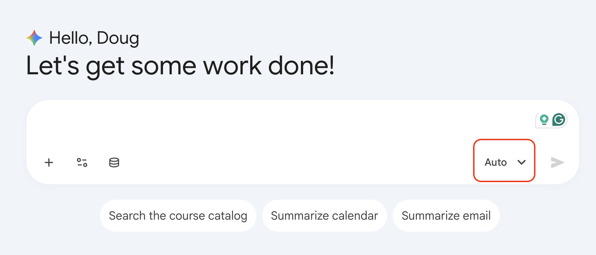

# Play Title Example

## Overview
This play teaches you how to complete a focused task using Gemini Enterprise tools.

### Objectives
In this play, you learn how to:
- Objective 1
- Objective 2
- Objective 3


## Instructions
1. Open Gemini Enterprise in your browser.

2. Start a new chat and paste your prompt.

3. Review the output and refine the prompt for clarity.

4. Save your final result for sharing.


## Here is an example code block

```text
You are a retail operations analyst.
Analyze the attached data and provide:
1) Three key findings
2) Two risks
3) One recommended action
Format the response as concise bullets for executives.
```

## Example Image Link

Alt-text is in the square brackets.


