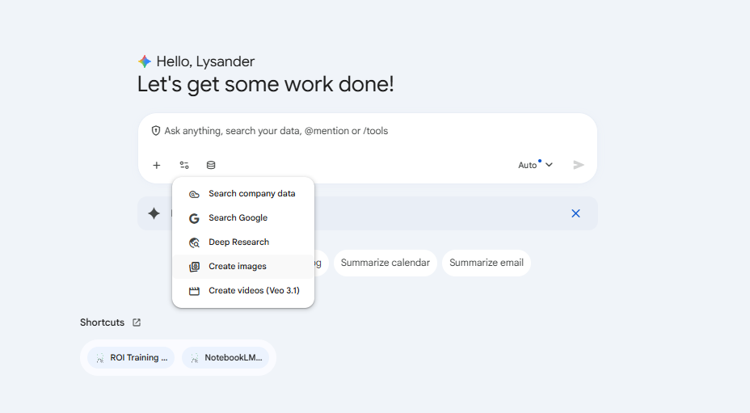
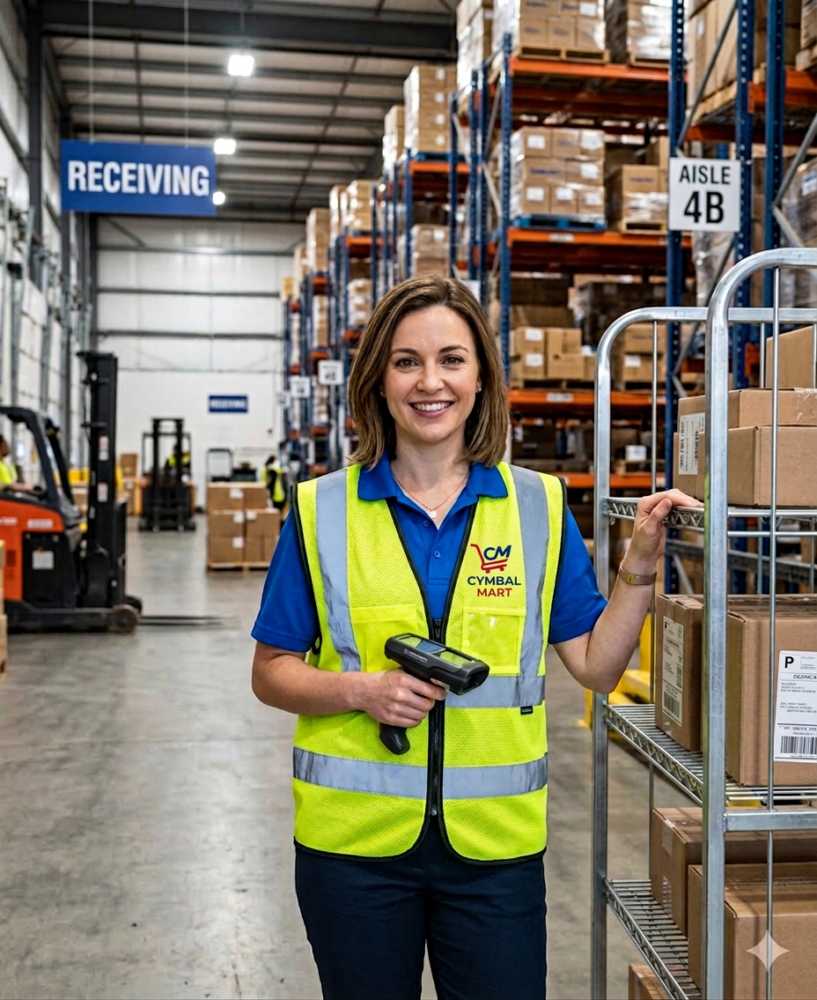
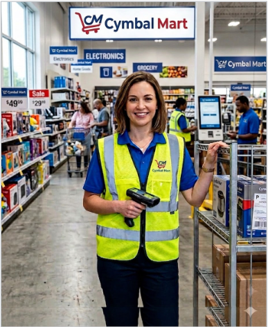

# Ice Breaker: Simple Image Generation

## Time Required
10 minutes

## Overview
In this lab, you will use Gemini's image generation model to place yourself—using your own headshot—into a Cymbal Mart warehouse setting. This is a quick, fun introduction to Gemini's multimodal image generation capabilities and a great way to kick off the course.

### You learn how to:
- Upload an image file as context for an image generation prompt.
- Use a detailed, role-based prompt to control setting, branding, and style.
- Generate a professional, context-aware image asset.

## Scenario

<p align="left">
  
</p>

Cymbal Mart is running an internal employee spotlight campaign. The Social Media team wants a series of gritty, authentic portraits placing team members inside the company's massive distribution centers. You have been asked to generate your own spotlight photo.

## Lab Instructions

### Task 1: Generate your warehouse portrait

1. Open **Gemini Enterprise** in your browser.

2. In the chat bar, select the **Tools** icon and choose **Generate images**.

   <p align="left">
      
      <br>
      <em>Generate images tool</em>
   </p>

3. Click **+ Add files** and select **Upload files**. In the dialog, upload a photo of yourself, and click **Open**. __Note:__ if it is easier, just copy a picture of yourself to the clipboard and paste it in the chat box. 

4. Copy and paste the following prompt into the chat, then press ENTER:

   ```text
   You are a professional photographer taking a gritty and authentic portrait for an employee spotlight series. Using the face from the uploaded headshot, maintaining the facial identity as a perfect, unaltered match, place it onto the body of a worker.

   The worker is wearing a branded high-visibility safety vest (neon yellow and blue) with a "Cymbal Mart" logo on the chest, a standard blue uniform shirt, and dark work trousers. Their expression is competent and professional, holding a hand-held scanner gun in one hand and resting the other on a large metal rolling inventory cart filled with boxes.

   The setting is the interior of a massive Cymbal Mart warehouse distribution center. The background shows endless rows of floor-to-ceiling metal shelving stocked high with cardboard boxes labeled with Cymbal Mart branding and barcodes. In the distance, other workers operate forklifts, and large "RECEIVING" and "AISLE 4B" signs hang from high steel beams. The lighting mixes harsh overhead fluorescents with natural light from loading bay doors. The photo is taken at eye level, capturing the scale of the facility. The feel is industrious, efficient, and realistic—sharp and detailed, like a documentary-style image.
   ```

5. We didn't give Gemini the Cymbal Mart logo. Copy it from the image above, paste it into the chat, and tell the model to use it in the photo. Enter the prompt below, after you paste the logo. 

```
Adjust the image using the attached logo on the vest. 
```

   <p align="left">
      
      <br>
      <em>Example of a generated image.</em>
   </p>


6. Review the generated image. If the likeness or setting is not quite right, see the Bonus Task below for refinement techniques.

### Bonus Task 2: Refine and experiment

1. Try swapping the setting. Ask Gemini to regenerate the same portrait but place you **on the floor of a busy Cymbal Mart retail store** instead of the warehouse—surrounded by product displays, customers, and branded signage.

2. Experiment with one change at a time: adjust the lighting description, change the uniform, or modify the expression instruction. Notice how each specific change affects the output.

3. Share your best result with the group.


   <p align="left">
      
      <br>
      <em>Example of a generated image.</em>
   </p>

## Congratulations!

In this lab, you have:
- Uploaded a personal image as generation context.
- Used a detailed, structured prompt to control identity, setting, and style.
- Generated a branded employee spotlight image using Gemini.
