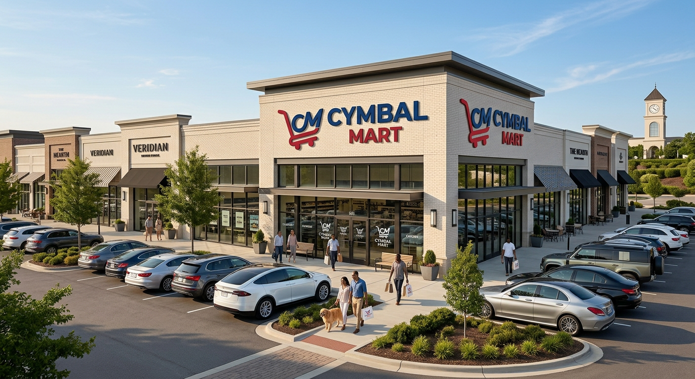
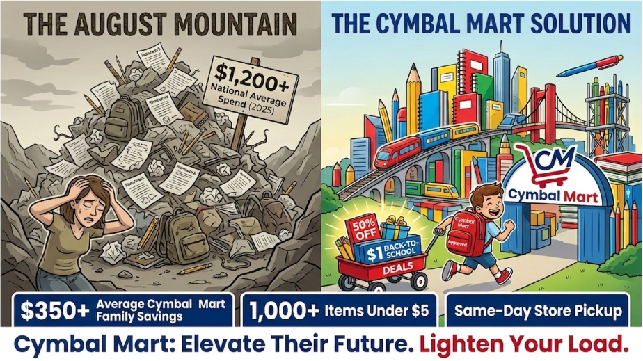
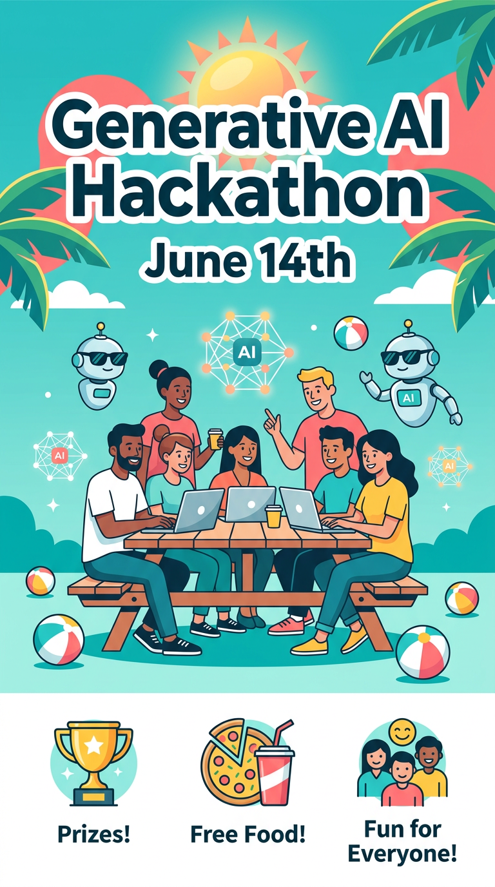

# Create an Infographic

## Time Required
20 minutes

## Overview
In this lab, you will create a promotional infographic for Cymbal Mart's Back-to-School sale using Gemini's image generation model. You will start with a strong baseline prompt, then practice prompt engineering techniques—adding context, refining details, and iterating—to improve the output.

### You learn how to:
- Construct a detailed image generation prompt with role framing, visual metaphors, and specific copy.
- Iterate on a prompt by modifying individual elements to improve the result.
- Generate a branded promotional asset grounded in real campaign details.

## Scenario

<p align="left">
  
</p>

Cymbal Mart's Marketing team needs a campaign infographic for the **Back-to-School Super Sale**. The brief: use a bold visual metaphor to show the contrast between the stress of back-to-school spending and the relief Cymbal Mart provides. The infographic must include specific pricing callouts, the Cymbal Mart logo, and a campaign tagline.

## Lab Instructions

### Task 1: Generate the baseline infographic

1. Open **Gemini Enterprise** in your browser and create a new chat. 

2. In the chat bar, select the **Tools** icon and choose **Generate images**.

3. Copy and paste the image below of the Cymbal Mart logo into the chat:

<p align="left">
  
  <br>
  <em>Cymbal-Mart Logo</em>
</p>


4. Copy and paste the following prompt into the chat, then press ENTER:

   ```text
   You are a data visualization artist who creates infographics with dramatic, physical metaphors. Create a striking, horizontal infographic-style image promoting the "Cymbal Mart: Back-to-School Super Sale."

   The scene is a dramatic, split landscape. On the left side, labeled "THE AUGUST MOUNTAIN," stands a massive, precarious, towering pile of crumpled homework, worn-out backpacks, broken pencils, and dull grays. A sign on this pile reads: "$1,200+ National Average Spend (2025)." A cartoon mother figure below looks overwhelmed and exhausted, shielding her eyes.

   On the right side, labeled "THE CYMBAL MART SOLUTION," the same mountain has been replaced by a sprawling, organized city made entirely of fresh, colorful school supplies—notebook skyscrapers, pencil-case trains, and textbook bridges, all gleaming with primary colors. An energetic young student wearing a "Cymbal Mart Approved" backpack runs gleefully toward the city, pulling a wagon stacked with glowing deals labeled "50% OFF" and "$1 BACK-TO-SCHOOL DEALS."

   A large, friendly Cymbal Mart logo is integrated seamlessly as the central archway entrance to the city. Along the bottom, clean data callouts read: "$350+ Average Cymbal Mart Family Savings," "1,000+ Items Under $5," and "Same-Day Store Pickup." The final banner text across the bottom reads: "Cymbal Mart: Elevate Their Future. Lighten Your Load."

   See the attached image for the official Cymbal Mart logo. 
   ```

4. Review the output. Note what worked well and what you would change.

   <p align="left">
     
     <br>
     <em>Infographic Example</em>
   </p>

### Task 2: Iterate to improve the result

Prompt engineering for image generation is iterative. Try at least two of the following refinements:

1. **Adjust the style.** Add a style instruction to shift the look—for example, try adding `"The style should be a bold, flat vector illustration with thick outlines, similar to a children's book or modern editorial design."` to the end of the prompt.

2. **Fix a specific element.** If the logo placement or text rendering is off, isolate that issue: `"Regenerate the image. Keep everything the same but move the Cymbal Mart logo to the upper-right corner and make the tagline text larger and easier to read."`

3. **Change the campaign.** Swap the Back-to-School theme for a **Black Friday** version. Update the copy: replace the mountain metaphor with a crowded parking lot vs. calm online checkout, and update the pricing callouts to reflect holiday deals.

> [!NOTE]
> Each iteration should change only one or two things at a time. Changing everything at once makes it hard to understand what improved the result.

### Bonus Task 3: Use your own example

1. Start a new chat. 

2. Create a prompt for an infographic, but using an example appropriate to your business. It could refer to something you sell, a new product or service you are promoting, a company celebration, or anything else. 

 > [!NOTE]
 > You can ask Gemini for help creating the prompt. Tell Gemini something like the following:

   ```text
   You are an expert prompt engineer. 
   Create a prompt that uses Gemini Image Generation to create an Infographic. 
   I want the infographic to promote the Company's Generative AI Hackathon event on June 14th. I want this promoted as a fun, summer event for everyone. There will be prizes and food.
   Do not create the infographic, just return the prompt. 
   ```

3. Take a look at the generated prompt. If you are happy with it copy it to the clipboard. Then, create a new chat, select the Image Generation tool, and run it. 

   <p align="left">
     
     <br>
     <em>Infographic Example</em>
   </p>

## Congratulations!

In this lab, you have:
- Built a complex, multi-element image generation prompt for a real promotional brief.
- Practiced iterative prompt refinement to improve specific aspects of the output.
- Explored how providing reference files affects logo and brand accuracy.
