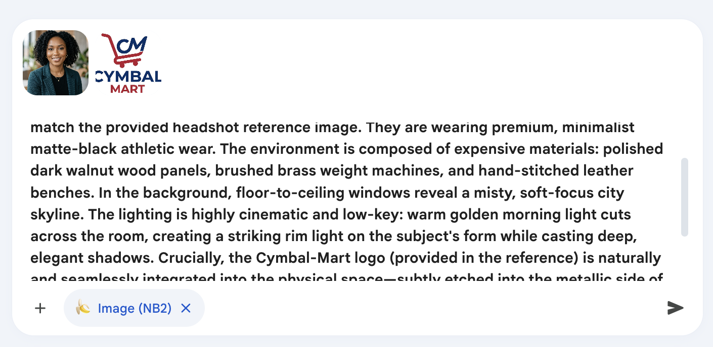
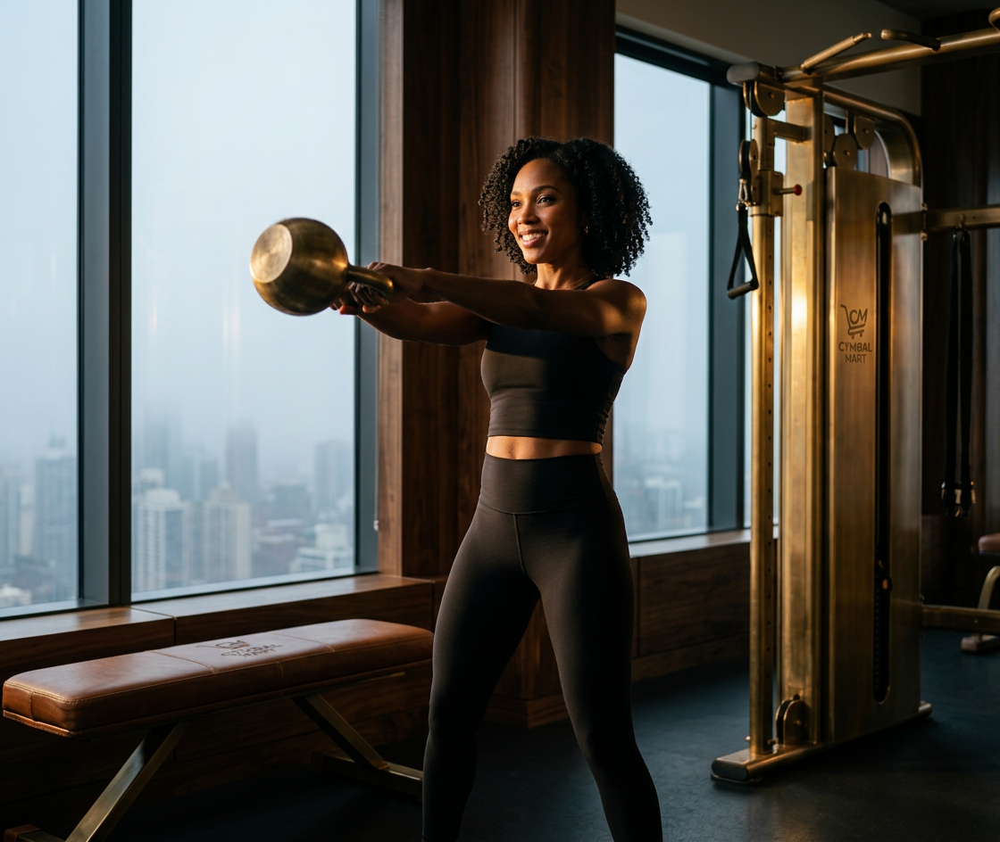

# Meta Prompting for Image Generation

## Time Required
20 minutes

## Overview
In this lab, you will use a **meta-prompt**—asking Gemini to write an image generation prompt for you—and then use that AI-generated prompt to produce the actual image. This technique is especially useful for complex, high-production-value assets where precise prompt structure matters but the technical vocabulary of image generation is unfamiliar.

### You learn how to:
- Use a meta-prompt to transform a plain-language brief into a structured, technical image generation prompt.
- Evaluate and refine an AI-generated prompt before using it.
- Apply meta-prompting to retail and marketing use cases.

## Scenario

<p align="left">
  
</p>

Cymbal Mart is launching a premium athletic apparel line. The Marketing team wants a **luxury lifestyle photograph** featuring the new line in an exclusive gym setting, with the Cymbal Mart logo integrated naturally into the environment. Rather than writing a long technical prompt from scratch, you will ask Gemini to write the prompt for you—then use it.

## Lab Instructions

### Task 1: Generate a prompt with a meta-prompt

A meta-prompt asks Gemini to generate a prompt for another task—in this case, an image generation prompt. This is a powerful technique when you know what you want visually but don't know the exact language that produces it.

1. Open **Gemini Enterprise** in your browser, and create a new chat. 

2. Copy and paste the following meta-prompt into the chat, then press ENTER:

   ```text
   You are an expert prompt engineer. 
   Create a prompt for a high-end athletic lifestyle marketing image for Cymbal Mart that feels luxurious and aspirational. Please write a precisely engineered image generation prompt for me.

   The scene should feature a person working out with the Cymbal Mart logo integrated naturally into the environment—not just placed on top. Focus on expensive textures, cinematic lighting, and a sophisticated athletic setting like an exclusive gym. Tell the model to use the logo and the person from the headshot which I will provide with the prompt. 
   ```

3. Review the generated prompt. Note how Gemini structures it differently from your original request—more specific technical language, explicit attention to lighting, texture, and perspective.

4. Copy the generated prompt to the clipboard (_You can save it to a text file to make sure you don't lose it._)


> [!NOTE]
> Below is an example of a prompt this technique produces:

   ```text
   A high-end, editorial athletic lifestyle advertisement for Cymbal Mart. The scene features a person in mid-motion during a sophisticated workout inside an exclusive, ultra-luxury high-rise gym at dawn. The subject's face, hair, and exact physical likeness must perfectly match the provided headshot reference image. They are wearing premium, minimalist matte-black athletic wear. The environment is composed of expensive materials: polished dark walnut wood panels, brushed brass weight machines, and hand-stitched leather benches. In the background, floor-to-ceiling windows reveal a misty, soft-focus city skyline. The lighting is highly cinematic and low-key: warm golden morning light cuts across the room, creating a striking rim light on the subject's form while casting deep, elegant shadows. Crucially, the Cymbal Mart logo (provided in the reference) is naturally and seamlessly integrated into the physical space—subtly etched into the metallic side of the gym equipment and embossed onto the leather bench, perfectly reflecting the ambient lighting and shadows of the room. Shot on an 85mm lens at f/1.4, high-end commercial color grading, hyper-realistic details, and a sophisticated, aspirational mood.
   ```

### Task 2: Use the generated prompt to create the image

1. Click **New chat** to open a fresh session.

2. In the chat bar, select the **Tools** icon and choose **Generate images**.

3. Paste the prompt from Task 1 into the chat, but don't run it yet. 

4. Copy and paste the logo above into the chat box. 

5. If you need a headshot for your ad image, open Gemini Enterprise in a new browser tab. Create a new chat and add the Image generation tool. Ask Gemini to create a headshot of a model. Describe the person any way like. Specify an age range, male or female, features, skin-tone, hair color, etc. Below, is an example. 

   ```text
   Create a headshot for a model for an ad campaign. Make the model a woman in her 30s with black hair and brown skin.
   ```

   <p align="left">
     
     <br>
     <em>Model Headshot</em>
   </p>

5. Copy and paste your model into the chat. Now, your chat should look similar to the screenshot below. 

    <p align="left">
     
     <br>
     <em>Chat ready to run</em>
   </p>

6. Make sure you selected the Image Generation tool, pasted the prompt, and added the logo and headshot of the model. Then, run your prompt. 

7. Evaluate your results. Ask Gemini to make changes and modify that generated image if you like. 

    <p align="left">
     
     <br>
     <em>Gemerated image example</em>
   </p>

### Task 3: Evaluate the meta-prompt technique

1. Compare the image you just generated with the images from Labs 1 and 2. In those labs you wrote the prompts yourself; here Gemini wrote it for you. What differences do you notice in the structure and specificity of the prompts?

2. Try using the meta-prompt technique for a second use case. Ask Gemini to write an image generation prompt for a different Cymbal Mart marketing scenario. For example:

   ```text
   Write an image generation prompt for a high-quality product photography shot of a Cymbal Mart end-cap display. The display should feature a seasonal promotion (e.g., summer outdoor living). Focus on in-store retail photography conventions: clean product arrangement, warm lighting, visible price tags, and natural customer interaction in the background.
   ```

3. Generate the image with the produced prompt. Share both the meta-prompt output and the resulting image with the group.

### Bonus Task 4: Try your own example

1. Start a new chat. Come up with an example relevant to your work or your company. Experiment with meta-prompting to have Gemini create the prompts to generate an ad campaign, a company promotion, a graphic for a social media post, or anything else. 

## Congratulations!

In this lab, you have:
- Used a meta-prompt to generate a structured, technical image generation prompt from a plain-language brief.
- Applied the generated prompt to produce a luxury lifestyle marketing asset.
- Explored how Gemini translates high-level creative intent into precise visual language.
