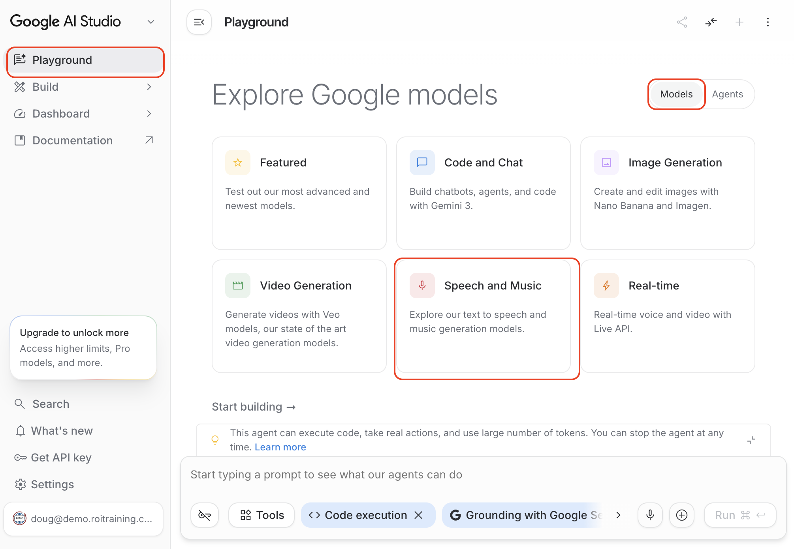
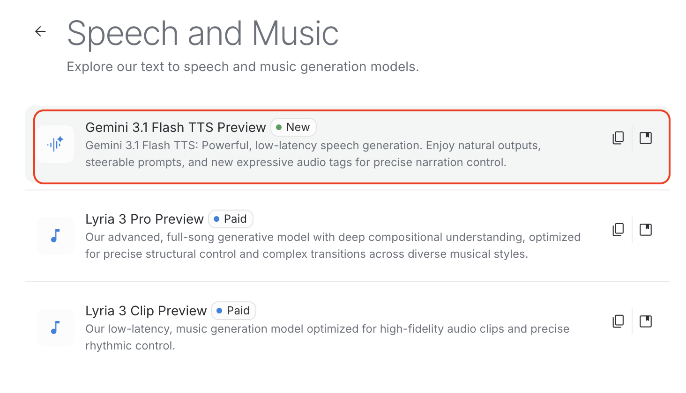
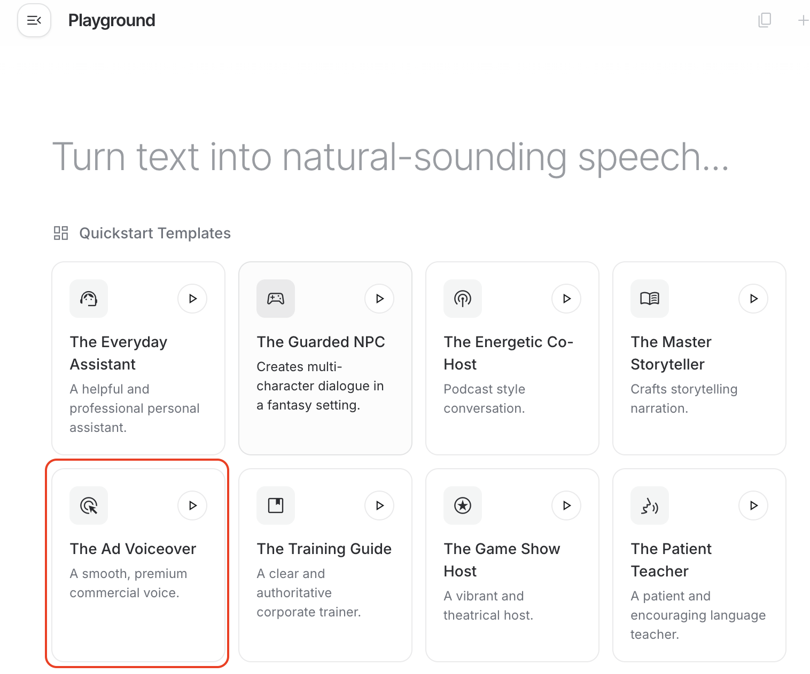
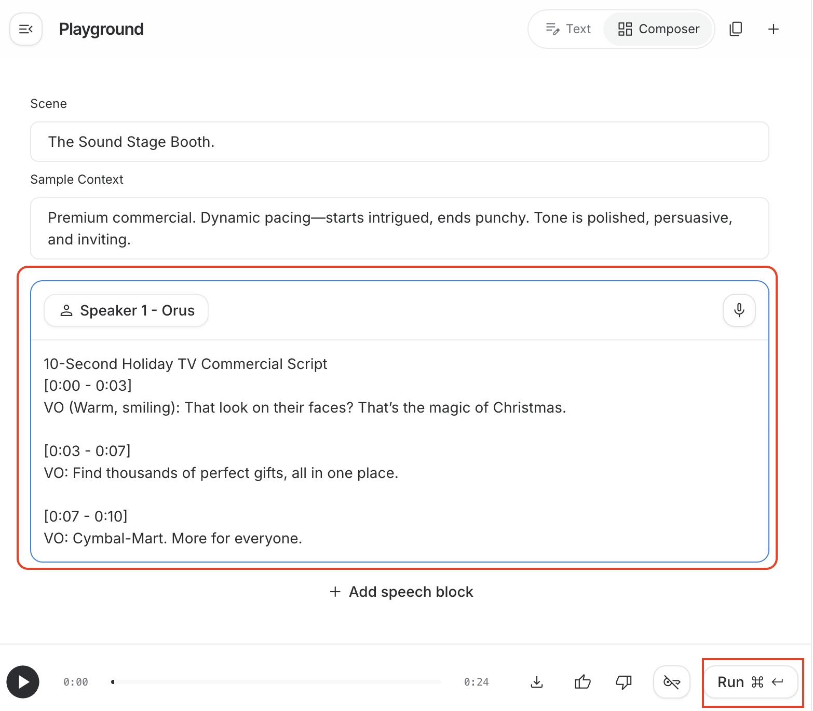

# Video and Audio Generation

## Time Required
30 minutes

## Overview
In this lab, you will use Gemini to generate a short holiday social media video clip for Cymbal Mart, complete with a synchronized voiceover script. You will then use Google AI Studio to generate an audio track from the script. The result is a complete, production-ready promotional asset built entirely with AI tools.

### You learn how to:
- Generate a short video clip with Gemini's video creation tool.
- Write a synchronized promotional script timed to match the video.
- Use Google AI Studio to generate an audio track from the script.

## Scenario

<p align="left">
  
</p>

Cymbal Mart's Social Media team needs a **10-second holiday ad** for Instagram and TikTok. The brief: a family discovering new holiday gift ideas in-store, festive and cinematic, with the Cymbal Mart logo appearing naturally in the environment. The team also needs a punchy voiceover script that matches the visual energy. Budget: zero production hours—it all needs to be AI-generated.

## Lab Instructions

### Task 1: Generate the video clip

> [!IMPORTANT]
> Video generation uses **Gemini** (gemini.google.com), not Gemini Enterprise. Make sure you are in the correct product before starting.

1. Open [Gemini](https://gemini.google.com/app) in your browser, and create a new chat.

2. In the chat bar, select the **Tools** icon and choose **Create video**.

   <p align="left">
     
     <br><em>Select Create video from the Tools menu</em>
   </p>

3. Copy the __Cymbal Mart__ logo above to the clipboard and then paste it in the chat box. 

4. Copy and paste the following prompt into the chat, then press ENTER:

   ```text
   You are a creative director producing a holiday social media ad for Cymbal Mart, a modern omnichannel retailer.

   Generate a 10-second cinematic video clip with the following specifications:

   Visual: A young family—two parents and two children—moving excitedly through a festive Cymbal Mart store. The children discover a display of holiday gifts and light up with excitement. The parents exchange a warm, knowing look. The Cymbal Mart logo (from the uploaded file) appears naturally on shopping bags in the family's hands and on digital signage in the background.

   Style: Warm, festive lighting with a shallow depth of field. Slow push-in camera movement. Brand colors are blue and silver. The feel is smart, modern, and emotionally warm—not kitschy.

   The video should feel like a 10-second cut from a premium TV commercial.
   ```

5. Review the generated video. Download the clip to your computer. Here is an example of one that was previously created:

   [Sample Video Clip](https://drive.google.com/file/d/11fbc6SXOJToqWTNCDQPHAytkJzhVd7WM/view?usp=sharing)

6. If you don't like your results, try changing the prompt. 

### Task 2: Write the voiceover script

The video needs a voiceover that fits the 10-second runtime precisely.

1. In a new Gemini chat (Gemini Enterprise is fine for this task), ask Gemini to write the script:

   ```text
   Write a 10-second voiceover script for a Cymbal Mart holiday TV commercial. The tone should be smart, warm, and festive—not cheesy. The script must:
   - Open with a line that captures family excitement
   - Include a brief product or value mention (e.g., "thousands of gifts, all in one place")
   - End with the Cymbal Mart tagline: "More for everyone."
   - Time out to exactly 10 seconds when read at a natural pace

   After the script, provide a word count and an estimated reading time in seconds.
   ```

2. Review the output and refine if needed. Ask Gemini to make it shorter, punchier, or more specific to holiday gifting if the first version isn't quite right.

### Task 3: Generate the audio track

1. Open [Google AI Studio](https://aistudio.google.com/) in a new tab.

2. Select __Playground__, then __Models__, and then __Speech and Music__. 

   <p align="left">
     
     <br><em>AI Studio Playground</em>
   </p>

3. Select the latest TTS (Text-to-Speech) model. 

   <p align="left">
     
     <br><em>TTS model selection</em>
   </p>

4. Choose __Ad Voiceover__. 

   <p align="left">
     
     <br><em>Ad Voiceover</em>
   </p>


5. Paste the voiceover script that you generated in the last task, and then click the __Run__ button. 

   <p align="left">
     
     <br><em>Generate Voiceover</em>
   </p>

6. Once the voiceover is generated, click the __Play__ button to hear it. You can experiment the script and with different voices, tones, and profiles. When you are satisfied download the audio file. Below is an example audio file. 

   [Sample Audio File](https://drive.google.com/file/d/1zXwfVMEppsvtdTfup9ZKNLJAaY_3CtV-/view?usp=sharing)


### Bonus Task 4: Assemble the full ad concept

1. You have three AI-generated components, in a new chat, ask Gemini to bring them together into a brief creative brief document that describes:
   - The target platform (Instagram Reels, TikTok, YouTube Shorts)
   - The video description and what it shows
   - The voiceover script with timestamp markers
   - Notes on how the audio and video are synchronized

2. Share the video, script, and brief with the group. Discuss: what would a human creative team need to do to take these AI-generated assets to a final, publishable state?

### Bonus Task 5: Try with your own use case

1. Create a video clip, script, and voiceover for something relevant for your own work or personal use. 

## Congratulations!

In this lab, you have:
- Generated a branded holiday video clip using Gemini's video creation tool.
- Written a synchronized 10-second voiceover script timed to the video.
- Generated an audio track from the script using Google AI Studio.
- Assembled the components into a complete AI-generated promotional asset concept.

