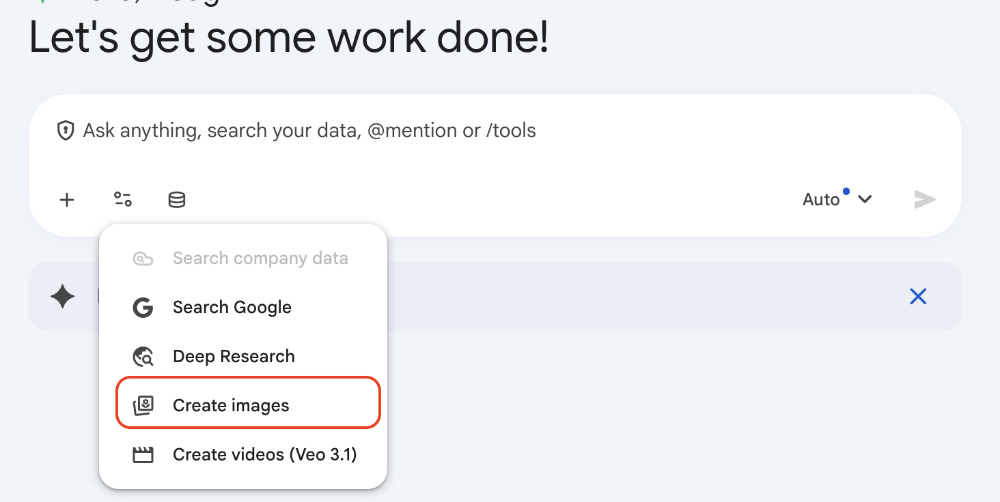
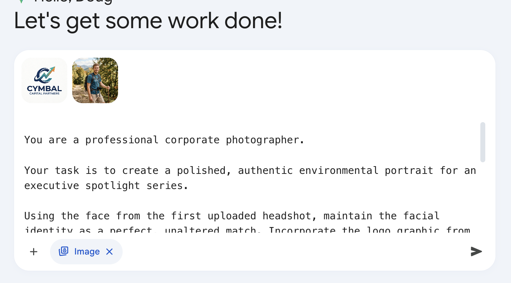

# Ice Breaker: Put Yourself in Cymbal Capital Partners

## Time Required
15 minutes

## Overview
In this lab, you will use Gemini's image generation model to place yourself—using your own headshot—into a Cymbal Capital Partners investment setting. This is a quick, fun introduction to Gemini's multimodal image generation capabilities and a great way to kick off the course.

### You learn how to:
- Upload an image file as context for an image generation prompt.
- Use a detailed, role-based prompt to control setting, branding, and style.
- Generate a professional, context-aware image asset.

## Scenario

<p align="left">
  
</p>

Cymbal Capital Partners is running an internal leadership spotlight campaign. The Brand and Communications team wants a series of polished, credible portraits placing team members inside the firm's offices and deal-making environments. You have been asked to generate your own spotlight photo.

## Lab Instructions

### Task 1: Generate your finance portrait

1. Open Gemini Enterprise in your browser.

2. In the chat bar, select the **Tools** icon and choose **Create images**.

   <p align="left">
     
     <br />
     <em>Create Images</em>
   </p>

3. Click **+ Add files** and select **Upload files**. In the dialog, upload a photo of yourself, and click **Open**. __Note:__ if it is easier, just copy a picture of yourself to the clipboard and paste it in the chat box.

4. Copy the Cymbal Capital Partners logo from above and past it in the chat box.

5. Paste the following prompt into the chat.

   ```text
      You are a professional corporate photographer.

      Your task is to create a polished, authentic environmental portrait for an executive spotlight series.

      Using the face from the first uploaded headshot, maintain the facial identity as a perfect, unaltered match. Incorporate the logo graphic from the second uploaded image into the scene.

      The output photo should depict a finance professional at Cymbal Capital Partners leading a meeting with a high-value client in a modern, light-filled office. The subject should be seated at a polished conference table, smiling warmly and wearing a professional, tailored dark blue suit with a crisp white shirt. The background features a sophisticated glass-walled office with a view of a city skyline. The uploaded logo should be integrated subtly, appearing engraved discreetly on a glass partition in the background and visible in a sharp, clear version on the cover of a leather-bound notebook on the table.
   ```

   <p align="left">
     
     <br />
     <em>Create Image Prompt</em>
   </p>

6. Ensure you added the logo, the photo, and the prompt, and have selected the image tool. Then, run it. 

   <p align="left">
     
     <br />
     <em>Create Image Results</em>
   </p>

7. Review the result. If the likeness or setting is not quite right, ask Gemini to make changes. Try changing the scene or add detail as you like.

8. Share your results with the group. 

### Bonus Task 2: Try you own use case

1. Do something similar, but appropriate to your own workplace. Create an image you could use for a social media post that puts you into a scene that would be appropiate to your company. 

## Congratulations!

In this lab, you have:
- Uploaded a personal image as generation context.
- Used a detailed, structured prompt to control identity, setting, and style.
- Generated a finance-themed executive spotlight image using Gemini.
