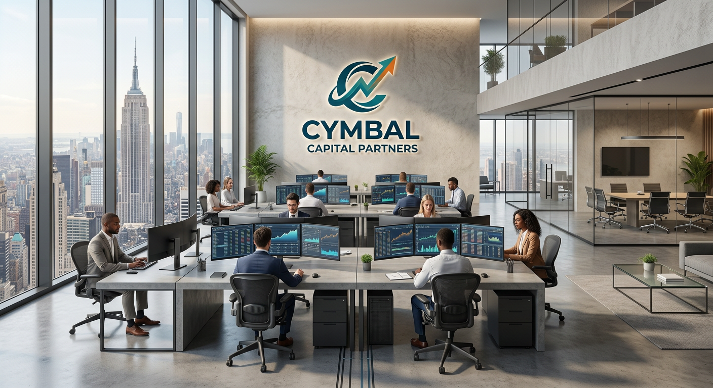
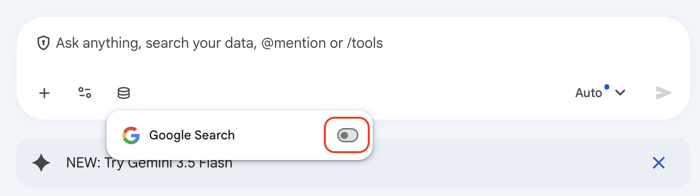
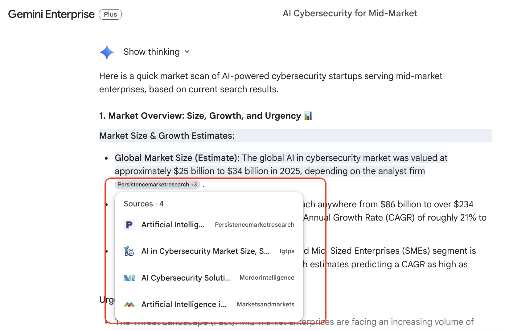

# Using the Google Search Tool

## Time Required
20 minutes

## Overview
In this lab, you will investigate a potential investment opportunity for Cymbal Capital Partners using Gemini Enterprise.

You will run the same analysis in two different ways and compare the quality of the output based on recency, sourcing, and confidence.

### You learn how to:
- Evaluate the difference between unsourced and source-grounded analysis.
- Use Search Google in Gemini Enterprise to investigate a market topic quickly.
- Write prompts that demand verifiable, source-grounded research.
- Compare companies and extract signals relevant to venture capital or private equity decisions.
- Turn search findings into a concise recommendation.

## Scenario

<p align="left">
  
</p>

Cymbal Capital Partners is an investment firm focused on identifying high-potential opportunities in venture capital and private equity.

Your team has asked for a rapid market scan on an emerging theme:

**AI-powered cybersecurity startups for mid-market enterprises**.

You need to produce an initial research brief that helps the investment team decide whether to prioritize deeper due diligence in this category.

## Lab Instructions

### Task 1: Baseline pass (no search tool)

Start with a quick baseline so you can compare results later.

1. Open Gemini Enterprise and start a new chat.

2. In the Connectors menu, deselect **Google Search**.

   <p align="left">
     
     <br />
     <em>Deselect Search</em>
   </p>

3. Paste this prompt:

```text
You are supporting an investment team at Cymbal Capital Partners.

Provide a quick market scan of AI-powered cybersecurity startups serving mid-market enterprises.

Deliver:
1. A short market overview
2. Key demand drivers
3. Top risks
4. 5 example companies in the space
```

4. Copy and paste this output to a document. Note any statements that do not include concrete evidence, links, or dates.

### Task 2: Grounded pass with Search Google

1. Start a new chat in Gemini Enterprise.

2. In the **Connectors** menu, select **Search Google**.

3. Paste the prompt below to establish scope:

```text
You are supporting an investment team at Cymbal Capital Partners.

Use Google Search to perform a quick market scan of AI-powered cybersecurity startups serving mid-market enterprises.

Deliver:
1. A short market overview (size, growth, urgency of problem).
2. Key demand drivers and adoption trends.
3. Top risks or headwinds that could limit returns.

Requirements:
- Ground your answer in current web sources.
- Cite sources inline with links.
- Distinguish between facts, estimates, and assumptions.
- If a claim cannot be verified, label it Unverified.
```

4. Review the response and verify that it includes links and clearly grounded claims.

   <p align="left">
     
     <br />
     <em>Search Results</em>
   </p>

5. Compare this response against your first results without Google Search. Now, there are citations with links that can be used to verify the claims made by the AI model. 

### Task 3: Recency stress test and company comparison

Now test whether the output can handle very recent developments and then narrow to targets.

1. In the same chat, run this recency prompt:

```text
Using Google Search, list material developments from the last 10 days related to AI-powered cybersecurity for mid-market enterprises.

For each development include:
- What happened
- Why it matters for investors
- Date
- Source link

If an item cannot be dated and sourced, exclude it.
```

2. Verify that each item has a date and link.

3. Continue with company identification using this prompt:

```text
Using Google Search, identify 8–10 private companies in AI-powered cybersecurity focused on mid-market customers.

For each company, provide:
- Company name
- Core product/use case
- Target customer profile
- Most recent funding stage (if available)
- Notable traction signal (customer growth, partnerships, product adoption, or expansion)

Return results in a table.
Include source links for every row.
If data is missing, mark it as Unknown rather than guessing.
```

4. Scan the output for missing fields or weak sourcing. If needed, you can ask Gemini to fill gaps with a follow-up prompt like:

```text
Re-check the companies with Unknown fields and use Google Search to fill in missing information where possible.
Only update fields supported by reliable sources.
```

5. Ask for a short shortlist:

```text
Based on the evidence collected, shortlist the top 3 companies for deeper diligence.
Explain the selection criteria and cite supporting sources.
```

### Task 4: Test investment thesis strength with focused follow-ups

Pressure-test the opportunity before recommending next steps.

1. In the same chat, prompt Gemini to evaluate upside and downside:

```text
Act as an investment analyst.

For the shortlisted companies, evaluate:
- Potential upside drivers over the next 24 months
- Key downside risks (competition, regulation, customer concentration, technical moat concerns)
- What evidence would increase confidence in an investment decision

Use Google Search and cite sources for each major claim.
```

2. Ask Gemini to challenge its own conclusion:

```text
Now take the opposing view.
Give the strongest argument for NOT investing in this theme right now.
Back every major point with sourced evidence.
```

3. Compare both outputs and note where evidence is strong versus where uncertainty remains.


### Task 5: Produce an investment brief for leadership

Create a final, decision-oriented output for an internal investment committee.

1. Run the prompt below:

```text
Create a 1-page investment brief for Cymbal Capital Partners on AI-powered cybersecurity for mid-market enterprises.

Include these sections:
1. Market Snapshot
2. Why Now
3. Target Company Shortlist (Top 3)
4. Key Risks
5. Recommendation: Proceed to deeper diligence or Hold
6. Next 5 diligence questions we should answer

Requirements:
- Keep it concise and executive-friendly.
- Every major claim must be source-backed.
- Include a short source list at the end.
```

2. Review the brief for clarity, quality of evidence, and actionability.
3. If needed, ask Gemini to tighten the writing:

```text
Rewrite this brief for an investment committee memo. Make it sharper and more concise while preserving all source-backed claims.
```

## Bonus Task 6: Bring your own use case

Think of a topic your company or team actually needs real-time, web-grounded answers on. This could be competitive intelligence, regulatory changes, industry trends, supplier news, customer segment research, or anything else where outdated information causes problems.

1. Define your topic in one or two sentences. What do you need to know, and why does recency matter?

2. Enable **Google Search** and write a prompt that asks Gemini to research the topic, synthesize what it finds, and flag anything uncertain or conflicting.

3. Review the response. Check that claims are grounded in cited sources, and note where Gemini could not find reliable information.

Suggested starter prompt structure:

```text
Using Google Search, research the following topic for [your company or team]:
[Describe your topic in 1–2 sentences]

Please:
1. Summarize the current state of [topic] based on recent sources
2. Identify the most important developments from the past 6–12 months
3. Highlight any open questions or areas where the evidence is limited or conflicting
4. Suggest 2–3 follow-up questions worth investigating further

Cite your sources and note the date of any time-sensitive information.
```

## Congratulations
In this lab, you have:
- Run the same investment analysis with and without Google Search.
- Compared outputs for evidence quality, recency, and verifiability.
- Built a source-grounded market scan and company comparison.
- Produced a concise, decision-ready investment brief for Cymbal Capital Partners.
