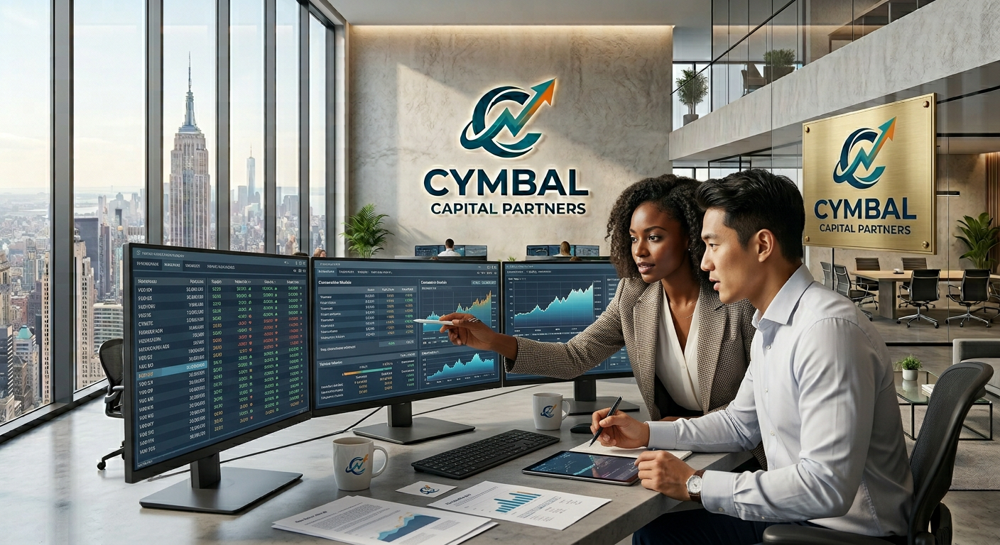
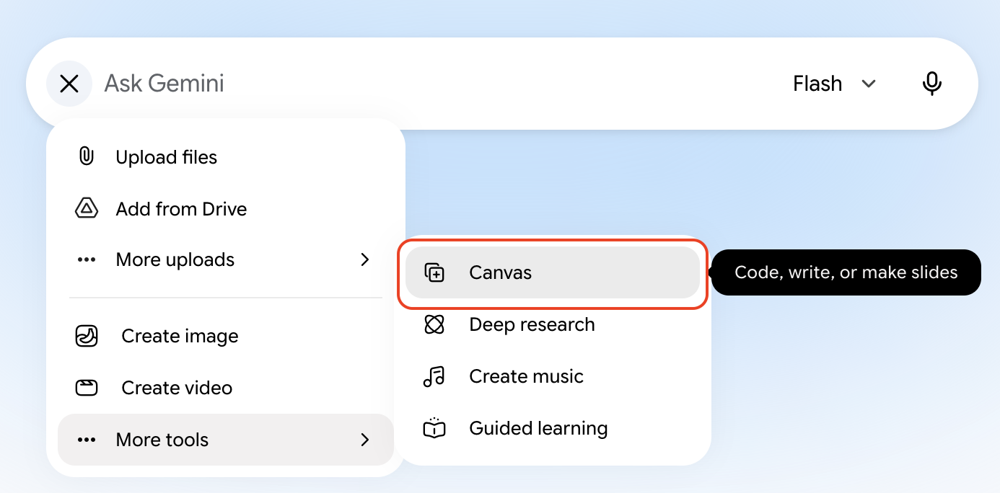
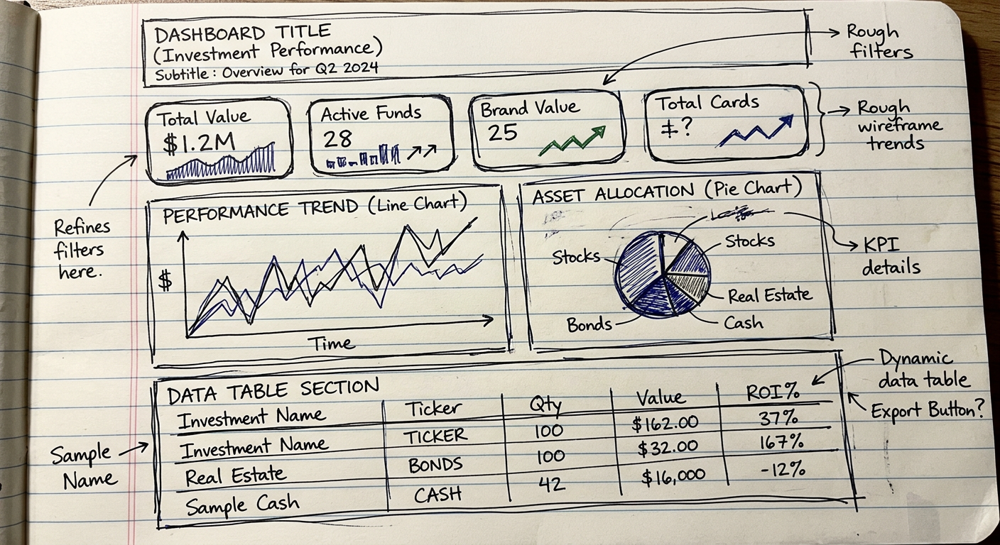
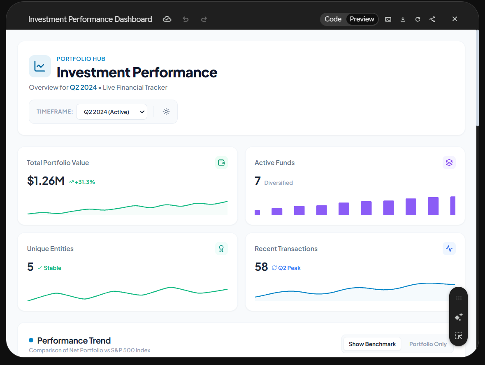
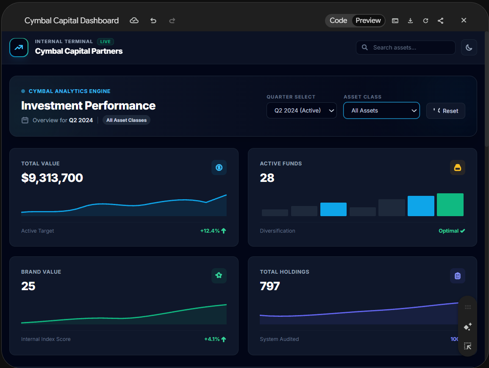

# Vibe Coding with Gemini Canvas

## Time Required
30 minutes

## Overview
In this lab, you'll use a rough, hand-drawn sketch to generate the first version of the Cymbal Capital Partners Investment Dashboard using Gemini Canvas.

### You learn how to:
- Translate a low-fidelity UI sketch into a structured web layout.
- Use Gemini Canvas to generate a dashboard shell from an image and a short prompt.
- Refine a generated interface with focused follow-up prompts instead of rebuilding it from scratch.

## Scenario

<p align="left">
  
</p>

Cymbal Capital Partners is evaluating its next investment opportunity. The team wants a dashboard that helps partners quickly scan the deal pipeline, review portfolio signals, and identify the most promising companies at a glance.

This application will help investment teams see which opportunities need attention, which deals are moving forward, and how the current pipeline is distributed across sectors and stages.

### Dashboard design
The UI dashboard should include easy-to-read status cards with the following metrics:
- Active Deals
- Deals in Due Diligence
- Portfolio Watchlist
- Pending Partner Reviews

Users also want charts that show pipeline volume by sector and deal stage mix. There should be a table of active opportunities and the ability to add new deals.

## Lab Instructions

### Task 1: Sketch the UI Design

Before writing any code, grab a piece of paper and a pen, or use a digital whiteboard, and sketch your vision for the dashboard based on the scenario.

1. Review the scenario description above.

2. Draw a rough wireframe that includes these core structural regions:
   - A header with the dashboard title and a short subtitle
   - A row of KPI cards for the most important investment metrics
   - Two distinct chart placeholders
   - A data table section at the bottom

> [!Note]
> Focus on structure, not styling. The sketch is only there to help Canvas understand the page layout.

### Task 2: Upload the sketch and generate the initial UI
Now bring the sketch to life in Canvas.

> [!Note]
> At the time of this writing the Canvas tool was not supported in Gemini Enterprise. So, we are using the standard Gemini app for this play. 


1. Open [Gemini](https://gemini.google.com/app), click the __+__ icon, and select **Canvas** from the Tools list.

   <p align="left">
     
     <br>
     <em>Tools | Canvas menu</em>
   </p>

2. Take a photo of your sketch and send it to yourself. Then copy and paste it into your Gemini prompt window. Alternatively, you can use the example sketch below. Right-click the sketch, copy it, and paste it into your prompt:

   <p align="left">
     
     <br>
     <em>Cymbal Capital Partners Investment Dashboard — wireframe sketch</em>
   </p>

3. Start small. Try a brief prompt first so you can see how Gemini interprets the image natively:

```text
Program this dashboard.
```

4. Let the code generation finish. You can click the __Code__ tab in Canvas and watch the HTML, CSS, and JavaScript take shape.

5. When the code completes, click the __Preview__ tab. The first version should resemble a dashboard shell, even if it is not yet polished.

   <p align="left">
     
     <br>
     <em>Dashboard preview rendered in the Preview tab</em>
   </p>

7. If the prompt is too open-ended, Canvas can invent details you did not ask for. Now tighten the prompt so the output stays focused on layout and structure.

8. Click the __New chat__ icon. As before, select __Canvas__ from __Tools__, then paste the UI sketch again. Run the prompt below. Study it before you paste it.

```text
You are a senior front-end developer designing an internal investment dashboard for Cymbal Capital Partners.

Use the attached sketch to create the first version of the dashboard layout.

Steps:
1. Build a clean, responsive dashboard shell using HTML, CSS, and JavaScript.
2. Match the sketch structure as closely as possible.
3. Include a header, KPI cards, two chart placeholders, and a data table section.
4. Keep the design simple, accessible, and readable.
5. Do not add functional charts, investment logic, or backend integrations yet.

Output:
- Return only the code needed for the layout.
```

9. Compare the results. This version should stay closer to the wireframe and avoid fake behavior because the prompt asked for a shell, not a fully featured app.

10. Inspect the generated code. You should see mostly clean HTML and CSS with just enough JavaScript to support the page shell.

### Task 3: Refine and polish the UI
With the structure established, your final task is to polish the design so it looks production-ready without changing the underlying layout.

1. Ask Gemini to improve the current layout while keeping the same structure.Use a refinement prompt similar to this:

```text
Refine the dashboard styling while keeping the exact same overall layout.

Improve the following:
- Spacing and alignment
- Typography and visual hierarchy
- KPI card styling
- Data table readability
- Visual consistency across the page
- Hover states for cards and table rows

Do not add chart libraries, investment calculations, CSV parsing, or backend logic.
Keep this as a front-end dashboard shell that is ready for data integration.
``` 

2. Experiment with other small refinements if you want to. Ask for specific changes such as:
   - Better spacing, padding, and alignment
   - Cleaner, more professional KPI card styling
   - Stronger typography for labels and section headings
   - Improved readability in the table formatting
   - Consistent color usage across the dashboard
   - A subtle hover treatment for cards and table rows

  <p align="left">
     
     <br>
     <em>Improved Dashboard Preview</em>
   </p>

3. Notice how the focus of your prompting is on usability and aesthetics, not new features. The goal is to learn how to steer Canvas with precise follow-up prompts, not to break the layout. Verify that the final UI still matches the sketch, but now looks more polished and easier to scan.

### Bonus Task 4: Combining image generation with Canvas

1. Open Gemini in a new tab and select **Create images** from the Tools list.

2. Think of a simple app you might like for your work or personal use. Write a short 1- or 2-sentence description, then add a bulleted list of features. 

3. Prompt Gemini for a simple dashboard-style layout that matches the app idea, and copy the generated image to use as your starting point.

4. Open a new chat and select **Canvas**, paste the generated mockup image, and ask Gemini to program the UI. Tell it to focus on the page shell and visible UI elements, not to fully implement every feature.

4. If the first Canvas result is too loose, follow up with a tighter prompt that asks for the same layout structure, clearer spacing, and a more polished visual style.

## Congratulations!
In this lab, you have:
- Translated a low-fidelity UI sketch into a structured web layout.
- Prompted Gemini Canvas to generate an investment dashboard shell from an image.
- Refined and iterated on a generated interface through focused prompting.
