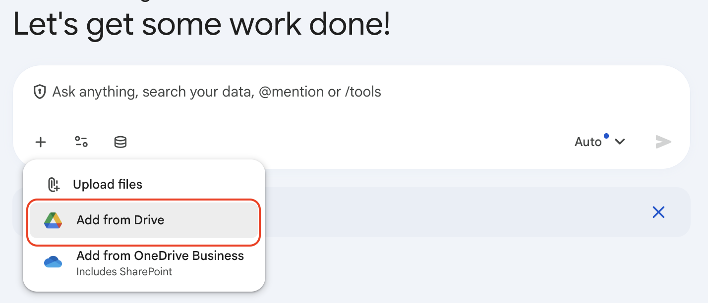
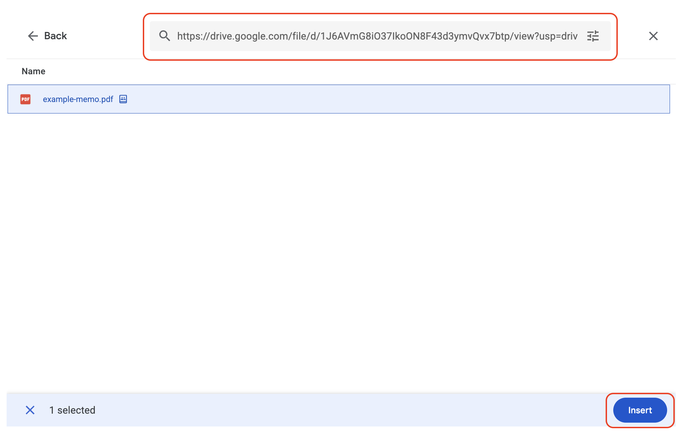

# Prompt Engineering Best Practices

## Time Required
30 minutes

## Overview
In this lab, you'll use Gemini to help Cymbal Capital Partners analyze investment opportunities and improve the quality of its outputs through better prompting. You will start with a plain request, improve it with basic formatting, move into a repeatable framework, and then apply advanced techniques and meta-prompting.

### You learn how to:
- Use the 5-step framework to refine prompts.
- Separate prompt sections with delimiters to help the model understand.
- Use few-shot examples to teach a consistent style or structure.
- Specify step-by-step instructions for complex tasks.
- Set system-style instructions that keep Gemini focused on a persona and constraints.
- Use meta-prompting to improve your own prompts before you rely on them.

## Scenario

<p align="left">
  
</p>

Cymbal Capital Partners is looking for its next high-potential investment. The team reviews startup pitches, portfolio signals, market trends, and diligence notes every day, but they want a faster way to turn scattered information into a decision-ready recommendation.

Your job is to learn how to prompt Gemini so it can help the team summarize information accurately, compare opportunities consistently, and produce outputs that are easy for investment partners to review.

## Lab Instructions

### Task 1: Compare a raw prompt with a basic prompt

Start by seeing why prompt engineering matters in the first place.

1. Open Gemini Enterprise and start a new chat.

2. Click **+ Add files** and select **Add from Drive**. In the dialog, select `example-memo.pdf` and click **Open**.

   <p align="left">
     
     <br>
     <em>Add from Drive</em>
   </p>

3. Paste the following URL into the Search in Drive box, press **Enter**, then select the resulting file and __Insert__ it. 

```text
https://drive.google.com/file/d/1J6AVmG8iO37IkoON8F43d3ymvQvx7btp/view?usp=drive_link
```

   <p align="left">
     
     <br>
     <em>Insert from Drive</em>
   </p>

4. Ask Gemini to summarize the deal memo using only a plain, minimal request. Copy and paste the following prompt into the chat, then press **Enter**:

```text
Summarize this deal memo.
```

5. Review the output and note whether the response is too long, too vague, too generic, or missing investment risks.

6. Start a new chat and add the same document. This time try a slightly improved prompt. This version is still simple, but it gives the model a clearer role, audience, and format.

```text
You are an investment analyst for Cymbal Capital Partners.
Summarize the deal memo below for a partner meeting.
Use only the facts in the memo.
Return 3 bullets: upside, risk, and recommendation.
```

7. Compare the two responses. The second prompt should usually produce a better answer because it provides a role, an audience, and a target format.

8. Refine the second prompt if needed. Even a small amount of structure to your prompts can improve the result before you move into more advanced prompt engineering.

### Task 2: The 5-Step Framework

Now use the full 5-step framework to make the same kind of request more repeatable.

The five steps help turn a vague request into a reusable prompt pattern:
- Task: state exactly what you want the model to do.
- Context: explain who the output is for and how it will be used.
- References: define what sources the model should rely on.
- Evaluation: set the quality bar for the answer.
- Iteration: tell the model what to do if the result is incomplete or uncertain.

This matters because it makes prompts easier to repeat, compare, and refine without rewriting the whole request each time.

1. Start a new chat and ask Gemini Enterprise to find two investment opportunities and compare them.

2. Use the five parts of the framework to keep the prompt clear and intentional.

```text
Task:
Find two investment opportunities and compare them to recommend which one deserves a first meeting.

Context:
The audience is a partner who wants a concise, decision-oriented recommendation.

References:
Use only the information you find in your available sources.

Evaluation:
The answer should be accurate, concise, and grounded in the deal details.

Iteration:
If the recommendation feels uncertain, explain why and identify the missing information.

Output:
Return the recommendation, the key reasons, the main risks, and one follow-up question.
```

3. Review the response and check whether Gemini used the available sources correctly and stayed focused on the requested output.

4. Refine the prompt if needed. This is the repeatable version you can use when you want a consistent structure for similar tasks.

### Task 3: Apply advanced prompting techniques

Use advanced techniques when you need tighter control over structure, tone, or format. In this task, keep the same chat open and use the best investment opportunity from Task 2 as the subject of the memo.

#### Part A: Set system-style instructions

1. Paste a persona-style instruction block before the task.

```text
You are a senior investment communications assistant for Cymbal Capital Partners.

Behavior rules:
- Write in concise business language.
- Prefer clarity over flair.
- Use Markdown headings and bullets when it improves readability.
- Never invent facts, metrics, or market data.
- Flag uncertainty explicitly.
- Keep recommendations practical and decision-oriented.

Now help me write a partner-ready memo for the best investment opportunity from the previous comparison.
```

2. Now the behavior rules are set. As long as you are in the same chat, you do not need to repeat the persona in every follow-up prompt.

#### Part B: Separate instructions from the memo format with delimiters

1. In the same chat, ask Gemini to write a new memo for the selected investment opportunity.

2. Use delimiters to keep the instructions distinct from the format example it must follow.

```text
Write a partner-ready memo for the best investment opportunity from the previous comparison.

Rules:
- Base the memo only on the opportunity details from the current chat.
- Do not invent missing facts.
- Match the structure and tone of the memo example below.
- Keep the memo concise and decision-oriented.

<memo-format>
Title: [Opportunity Name]

Summary:
[One-sentence overview]

Why it stands out:
- [Point 1]
- [Point 2]
- [Point 3]

Key risks:
- [Risk 1]
- [Risk 2]
- [Risk 3]

Recommendation:
[Clear next step]
</memo-format>
```

3. Evaluate the response. Check whether Gemini stayed inside the memo format and avoided adding unrelated structure.

#### Part C: Use a one-shot example to lock in the style

One-shot prompting means embedding a complete example of the output you want directly inside the prompt. The model reads the example and imitates its structure, tone, and level of detail—without you needing to describe those qualities abstractly.

1. In the same chat, paste the prompt below. The inline example teaches Gemini exactly what a good memo looks like before you ask it to write one.

```text
Here is one example of a well-written investment memo. Use it as a one-shot example—match its structure, tone, and analytical depth exactly.

--- EXAMPLE START ---
Title: Vanta Security — Series B Consideration

Summary:
Vanta automates SOC 2 compliance for SaaS companies, replacing a months-long manual audit process with a continuous monitoring platform.

Why it stands out:
- Addresses a $4B compliance automation market growing at 22% CAGR
- 3,000+ customers with 140% net revenue retention
- Land-and-expand model with strong product-led growth motion across SMB and mid-market

Key risks:
- Increasing competition from legacy GRC vendors adding automation features
- Revenue concentration in the US market; international expansion unproven
- Regulatory changes could reduce the perceived urgency of SOC 2 certification

Recommendation:
Proceed to partner meeting. Request updated ARR, churn, and CAC/LTV data before advancing to a term sheet.
--- EXAMPLE END ---

Now write a memo in the same format for the best investment opportunity from our previous comparison. Use only facts from the current chat. Do not invent metrics or data.
```

2. Compare the outputs from Parts A, B, and C. In Part A you set behavior rules; in Part B you defined a format template with delimiters; in Part C you provided a complete inline example. Which approach produced the most consistent and usable result?

3. One-shot prompting is most useful when you already have a real example of good output you want to replicate—a memo a partner approved, a report that landed well, or a format your team already uses. The richer and more representative the example, the less the model has to guess.

### Bonus Task 4: Meta-Prompting

Meta-prompting means using Gemini to improve the prompt itself before you use it on real work. You will take the one-shot example prompt from Task 3 Part C and improve it using the 5-step framework from Task 2.

1. In a new chat, copy and paste the following prompt.

```text
Act as a prompt engineer.

Review the prompt below and rewrite it using the 5-step framework:
1. Task
2. Context
3. References
4. Evaluation
5. Iteration

--- PROMPT START ---
Help me write a partner-ready memo for the best investment opportunity from the previous comparison using the structure, tone, and analytical depth of the attached example-memo.pdf.

Mirror the professional, data-driven, and skeptical tone used in the example. Use the exact same section headings (e.g., Investment Thesis, Market Analysis, Risks & Mitigants).

Pull specific metrics, competitive advantages, and market trends from our previous discussion to populate the sections.

Use clean Markdown with bolded headers and bulleted lists for scannability.
--- PROMPT END ---
```

2. Copy the improved prompt. Open a new chat, paste the improved prompt, and attach `example-memo.pdf` from Drive as you did earlier.

3. Compare the revised prompt with your original version from Task 3 Part C. Did the output quality improve?

### Bonus Task 5: Bring your own use case

Choose a real task from your own work—summarizing a long document, comparing options, drafting a communication, or producing a structured analysis. Apply the techniques from this lab:

1. Write a raw first attempt and note where the output falls short.
2. Rewrite it using the 5-step framework.
3. Optionally add a persona block, use delimiters to separate instructions from a format template, or embed a one-shot example drawn from a real output you were happy with.
4. Share your before and after prompts with the group and explain which technique made the biggest improvement.

## Congratulations!
In this lab, you have:
- Compared a plain request with a more structured prompt to see why prompt engineering matters.
- Used the 5-step prompting framework to make requests repeatable.
- Applied advanced prompting techniques such as system-style instructions, delimiters, and one-shot examples.
- Used meta-prompting to improve your own prompts before using them in real work.
