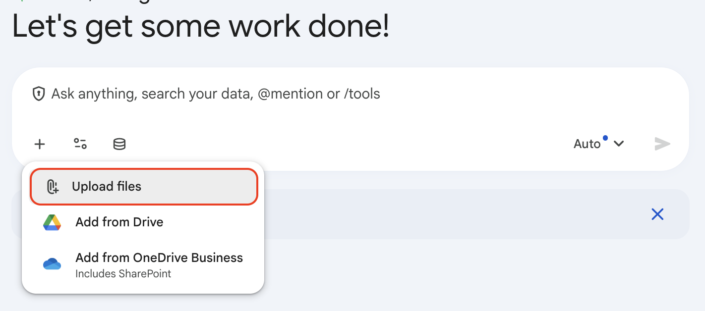

# Managing Files as Context

## Time Required
30 minutes

## Overview
In this lab, you will use Gemini Enterprise's Manage files feature to turn scattered source material into useful context for prompts.

You will attach files from different sources, compare how file type affects the answer, and learn how to update the attached file set when you want the model to focus on different evidence.

### You learn how to:
- Analyze various files, including PDFs, spreadsheets, documents, text files, and images.
- Ask questions that force Gemini to ground its answer in attached files.
- Compare how answers change when you add, remove, or replace context files.
- Build a cleaner, decision-ready response for a complex workflow.

## Scenario

<p align="left">
  
</p>

Cymbal Capital Partners is evaluating a new investment opportunity.

The team has collected a deal memo, traction metrics, customer notes, and product visuals in different file types and from different sources. Your job is to use Gemini Enterprise to manage those files as context so the model can summarize the opportunity, compare signals, and produce a partner-ready recommendation.

## Lab Instructions

### Task 1: Start with one file

Begin with a single source so you can see how much context Gemini gets from one attachment.

1. Download the following .zip file to your computer and unzip it. 

```
https://drive.google.com/file/d/1AKnDtaGSxJ-Fe1ZdZaHgmf9pRIK94vjF/view?usp=drive_link
```


2. Open Gemini Enterprise and start a new chat. Click the **+ Add files** icon and select __Upload files__.

   <p align="left">
     
     <br>
     <em>Upload Files</em>
   </p>

3. Add the `cymbal-alpha-deal-memo.pdf` from your computer.

4. Ask Gemini to summarize the opportunity using only that file:

```text
You are supporting Cymbal Capital Partners.

Summarize the attached deal memo for a partner meeting.
Use only facts from the file.
Return:
1. What the company does
2. Why it could be attractive
3. The biggest risk
4. A one-sentence recommendation
```

5. If the answer is too generic, ask a follow-up question that forces a tighter summary.

### Task 2: Add a second file type

Now add a different type of evidence so Gemini can combine narrative and numbers.

1. Keep the same chat open, and add the file`traction-metrics.xlsx` from your computer.

2. Ask Gemini to compare the two files:

```text
Use the attached deal memo and traction metrics spreadsheet.

Compare the story in the memo with the operating signals in the spreadsheet.

Return:
1. Where the two files agree
2. Where the spreadsheet raises questions or supports the memo
3. Any metrics that look especially strong or weak
4. Two diligence questions for the investment team
```

3. Review whether Gemini uses the spreadsheet as evidence. It should cite specific rows, columns, or metric names from the spreadsheet.

### Task 3: Add a third file type

Add a DOCX file to show that Manage files works across different document types, not just PDFs and spreadsheets.

1. Attach the file `customer-interview-notes.docx`. Ask Gemini to identify customer signals:

```text
Use the attached deal memo, traction spreadsheet, and customer interview notes.

Identify the strongest customer evidence for or against the investment.

Return:
1. Positive customer signals
2. Negative customer signals
3. Any contradictions across the files
4. The single most important follow-up question for a partner discussion
```

2. If Gemini surfaces a contradiction between files, ask it to identify which source it trusts more and why.

### Task 4: Use an image as context

Now add a visual file so Gemini has to interpret a different format.

1. Click **+ Add files** and upload `product-infographic.png`

2. Ask Gemini to read the image together with the written material:

```text
Use the attached files, including the product infographic.

Based on the memo, metrics, notes, and the infographic, explain whether the product looks real, differentiated, and ready for customers.

Return:
1. What the image appears to show
2. Whether it supports the company story
3. Any concerns about product maturity or positioning
4. A concise investment view
```

3. Check whether Gemini describes only what is visible and avoids inventing details from the image.

4. If the response is vague, ask it to separate visual evidence from written evidence.


### Task 5: Manage the file set deliberately

A key part of Manage files is choosing the right file set *before* you ask a question. Once files have been discussed in a chat, the conversation history already contains the model's knowledge of them—so the meaningful way to see how file selection affects output is to start a new chat with a different set of files.

1. Open a **new chat** in Gemini Enterprise. Add only three files: `cymbal-alpha-deal-memo.pdf`, `traction-metrics.xlsx`, and `customer-interview-notes.docx`. Do **not** attach the infographic yet.

2. Ask the same question from Task 4:

```text
Based on the attached files, explain whether the product looks real, differentiated, and ready for customers.
```

3. Compare this answer with your Task 4 result. Without the image, note which parts of the answer weaken or disappear. This shows how a missing file type creates a gap even when the written evidence is complete.

4. Now add `product-infographic.png` to this new chat and run the following prompt to synthesize and clean the evidence across all four files (`cymbal-alpha-deal-memo.pdf`, `traction-metrics.xlsx`, `customer-interview-notes.docx`, and `product-infographic.png`):

```text
You are an investment analyst for Cymbal Capital Partners. Use ONLY the attached files and do not browse external sources or invent facts.

Task—Clean & Synthesize:
1. Identify and remove noisy or unreliable data across these files (unsupported claims, contradictions, undated items, unexplained outliers, or unclear provenance). For each removed item list: file, precise location (PDF page/paragraph, spreadsheet sheet+row/cell, docx paragraph, image area), and a one-line reason for removal.
2. Using the remaining reliable evidence, produce a concise synthesis (max 250 words) with:
   - Investment thesis (one sentence)
   - Top 3 supporting facts (each with file citation and location)
   - Top 3 risks (each with file citation and location)
   - Two missing data points that materially affect the decision
   - One-line recommendation: `Proceed to diligence` / `Hold` / `No` and a one-line rationale
3. Appendix: list exact spreadsheet cells/sheets used, PDF pages and paragraph ranges used, and docx paragraph excerpts used.

Output headings: Investment Thesis, Supporting Facts, Risks, Missing Data, Recommendation, Appendix, Removed Items.
Begin by listing the number of removed items and the number of retained evidence items, then deliver the synthesis and appendix.
```

5. Review the cleaned synthesis. Compare this view with the earlier, broader answers from Tasks 1–4. Ask a follow-up if something looks incorrectly removed or still noisy.

### Task 6: Produce a final investment note

Use the cleaned evidence to create a tight partner-ready memo.

1. Now that the cleaning step produced a short evidence appendix, run the following prompt to produce a final memo:

```text
You are preparing a partner note for Cymbal Capital Partners.

Using only the cleaned evidence (attached files taking into account the items removed and evidence items retained), write a short investment memo (max 300 words) with these sections:
- Title
- One-line Summary
- Why it stands out (3 bullets, each citing file+location)
- Key risks (3 bullets, each citing file+location)
- Missing information (2 bullets)
- Recommendation (one line: `Proceed to diligence` / `Hold` / `No` and one-line rationale)

Rules:
- Stay grounded in the provided files.
- Do not invent missing facts.
- Mark any uncertain claims `Unverified` and explain why in one line.
- Keep language concise and decision-oriented.
```

2. Review the memo for clarity and evidence linkage. You can save the final memo to share it by clicking the **Download response** button.

### Bonus Task 7: Start without the primary document

So far every chat has started with the deal memo as the anchor. See what happens when the primary narrative document is absent from the start.

1. Open a **new chat** in Gemini Enterprise and add only the supporting files: `traction-metrics.xlsx`, `customer-interview-notes.docx`, and `product-infographic.png`. Do **not** attach the deal memo.

2. Ask the same question used in Task 1:

```text
Based on the attached files, summarize the investment opportunity and give a one-sentence recommendation.
```

3. Compare this answer with your Task 1 and Task 6 outputs. Which conclusions survive on supporting evidence alone? Which collapse without the memo's narrative?

4. Add `cymbal-alpha-deal-memo.pdf` to this chat and re-run the same question. Confirm whether the recommendation aligns with your earlier Task 6 output.

### Bonus Task 8: Bring your own use case

Choose three or more files from your own work—a mix of types such as a report, a spreadsheet, and a document—that all relate to a single question or decision you need to make.

1. Open a new Gemini Enterprise chat and attach your files one at a time. After each addition, ask a question that uses all attached files so far and note how the answer evolves.

2. When all files are attached, run a synthesis prompt asking Gemini to identify the strongest evidence, surface any contradictions, and give a recommendation or next step.

3. Open a second new chat and attach only the files you trust most—leave out the weakest source. Run the same synthesis prompt and compare the two outputs. Did removing the weaker file improve or degrade the answer?

4. Share your final synthesis with the group and explain which file combination produced the most useful output.

## Congratulations!

In this lab, you have:
- Added contextual files (PDF, spreadsheet, DOCX, image) to Gemini Enterprise.
- Compared answers across different file sets by starting fresh chats with deliberate subsets of files.
- Cleansed unsupported, contradictory, or undated items and documented removed evidence.
- Created a concise, evidence-backed investment thesis and partner-ready memo with supporting facts and risks.
