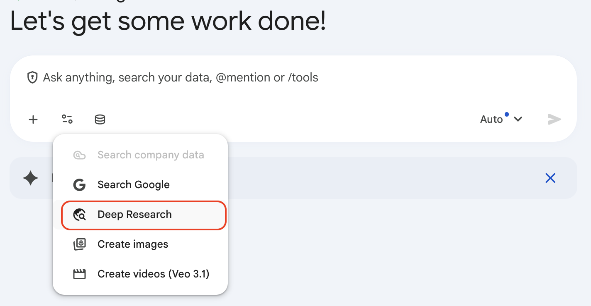

# Deep Research

## Time Required
30 minutes

## Overview
In this lab, you will use Gemini Enterprise Deep Research to investigate a company before making an investment decision.

You will learn how to start with a broad question, narrow the research to founders and company background, test market viability, and turn the results into a partner-ready recommendation.

### You learn how to:
- Frame a strong Deep Research request.
- Ask follow-up questions that improve source quality and answer depth.
- Turn research output into a concise executive summary.

## Scenario

<p align="left">
  
</p>

The Cymbal Capital Partners team has identified a number of high-growth technology companies and needs to move quickly. 

Your job is to use Gemini Enterprise Deep Research to gather evidence on the company backgrounds, founder credibility, and market viability, and then, turn the findings into concise recommendations for the investment committee.


## Lab Instructions

### Task 1: Start with a broad research brief

Begin with a wide question so Deep Research can surface the company overview and the main evidence themes.

1. Open Gemini Enterprise and start a new chat.

2. From the **Tools** list, select **Deep Research**.

   <p align="left">
     
     <br>
     <em>Deep Research</em>
   </p>

3. Choose a company to research. Pick one from the list below, or use any company you find interesting.

   | Company | What they do |
   |---------|--------------|
   | **Stripe** | Payments infrastructure for the internet |
   | **Databricks** | Data and AI platform for enterprises |
   | **Anthropic** | AI safety company and developer of the Claude model |
   | **Canva** | Online design and visual communication platform |
   | **Scale AI** | Data labeling and AI infrastructure for ML teams |
   | **Hugging Face** | Open-source AI model hub and developer tools |
   | **Perplexity AI** | AI-powered answer engine and search alternative |
   | **Harvey AI** | Generative AI platform built for legal work |

4. Paste the following prompt, replacing `[Company Name]` with the company you chose:

```text
You are helping Cymbal Capital Partners, a venture capital and private equity firm, to evaluate a potential investment.

Research [Company Name] and summarize the most important facts for an investor.

Return:
1. What the company does
2. Who the founders are and why they matter
3. What problem the company claims to solve
4. The top 3 signs the company could be investable
5. The top 3 reasons to be cautious
6. A one-sentence preliminary recommendation

Use reliable sources and cite where each claim comes from.
```

5. Wait for Deep Research to generate a research plan. Review the plan—a good plan should cover at least the company background, the founders, and the market. If it looks too narrow or too broad, ask Deep Research to adjust it before proceeding.

6. Scroll to the bottom of the plan and click **Start research**.

### Task 2: Focus on the founders

Now narrow the research to the people behind the company.

1. Ask a follow-up prompt focused only on the founders:

```text
Now focus only on the founders and leadership team of this company.

Research their background, relevant experience, and any signals that affect investor confidence.

Return:
1. Founder bios in one or two sentences each
2. Relevant startup, industry, or domain experience
3. Any prior exits, failures, or leadership gaps that matter
4. Evidence of founder-market fit
5. One concern an investor should investigate further

Use only evidence you can support from reliable sources.
```

2. Check whether Deep Research distinguishes between strong evidence and speculation. Good output should name specific roles, dates, companies, or prior outcomes. If the output is too vague, ask a follow-up:

```text
For each founder, cite specific roles, companies, and dates rather than general descriptions. Label anything you cannot verify from a reliable source as Unverified.
```

### Task 3: Test market viability

Shift from people to market opportunity.

1. Ask a market-focused follow-up:

```text
Research the market viability of this company.

Answer as an investor would.

Return:
1. The market problem and why it matters now
2. The size or direction of the opportunity
3. The most important competitors or alternatives
4. The company's likely differentiation
5. The biggest market risk
6. Whether the market appears attractive enough for venture or growth investment
```

2. Look for evidence that the response is based on concrete sources rather than general market commentary. If the answer relies on broad industry language without citations, ask a follow-up:

```text
Replace any general market size claims with specific figures or named sources. If a number cannot be verified, label it Unverified.
```

### Task 4: Produce an investment summary

Now turn the research into an internal memo.

1. Ask Deep Research to synthesize the evidence into a short decision note:

```text
Prepare a short investment note for Cymbal Capital Partners using only the research gathered so far.

Write a memo with these sections:
- Title
- One-line summary
- Why it stands out
- Key risks
- Missing information
- Recommendation

Rules:
- Stay grounded in the research.
- Do not invent facts.
- Mark any uncertain claims as Unverified.
- Keep it concise and decision-oriented.
```

2. Review whether the memo is useful for an investment committee. The best version should make the decision easier, not just repeat the research. If it reads more like a summary than a recommendation, ask:

```text
Rewrite the recommendation section to be more direct. State clearly whether Cymbal Capital Partners should proceed to diligence, hold, or pass, and give a one-line rationale.
```

### Bonus Task 5: Apply Deep Research to your own work

Choose a research question that is relevant to your organization—something you would normally spend hours investigating manually. Use Deep Research to do the first pass.

Here are some ideas to get you started:

| Scenario | Example question |
|----------|-----------------|
| **Market research** | What are the emerging trends and unmet needs in [your market or industry] over the next 2–3 years? |
| **Competitor analysis** | Who are the top competitors to [your product or service], and how do they differentiate on pricing, features, and positioning? |
| **Technology evaluation** | What are the leading platforms or tools for [a capability your team needs], and what are the trade-offs between them? |
| **Regulatory landscape** | What regulations or compliance requirements should a company in [your industry] be aware of when operating in [a region or market]? |
| **Partnership scouting** | Who are the most credible vendors or partners in the [a domain relevant to you] space, and what do customers say about working with them? |

1. Open a new Gemini Enterprise chat and select **Deep Research**.

2. Write a prompt that gives Deep Research your role, your organization's context, and the specific question you want answered. Ask it to return findings with citations.

3. When the research plan appears, check that it covers the right scope—not too broad, not too narrow. Adjust it if needed before clicking **Start research**.

4. Review the output. Ask at least one follow-up prompt to push for more specific evidence or to clarify a claim that looks too general.

5. Share your question and one key finding with the group. Did Deep Research surface anything you did not already know?

## Congratulations!

In this lab, you have:
- Used Gemini Enterprise Deep Research to investigate a company's background, founders, and market viability.
- Refined research output by asking follow-up prompts that force citation and remove vague language.
- Turned multi-pass research into a concise, decision-ready investment note.
