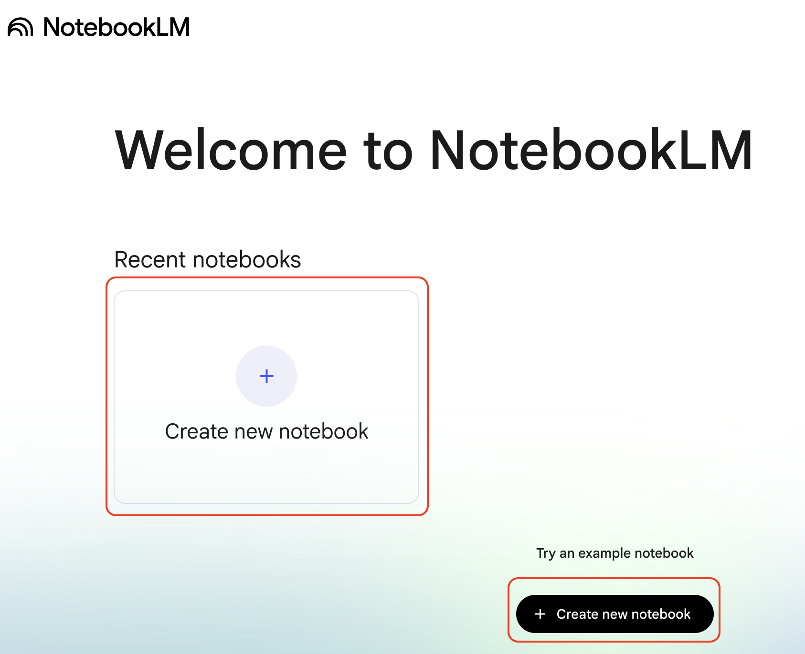
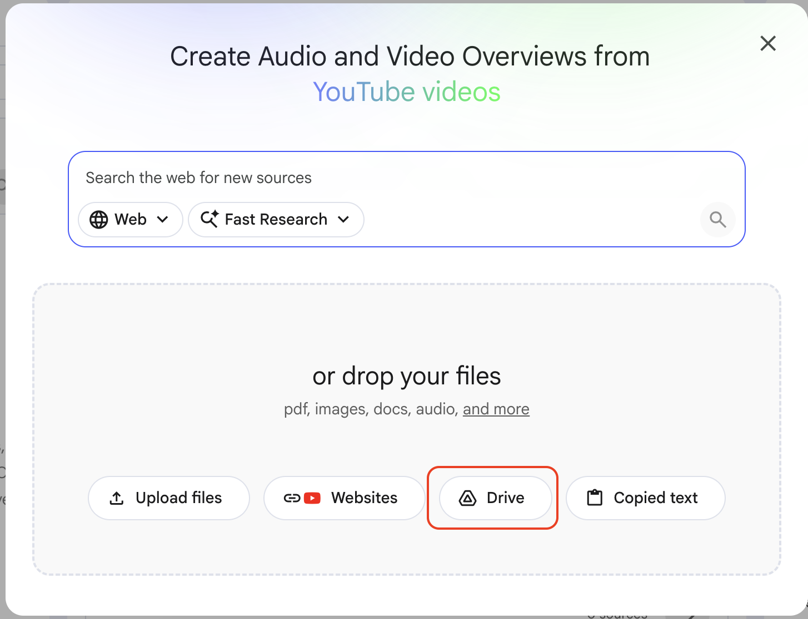
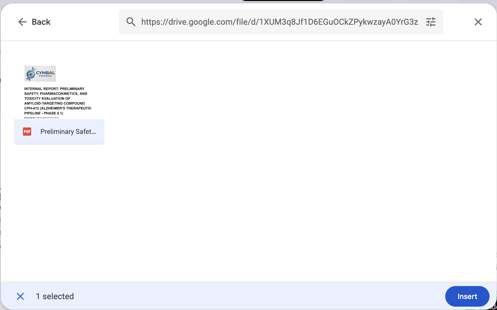
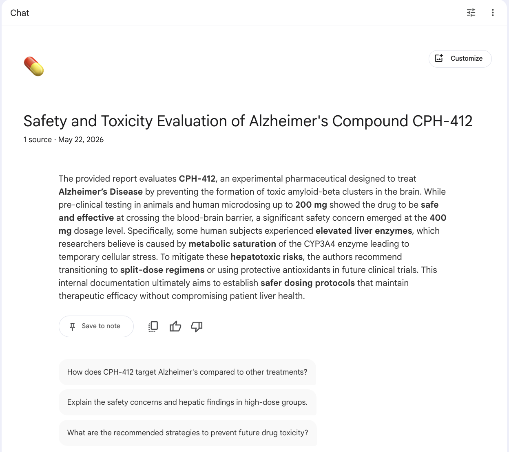

# Getting Started with NotebookLM

## Time Required
20 minutes

## Overview
In this lab, you will create your first NotebookLM notebook and explore its core features: uploading a source document, reviewing the automatically generated Notebook Guide, and asking targeted questions that are grounded in your source. Every answer NotebookLM provides includes a citation that links directly back to the relevant passage—so you can verify every claim in seconds.

### You learn how to:
- Create a new notebook in NotebookLM.
- Upload a PDF as a source document.
- Use NotebookLM to get an instant structured overview of a complex document.
- Ask targeted questions and follow up on specific citations.
- Add notes to capture your own analysis alongside the AI-generated content.

## Scenario

<p align="left">
  
</p>

You are a Senior Research Scientist in Cymbal Pharma's Early-Stage Drug Discovery unit. Your team has been fast-tracking a promising new Alzheimer's compound called **CPH-412**.

A critical, *Initial Safety and Toxicity Report* has just arrived from the lab. You only have an hour before a stakeholder meeting where you must identify the high-risk data points and recommend a path forward. Studying the full report would leave no time for preparation—but with the right tool, it doesn't have to.

In this lab, you will use NotebookLM as a triage tool: uploading the report, getting an instant overview, and extracting the exact findings that matter before the meeting starts.


## Lab Instructions

### Task 1: Create a Notebook and upload the Report

1. Open [NotebookLM](https://notebooklm.google.com/) in your browser. Sign in with your Google account if prompted.

2. On the NotebookLM home page, click **New notebook**.

   <p align="left">
     
     <br><em>The New notebook button on the NotebookLM home page</em>
   </p>

3. A new, empty notebook opens. The __Add Sources__ screen will open. 

   <p align="left">
     
     <br><em>The Sources panel in an empty notebook</em>
   </p>

4. Click the __Drive__ button. Then, paste the following link into the __Search__ field at the top, then press the __Enter__ key. It will find the file, select it, and then click __Insert__.

```text
https://drive.google.com/file/d/1XUM3q8Jf1D6EGuOCkZPykwzayA0YrG3z/view?usp=drive_link
```

   <p align="left">
     
     <br><em>Add file from Drive screen.</em>
   </p>


5. Wait a few seconds while NotebookLM processes the document. The source appears in the Sources panel when it is ready.

> [!NOTE]
> NotebookLM reads and indexes the full document during this step. The richer and more structured the source, the better the quality of answers and citations you will receive.

### Task 2: Explore the Notebook Guide

Once a source is added, NotebookLM automatically generates a **Notebook Guide**—a structured overview of the document's key topics, themes, and suggested questions.

1. In the chat panel, click **Notebook Guide**.

   <p align="left">
     
     <br><em>The Notebook Guide provides an instant overview of your source</em>
   </p>

2. Read through the generated summary. NotebookLM should have identified:
   - The compound under study (CPH-412) and its intended therapeutic area
   - The test groups, dosage ranges, and study design
   - The key safety signals identified in the report

3. Scroll to the **Suggested questions** at the bottom of the guide. These are questions NotebookLM has surfaced as important based on the document's content. Take note of them before moving to the next task.

> [!NOTE]
> The Notebook Guide is generated automatically but is not saved. If you want to keep it, click the **Save to note** icon (📌) before closing or scrolling past it.

### Task 3: Ask targeted questions

You want three specific answers before the stakeholder meeting. Ask each of the following questions in the chat and evaluate the response—paying close attention to the citations NotebookLM provides.

**Question 1: Identify the high-risk dosage group**

1. Type the following in the chat and press Enter:

```text
What was the exact dosage of CPH-412 given to the group that showed elevated liver enzymes?
```

- Review the answer, then hover over the **citation** link. If you click on a citation, it should take you directly to the relevant section of the report.
- Verify that the citation identifies the specific milligram dosage and the group designation.

2. Click the __Save to note__ button. Notice, your notes are saved on the lower-right pane of the screen. 

**Question 2: Find the recommended mitigation options**

3. Type the following in the chat and press Enter:

```text
Does the report recommend any alternative dosing schedules to mitigate the liver enzyme risk?
```

- This question requires NotebookLM to synthesize across multiple sections. Check whether it cites more than one part of the document.
- Verify that the answer references at least two distinct alternative schedules.

**Question 3: Understand the biological mechanism**

4. Type the following in the chat and press Enter:

```text
What is the biological mechanism causing the toxicity in the high-dose group?
```

- This is the most technical question. Check whether the answer accurately describes an enzymatic pathway and its downstream effects.
- Verify that the answer names the specific metabolic process responsible for the toxicity and explains the resulting cellular stress.

> [!NOTE]
> If an answer feels incomplete, try a more specific follow-up. For example: *"Can you be more specific about which enzyme is involved and why saturation causes the observed effects?"* Precision in your questions leads to precision in the answers.

### Task 4: Preparing for your meeting

You need a concise written summary to share with meeting attendees. 

1. Run the following prompt. 

```text
Write a short briefing note for the stakeholder meeting. Include:
- The key risk finding
- Mitigation options the report recommends
- Recommended path forward

Keep this output short and concise. Just notes for my upcoming meeting. 
```

2. Save this as a note. 


4. With your note saved, ask a follow-up question that builds on it:

```text
Based on the report, what additional safety data would the lab need to collect to confirm that a lower twice-daily dose is safe for long-term use?
```

### Bonus Task 5: Challenge the Summary

Use these prompts to test NotebookLM's boundaries and sharpen your instincts for working with cited AI tools.

1. Ask a question the report cannot answer—for example:

```text
What were CPH-412's Phase 2 trial results?
```

2. Ask for a comparison across groups:

   ```text
   How did the low-dose group's results differ from the high-dose group's results across all measured safety markers?
   ```

3. Ask NotebookLM to reformat information into a table:

   ```text
   List all dosage groups tested, the CPH-412 dose each received in milligrams, and their most significant finding — formatted as a table.
   ```

4. Compare the table against the original report to verify that no information was added or altered.

### Bonus Task 6: Try it with your own document

Create a new notebook and upload a long document from your own work—a report, a policy, a research paper, or a lengthy email thread. Ask NotebookLM three questions that would normally take you significant time to answer manually. Note how long it takes compared to reading the document yourself.

## Congratulations!

In this lab, you have:
- Created a NotebookLM notebook and uploaded a source document.
- Used the Notebook Guide to get an instant structured overview of a complex technical report.
- Asked targeted questions and verified answers using citations linked to the source.
- Added a note to capture your own analysis alongside the AI-generated content.
