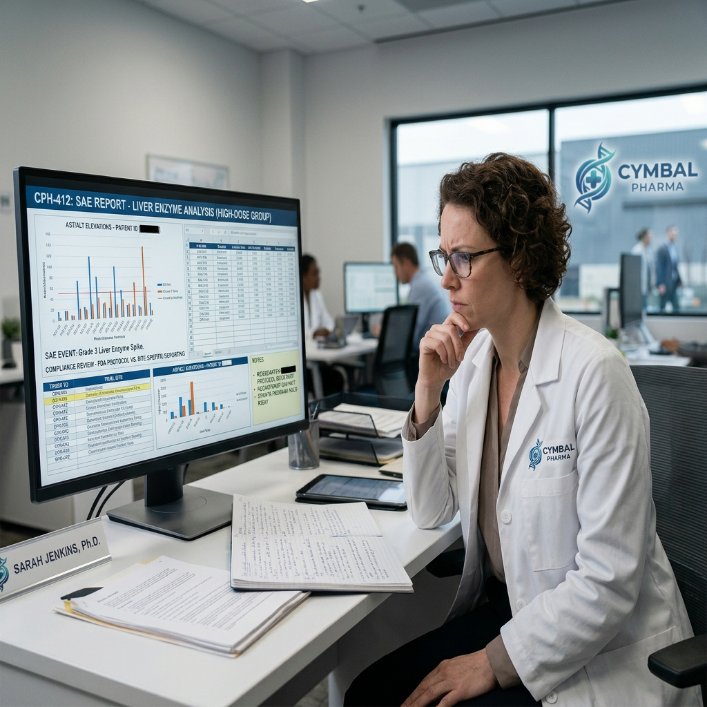
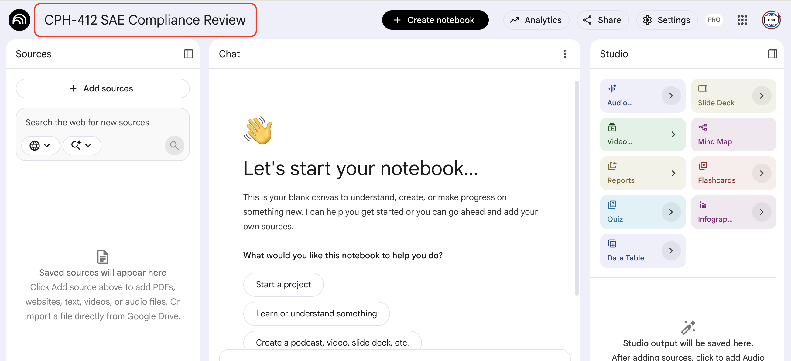
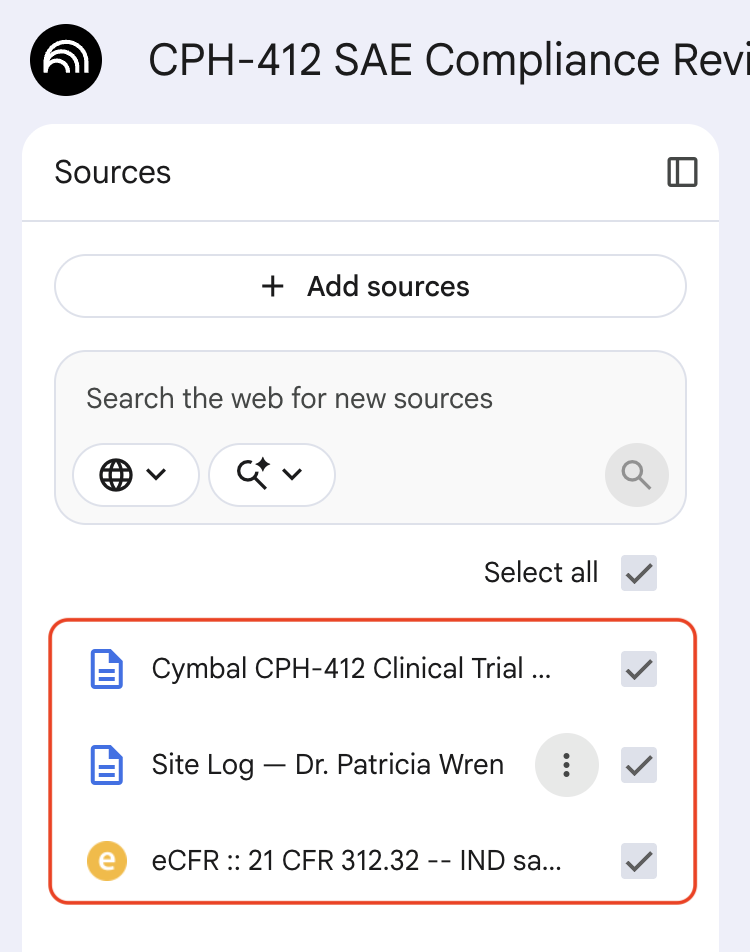
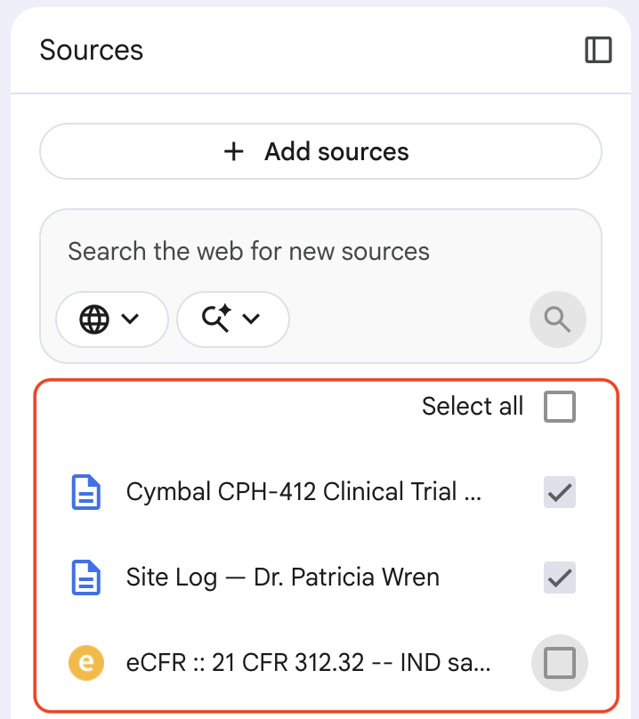

# Complex Data Analysis with NotebookLM

## Time Required
30 minutes

## Overview
In this lab, you will load three diverse source types into a single NotebookLM notebook—a real regulatory document added via URL, an internal protocol added as copied text, and a raw field log added as copied text. You will then ask questions that require synthesizing all three simultaneously, and use source deselection to isolate and compare different information subsets. NotebookLM's cited answers make it uniquely suited for compliance work: every finding traces back to a specific document and section.

### You learn how to:
- Add multiple source types to a single notebook (URL, and copied text).
- Ask questions that require synthesizing information across multiple sources at once.
- Deselect individual sources to focus analysis on a specific subset.
- Identify compliance violations by cross-referencing regulatory requirements, internal protocols, and event records.

## Scenario

<p align="left">
  
</p>

The liver enzyme spikes identified in the high-dose group (from Lab 1's toxicity report) have triggered a formal compliance review. You are the **Director of Clinical Quality Assurance** at Cymbal Pharma.

A Serious Adverse Event (SAE) was recorded at the CPH-412 clinical trial site. Your job is to determine whether the lead investigator complied with both FDA regulatory requirements and Cymbal's own internal trial protocol when handling and reporting the event. If the investigator failed to comply, the FDA could place the entire CPH-412 program on clinical hold.

You have three documents: the actual FDA safety reporting regulation, Cymbal's internal trial protocol, and the investigator's raw on-site notes.

## Before You Begin

Two of the three sources in this lab are provided below as text you will paste directly into NotebookLM. Source 1 is a real, publicly available FDA regulation that you will add via URL. Have the text for Sources 2 and 3 ready to copy before you begin.

## Lab Instructions

### Task 1: Create the Notebook and add all three sources

1. Open [NotebookLM](https://notebooklm.google.com/) and create a **New notebook**. Close the __Add sources__ screen, and then name the notebook `CPH-412 SAE Compliance Review`.

   <p align="left">
     
     <br><em>The CPH-412 SAE Compliance Review notebook</em>
   </p>

2. **Add Source 1—FDA Regulation (via URL)**

   In the **Sources** panel, click **+ Add sources** and select **Website**. Paste the following URL—this is the actual FDA Code of Federal Regulations rule governing IND safety reporting:

   ```text
   https://www.ecfr.gov/current/title-21/chapter-I/subchapter-D/part-312/subpart-B/section-312.32
   ```

 > [!NOTE]
 > This is a live, publicly available FDA regulation (21 CFR § 312.32). NotebookLM will index the full text. If the URL is unreachable, search for "21 CFR 312.32" on [ecfr.gov](https://www.ecfr.gov) and add the result.

3. **Add Source 2—Cymbal CPH-412 Clinical Trial Protocol (via copied text)**

   Click **+ Add sources**, select **Copied text**, paste the following, and click **Insert**:

   ```text
   CYMBAL PHARMA — CPH-412 CLINICAL TRIAL PROTOCOL
   Protocol Version 3.1 | Confidential

   SECTION 5: ADVERSE EVENT MONITORING AND REPORTING

   5.1 Liver Function Monitoring
   All trial participants must undergo liver function testing (ALT, AST, ALP, and bilirubin) at baseline, Day 3, Day 7, and weekly thereafter.

   5.2 Dosing Suspension Criteria
   If a participant's ALT or AST level exceeds 3x the Upper Limit of Normal (ULN) at any measurement point during the trial, the following actions are mandatory and must be executed immediately:
   a) Suspend the participant's dosing schedule entirely until liver function returns to below 1.5x ULN.
   b) Do not substitute a reduced dose as an alternative. Full suspension is required.
   c) Notify the Cymbal Quality Assurance team within 24 hours of the abnormal result.
   d) Initiate a clinical hold assessment within 48 hours of the abnormal result.

   5.3 Serious Adverse Event (SAE) Reporting
   Any SAE, as defined by 21 CFR § 312.32, must be reported to the Cymbal Safety team immediately upon identification. The Cymbal Safety team is responsible for all subsequent FDA reporting within required regulatory timeframes.

   5.4 Protocol Deviation
   Failure to adhere to the dosing suspension criteria in Section 5.2 constitutes a protocol deviation and must be documented and reported to the Cymbal Medical Monitor within 24 hours of the deviation being identified.
   ```

4. After the source is added, click the action menu and select __Rename source__. Give it the title `Cymbal CPH-412 Clinical Trial Protocol`.

5. **Add Source 3—Clinical Investigator's Raw Daily Log (via copied text)**

   Click **+ Add sources** again, select **Copied text**, paste the following, and click **Insert**:

   ```text
   CPH-412 SITE LOG — Dr. Patricia Wren, Principal Investigator
   Site: Memorial Clinical Research Center
   Participant: Subject 1411

   Monday, Day 5:
   Reviewed Subject 1411's Day 5 lab results this morning. ALT came back at 4.9x ULN—higher than I expected. Decided to delay next dose rather than suspend. Subject is showing no clinical symptoms and is in good spirits. Administered standard liver support supplements and scheduled a follow-up blood draw for Thursday.

   Wednesday, Day 7:
   Follow-up bloods not yet back. Subject feeling fine, no complaints. Proceeding with monitoring.

   Thursday, Day 8:
   Results returned. ALT is now 3.2x ULN—trending down, which is encouraging. Called Cymbal QA this afternoon to let them know about Monday's result. They flagged it as a potential SAE. Will document formally in the trial log tomorrow and prepare the deviation report over the weekend.
   ```
6. As you did before, give this source the name `Site Log — Dr. Patricia Wren`. 

7. Your notebook should now have all three sources in the Sources panel.

   <p align="left">
     
     <br><em>The Sources panel with the FDA regulation, Cymbal protocol, and investigator log loaded</em>
   </p>

### Task 2: Cross-reference the sources

With all three sources active, NotebookLM can answer questions that require reading across all of them simultaneously.

1. Start with a broad compliance question:

   ```text
   Based on all three sources, did the clinical investigator comply with both FDA regulations and the Cymbal trial protocol when handling Subject 1411's ALT spike on Monday?
   ```

   Review the answer carefully. It should cite specific sections from all three sources. Look for:
   - The FDA regulation's requirement for how quickly an SAE must be reported
   - The Cymbal protocol's specific dosing suspension requirement for a 3x ULN threshold
   - The investigator's log entry showing what was actually done and when

2. Ask a more targeted follow-up question about timing:

   ```text
   How many days passed between Subject 1411's ALT spike and the notification to Cymbal QA? Does that timeline comply with the Cymbal protocol and FDA regulation?
   ```

3. Ask NotebookLM to enumerate every specific violation:

   ```text
   List every specific action the investigator took—or failed to take—that constitutes a protocol deviation or regulatory violation. For each one, cite the exact source document and section.
   ```

> [!NOTE]
> You are looking for at least two distinct violations: (1) the failure to fully suspend dosing as required by Section 5.2 of the Cymbal protocol (4.9x ULN exceeds the 3x threshold, but the investigator only "delayed" rather than suspended), and (2) the delayed QA notification—Thursday afternoon instead of within 24 hours of Monday's result.

### Task 3: Isolate sources to test reasoning

One of NotebookLM's most powerful features is source deselection. Turning off individual sources lets you ask the same question with different information available—revealing how much each source contributes to the answer.

1. In the **Sources** panel, uncheck the first source you added (the FDA regulation) to deactivate it. Only the Cymbal protocol and the investigator log are now active.

   <p align="left">
     
     <br><em>Deactivating Source 1 removes it from all subsequent responses</em>
   </p>

2. Ask the same compliance question again:

   ```text
   Did the investigator comply with the applicable requirements when handling Subject 1411's ALT spike?
   ```

   Notice how the answer changes—it now reflects only the Cymbal internal protocol, without any FDA regulatory context.

3. Re-activate Source 1. Now deactivate **Source 2** (the Cymbal protocol) and ask the same question again. The answer will now reflect only the FDA regulation and the investigator's log—no internal Cymbal standards.

4. Re-activate all sources. Ask a question from the perspective of an external auditor:

   ```text
   If an FDA auditor reviewed this site log alongside the regulatory requirements, what would be their top three findings?
   ```

### Task 4: Generate a Compliance Risk Memo

1. With all sources active, ask NotebookLM to draft a formal internal memo:

   ```text
   Draft a Compliance Risk Memo addressed to the Cymbal VP of Clinical Operations. The memo should: 
   
   (1) identify the specific protocol deviations and regulatory violations, citing the exact sections from the relevant documents.
   
   (2) State the potential risk to the CPH-412 program. 
   
   (3) List the immediate corrective actions required.
   ```

2. Review the output. Verify that every violation cited traces back to a specific section in Source 1 or Source 2—not to a general statement.

3. Save the memo as a note by clicking the **Save to note** icon (📌).

4. Look back at the investigator's log. Is there any detail in the log that the memo did not address? If so, ask a follow-up to surface it.

### Bonus Task 5: Stress-test the sources

1. Ask NotebookLM a question it cannot fully answer from the available sources:

   ```text
   What was Subject 1411's baseline ALT level before the trial started?
   ```

   Observe how it handles missing information. It should acknowledge the gap rather than guess.

2. Test what happens when sources conflict. Add a new copied text source with a slightly different rule:

   ```text
   CYMBAL PHARMA — CPH-412 PROTOCOL AMENDMENT v3.2 (DRAFT)

   Proposed amendment to Section 5.2(c): Notification to Cymbal QA should occur within 48 hours of an abnormal result, revised upward from the current 24-hour requirement to reduce administrative burden on site investigators.
   ```

3. Now ask the timing compliance question again. Does NotebookLM surface the conflict between Protocol v3.1 and the draft amendment? How does it handle the discrepancy?

### Bonus Task 6: Try it with your own multi-source problem

Create a new notebook around a real situation where you have multiple documents that need to be compared or cross-referenced—for example, a vendor contract alongside an internal policy, or meeting notes alongside a project brief. Add at least two sources, ask a cross-source question, and try deselecting one source to see how much it changes the answer.

## Congratulations!

In this lab, you have:
- Added three diverse source types to a single NotebookLM notebook.
- Asked cross-source questions that required synthesizing regulatory, procedural, and field log data simultaneously.
- Used source deselection to isolate and compare answers from different information subsets.
- Generated a compliance risk memo grounded entirely in cited source material.
